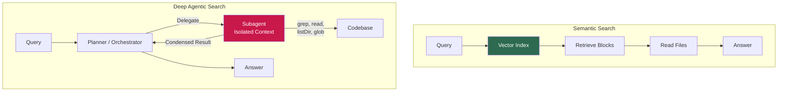
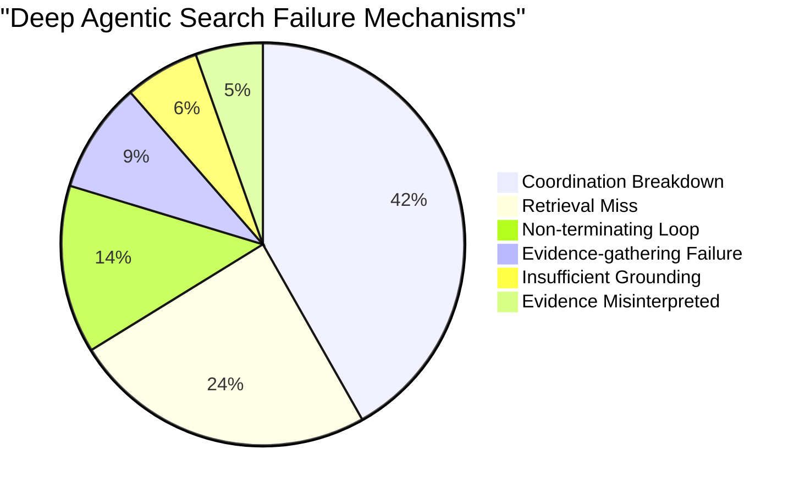

# Deep Agentic Search vs Semantic Search: Why Delegating Code Exploration to Subagents Costs More and Finds Less — and What It Means for Your Codex CLI Search Strategy


---

## The Intuition That Fails

Every senior developer working with coding agents has internalised the same rule of thumb: keep the context window clean. When the main agent needs to explore a large repository, spawn a subagent — let it absorb the noise, return a condensed result, and protect the orchestrator's reasoning capacity. This is "context engineering" orthodoxy, and it is widely regarded as good practice [^1].

A new empirical study by Rafiei Oskooei et al. demonstrates that this orthodoxy fails for the most common code-understanding task: answering questions about a repository. Across 720 questions, 15 Python repositories, and four frontier models, *semantic search with a pre-built vector index outperformed deep agentic search by 19 percentage points — at less than half the cost* [^1].

The finding does not invalidate subagent delegation. But it draws a sharp boundary around when delegation helps and when it hurts, and that boundary has direct implications for how you configure Codex CLI.

---

## The Experiment

Rafiei Oskooei et al. (arXiv:2608.01507, August 2026) compared two repository code-search architectures head-to-head [^1]:

**Semantic search** builds a vector index from the repository up front. The agent queries the index, retrieves relevant code blocks, reads the files, and answers. Three tools: retrieval, file reading, structure lookup.

**Deep agentic search** builds no index. A planning orchestrator maintains a task list and delegates exploration to an isolated subagent operating in its own context window. The subagent uses grep, file reading, directory listing, and globbing. It returns condensed results so that the orchestrator reasons over clean material. This is the architecture that modern coding agents — including Codex CLI's own subagent delegation — use for open-ended repository exploration [^1].



### Setup

- **Models tested:** Gemini 2.5 Flash, Gemini 2.5 Pro, Gemini 3 Flash, Qwen3-235B [^1]
- **Repositories:** 15 Python projects from SWE-bench and SWE-bench-Live, ranging from ~13K to 861K lines of code [^1]
- **Questions:** 720 total — 48 per repository across four interrogative categories (What, Why, Where, How) [^1]
- **Judge:** Claude Sonnet 4.6 (different provider/family), validated against a human panel (Cohen's kappa 0.74) [^1]

---

## The Results

### Accuracy

| Model | Semantic Pass % | Deep Pass % | Delta | Effect Size (Cliff's δ) |
|-------|-----------------|-------------|-------|--------------------------|
| Gemini 2.5 Flash | 48.4 | 42.8 | +5.6 pp | 0.137 |
| Gemini 2.5 Pro | 54.2 | 44.2 | +10.0 pp | 0.138 |
| Gemini 3 Flash | 89.3 | 39.7 | **+49.6 pp** | 0.760 |
| Qwen3-235B | 68.8 | 58.2 | +10.6 pp | 0.235 |
| **Pooled** | **65.2** | **46.2** | **+19.0 pp** | — |

All four paired McNemar and Wilcoxon tests remained significant after false discovery rate correction. Semantic led on 14 of 15 repositories; deep agentic search exceeded only on Django (+3.0 points) [^1].

### Cost

| Metric | Semantic | Deep | Ratio |
|--------|----------|------|-------|
| Mean cost per question | \$0.32 | \$0.74 | 2.3× |
| Input tokens (Qwen) | 34K | 761K | 22.4× |

Semantic occupied the upper-left (higher accuracy, lower cost) region of the efficiency frontier for every model tested [^1].

### The Effort Paradox

Longer trajectories — more tool calls, more tokens consumed — correlated with *lower* pass rates in both paradigms. Extra effort did not recover harder questions; it signalled the agent was lost [^1].

---

## Why Deep Search Fails: The Coordination Bottleneck

The failure analysis is where this study becomes most valuable. Every Fail verdict (1,621 total) was coded by mechanism and symptom [^1]:

| Failure Mechanism | Semantic | Deep |
|-------------------|----------|------|
| **Coordination breakdown** | 0% | **41.8%** |
| Retrieval/localisation miss | 53.6% | 24.4% |
| Insufficient grounding | 18.1% | 6.0% |
| Evidence misinterpreted | 17.1% | 5.4% |
| Non-terminating loop | 2.9% | 13.5% |
| Evidence-gathering failure | 8.4% | 8.9% |

The dominant failure mode for deep agentic search — coordination breakdown at the planner-to-subagent handoff — is a failure class that *cannot exist* in a flat retrieval architecture [^1]. The subagent design was supposed to prevent context rot; instead, it introduced a new failure surface at the delegation boundary.

Worse: 91% of coordination breakdowns produced "fluent, confidently worded answers" rather than reporting failure [^1]. The agent did not know it had failed. Silent failures at the delegation boundary are harder to detect and harder to defend against than retrieval misses, where the agent at least knows it found nothing.



---

## Context Rot: The Cure That Introduced a New Disease

Context rot — the measurable performance degradation as irrelevant material accumulates in the context window — is well-documented across frontier models [^2]. Xia et al. (arXiv:2606.29718) demonstrated that premature termination rates correlate positively with context length across four flagship LLMs, and that test-time mitigation strategies can reduce but not eliminate the effect [^3].

The deep agentic search architecture addresses context rot through delegation: the subagent absorbs noisy exploration and returns only condensed results, keeping the orchestrator's context clean [^1]. In principle, this is sound context engineering.

In practice, the delegation handoff introduces *information loss*. The condensed result may omit the critical detail; the planner may frame the delegation query ambiguously; the subagent may interpret "find how X works" differently from what the planner intended. The study found that 68.8% of all tool calls occurred within delegated subagents rather than by the planner itself — meaning the planner was reasoning over summaries of summaries, not primary evidence [^1].

This mirrors the broader finding from Xu et al. (arXiv:2606.30005) that frontier models lack "proprioceptive" awareness of their own context state [^4]. Without awareness of what has been lost in the delegation handoff, the planner cannot know whether the condensed result is sufficient.

---

## Mapping to Codex CLI: A Search Strategy Decision Framework

Codex CLI provides the building blocks for both search paradigms. The question is when to use each.

### Semantic Search via MCP

Since v0.142.2, Codex CLI defaults to MCP tool search for discovering available tools [^5]. For repository-level code search, MCP servers like `code-index-mcp` and CocoIndex Code provide AST-aware semantic indexing with vector retrieval [^6]. These can be configured in `config.toml`:

```toml
[mcp_servers.code-index]
command = "code-index-mcp"
args = ["--project", "."]
enabled_tools = ["search_code", "lookup_symbol", "find_references"]
```

For stable repositories where the codebase is not changing during the session, this is the dominant strategy. The study's results suggest you should prefer index-backed retrieval over live exploration for any read-only code understanding task [^1].

### Subagent Delegation for Volatile Workspaces

Codex CLI's subagent delegation (available since v0.107.0) spawns child agents in isolated context windows [^5]. Each subagent gets a fresh context window; results return to the parent as concise summaries. This is the deep agentic search architecture.

Use this when:
- The codebase is changing during the session (edits, branch switches, dependency updates)
- No indexing infrastructure is available
- The task requires code *modification*, not just understanding
- Multi-turn sessions where orchestrator context hygiene matters beyond single-answer correctness

### The Hybrid Configuration

The study recommends a hybrid: "a cheap semantic index for retrieval, reserving delegated exploration for the questions, repositories, or tasks that genuinely require it" [^1]. In Codex CLI, this translates to:

```toml
# config.toml — hybrid search strategy

[mcp_servers.code-index]
command = "code-index-mcp"
args = ["--project", ".", "--watch"]
enabled_tools = ["search_code", "lookup_symbol"]

# Constrain subagent spawning
max_threads = 2
max_depth = 1

# Keep tool output manageable to prevent context rot
tool_output_token_limit = 4096
model_auto_compact_token_limit = 200000
```

Pair this with AGENTS.md directives that encode the search preference hierarchy:

```markdown
## Code Search Strategy

1. **First:** Use the code-index MCP server for symbol lookup,
   reference finding, and semantic search. This is the default
   for read-only code understanding.

2. **Only if the index returns no relevant results:** Fall back
   to grep-based exploration in the current context.

3. **Only for multi-file investigation spanning >3 files:**
   Delegate to a subagent. Keep the delegation query specific
   and request structured output (file paths + line ranges).
```

### Defending Against Silent Coordination Failures

The study's most alarming finding is that 91% of coordination breakdowns produce fluent, confident answers [^1]. PostToolUse hooks can partially defend against this by requiring subagent results to include source evidence:

```json
{
  "hooks": [
    {
      "event": "PostToolUse",
      "tool": "subagent",
      "command": ["python", "verify_subagent_grounding.py"],
      "timeout_ms": 5000
    }
  ]
}
```

A verification script can check that the subagent's response includes concrete file paths and line numbers rather than vague summaries. If the response lacks grounding evidence, the hook returns exit code 2 with `additionalContext` steering the agent to retry with a more specific query.

---

## When the Numbers Change

The study's boundaries are important. Results apply to [^1]:

- **Read-only question answering** — not code editing or execution
- **Python repositories only** — 15 projects, 13K–861K LOC
- **Single-snapshot repositories** — no index staleness concern
- **Four models** — Gemini 2.5 Flash/Pro, Gemini 3 Flash, Qwen3-235B

For code-writing tasks, volatile codebases, or multi-turn sessions where the orchestrator needs to maintain clean state across dozens of tool calls, subagent delegation may still be the correct architecture. The study does not evaluate these scenarios.

The practical takeaway for Codex CLI users: *do not default to subagent delegation for code understanding*. Build a semantic index. Reserve delegation for tasks that genuinely require live exploration.

---

## Key Takeaways

1. **Semantic search outperforms deep agentic search by 19 pp at 2.3× lower cost** for repository-level code QA — across four frontier models and 15 repositories [^1].

2. **The coordination bottleneck** at the planner-to-subagent handoff accounts for 41.8% of deep search failures — a failure class that cannot exist in flat retrieval [^1].

3. **91% of coordination failures are silent** — the agent produces fluent, confident but wrong answers [^1].

4. **Extra effort does not help** — longer trajectories correlate with lower pass rates in both paradigms [^1].

5. **Configure Codex CLI for hybrid search**: MCP-backed semantic index as default, subagent delegation only for volatile or multi-file tasks.

6. **Defend against silent failures** with PostToolUse grounding verification hooks.

---

## Citations

[^1]: Rafiei Oskooei, A., Ilci, B., Kayim, A., Uzun, M. E., Can, B., Kara, K. E., Orhan, O. & Aktas, M. S. (2026). "Deep Agentic Search for Repository-Level Code Question Answering: An Empirical Study." arXiv:2608.01507. [https://arxiv.org/abs/2608.01507](https://arxiv.org/abs/2608.01507)

[^2]: Morphllm (2026). "Context Rot: Why LLMs Degrade as Context Grows (Complete Guide)." [https://www.morphllm.com/context-rot](https://www.morphllm.com/context-rot)

[^3]: Xia, S., Wang, Y., Huang, Z. & Liu, P. (2026). "Diagnosing and Mitigating Context Rot in Long-horizon Search." arXiv:2606.29718. [https://arxiv.org/abs/2606.29718](https://arxiv.org/abs/2606.29718)

[^4]: Xu, B., Li, H. & Zhang, K. (2026). "LLM Agents Are Latent Context Managers: Eliciting Self-Managed Context via State Proprioception." arXiv:2606.30005. [https://arxiv.org/abs/2606.30005](https://arxiv.org/abs/2606.30005)

[^5]: OpenAI (2026). Codex CLI v0.147.0 Release Notes. [https://github.com/openai/codex/releases/tag/rust-v0.147.0](https://github.com/openai/codex/releases/tag/rust-v0.147.0)

[^6]: johnhuang316 (2026). "code-index-mcp: A Model Context Protocol server for code indexing and search." GitHub. [https://github.com/johnhuang316/code-index-mcp](https://github.com/johnhuang316/code-index-mcp)
