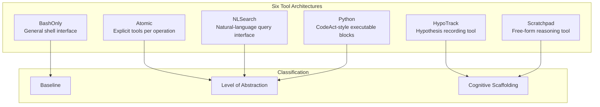
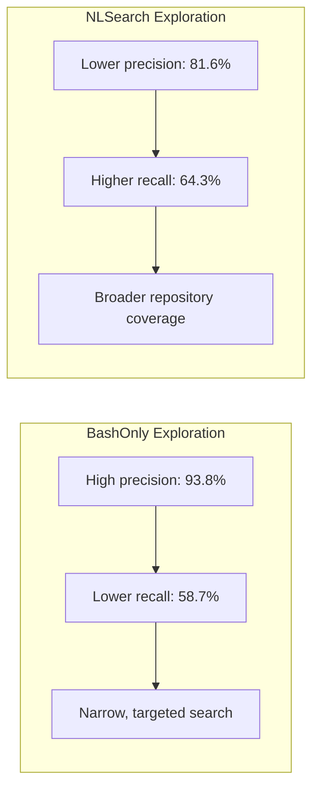
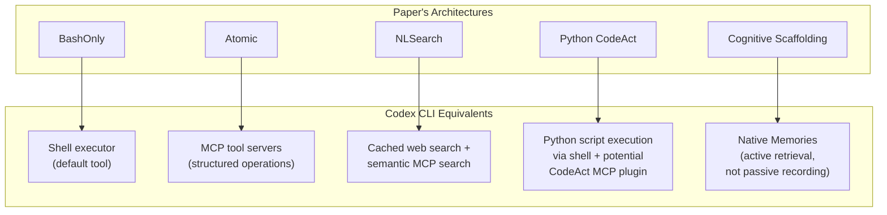

# The Devil Is in the Interface: What 11,700 Trajectories Reveal About How Tool Architecture Shapes Coding Agent Behaviour — and What It Means for Codex CLI


---

When we debate which model is "best" for coding, we almost always mean the model itself — its weights, its training data, its reasoning capabilities. A new study from Xu et al. forces a different question: does the *shape* of the tools you give the model matter as much as the model you choose?

Their answer, backed by 11,700 controlled trajectories across three models, is an emphatic yes. The paper "The Devil Is in the Interface: Evaluating How Tool Architecture Shapes Coding Agent Behavior" [^1] draws a sharp distinction between *tool capability* (what information and actions are available) and *tool architecture* (how those capabilities are organised and exposed to the model). Holding capability constant, the authors show that architecture alone can improve consistency by up to 4.7×, cut token usage by 56.3%, and shift how broadly agents explore a repository.

For Codex CLI practitioners, this is directly actionable: the tool surface you configure — shell commands, MCP servers, AGENTS.md directives, plugin catalogs — is not neutral scaffolding. It is an architectural choice that shapes every trajectory your agent produces.

## The Experimental Design

The study compares six tool architectures against 65 SWE-bench Live instances [^2], with 10 rollouts per instance across three models: Qwen3Coder-30B, Kimi K2.5, and Claude Sonnet 4.5 [^1]. All six architectures provide equivalent underlying capabilities — file viewing, editing, searching, shell execution — but organise them differently.



The critical design choice: task *resolve rates* remain broadly similar across architectures by construction. The paper's contribution is not about making agents solve more problems, but about how they solve them — consistency, efficiency, exploration breadth, and error patterns.

## Finding 1: Structured Interfaces Dramatically Improve Consistency

The most striking result concerns pass^k consistency — the probability that an agent solves a problem on *every* attempt rather than just one. Under BashOnly, Qwen3Coder-30B achieves a pass^9 of just 0.020 [^1]. Switch to Atomic tools and that rises to 0.094 — a 4.7× improvement with no change in underlying capability.

| Actor | Architecture | pass^5 | pass^9 |
|---|---|---|---|
| Qwen3Coder-30B | BashOnly | 0.046 | 0.020 |
| Qwen3Coder-30B | Atomic | 0.106 | 0.094 |
| Kimi K2.5 | BashOnly | 0.290 | 0.266 |
| Kimi K2.5 | Atomic | 0.304 | 0.280 |
| Claude Sonnet 4.5 | BashOnly | 0.296 | 0.252 |
| Claude Sonnet 4.5 | Atomic | 0.313 | 0.283 |

The pattern is consistent across all three models but most dramatic for the weakest one. Structured interfaces act as guardrails that constrain the agent into repeatable interaction patterns — reducing the variance that comes from open-ended shell composition [^1].

**Why this matters for Codex CLI:** Codex CLI's primary tool surface is a general-purpose shell executor — architecturally closest to BashOnly [^3]. The agent generates shell commands, `apply_patch` diffs, and file operations through this single interface. The study suggests that teams wanting deterministic, repeatable agent behaviour should consider whether supplementing the shell with structured MCP tools — dedicated search servers, file-manipulation servers, linting tools — would reduce trajectory variance.

## Finding 2: Natural-Language Search Broadens Exploration

The NLSearch architecture wraps the same underlying grep/find capabilities in a natural-language query interface. The result: agents access relevant files at rates more than 11% higher than BashOnly [^1], with recall reaching 64.3% for Claude Sonnet 4.5 versus 58.7% under BashOnly.

The trade-off is precision: NLSearch drops from 93.8% to 81.6% [^1]. The agent retrieves more files that turn out to be irrelevant. But in repository-level bug fixing, where the hardest part is often *finding* the right code, recall matters more than precision.



**Codex CLI mapping:** Codex CLI's cached web search mode and MCP-connected search servers already move in this direction [^4]. The paper's findings validate the design of MCP search tools that accept natural-language queries rather than requiring developers to construct exact grep patterns in AGENTS.md. Teams running Codex CLI with MCP-based code search servers (e.g., Sourcegraph MCP, local semantic search) are architecturally closer to NLSearch than teams relying on raw shell grep.

## Finding 3: CodeAct-Style Interfaces Slash Token Costs

The Python (CodeAct) architecture lets the agent write executable Python blocks instead of issuing individual tool calls [^1]. The efficiency gains are substantial:

- **41.6% fewer steps** (46 vs 77 for Qwen3Coder-30B)
- **56.3% lower input token usage**
- **Equivalent task performance**

The mechanism is compound interaction: a single Python block can read a file, parse its AST, grep for a pattern, and apply a transformation — operations that would require 4–5 separate tool calls under Atomic or BashOnly architectures. The study confirms that 97% of sampled Python actions corresponded to operations already available via BashOnly [^1]; the gains come entirely from how they are bundled.

**Codex CLI implications:** Codex CLI does not currently expose a Python CodeAct interface; it routes through shell execution [^3]. However, the agent *can* write and execute Python scripts via the shell, achieving a similar compound-interaction pattern when prompted effectively. AGENTS.md directives that encourage the agent to "write a Python script to perform multi-step file transformations rather than issuing individual shell commands" could capture some of the CodeAct efficiency dividend. The v0.147.0 plugin system [^4] could also enable a purpose-built CodeAct MCP server that accepts Python blocks and returns structured results.

## Finding 4: Cognitive Scaffolding Tools Have Limited Effect

Perhaps the most sobering finding: HypoTrack (hypothesis recording) and Scratchpad (free-form reasoning) tools showed minimal impact on agent behaviour [^1]. The models "mostly project their original reasoning patterns into these lightweight scaffolds" rather than adopting new reasoning strategies.

The authors attribute this to the tools' limited scope — they "only record a hypothesis and its status" without adding "retrieval, memory management, new task information, or enforcing a different reasoning policy" [^1].

**Codex CLI lesson:** This finding cuts against the intuition that adding a "thinking tool" or "reasoning scratchpad" to an MCP server will improve agent performance. Codex CLI's native Memories system [^5] succeeds where lightweight scaffolds fail because it persists information *across sessions* and triggers *retrieval* at relevant moments. The research suggests that passive recording tools are insufficient — agents need tools that actively reshape their information access patterns.

## Error Reduction: The Hidden Architecture Dividend

The error analysis reveals another architectural benefit. Under BashOnly, Qwen3Coder-30B averages 3.11 interaction errors per trajectory — malformed commands, incorrect escaping, misunderstood output formats [^1]. Under Atomic tools, this drops to levels comparable to the stronger models.

Structured interfaces eliminate entire classes of errors:

- **Mis-edit errors:** From 1.64 per trajectory under BashOnly to 0.19 under Atomic for Qwen3Coder-30B [^1]
- **Search syntax errors:** Natural-language search eliminates grep flag mistakes entirely
- **Multi-step coordination failures:** Python blocks reduce the surface area for inter-step errors

This matters for Codex CLI's PreToolUse and PostToolUse hooks [^6]. If the tool surface generates fewer malformed commands, hooks spend less time catching errors and more time enforcing policy. A well-designed MCP tool surface is, in effect, a first layer of defence before any hook fires.

## Mapping the Six Architectures to Codex CLI's Tool Surface



The practical takeaway: Codex CLI teams should treat their MCP server configuration as an *architectural decision*, not a convenience feature. Each MCP server reshapes the tool surface, moving the agent away from pure BashOnly and towards the structured, efficient patterns the paper demonstrates.

## Actionable Configuration

For teams wanting to apply these findings to their Codex CLI setup:

**1. Add structured MCP tools for high-frequency operations:**

```toml
# config.toml — move from BashOnly towards Atomic
[mcp_servers.file-ops]
command = "file-operations-mcp"
args = ["--structured"]

[mcp_servers.code-search]
command = "semantic-search-mcp"
args = ["--natural-language"]
```

**2. Encourage compound operations in AGENTS.md:**

```markdown
## Tool Usage Policy
- For multi-step file transformations, write a Python script and execute it
  rather than issuing sequential shell commands.
- Prefer structured MCP tools over raw shell equivalents when available.
- Do not record intermediate reasoning to scratchpad tools; instead, state
  your hypothesis directly in your response before acting.
```

**3. Use PostToolUse hooks to measure architectural impact:**

```bash
#!/bin/bash
# hooks/post-tool-use.sh — log tool surface usage for analysis
echo "$(date -u +%Y-%m-%dT%H:%M:%SZ) tool=$TOOL_NAME tokens=$INPUT_TOKENS steps=$STEP_COUNT" \
  >> .codex/tool-architecture-metrics.log
```

## The Bigger Picture

The paper's most important contribution is conceptual: it separates *what tools can do* from *how tools are presented*. This distinction has been implicit in Codex CLI's design — the difference between a raw shell command and a well-configured MCP server is precisely an architectural choice — but the study provides the first large-scale empirical evidence that this choice matters as much as model selection.

For the 4.7× consistency improvement alone, the message is clear: if you are running Codex CLI with only the default shell executor and wondering why repeated runs produce wildly different results, the answer may not be a better model. It may be a better tool surface.

## Citations

[^1]: Xu, X., Saghir, H., Wu, Q., Côté, M.-A., Wang, T., Lakkaraju, K., Pei, K. & Zhang, X. (2026). "The Devil Is in the Interface: Evaluating How Tool Architecture Shapes Coding Agent Behavior." arXiv:2608.11386. [https://arxiv.org/abs/2608.11386](https://arxiv.org/abs/2608.11386)

[^2]: OpenAI. (2025). "SWE-bench Live: A contamination-controlled benchmark for repository-level issue resolution." [https://github.com/swe-bench/SWE-bench-live](https://github.com/swe-bench/SWE-bench-live)

[^3]: OpenAI. (2026). "Codex CLI Documentation: Tool Surface and Execution Model." [https://github.com/openai/codex](https://github.com/openai/codex)

[^4]: OpenAI. (2026). "Codex CLI v0.147.0 Release Notes: Portable Agent Plugins, MCP 2026-07-28 Support." [https://github.com/openai/codex/releases/tag/rust-v0.147.0](https://github.com/openai/codex/releases/tag/rust-v0.147.0)

[^5]: OpenAI. (2026). "Codex CLI Native Memories: Cross-Session Knowledge Persistence." [https://github.com/openai/codex](https://github.com/openai/codex)

[^6]: OpenAI. (2026). "Codex CLI Hooks: PreToolUse and PostToolUse Configuration." [https://github.com/openai/codex](https://github.com/openai/codex)
