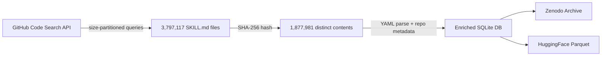
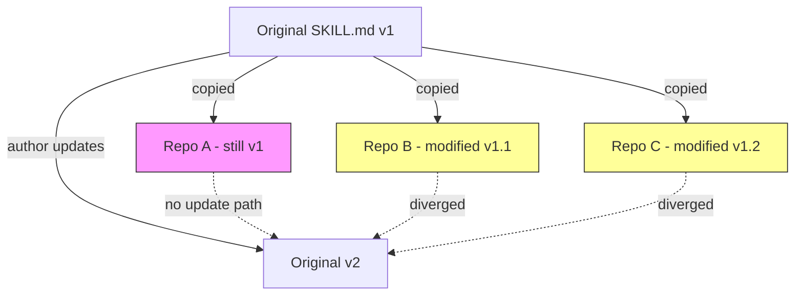

# GitSkills and the 3.7 Million Skill Files: What the Largest Agent Skill Dataset Reveals About Codex CLI's Plugin Ecosystem


---

On 11 August 2026, Destefanis, Graziotin, Vaccargiu, and Ortu published *GitSkills: A Dataset of Agent Skills on GitHub* — a dataset of **3,797,117 SKILL.md files** harvested from 282,200 public repositories [^1]. That number alone is remarkable: fewer than ten months after Anthropic formalised the SKILL.md format in October 2025 [^2], nearly four million skill files sit in the open, authored by 195,841 distinct repository owners. For anyone building or consuming skills in Codex CLI, this dataset is the first empirical mirror held up to a rapidly growing ecosystem — and what it reflects should change how you think about skill authoring, distribution, and governance.

## What GitSkills Measured

The researchers ran a three-stage pipeline: **discovery** via GitHub's code-search API (partitioned by file size to circumvent the 1,000-result cap), **deduplication** by content hash, and **enrichment** with full text, parsed YAML front matter, folder contents, repository metadata, and sampled commit histories [^1]. The resulting SQLite database groups 3.8 million files into 1,877,981 distinct contents, meaning exactly **50.5% of all skill files on GitHub are verbatim duplicates** of another file [^1].



That 50.5% duplication rate is the headline finding. Skills spread through **folder copying** — `git clone`, scaffolding tools, or plain `cp -r` — rather than through a centralised package manager [^1]. There is no `npm install` for skills; there is no lockfile, no version pinning, no transitive dependency resolution. This is precisely the gap that Agent Plugins 1.0 and Codex CLI v0.147.0's multi-catalog federation now attempt to close.

## The Anatomy of a Skill

A skill is a folder containing a `SKILL.md` file with YAML front matter (`name`, `description` at minimum) and natural-language instructions for a language-model agent, optionally accompanied by scripts and reference files [^1] [^2]. The agent loads the skill probabilistically based on the task description — no compiler or type checker verifies the selection [^1]. This means quality assurance for skills is fundamentally different from quality assurance for code: there is no test suite, no static analysis, and no type system. The skill either fires correctly at inference time or it does not.

In Codex CLI, skills live under `~/.codex/skills/` (personal) or `.agents/skills/` (project-level, the vendor-neutral path) [^3]. Since v0.117.0, Codex has elevated plugins — bundles of skills, MCP server configurations, and app connectors — to a first-class workflow primitive [^3]. With v0.147.0, the plugin system gained **multi-catalog federation**: search resolves across four scopes in strict precedence order [^4]:

```toml
# Codex CLI plugin resolution order (v0.147.0+)
# 1. Local project plugins   — .agents/plugins/
# 2. Personal plugins        — ~/.codex/plugins/
# 3. Workspace catalog       — org-managed, e.g. via managed_config.toml
# 4. Remote catalog           — codex plugin marketplace search
```

Local shadows personal; personal shadows workspace; workspace shadows remote — mirroring `config.toml` merge precedence [^4]. This four-tier resolution is Codex CLI's answer to the duplication problem GitSkills documents.

## Why 50% Duplication Matters

Half of all skill files being identical copies is not inherently bad — it signals adoption. But it creates three concrete risks:

1. **Stale copies.** A skill copied six months ago may reference deprecated model names, obsolete command flags, or removed API endpoints. With no version pinning, there is no mechanism to propagate upstream fixes to downstream copies.

2. **Supply-chain injection.** A modified copy of a popular skill — with a subtle instruction change — can redirect agent behaviour. The GitSkills authors explicitly flag this as an open research question: "executable file bundling frequency" and "supply-chain attack potential through modified copies" [^1].

3. **Semantic drift.** Two teams may independently modify the same copied skill, diverging in incompatible ways. Without a canonical source, reconciliation is manual.



Agent Plugins 1.0, published on 6 August 2026 by OpenAI, Microsoft, AWS, Anysphere (Cursor), and Vercel [^5], addresses this directly. The specification defines a **`plugin.json`** manifest, a `skills/` folder, and an optional `mcp.json`, creating a distributable, versionable unit [^5]. The SkillsMP Marketplace already indexes skill projects on GitHub by category, update time, and star count [^6]. Codex CLI v0.147.0 consumes this format natively via `codex plugin marketplace search` [^4].

## What the Dataset Tells Skill Authors

The GitSkills dataset opens five research dimensions that map directly to practical Codex CLI decisions [^1]:

### 1. Adoption Velocity

282,200 repositories in under ten months. The dataset enables measuring adoption curves by language, project size, and geography. For Codex CLI users, this confirms that skills are no longer experimental — they are infrastructure.

### 2. Format Standardisation

Skills appear in both vendor-specific paths (`.claude/skills/`, `.cursor/skills/`) and the vendor-neutral `.agents/skills/` directory [^1]. Codex CLI reads from `.agents/skills/` by default [^3], aligning with the Agent Plugins 1.0 recommendation. If you are authoring skills today, use the vendor-neutral path.

### 3. Reuse Genealogy

The 50.5% duplication rate invites genealogical analysis: which skills are copied most, how many hops separate a copy from its origin, and whether scaffolding tools (e.g. `codex plugin init`) or manual copying dominate [^1]. For teams maintaining internal skill libraries, this data argues for treating skills as **published packages** with explicit versioning, not as files to copy into each repository.

### 4. Software Metrics for Natural Language

Traditional code metrics — cyclomatic complexity, lines of code, coupling — have no direct equivalent for SKILL.md files. The dataset provides the raw material to develop analogues: instruction count, conditional branching density in natural language, and cross-reference frequency [^1]. This matters because the *Catastrophic Remembering* research (Chakrabarti, arXiv:2608.11095, August 2026) showed that instruction files grow +226% over their lifetime with a declining deletion hazard [^7] — a pattern that likely applies to skills as well.

### 5. Maintenance and Security

The dataset captures commit history per skill, enabling analysis of update frequency, author turnover, and abandonment rates [^1]. Combined with the bundled executable files that some skills include, this creates a measurable attack surface. Codex CLI's `requirements.toml` enforcement and `PreToolUse` hooks provide defence, but only if teams configure them.

## Mapping GitSkills Findings to Codex CLI Configuration

The dataset's implications translate into concrete Codex CLI configuration decisions:

```toml
# config.toml — skill governance settings

# Cap skill instruction size to prevent instruction bloat
project_doc_max_bytes = 32768

# Prefer workspace catalog over ad-hoc copies
[plugins]
catalog_precedence = ["local", "personal", "workspace", "remote"]
```

```bash
# Audit installed skills against known duplicates
codex plugin list --format json | jq '.[] | {name, version, source}'

# Search the federated catalog instead of copying
codex plugin marketplace search "code-reviewer"

# Verify skill provenance before installation
codex plugin inspect code-reviewer --show-manifest
```

For enterprise teams, the workspace catalog tier is critical. Rather than allowing each developer to copy skills into their personal `~/.codex/skills/` directory, publish approved skills to the workspace catalog via `managed_config.toml` [^4]. This eliminates the stale-copy problem and gives security teams a single point of audit.

## The Gap Between Dataset and Governance

GitSkills documents what exists; Agent Plugins 1.0 and Codex CLI v0.147.0 define what should exist. The gap between the two is the governance layer that most teams have not yet built:

- **No skill signing.** Agent Plugins 1.0 does not yet mandate cryptographic signatures on `plugin.json` [^5]. A tampered skill in a remote catalog is indistinguishable from a legitimate one without out-of-band verification.

- **No dependency resolution.** Skills can reference other skills or MCP servers, but there is no formal dependency graph. A skill that assumes a particular MCP server is available will fail silently if that server is not configured.

- **No telemetry on skill selection.** Codex CLI does not currently expose which skill was selected for a given task, making it difficult to audit whether the agent chose correctly. The `--print-instructions` flag shows loaded instructions but not the selection rationale.

## Practical Recommendations

1. **Migrate from copied skills to the plugin catalog.** Use `codex plugin marketplace search` and `codex plugin install` rather than copying `SKILL.md` folders between repositories. This gets you version tracking and update propagation.

2. **Use vendor-neutral paths.** Place skills under `.agents/skills/` rather than `.claude/skills/` or `.cursor/skills/`. This ensures portability across Agent Plugins 1.0-compatible clients including Codex CLI, Cursor, VS Code, and GitHub Copilot [^5].

3. **Version your skills explicitly.** Add a `version` field to your YAML front matter even though it is optional. When the ecosystem matures to support version pinning, your skills will be ready.

4. **Audit with `requirements.toml`.** Restrict which skills can execute shell commands or access network resources. The GitSkills dataset shows that some skills bundle executable scripts [^1] — these need the same sandboxing scrutiny as any other code.

5. **Monitor for instruction bloat.** Use `--print-instructions` to inspect loaded skill instructions periodically. If a skill has grown significantly since installation, it may be suffering from the catastrophic remembering pattern documented by Chakrabarti [^7].

## Conclusion

The GitSkills dataset gives the agent skill ecosystem its first large-scale empirical baseline: 3.8 million files, 50.5% duplication, and no centralised governance. Codex CLI v0.147.0's multi-catalog federation and Agent Plugins 1.0's portable manifest format are the infrastructure response. The question for teams is whether they will adopt these mechanisms before the duplication and drift problems documented in GitSkills become their own maintenance burden.

---

## Citations

[^1]: Destefanis, G., Graziotin, D., Vaccargiu, M., & Ortu, M. (2026). *GitSkills: A Dataset of Agent Skills on GitHub*. arXiv:2608.10906. [https://arxiv.org/abs/2608.10906](https://arxiv.org/abs/2608.10906)

[^2]: Anthropic. (2025). *Claude Code Skills Documentation*. [https://docs.anthropic.com/en/docs/claude-code/skills](https://docs.anthropic.com/en/docs/claude-code/skills)

[^3]: OpenAI. (2026). *Codex CLI Plugin System*. [https://github.com/openai/codex](https://github.com/openai/codex)

[^4]: OpenAI. (2026). *Codex CLI v0.147.0 Release Notes*. [https://github.com/openai/codex/releases/tag/rust-v0.147.0](https://github.com/openai/codex/releases/tag/rust-v0.147.0)

[^5]: Agent Plugins Contributors. (2026). *Agent Plugins 1.0.0 Specification*. [https://agent-plugins.org](https://agent-plugins.org)

[^6]: SkillsMP. (2026). *Agent Skills Marketplace*. [https://github.com/topics/skill-md](https://github.com/topics/skill-md)

[^7]: Chakrabarti, K. (2026). *Why Does CLAUDE.md Keep Growing? Catastrophic Remembering in Agentic Coding*. arXiv:2608.11095. [https://arxiv.org/abs/2608.11095](https://arxiv.org/abs/2608.11095)
