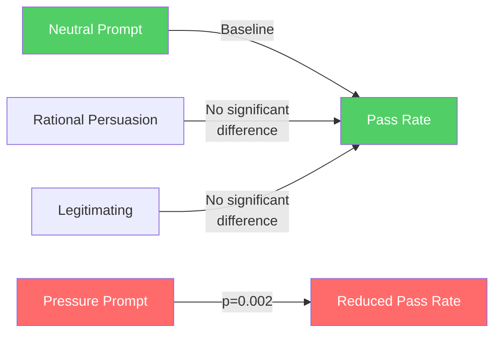
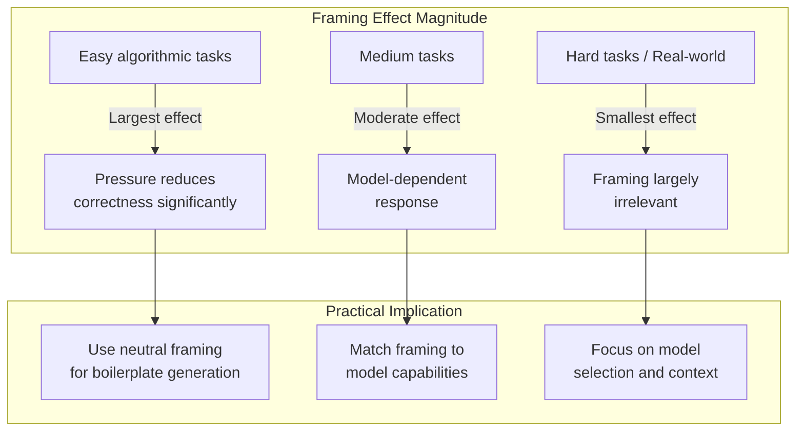

# Do Influence Tactics Matter? What 123,000 Prompt Variations Reveal About Framing Effects in LLM Code Generation — and What It Means for Your AGENTS.md


---

## The Hidden Variable in Your Prompts

Every AGENTS.md file, every skill definition, and every interactive prompt you send to Codex CLI carries a linguistic frame. Whether you write "You must always run tests before committing" (pressure) or "Running tests before commits catches regressions early and saves review cycles" (rational persuasion), you are — consciously or not — deploying an influence tactic.

A new study published in *Empirical Software Engineering* quantifies what that framing actually does to the code your agent produces [^1]. Deaconu et al. operationalised seven influence tactics from organisational psychology into reproducible prompt templates and ran them across ~123,435 generations on LiveCodeBench and ~56,745 on SWE-bench Verified. The headline: **pressure-framed prompts significantly reduce correctness and increase security vulnerabilities**, while model architecture and scale still dominate overall performance.

For Codex CLI users, the implications are concrete: the tone of your AGENTS.md and prompt instructions is not neutral scaffolding — it is a variable that shifts functional correctness, security posture, and documentation quality.

---

## The Yukl–Falbe Framework, Applied to Code

The study draws on Yukl and Falbe's taxonomy of interpersonal influence tactics [^2], operationalising seven tactics plus a neutral baseline using items from the Influence Behavior Questionnaire-General (IBQ-G):

| Tactic | Core mechanism | Example framing |
|---|---|---|
| **Rational Persuasion** | Logical reasoning and evidence | "This approach reduces memory allocations by 40%" |
| **Exchange** | Offering reciprocity | "If you handle the error cases, I'll take care of the tests" |
| **Inspirational Appeals** | Appealing to values and ideals | "Write code that future maintainers will thank you for" |
| **Ingratiation** | Flattery before the request | "You're excellent at this — now implement..." |
| **Personal Appeals** | Requesting a personal favour | "As a favour to me, please ensure..." |
| **Legitimating** | Establishing authority | "Per the project's coding standards, you must..." |
| **Pressure** | Demands, threats, urgency | "This is critical and overdue — deliver immediately" |
| **Neutral** (control) | Straightforward request | "Implement function X that does Y" |

Each tactic incorporated four behavioural requirements from the IBQ-G, producing prompts with consistent structure but varying linguistic framing [^1].

---

## Experimental Design

The study tested five open-weight models via the Groq API [^1]:

- **Llama 3.1 8B** — small-scale dense transformer
- **Llama 3.3 70B** — larger dense variant
- **Llama 4 Maverick 17B-128e** — mixture-of-experts
- **DeepSeek R1 Distill Llama 70B** — reasoning-optimised
- **Qwen 3 32B** — non-Llama MoE

Two benchmarks provided the task corpus:

- **LiveCodeBench**: 1,055 Python coding problems across easy, medium, and hard difficulty tiers [^3]
- **SWE-bench Verified**: 485 human-validated real-world GitHub issue-fix pairs [^4]

Non-reasoning models ran three trials per tactic (temperature 0.2, top-p 0.95, max 8,192 tokens). DeepSeek R1, being computationally heavier, ran a single trial. Statistical analysis used Linear Mixed Models (LMMs) and Generalised Linear Mixed Models (GLMMs) with Bonferroni-adjusted post hoc comparisons.

---

## Key Findings

### Pressure Kills Correctness

On LiveCodeBench, Pressure-framed prompts produced significantly lower pass rates than Neutral framing (p=0.002). An alternative pressure formulation confirmed the effect (p=0.03). The overall tactic main effect on correctness was significant (p=0.001) with an effect size of ηp²=0.015 [^1].



### Pressure Increases Security Vulnerabilities

Bandit low-level security warnings rose significantly under both Pressure (p<0.001) and its alternative formulation (p=0.0004), with Cohen's d up to 0.30. Exchange framing produced fewer warnings than Pressure (p=0.001). The effect size for tactic on security was ηp²=0.02 [^1].

This is the finding that should concern Codex CLI users most. If your AGENTS.md or prompt instructions use urgency-laden language — "you MUST", "CRITICAL", "FAILURE to do this will..." — you may be actively degrading the security posture of generated code.

### Documentation Quality Shifts

Neutral framing produced significantly more inline comments than Exchange (p<0.0001) or Pressure (p<0.001). Legitimating framing ("Per the project's coding standards...") produced *more* comments than Neutral (p=0.03) [^1]. Maintainability Index, cyclomatic complexity, and SLOC showed no significant tactic effects.

### Real-World Tasks Are More Resilient

On SWE-bench Verified, tactic effects were largely absent — no significant main effect on functional correctness (p=0.45), maintainability (p=0.45), or security (p=0.60). The exception: Pressure produced more verbose code than Neutral (p=0.0025, Cohen's d=0.21) [^1].

This divergence matters. Real-world maintenance tasks, where the model must reason about existing repository context, appear more robust to framing effects than structured algorithmic problems. But SWE-bench also showed dramatically higher run-to-run variability (10.31% mean percentage difference vs 0.059% for LiveCodeBench), making it harder to detect effects statistically.

### Model Architecture Dominates

Across all metrics, LLM architecture and scale explained far more variance than prompt framing (ηp² 0.10–0.13 for model effects vs 0.015–0.02 for tactic effects) [^1]. This aligns with what Codex CLI users already know: model selection via named profiles is the primary lever for quality.

---

## Mapping to Codex CLI's Configuration Stack

The study's findings map directly to three layers of Codex CLI's prompt and configuration architecture.

### Layer 1: AGENTS.md Instruction Tone

Your AGENTS.md file is, in effect, a persistent influence tactic applied to every task. The study provides evidence-based guidance on how to frame it:

```markdown
# AGENTS.md — Rational Persuasion Framing (Recommended)

## Testing Requirements
Running tests before commits catches regressions early and reduces
review cycles. The test suite covers 94% of business logic paths,
making it the most efficient quality gate available.

## Security Constraints
Input validation at API boundaries prevents the injection categories
that account for 73% of our historical CVEs. Validate all user-supplied
strings before database operations.
```

Compare with pressure framing (evidence suggests this degrades output):

```markdown
# AGENTS.md — Pressure Framing (Avoid)

## Testing Requirements
You MUST run ALL tests. FAILURE to test is UNACCEPTABLE. This is
CRITICAL and NON-NEGOTIABLE. Every commit without tests is a
serious violation.

## Security Constraints
NEVER skip input validation. This is a CRITICAL SECURITY REQUIREMENT.
Any failure here will result in vulnerabilities. You MUST validate
EVERYTHING.
```

### Layer 2: Named Profiles and Model Routing

The study confirms that model selection has 5–8× the effect size of prompt framing [^1]. Codex CLI's named profiles in `config.toml` remain the primary quality lever:

```toml
[profiles.security-critical]
model = "o3"               # Reasoning model for security-sensitive work
approval_policy = "unless-allow-listed"
sandbox_mode = "full"

[profiles.rapid-iteration]
model = "gpt-5.6-luna"     # Cost-efficient for iterative tasks
approval_policy = "on-failure"
sandbox_mode = "workspace-write"
```

The practical takeaway: invest more engineering effort in model routing than in prompt rhetoric. But once model selection is optimised, framing becomes the marginal variable worth tuning.

### Layer 3: PreToolUse and PostToolUse Hooks

Since pressure framing increases security warnings (p<0.001), teams that must use urgency-laden language in AGENTS.md (e.g. compliance-driven environments) should compensate with deterministic verification:

```json
{
  "hooks": [
    {
      "event": "PostToolUse",
      "command": "bandit -r . -f json -o /tmp/bandit-report.json",
      "timeout_ms": 30000,
      "on_failure": "block"
    }
  ]
}
```

This creates a structural safety net that operates independently of the linguistic frame applied to the model [^5].

---

## The Three-Way Interaction

The study found a significant three-way interaction between tactic, model, and task difficulty on both correctness and documentation (p<0.001 for comments) [^1]. This means framing effects are not uniform — they vary by which model you use and how hard the task is.



For Codex CLI workflows, this suggests a framing strategy that varies by task type:

- **Boilerplate and straightforward generation** (equivalent to easy/medium LiveCodeBench): Neutral or rational persuasion framing in AGENTS.md. Avoid pressure.
- **Complex refactoring and bug fixing** (equivalent to SWE-bench): Framing matters less; invest in context quality (project_doc_max_bytes, tool_output_token_limit) instead.

---

## Legitimating as the Surprise Winner

One finding deserves special attention: legitimating framing — establishing authority and invoking standards — produced more inline comments than neutral framing (p=0.03) without degrading any other metric [^1]. This aligns with how well-structured AGENTS.md files already work in practice:

```markdown
## Code Documentation Standards (Legitimating Frame)
Per the project's architectural decision records (ADR-017), all public
functions require docstrings that specify parameter types, return values,
and raised exceptions. This convention is enforced by the CI pipeline
and required for merge approval.
```

Referencing specific standards, ADRs, or organisational policies provides the model with both instruction and justification — exactly the pattern that legitimating framing operationalises.

---

## Limitations and Caveats

The study tested open-weight models (Llama, DeepSeek, Qwen) rather than the proprietary models Codex CLI typically uses (GPT-5.6 Sol/Terra/Luna, o3) [^6]. Framing effects may differ with instruction-tuned proprietary models that have undergone extensive RLHF. ⚠️ Until replicated on Codex CLI's default models, treat the effect sizes as directional rather than precise.

The effect sizes for framing (ηp² ~0.015–0.02) are small by conventional standards. Model selection and task difficulty explain far more variance. This is not a reason to ignore framing — small effects compound across thousands of generations in production workflows — but it is a reason to prioritise model routing first.

SWE-bench showed high run-to-run variability (10.31%), which may mask real framing effects on complex tasks. The absence of significance on SWE-bench should not be interpreted as absence of effect.

---

## Practical Checklist

1. **Audit your AGENTS.md** for pressure language: "MUST", "CRITICAL", "NEVER", "FAILURE". Replace with rational persuasion or legitimating frames that explain *why*.
2. **Keep neutral framing** as your default for task prompts. It matched or outperformed all other tactics on correctness.
3. **Use legitimating framing** when you want better documentation: reference specific standards, ADRs, or organisational policies.
4. **Compensate with hooks** if compliance requirements force urgency-laden language. PostToolUse security scanning catches what pressure framing introduces.
5. **Invest primarily in model routing.** Framing is the marginal variable; model selection is the dominant one.
6. **Vary framing by task complexity.** Simple generation tasks are most sensitive to framing; complex real-world tasks are more resilient.

---

## Citations

[^1]: Deaconu, A., Gupta, A., Basha, M., Haydu, N. & Rodríguez-Pérez, G. (2026). "Do Influence Tactics Matter? Investigating Prompt Framing Effects in LLM Code Generation." *Empirical Software Engineering*, 32, 13. arXiv:2608.11513. [https://arxiv.org/abs/2608.11513](https://arxiv.org/abs/2608.11513)

[^2]: Yukl, G. & Falbe, C.M. (1990). "Influence Tactics and Objectives in Upward, Downward, and Lateral Influence Attempts." *Journal of Applied Psychology*, 75(2), 132–140.

[^3]: Jain, N. et al. (2024). "LiveCodeBench: Holistic and Contamination Free Evaluation of Large Language Models for Code." arXiv:2403.07974. [https://arxiv.org/abs/2403.07974](https://arxiv.org/abs/2403.07974)

[^4]: Jimenez, C.E. et al. (2024). "SWE-bench: Can Language Models Resolve Real-World GitHub Issues?" arXiv:2310.06770. [https://arxiv.org/abs/2310.06770](https://arxiv.org/abs/2310.06770)

[^5]: OpenAI (2026). "Codex CLI Hooks Configuration." Codex CLI Documentation, v0.147.0. [https://github.com/openai/codex](https://github.com/openai/codex)

[^6]: OpenAI (2026). "Codex CLI Models — GPT-5.6 Sol, Terra, Luna." [https://developers.openai.com/codex/models](https://developers.openai.com/codex/models)
