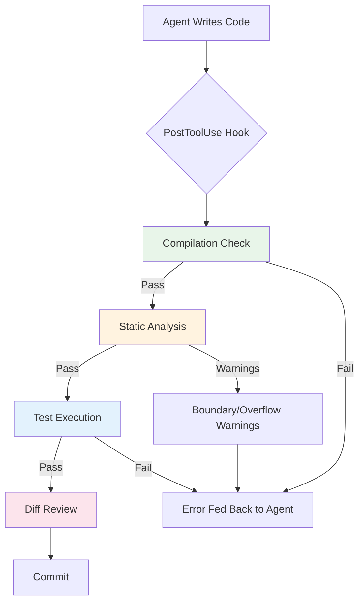
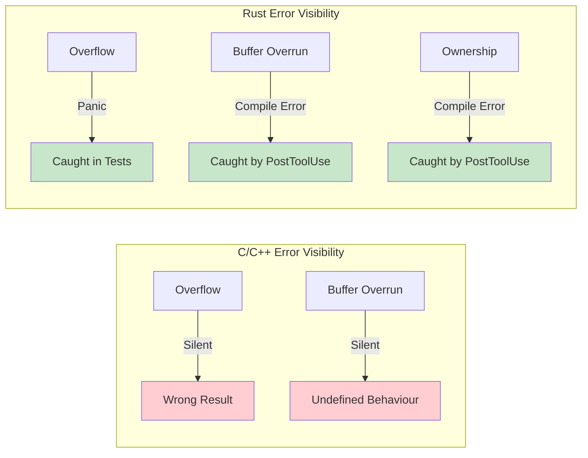

# Unreliable in Practice? What 86,726 LLM Code Errors Reveal About Codex CLI Verification Strategy


---

Every senior developer who has adopted Codex CLI knows the pattern: the agent produces plausible-looking code, the diff reads cleanly, and then a boundary condition blows up in CI. Intuition says these are random slips. A new large-scale study says otherwise — LLM-generated code fails in *systematic, predictable ways* that vary by language and model, and Codex CLI already ships the machinery to catch the most damaging classes before they reach a branch.

## The Study: 86,726 Errors Across Four Languages and Seven Models

Nogueira, Vieira, and Campos (University of Coimbra) analysed 86,726 code samples containing compilation or runtime errors, generated by seven LLMs across C, C++, Java, and Rust [^1]. The samples were drawn from the PROBE dataset, built atop IBM's Project CodeNet — 1,651 contest-style problems spanning four difficulty tiers [^2]. Each model generated five solutions per problem under both baseline and Chain-of-Thought prompting, yielding a corpus large enough to expose structural patterns rather than anecdotal failures.

The seven models tested were Qwen2.5:14b, Qwen2.5-Coder (7B and 14B), DeepSeek-Coder-v2, GPT-4.1-mini, Gemini-2.0-Flash, and GPT-oss:120b [^1]. Error classification used an LLM-based pipeline validated against 300 manually annotated samples per error family, achieving strict accuracy between 0.81 and 0.92 across languages [^1].

This matters for Codex CLI developers because the models powering Codex — GPT-5.6 Sol, Terra, and Luna — sit in the same architectural lineage as the tested models. The error *categories* are structural, not model-specific.

## The Error Taxonomy: Compilation and Runtime

The study identified 14 compilation error categories and 15 runtime error categories. Two findings stand out for Codex CLI workflows:

### Compilation Errors Are Dominated by Two Categories

| Error Category | C++ | Java | C | Rust |
|---|---|---|---|---|
| Missing import/include | 56.6% | 8.1% | 35.5% | 20.5% |
| Incompatible parameter types | 20.3% | 43.0% | 21.9% | 43.4% |
| Undeclared variable | 6.1% | 15.7% | 10.4% | 3.8% |
| Ownership/lifetime errors | — | — | — | 16.7% |

Missing imports and type mismatches account for the majority of compilation failures in every language [^1]. These are *trivially detectable* by a compiler invocation — which means a PostToolUse hook that runs `cargo check`, `javac`, or `gcc -fsyntax-only` after every file write would catch 70–80% of compilation errors before the agent's next turn.

### Runtime Errors Cluster Around Boundaries and Overflow

| Error Category | C++ | Java | C | Rust |
|---|---|---|---|---|
| Out-of-bounds access | 59.9% | 45.5% | 51.1% | 28.1% |
| Numeric overflow | 4.0% | 5.6% | 4.9% | 44.0% |
| Incorrect input processing | 4.3% | 25.8% | 1.3% | 22.4% |
| Recursion error | 8.0% | 14.3% | 1.2% | 2.9% |

Out-of-bounds access is the single largest runtime error class in three of four languages [^1]. The Rust column tells a different story: numeric overflow dominates at 44.0% because Rust panics on overflow in debug mode rather than silently wrapping. As the authors note, "silent propagation is a significant dependability and security risk" — identical generated code may contain hidden faults in C/C++/Java that Rust surfaces immediately [^1].

## Iterative Feedback Does Not Fix Structural Errors

The study tested whether feeding error messages back to the model improves output. Surface-level errors like missing imports were fixed in 12.4% of re-attempts, but structural errors resisted correction: out-of-bounds access was fixed in only 4.5% of cases, recursion errors in 3.6%, and type mismatches in 7.8% [^1].

This has a direct implication for Codex CLI: relying on the agent's self-repair loop to catch boundary violations is unreliable. External verification — tests, sanitisers, static analysers — must close the gap.

## Mapping the Findings to Codex CLI's Verification Stack

Codex CLI v0.147.0 ships a layered verification architecture [^3] [^4]. Here is how each layer maps to the error classes identified by the study:



### Layer 1: PostToolUse Compilation Gate

A PostToolUse hook that compiles after every file write catches the dominant error class (missing imports + type mismatches) at near-zero cost [^4]. For a Rust project:

```toml
# .codex/hooks.toml
[hooks.post_tool_use]
command = "cargo check --message-format=short 2>&1 | head -20"
on_file_types = ["rs"]
```

For C/C++ projects, replace with `gcc -fsyntax-only` or `clang -fsyntax-only`. For Java, `javac -Xlint:all`. The hook's exit code steers the agent: exit 0 continues, exit 2 sends the error output back as context [^4].

### Layer 2: Static Analysis for Boundary and Overflow Risks

The study shows that out-of-bounds and overflow errors survive iterative feedback. Static analysers catch what the model cannot self-correct:

```markdown
# AGENTS.md excerpt
## Code Quality Requirements
- All C/C++ code must pass `cppcheck --enable=all --error-exitcode=1`
- All Rust code must pass `cargo clippy -- -D warnings`
- Java code must pass SpotBugs with high-priority findings as errors
- Never suppress array bounds warnings without explicit justification
```

Clippy's `clippy::indexing_slicing` lint catches direct indexing on slices and vectors — precisely the pattern responsible for 28.1% of Rust runtime errors and the analogous pattern behind 51–60% of C/C++ runtime errors [^1].

### Layer 3: Test Execution with Sanitisers

For C and C++, the silent overflow problem demands runtime instrumentation. AddressSanitizer (ASan) and UndefinedBehaviorSanitizer (UBSan) surface the errors that compilers silently accept:

```bash
# PostToolUse test hook for C/C++ projects
#!/bin/bash
export CFLAGS="-fsanitize=address,undefined -fno-omit-frame-pointer"
export CXXFLAGS="$CFLAGS"
make test 2>&1 | tail -30
```

For Rust, debug-mode overflow panics already provide this signal — but only if tests run in debug mode. A common mistake in AGENTS.md is specifying `cargo test --release`, which disables overflow checks [^5].

### Layer 4: AGENTS.md as Structural Guidance

The study found that "generated code often omits basic input validation or memory-safety checks" [^1]. AGENTS.md is the correct place to encode these requirements as persistent instructions:

```markdown
## Input Validation Rules
- Every function that accepts user input MUST validate bounds before indexing
- Prefer `.get()` over direct indexing for collections
- All numeric inputs from external sources MUST be checked for overflow before arithmetic
- In C/C++: use `size_t` for array indices; never cast signed to unsigned without bounds check
- In Rust: prefer `checked_add()`, `checked_mul()` over raw arithmetic for user-supplied values
```

These rules persist across sessions and apply to every agent thread, including subagents spawned under Multi-Agent v2 [^6].

## Language Choice as a Verification Strategy

One of the study's most striking findings is that language choice itself is a verification strategy. Rust's type system and ownership model mean that 16.7% of compilation errors are caught as ownership/lifetime violations — errors that would be silent memory bugs in C/C++ [^1]. Rust's debug-mode overflow panics surface 44.0% of runtime errors that would silently produce wrong results in other languages.

For Codex CLI developers working on new projects, this is a concrete data point: choosing Rust shifts an entire class of errors from runtime (hard to detect) to compile-time (trivially detectable by a PostToolUse hook).



## Practical Recommendations

Based on the study's data and Codex CLI's current feature set:

1. **Always run a compilation hook.** The 70–80% of compilation errors from missing imports and type mismatches cost almost nothing to detect and the agent fixes them reliably (12.4% self-repair rate for surface errors is acceptable when the hook catches them immediately).

2. **Do not rely on the agent to fix boundary errors.** The 4.5% self-repair rate for out-of-bounds access means external tooling — sanitisers, Clippy, CppCheck — is essential.

3. **Use debug builds for tests.** Release-mode optimisations disable overflow detection in Rust and undefined-behaviour traps in C/C++.

4. **Encode validation rules in AGENTS.md, not in prompts.** Prompts are ephemeral; AGENTS.md persists across sessions and applies to subagents.

5. **Treat language choice as a security decision.** The study provides concrete numbers: identical algorithmic logic produces significantly different error visibility depending on language.

## Limitations and Open Questions

The study used contest-style problems, not production codebases with complex dependency graphs, API integrations, or concurrency. ⚠️ Error distributions may differ for real-world Codex CLI workloads involving framework code, database queries, or network I/O.

The models tested (up to GPT-4.1-mini and GPT-oss:120b) predate GPT-5.6 Sol/Terra/Luna. ⚠️ Whether the GPT-5.6 family exhibits the same error distribution is unverified, though the structural nature of the error categories (missing imports, type mismatches, boundary violations) suggests they are architecture-independent.

The iterative feedback mechanism tested simple error-message replay. Codex CLI's PostToolUse hooks can provide richer context — compiler output, sanitiser traces, test failure details — which may improve self-repair rates beyond the 4.5–12.4% range reported.

## Citations

[^1]: R. P. Nogueira, M. Vieira, and J. R. Campos, "Unreliable in Practice? A Comprehensive Study of Errors in LLM-Generated Code," accepted at ISSRE 2026, arXiv:2608.00661, August 2026. [https://arxiv.org/abs/2608.00661](https://arxiv.org/abs/2608.00661)

[^2]: R. Puri et al., "CodeNet: A Large-Scale AI for Code Dataset for Learning a Diversity of Coding Tasks," IBM Research, NeurIPS 2021 Datasets and Benchmarks Track. [https://github.com/IBM/Project_CodeNet](https://github.com/IBM/Project_CodeNet)

[^3]: OpenAI, "Codex CLI v0.147.0 Release Notes," August 7, 2026. [https://github.com/openai/codex/releases/tag/rust-v0.147.0](https://github.com/openai/codex/releases/tag/rust-v0.147.0)

[^4]: OpenAI, "Agent Approvals & Security — Codex CLI Hooks Reference," ChatGPT Learn, 2026. [https://developers.openai.com/codex/agent-approvals-security](https://developers.openai.com/codex/agent-approvals-security)

[^5]: The Rust Reference, "Integer Overflow," The Rust Programming Language. Overflow checks are enabled in debug mode and disabled in release mode by default. [https://doc.rust-lang.org/reference/expressions/operator-expr.html#overflow](https://doc.rust-lang.org/reference/expressions/operator-expr.html#overflow)

[^6]: OpenAI, "AGENTS.md — Codex CLI Documentation," ChatGPT Learn, 2026. [https://developers.openai.com/codex/agents-md](https://developers.openai.com/codex/agents-md)
