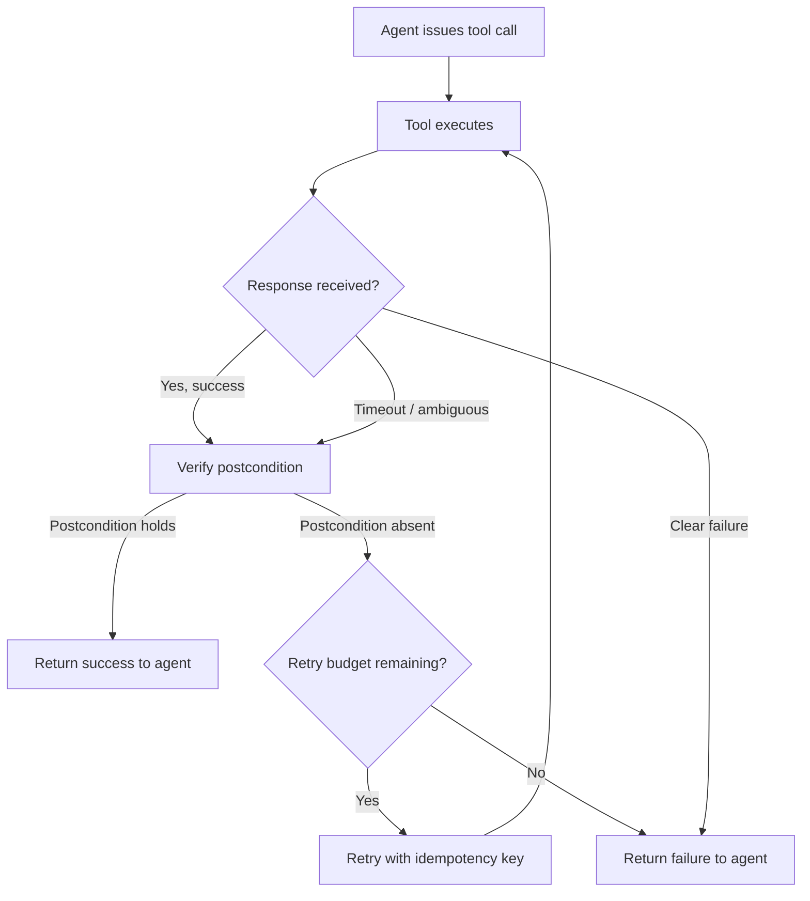

# Verified Tool Calls and Non-Atomic Failures: What a Postcondition Wrapper Teaches Us About Codex CLI's PostToolUse Hooks


---

Every coding agent framework assumes tool calls are atomic: the call either succeeds or fails, and the response tells the truth. In production, that assumption is dangerously wrong. Timeouts fire after the side-effect has already landed. Delayed visibility means a state change exists but the response does not confirm it. Partial success leaves the world half-updated. A new paper by Mansoor, Phadke, and Rana — *Verified Tool Calls Improve LLM Agent Reliability Under Non-Atomic Failures* — quantifies exactly how badly these non-atomic failures degrade agent behaviour and proposes a lightweight wrapper that largely eliminates the damage [^1]. The findings map directly onto Codex CLI's hook system, where PostToolUse scripts already occupy the same architectural slot the paper's wrapper fills.

## The Non-Atomic Failure Taxonomy

The paper defines four failure modes, each injected at calibrated probabilities across low, medium, and high fault levels [^1]:

| Fault Type | Low | Medium | High |
|---|---|---|---|
| **Timeout** — call dispatched, response never arrives | 0.05 | 0.20 | 0.35 |
| **Delayed visibility** — state updated, query returns stale data | 0.05 | 0.15 | 0.25 |
| **Partial success** — some fields written, others not | 0.03 | 0.10 | 0.15 |
| **Conflict** — concurrent mutation rejects the write | 0.02 | 0.05 | 0.10 |

These are not exotic edge cases. Any agent that calls external APIs, writes to databases, provisions cloud resources, or runs multi-step shell pipelines encounters all four regularly. The Openlayer failure-modes survey confirms that tool-calling errors and cascading propagation are the dominant production failure patterns in deployed agent systems [^2].

## Three Design Principles

The verification wrapper rests on three principles [^1]:

1. **Effect–response separation.** The system must independently verify whether an action's postcondition holds in world state, without relying on the response channel.
2. **Verify-before-retry.** The system must never issue a retry without first consulting a postcondition verifier, ensuring retries fire only when the intended state change is confirmed absent.
3. **Idempotent execution.** When a retry is warranted, it must carry an idempotency key (`k = hash(agent_id, action_type, payload, timestamp_bucket)`) so that a retry arriving after a delayed success does not produce a duplicate effect.



## The Numbers

The paper evaluates two tasks — *Activate Customer* and *Record Invoice* — across 300 agent runs using Google Gemini Flash-Lite in a ReAct-style LangGraph loop [^1].

### Task Success Rate

| Task | Fault Level | Baseline | Wrapped | Improvement |
|---|---|---|---|---|
| Activate Customer | Low | 92% | 100% | +8pp |
| Activate Customer | Medium | 80% | 100% | +20pp |
| Activate Customer | High | 64% | 100% | **+36pp** |
| Record Invoice | Low | 100% | 100% | — |
| Record Invoice | Medium | 96% | 96% | — |
| Record Invoice | High | 96% | 100% | +4pp |

### Duplicate Action Rate

| Task | Fault Level | Baseline | Wrapped | Reduction |
|---|---|---|---|---|
| Activate Customer | Low | 20% | 0% | −20pp |
| Activate Customer | High | 72% | 20% | **−52pp** |
| Record Invoice | Low | 32% | 0% | −32pp |
| Record Invoice | High | 76% | 20% | **−56pp** |

The ablation study confirms that verification is the dominant factor: a verify-only configuration raises task success from 58% to approximately 80%, whilst idempotency keys alone provide marginal improvement without verification [^1].

## Mapping to Codex CLI's PostToolUse Hooks

Codex CLI's hook system already occupies the exact architectural position the paper's wrapper fills — a layer that fires after tool execution but before the agent processes the result [^3]. The mapping is direct:

### Postcondition Verification via Exit Code 2

A PostToolUse hook can verify that a shell command achieved its intended effect and, if verification fails, replace the tool result the agent sees with corrective feedback via exit code 2 [^3]:

```bash
#!/usr/bin/env bash
# hooks/verify-terraform-apply.sh
# PostToolUse hook: verify Terraform state after apply

INPUT=$(cat)
COMMAND=$(echo "$INPUT" | jq -r '.tool_input.command // ""')

# Only verify terraform apply commands
if [[ "$COMMAND" != *"terraform apply"* ]]; then
  exit 0
fi

# Effect-response separation: query state independently
STATE=$(terraform show -json 2>/dev/null | jq -r '.values.root_module.resources | length')

if [[ "$STATE" -eq 0 ]]; then
  echo "Postcondition failed: terraform show reports 0 resources after apply. Verify the plan and re-apply." >&2
  exit 2
fi

exit 0
```

The exit code semantics align precisely with the paper's design:

| Exit Code | Codex CLI Behaviour | Paper Equivalent |
|---|---|---|
| **0** | Pass-through, no intervention | Postcondition holds |
| **2** | Replace tool result with stderr feedback | Postcondition absent, steer retry |
| **Other** | Fail-open, proceed normally | Hook infrastructure failure |

### hooks.json Configuration

```json
{
  "hooks": {
    "PostToolUse": [
      {
        "matcher": "^Bash$",
        "hooks": [
          {
            "type": "command",
            "command": "bash hooks/verify-terraform-apply.sh",
            "timeout": 30,
            "statusMessage": "Verifying infrastructure state..."
          }
        ]
      }
    ]
  }
}
```

### Context Injection for Verify-Before-Retry

The paper's verify-before-retry principle maps onto PostToolUse's `additionalContext` response field. When a hook detects an ambiguous outcome, it can inject guidance that steers the agent towards verification before attempting a retry [^3]:

```json
{
  "hookSpecificOutput": {
    "hookEventName": "PostToolUse",
    "additionalContext": "Previous deploy returned ambiguous status. Run `kubectl get pods -n production` to verify pod state before re-deploying."
  }
}
```

This is functionally equivalent to the paper's postcondition check — the agent receives explicit instructions to verify world state rather than blindly retrying.

## What Codex CLI Does Not Yet Provide

The paper identifies three mechanisms. PostToolUse hooks deliver postcondition verification and verify-before-retry steering effectively. The third — idempotency keys — has no native support:

### The Idempotency Gap

The paper's formula `k = hash(agent_id, action_type, payload, timestamp_bucket)` ensures server-side deduplication when a retry arrives after a delayed success [^1]. Codex CLI hooks receive `tool_use_id` and `session_id` in their input JSON, which could serve as components of an idempotency key, but there is no built-in mechanism to:

1. **Generate and attach** idempotency keys to outgoing tool calls
2. **Track** which keys have been issued within a session
3. **Enforce** server-side deduplication

A PostToolUse hook can work around this by maintaining a local ledger — writing `tool_use_id` and a content hash to a session-scoped file and checking it before allowing a retry — but this is a userland workaround rather than a first-class feature.

### No Retry Budget Enforcement

The paper caps retries at one per operation. Codex CLI provides no per-tool-call retry budget. A PostToolUse hook can track retry counts via a temporary file, but the agent itself may still attempt unlimited retries unless `AGENTS.md` explicitly instructs otherwise.

### No Cross-Turn State Tracking

PostToolUse hooks are stateless between invocations. The paper's wrapper maintains state across the verify–retry cycle. In Codex CLI, a hook that needs cross-turn memory must persist it to the filesystem and read it back on the next invocation — functional but fragile.

## Practical PostToolUse Verification Patterns

Beyond the Terraform example, the paper's framework suggests several high-value PostToolUse patterns for Codex CLI:

### Database Migration Verification

```bash
#!/usr/bin/env bash
# Verify migration actually applied
INPUT=$(cat)
COMMAND=$(echo "$INPUT" | jq -r '.tool_input.command // ""')

[[ "$COMMAND" != *"migrate"* ]] && exit 0

# Postcondition: check latest migration version
CURRENT=$(python3 -c "from app.db import get_version; print(get_version())" 2>/dev/null)
EXPECTED=$(echo "$INPUT" | jq -r '.tool_response.output' | grep -oP 'Applying \K[\d]+' | tail -1)

if [[ "$CURRENT" != "$EXPECTED" ]]; then
  echo "Migration postcondition failed: expected version $EXPECTED, got $CURRENT" >&2
  exit 2
fi
exit 0
```

### Container Deployment Verification


```bash
#!/usr/bin/env bash
INPUT=$(cat)
COMMAND=$(echo "$INPUT" | jq -r '.tool_input.command // ""')

[[ "$COMMAND" != *"docker"*"run"* ]] && exit 0

CONTAINER=$(echo "$INPUT" | jq -r '.tool_response.output' | head -1)
sleep 2  # Allow startup

STATUS=$(docker inspect --format='{{.State.Running}}' "$CONTAINER" 2>/dev/null)
if [[ "$STATUS" != "true" ]]; then
  echo "Container $CONTAINER not running after docker run. Check logs: docker logs $CONTAINER" >&2
  exit 2
fi
exit 0
```


## AGENTS.md as a Complementary Defence

Where PostToolUse hooks enforce postcondition verification mechanistically, `AGENTS.md` can encode the verify-before-retry principle as a behavioural instruction [^4]:

```markdown
## Tool Reliability Rules

- After any infrastructure command (terraform, kubectl, docker), verify
  the intended state change before reporting success.
- Never retry a failed command without first checking whether the
  previous attempt partially succeeded.
- If a command times out, query the target system's state directly
  rather than re-running the command.
```

This dual-layer approach — mechanistic hooks plus behavioural instructions — mirrors the paper's finding that verification is the dominant improvement factor, with the wrapper providing the mechanism and the prompt providing the intent [^1].

## Implications for MCP Tool Calls

Codex CLI v0.147.0's support for MCP 2026-07-28 introduces paginated discovery and multi-round requests [^5]. Multi-round MCP requests are inherently non-atomic — a request that spans multiple rounds can fail partway through, leaving the server in an intermediate state. PostToolUse hooks that verify MCP tool postconditions become critical as the MCP tool surface grows.

The hook matcher already supports MCP tools via the `tool_name` field [^3]. A PostToolUse hook matching `^mcp__.*$` could implement universal postcondition verification for all MCP-connected services — the same architectural pattern the paper proposes, applied at the protocol boundary.

## Conclusion

The paper's core insight is simple but consequential: tool calls are not atomic, and pretending they are produces duplicate actions at rates up to 76% under realistic fault conditions. A lightweight postcondition-verification wrapper eliminates most of this damage. Codex CLI's PostToolUse hook system already provides the right architectural slot for this pattern — exit code 2 feedback, `additionalContext` injection, and per-tool matching are sufficient to implement postcondition verification and verify-before-retry logic today. The remaining gap is native idempotency-key support and cross-turn state tracking, which would close the loop on the paper's full three-principle framework.

---

## Citations

[^1]: Mansoor, I.K., Phadke, A., & Rana, P. (2026). "Verified Tool Calls Improve LLM Agent Reliability Under Non-Atomic Failures." *arXiv:2608.02645*. [https://arxiv.org/abs/2608.02645](https://arxiv.org/abs/2608.02645)

[^2]: Openlayer. (2026). "AI Agent Failure Modes: Tool-Calling Errors, Infinite Loops & Propagation." [https://www.openlayer.com/blog/ai-agent-failure-modes-tool-calling-loops-propagation](https://www.openlayer.com/blog/ai-agent-failure-modes-tool-calling-loops-propagation)

[^3]: Vaughan, D. (2026). "Codex CLI Hooks: Complete Guide to Events, Policy Engines and Production Patterns." *Codex Knowledge Base*. [https://codex.danielvaughan.com/2026/04/15/codex-cli-hooks-complete-guide-events-policy-patterns/](https://codex.danielvaughan.com/2026/04/15/codex-cli-hooks-complete-guide-events-policy-patterns/)

[^4]: Blake Crosley. (2026). "Codex CLI Guide 2026: Setup, Sandbox, AGENTS.md & MCP." [https://blakecrosley.com/guides/codex](https://blakecrosley.com/guides/codex)

[^5]: OpenAI. (2026). "Release 0.147.0 — openai/codex." *GitHub*. [https://github.com/openai/codex/releases/tag/rust-v0.147.0](https://github.com/openai/codex/releases/tag/rust-v0.147.0)

[^6]: Vaughan, D. (2026). "Codex CLI Verification Patterns: Seven Strategies for Ensuring Agent-Generated Code Actually Works." *Codex Knowledge Base*. [https://codex.danielvaughan.com/2026/06/09/codex-cli-verification-patterns-ensuring-agent-generated-code-correctness-hooks-review-testing/](https://codex.danielvaughan.com/2026/06/09/codex-cli-verification-patterns-ensuring-agent-generated-code-correctness-hooks-review-testing/)
