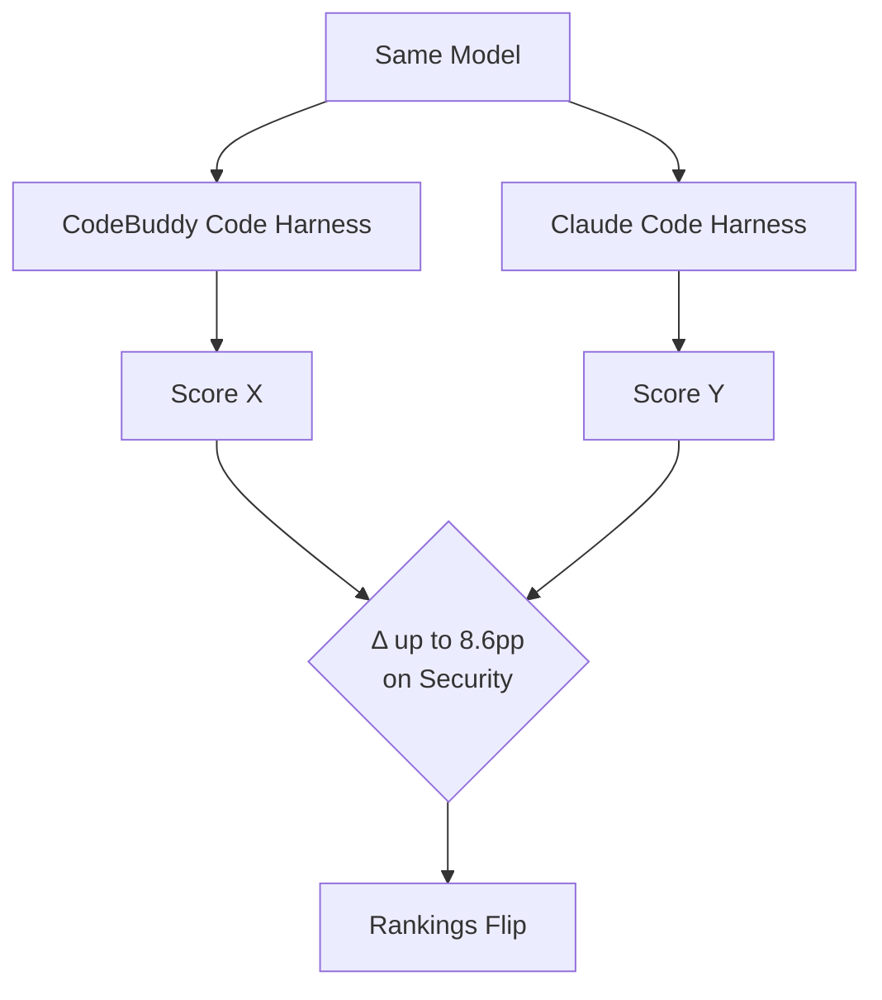
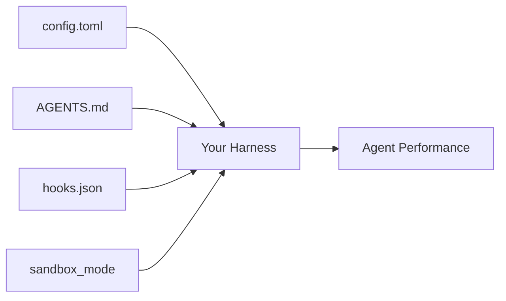

# WorkBuddy Bench and the Contamination-Resistant Multi-Domain Benchmark: Why the Harness Is Not a Neutral Instrument — and What 260 Tasks Reveal for Codex CLI Developers


---

## The Benchmark Contamination Crisis

By mid-2026, the coding agent benchmark landscape is in trouble. OpenAI discontinued SWE-bench Verified reporting in February 2026 after auditing 138 problems and finding that 59.4% of o3 failures were caused by test flaws rather than model limitations [^1]. Every frontier model showed training data contamination — verbatim solutions could be reproduced for some tasks. The replacement, SWE-bench Pro, fared little better: OpenAI later estimated roughly 30% of its tasks were broken and retracted its recommendation [^1].

Into this vacuum steps Tencent's WorkBuddy Bench (arXiv:2607.20911, July 2026), a 260-task evaluation suite that takes a fundamentally different approach to contamination resistance — and, in the process, surfaces a finding that should concern every developer tuning their Codex CLI configuration: **the harness is visibly not a neutral measurement instrument** [^2].

## What WorkBuddy Bench Does Differently

### Contamination-Resistant Construction

Rather than adapting public GitHub issues, every WorkBuddy Bench task is reverse-engineered from a real commit, pull request, or business scenario and rewritten as a short, colloquial, role-played request [^2]. The key insight: a task's prompt is not recoverable by web-searching the underlying issue, PR, or commit thread. Contamination resistance rests on construction methodology combined with dataset versioning, not secrecy.

This is a direct response to the contamination problem. Where SWE-bench tasks can be traced back to public GitHub issues that appear in training corpora [^1], WorkBuddy Bench's reverse-engineering approach severs the link between evaluation prompt and publicly indexed source material.

### Four Complementary Domains

The suite spans four work domains, each with its own verification style [^2]:

| Domain | Tasks | Focus | Verification |
|--------|-------|-------|-------------|
| Code | 80 | Repository-level engineering across 5 requester roles | Deterministic tests |
| Web | 70 | Frontend development, UI artifacts, interaction state | Rules + LLM/VLM judges (786 rubric items) |
| Office | 50 | Mixed-format file workflows, business tasks | Dual-channel: deterministic + LLM judges |
| Security | 60 | Red-team (38) and blue-team (22) operations on real CVEs | Deterministic `scoring.py`, zero LLM judges |

Critically, scores are explicitly declared non-comparable across subsets [^2]. This acknowledges what the "Coding Benchmarks Are Misaligned" position paper (arXiv:2606.17799) argued: a single aggregate score conflates fundamentally different capabilities [^3].

## The Harness Sensitivity Finding

WorkBuddy Bench tested seven models under two agent harnesses — CodeBuddy Code and Claude Code — and the results expose a structural problem for anyone relying on benchmark scores to guide configuration decisions.



### Rankings That Flip Between Harnesses

GPT-5.5 ranked ahead of GLM-5.2 under CodeBuddy (72.90 vs 71.54 on Code) but behind under Claude Code (76.63 vs 77.06) [^2]. The mean shift on Security was 8.6 points — enough to reorder the entire leaderboard. Office proved the least sensitive domain (median 0.86-point shift), whilst Security showed the most volatility.

### What This Means

The Binding Constraint Thesis — that the execution harness is often a stronger determinant of agent performance than the model it wraps — now has multi-domain empirical evidence [^4]. For Codex CLI users, this carries a direct implication: **your `config.toml`, `AGENTS.md`, and hook configuration are not just convenience wrappers — they are performance-critical infrastructure**.

## Key Results Across Domains

### Code (80 Tasks)

Claude Opus 4.8 led at 74.43/77.90 (CodeBuddy/Claude Code), but GPT-5.5 demonstrated exceptional efficiency: 6.9k output tokens under CodeBuddy versus Claude Opus 4.8's substantially higher token budget, with no correlation between output volume and performance [^2]. Only 10 of the 80 tasks involved bug fixing; the remaining 70 spanned broader engineering work including feature pipelines (0.94 mean score) and API contracts (0.47).

### Web (70 Tasks)

The Web subset uses 786 scored rubric items evaluated via rules, LLM/VLM judges, and agent judges. Claude Opus 4.8 and GLM-5.2 led (68.14/69.86 and 67.43/60.71 respectively). Weakest areas: data visualisation semantics and page interaction state management — precisely the kinds of tasks that require multi-step verification [^2].

### Security (60 Tasks)

The most striking result: GLM-5.2 topped the Security board at 76.32/80.86 — the only open-weight model leading any domain [^2]. The Security subset uses real historical CVEs from curl, nginx, vim, binutils, jq, and fluent-bit, with five anti-cheat layers including banned-literal scanning, renamed-input tests, overlay/tamper tests, encoding-dependence tests, and decoy fields.

Claude Opus 4.8 recorded 13 refusals under Claude Code on Security tasks — a reminder that safety alignment and benchmark performance can work at cross purposes.

### Office (50 Tasks)

GPT-5.5 led at 86.05 under Claude Code. Common failure modes — cross-file inconsistency, unvalidated artifacts, unclear source attribution — map directly to the kinds of errors that PostToolUse verification hooks are designed to catch [^2].

## Mapping to Codex CLI Configuration

WorkBuddy Bench's findings translate directly into Codex CLI configuration strategy.

### Model Selection via Named Profiles

The domain-dependent performance variations argue strongly for task-specific model routing via Codex CLI's named profiles in `config.toml`:

```toml
[profile.security-audit]
model = "glm-5.2"           # Leads Security domain
approval_policy = "unless-allow-listed"

[profile.office-workflow]
model = "gpt-5.6-terra"     # GPT-5.5 successor, Office-optimised
approval_policy = "on-failure"

[profile.code-review]
model = "claude-opus-4.8"   # Leads Code domain
approval_policy = "unless-allow-listed"
```

The GPT-5.4 deprecation on 31 August 2026 [^5] makes this routing decision more urgent. Migrating to GPT-5.6 Terra/Luna/Sol variants whilst considering WorkBuddy Bench's domain-specific rankings gives you data-driven defaults rather than blanket model choices.

### Harness Configuration as Performance Lever

WorkBuddy Bench's 8.6-point Security shift between harnesses demonstrates that the execution environment matters as much as the model. In Codex CLI terms, your harness is defined by:



- **`AGENTS.md`** — acts as the system prompt; its structure, specificity, and constraint density directly influence task completion
- **`sandbox_mode`** — `workspace-write` vs `network-full` changes what the agent can attempt, affecting both Security and Code domain performance
- **PostToolUse hooks** — the Office subset's common failures (cross-file inconsistency, unvalidated artifacts) are precisely what postcondition verification hooks address

### Security Task Refusals and Approval Policy

Claude Opus 4.8's 13 Security refusals under Claude Code raise a practical question for security-focused workflows. If your agent refuses legitimate red-team or security audit tasks, consider:

```toml
[profile.security-red-team]
model = "glm-5.2"
sandbox_mode = "network-full"
approval_policy = "on-failure"
```

Pairing an open-weight model that does not over-refuse with a restrictive `approval_policy` gives you coverage without sacrificing oversight.

### Token Efficiency and Context Budget

GPT-5.5's 6.9k output tokens on Code (the lowest of any model) with competitive scores suggests that `project_doc_max_bytes` and `model_auto_compact_token_limit` tuning can be model-dependent. Leaner models may benefit from tighter context budgets that prevent unnecessary exploration.

## The Anti-Contamination Blueprint

WorkBuddy Bench's construction methodology offers a template that the broader benchmark community should adopt:

1. **Reverse-engineer from real artefacts** — rewrite prompts so they cannot be recovered via web search
2. **Domain-specific verification** — avoid single-score aggregation across fundamentally different capability axes
3. **Deterministic scoring where possible** — the Security subset uses zero LLM judges, eliminating judge model variance
4. **Five-layer anti-cheat** — banned-literal scanning, renamed inputs, overlay/tamper tests, encoding dependence, and decoy fields resist shortcut strategies
5. **Open release with construction-based resistance** — transparency over secrecy, versioning over obscurity

## Gaps and Limitations

WorkBuddy Bench advances the field but leaves several questions open:

- **Two harnesses only** — testing CodeBuddy Code and Claude Code omits Codex CLI's native shell harness, OpenHands, and other production scaffolds. The harness sensitivity finding demands broader coverage.
- **No hook/plugin variation** — the harness is treated as a black box. WorkBuddy Bench does not test how PreToolUse/PostToolUse hooks or Agent Plugins (v0.147.0) modify outcomes.
- **Static configuration** — all runs use fixed configurations. Real-world Codex CLI usage involves dynamic model routing via named profiles, approval policy escalation, and context compaction — none of which are evaluated.
- **Security refusal asymmetry** — 13 Claude Opus 4.8 refusals are noted but not analysed for whether they represent genuine safety boundaries or false positives that reduce legitimate capability measurement.

## Practical Takeaways

1. **Stop treating benchmarks as model rankings.** WorkBuddy Bench's harness sensitivity data confirms that your Codex CLI configuration is a first-class performance variable.
2. **Route by domain.** GLM-5.2 for security, Claude Opus 4.8 for code, GPT-5.6 Terra for office workflows — the era of one-model-fits-all is over.
3. **Demand contamination-resistant benchmarks.** When evaluating claims about model performance, ask whether the benchmark uses construction-based resistance or relies on secrecy.
4. **Treat your harness as infrastructure.** `config.toml`, `AGENTS.md`, `hooks.json`, and `sandbox_mode` are not afterthoughts — they are the difference between an 8.6-point swing.

---

## Citations

[^1]: OpenAI, "Why SWE-bench Verified No Longer Measures Frontier Coding Capabilities," openai.com, February 2026. [https://openai.com/index/why-we-no-longer-evaluate-swe-bench-verified/](https://openai.com/index/why-we-no-longer-evaluate-swe-bench-verified/)

[^2]: Cai, S. et al., "Tencent WorkBuddy Bench: A Multi-Domain Coding-Agent Benchmark with Contamination-Resistant Task Construction," arXiv:2607.20911, July 2026. [https://arxiv.org/abs/2607.20911](https://arxiv.org/abs/2607.20911)

[^3]: Gorinova, M. et al., "Position: Coding Benchmarks Are Misaligned with Agentic Software Engineering," arXiv:2606.17799, June 2026. [https://arxiv.org/abs/2606.17799](https://arxiv.org/abs/2606.17799)

[^4]: Wasowski, J., "Coding Agent Index 2026 — Benchmarking Full Agent Stacks (Model + Harness)," Medium, May 2026. [https://medium.com/@wasowski.jarek/coding-agent-index-2026-benchmarking-full-agent-stacks-model-harness-4183305e4b90](https://medium.com/@wasowski.jarek/coding-agent-index-2026-benchmarking-full-agent-stacks-model-harness-4183305e4b90)

[^5]: OpenAI, "Codex CLI Changelog — August 2026," developers.openai.com. [https://developers.openai.com/codex/changelog](https://developers.openai.com/codex/changelog)

[^6]: Tencent WorkBuddy Bench Project, workbuddybench.com / GitHub: Tencent/workbuddy-bench / Hugging Face: papers/2607.20911. [https://huggingface.co/papers/2607.20911](https://huggingface.co/papers/2607.20911)
