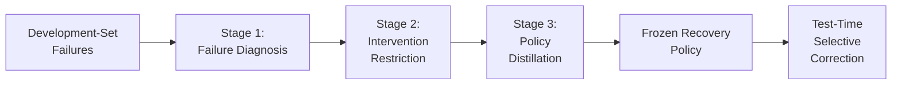
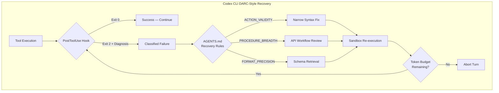

# Diagnosis Before Recovery: What DARC's Selective Self-Correction Means for Your Codex CLI Error-Handling Strategy


---

## The Problem with Generic Recovery

When a coding agent fails, the instinct — both human and programmatic — is to throw more context at the problem. Append the error trace. Retrieve similar examples. Inject a reflection prompt. This "broad playbook" approach is the default in most agent frameworks, and it is actively harmful in a surprising number of cases.

Wang et al.'s *Diagnosis Before Recovery* paper, published on 12 August 2026, quantifies the damage[^1]. Their core finding: applying the wrong recovery intervention to a failure is no better than doing nothing, and in structured-output tasks it is *worse* — mismatched policies dropped macro accuracy from 94.50% to 37.75% on their XBRL Finance benchmark[^1]. The paper introduces DARC (Diagnosis-guided Agent Recovery and Correction), a harness that diagnoses the failure class *before* selecting a recovery action, yielding a 50.75 percentage-point improvement on ALFWorld and a 29.65-point gain on AppWorld over base agents[^1].

The implications for Codex CLI practitioners are direct. Codex already provides the hook infrastructure to build selective recovery — PostToolUse exit-code feedback, `additionalContext` injection, AGENTS.md behavioural directives, and sandbox-mediated test loops[^2][^3]. What most teams lack is the diagnostic layer that decides *which* recovery to apply. DARC's failure taxonomy offers a blueprint.

## DARC's Three-Stage Pipeline



DARC operates in three stages, all completed before deployment[^1]:

1. **Failure Diagnosis** — development-set failures are profiled to identify the dominant failure mode for each task family. Rather than treating every error as a generic "task failure", DARC classifies it into one of three categories (detailed below).

2. **Intervention Restriction** — the candidate recovery library is pruned to only those interventions that match the diagnosed failure type. This reduces the policy search space by 10× (40 candidates versus 400 in the full library) whilst achieving equivalent accuracy: 99.25% diagnosed versus 98.51% full-library cascade[^1].

3. **Policy Distillation** — a verifier selects the optimal intervention ordering based on a success-cost trade-off, and the policy is frozen before test-time evaluation.

The causal ordering is the key insight: *diagnose, then recover*. This inverts the typical agent pattern of "fail, append everything, retry".

## The Failure Taxonomy

DARC identifies three failure categories that recur across domains[^1]:

| Failure Class | Domain Example | Signal Type | Recovery Action |
|---|---|---|---|
| **Action Validity** | ALFWorld: state-incompatible actions | Typed error from environment | Restrict action space |
| **Procedure Breadth** | AppWorld: missing API workflows | Missing multi-step dependency | Procedural-recovery fallback |
| **Format Precision** | XBRL Finance: schema violations | Structural mismatch | Retrieval of format exemplars |

The critical finding from ablation studies is that these categories interact non-linearly. On ALFWorld, action restriction alone yielded +3.73 percentage points. Recovery prompting alone yielded −0.75 points. Combined — with diagnosis gating the combination — they yielded +49.26 points[^1]. Neither component works in isolation; the pairing, guided by correct diagnosis, drives the gain.

## Mapping DARC to Codex CLI's Recovery Infrastructure

Codex CLI v0.147.0 provides four mechanisms that map directly onto DARC's pipeline[^2][^3][^4]:

### PostToolUse Hooks as the Diagnostic Layer

PostToolUse hooks run after every tool execution. Exit code 2 replaces the tool result the agent sees with your stderr feedback — it does not undo the execution but controls what diagnostic signal reaches the model[^2]. This is precisely DARC's Stage 1: the hook classifies the failure before the agent attempts recovery.

A minimal diagnostic hook in `hooks.json`:

```json
{
  "hooks": [
    {
      "event": "PostToolUse",
      "command": "./scripts/diagnose-failure.sh",
      "timeout_ms": 5000
    }
  ]
}
```

```bash
#!/usr/bin/env bash
# diagnose-failure.sh — classify failure and inject typed feedback
set -euo pipefail

TOOL_OUTPUT="$CODEX_TOOL_OUTPUT"
EXIT_CODE="$CODEX_TOOL_EXIT_CODE"

if [ "$EXIT_CODE" -eq 0 ]; then
  exit 0  # success — no intervention needed
fi

# Stage 1: Diagnose failure class
if echo "$TOOL_OUTPUT" | grep -qE 'SyntaxError|TypeError|NameError'; then
  echo "FAILURE_CLASS: ACTION_VALIDITY" >&2
  echo "The command produced a language-level error. Fix the specific syntax or type issue. Do NOT add new dependencies or refactor." >&2
  exit 2
elif echo "$TOOL_OUTPUT" | grep -qE 'FAIL|AssertionError|Expected.*but got'; then
  echo "FAILURE_CLASS: PROCEDURE_BREADTH" >&2
  echo "A test assertion failed. Review the test expectation and the function under test. Consider missing edge cases or API workflow steps." >&2
  exit 2
elif echo "$TOOL_OUTPUT" | grep -qE 'schema|format|invalid.*json|validation'; then
  echo "FAILURE_CLASS: FORMAT_PRECISION" >&2
  echo "Output format does not match the expected schema. Check field names, types, and required properties against the spec." >&2
  exit 2
fi

# Unclassified — let the agent see the raw output
exit 0
```

### AGENTS.md as Intervention Restriction

DARC's Stage 2 — pruning the recovery library — maps to AGENTS.md behavioural directives. By encoding failure-specific instructions, you prevent the model from applying broad recovery strategies when narrow ones are required[^3]:

```markdown
## Error Recovery Rules

When a PostToolUse hook reports FAILURE_CLASS: ACTION_VALIDITY:
- Fix ONLY the reported syntax/type error
- Do NOT add imports, refactor surrounding code, or run unrelated tests
- Limit your fix to the specific line(s) identified in the error trace

When a PostToolUse hook reports FAILURE_CLASS: PROCEDURE_BREADTH:
- Re-read the relevant API documentation before attempting a fix
- Check whether a multi-step workflow is required
- You may add new function calls but must not restructure existing ones

When a PostToolUse hook reports FAILURE_CLASS: FORMAT_PRECISION:
- Retrieve the output schema from the project spec
- Match field names, types, and nesting exactly
- Do NOT change the underlying computation — only the serialisation
```

### Sandbox as the Verification Loop

Codex CLI's sandbox modes (`--sandbox workspace-write` or network-restricted environments) provide the bounded execution environment that DARC's verifier requires[^4]. Test commands run inside the sandbox produce typed pass/fail signals — the same compiler-and-test substrate that the paper identifies as giving coding agents their self-correction advantage over generic language-agent tasks[^1].

### Token Budget as Recovery Cost Control

DARC's policy distillation includes a cost dimension: it optimises the trade-off between recovery success and resource expenditure. On XBRL Finance, DARC optimised to a mean retrieval budget of 1.5 demonstrations versus higher fixed budgets in baselines[^1]. Codex CLI's configurable rollout token budget serves the same function — capping how much context an agent can consume during recovery before the turn is aborted[^5].



## The Numbers That Matter

DARC's results translate to practical expectations for Codex CLI workflows:

- **Invalid actions reduced by 92.9%** (1.288 → 0.091 per episode on ALFWorld) — equivalent to nearly eliminating the "agent tries something impossible" failure mode[^1].
- **Environment steps decreased 54.2%** (34.56 → 15.83 average) — fewer wasted iterations means lower token spend and faster task completion[^1].
- **Cross-task transfer** — frozen policies generalise effectively: Finance Formula→FiNER achieved 89.50% versus 90.00% target-tuned, and ALFWorld seen→unseen maintained 90.30%[^1]. This suggests that once you build a diagnostic hook for one task family, it transfers.
- **10× search-space reduction** — diagnosis narrows the policy search from 400 to 40 candidates with no accuracy loss[^1]. For teams building custom hooks, this means a small development-set analysis pays for itself many times over.

## What DARC Reveals About Current Gaps

The paper exposes three gaps in Codex CLI's current recovery infrastructure:

**No built-in failure classifier.** PostToolUse hooks provide the *mechanism* for diagnosis but no default taxonomy. Teams must build their own `diagnose-failure.sh` — the framework provides plumbing, not policy. DARC suggests that even a coarse three-class taxonomy (validity, breadth, precision) delivers most of the value[^1].

**No cross-turn recovery budget.** Codex CLI's token budget controls total turn cost but does not distinguish between productive work and recovery overhead. DARC's success-cost optimisation suggests that a separate "recovery budget" — limiting how many retry iterations the agent spends on a single failure before escalating — would improve efficiency[^1].

**No intervention audit trail.** When a PostToolUse hook fires and injects feedback via exit code 2, the diagnostic classification is not persisted in the conversation history in a structured way. DARC's frozen policies depend on being able to audit which interventions were applied and whether they succeeded — metadata that v0.147.0's "tool call metadata recording with bounded execution details" partially addresses but does not yet expose to hooks[^2].

## Practical Recommendations

1. **Start with three failure classes.** DARC's taxonomy (action validity, procedure breadth, format precision) covers the majority of coding-agent failures. Build a PostToolUse hook that classifies into these three buckets using pattern matching on tool output.

2. **Encode recovery restrictions in AGENTS.md.** Do not let the model choose its own recovery strategy. Specify what it *may not do* for each failure class — this is DARC's intervention restriction, and it is where the non-linear gains come from.

3. **Profile your development failures.** Run your agent on a development set and log which failure classes dominate. DARC's 10× search-space reduction comes from this one-time profiling step. Even 50 development runs will reveal your dominant failure mode.

4. **Set a recovery iteration cap.** Use AGENTS.md to instruct the agent to attempt at most N recovery iterations for a single failure before moving on or requesting human input. DARC's data suggests that mismatched recovery is worse than no recovery — better to stop than to apply the wrong fix.

5. **Measure recovery cost separately.** Track how many tokens are consumed by retry loops versus productive code generation. If recovery exceeds 30% of your token budget, your diagnostic layer is likely too coarse.

## Citations

[^1]: Wang, P., Hu, Y., Wang, H., Lv, Z., Zhang, X., Li, J., Yang, J.-M., Wu, W. & Tong, Y. (2026). "Diagnosis Before Recovery: Turning Agent Failures into Selective Self-Correction." *arXiv:2608.11772*. [https://arxiv.org/abs/2608.11772](https://arxiv.org/abs/2608.11772)

[^2]: OpenAI. (2026). "Codex CLI v0.147.0 Release Notes." *GitHub*. [https://github.com/openai/codex/releases/tag/rust-v0.147.0](https://github.com/openai/codex/releases/tag/rust-v0.147.0)

[^3]: OpenAI. (2026). "Codex CLI Hooks: Complete Guide to Events, Policy Engines and Production Patterns." *Codex Documentation*. [https://codex.danielvaughan.com/2026/04/15/codex-cli-hooks-complete-guide-events-policy-patterns/](https://codex.danielvaughan.com/2026/04/15/codex-cli-hooks-complete-guide-events-policy-patterns/)

[^4]: OpenAI. (2026). "Codex CLI Guide 2026: Setup, Sandbox, AGENTS.md & MCP." [https://blakecrosley.com/guides/codex](https://blakecrosley.com/guides/codex)

[^5]: Releasebot. (2026). "Codex Updates by OpenAI — August 2026." [https://releasebot.io/updates/openai/codex](https://releasebot.io/updates/openai/codex)
