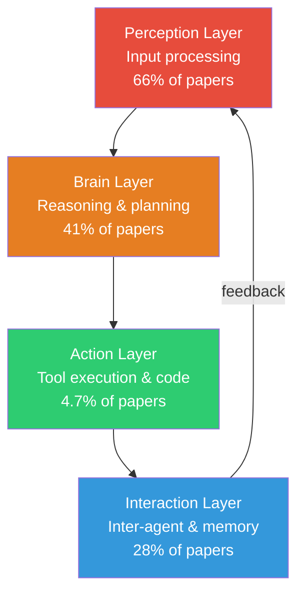
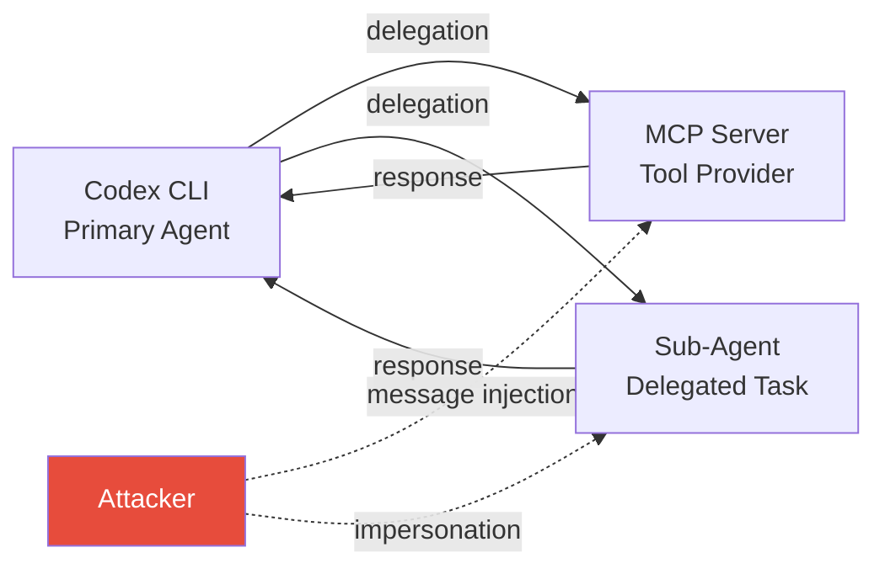

# The Four-Layer Agentic Vulnerability Taxonomy: What an 85-Paper Systematic Review Reveals About Your Codex CLI Defence Stack


---

A systematic review of 85 peer-reviewed papers on agentic LLM security has exposed a structural mismatch between where researchers look for vulnerabilities and where the real-world damage occurs. Hossain, Hossain and Ansari screened 743 records across six databases and distilled a four-layer taxonomy covering 13 vulnerability types — perception, brain, action, and interaction — with a finding that should concern every Codex CLI operator: attack research outpaces defence work by 3.9 to 1 [^1].

This article unpacks the taxonomy, maps each layer to Codex CLI v0.147.0's existing defence mechanisms, and identifies the gaps the review exposes.

## The Taxonomy at a Glance

The authors organise vulnerabilities by architectural function rather than by the inconsistent naming conventions that plague the field. Each layer corresponds to a stage in the agent loop:



The coverage distribution is the first red flag. Perception-layer research dominates at 66% whilst action-layer investigation — tool misuse, code injection, sandbox escape — accounts for just 4.7% of the corpus [^1]. The authors argue this reflects "methodological accessibility rather than actual risk distribution." Put differently: researchers study what is easy to demonstrate, not what is most dangerous in production.

## Perception Layer: The Crowded Front Door

The perception layer covers everything that happens before the model reasons about a task. The review catalogues four vulnerability classes here:

| Vulnerability | Papers | Codex CLI Defence |
|---|---|---|
| Direct prompt injection | 12 | `approval_policy`, AGENTS.md instruction boundaries |
| Indirect prompt injection | 15 | Auto-review (99.3% prompt injection recall) [^2] |
| Jailbreaking | 26 | Model-level safety training, `sandbox_mode` containment |
| Adversarial perturbations | 42 | Not directly applicable to text-primary CLI agents |

Codex CLI's auto-review system, introduced in the safer defaults for cyber-capable models in v0.146.1, operates as a perception-layer defence [^2]. It intercepts tool-call requests before execution and evaluates them against a trained classifier. OpenAI reports 99.3% prompt injection recall and 99.1% overall approval accuracy, though the review's finding of a 2.72× defensive refusal ratio for dual-use commands suggests over-blocking remains an unsolved tension [^2].

The `approval_policy` configuration — `suggest` (default), `auto-edit`, or `full-auto` via sandbox profiles — controls how much human review sits between perception and action [^3]. In the taxonomy's terms, this is a perception-to-action gate, not a perception-layer defence per se.

## Brain Layer: Reasoning Under Attack

The brain layer covers reasoning manipulation, goal hijacking, backdoor attacks, and memory poisoning. The review found 41% of papers touch this layer, dominated by memory poisoning (41 papers) and goal/plan hijacking (24 papers) [^1].

For Codex CLI operators, the brain layer maps to two surfaces:

1. **AGENTS.md and project-level instructions** — these shape the model's reasoning context. A compromised AGENTS.md file in an untrusted repository is a goal-hijacking vector. Codex CLI's project trust prompts mitigate this by requiring explicit user confirmation before loading project-level configuration from new repositories [^3].

2. **Context compaction** — when sessions exceed `model_auto_compact_token_limit`, Codex compacts the conversation history. The review's memory-poisoning category maps directly to the risk that adversarial content survives compaction whilst legitimate context is discarded. Recent formal work on context compaction theory has shown that repeated compaction degrades state fidelity [^4].

Codex CLI currently lacks cross-turn reasoning-chain verification. The model reasons, proposes a tool call, and the `PreToolUse` hook evaluates that call in isolation — there is no mechanism to detect a multi-step reasoning manipulation where each individual step appears benign but the sequence is adversarial.

## Action Layer: The 4.7% Blind Spot

The most striking finding is the action layer's underrepresentation. Only four of 85 papers (4.7%) focus on tool manipulation, code injection, or sandbox escape — yet these are the vulnerability types with immediate, irreversible real-world consequences [^1].

Codex CLI's defence stack is actually strongest here, partly by design and partly by accident:

### Sandbox Isolation

```toml
# config.toml — sandbox configuration
[sandbox]
mode = "workspace-write"  # Options: off, read-only, workspace-write, network-off
```

The `sandbox_mode` setting enforces OS-level containment. On macOS, Codex uses Apple's Seatbelt sandbox; on Linux, Landlock and seccomp-bpf restrict filesystem access and system calls [^3]. Crucially, sandbox enforcement sits below the model — a jailbroken or manipulated model cannot override it, which is exactly what the review means by "architectural coupling enables vulnerabilities to propagate across system components" when isolation is weak [^1].

### PreToolUse and PostToolUse Hooks

```json
{
  "hooks": {
    "PreToolUse": [
      {
        "command": "python3 policy_check.py",
        "timeout_ms": 5000,
        "on_failure": "block"
      }
    ],
    "PostToolUse": [
      {
        "command": "python3 verify_output.py",
        "timeout_ms": 10000,
        "on_failure": "block"
      }
    ]
  }
}
```

PreToolUse hooks intercept tool calls before execution, enabling custom policy enforcement — blocking destructive commands, validating file paths, or enforcing allowlists. PostToolUse hooks verify outcomes after execution. In the taxonomy's terms, these are action-layer defences that operate independently of the perception and brain layers [^5].

The review identifies sandbox escape as a vulnerability type with only 8 papers covering it. For Codex CLI, the v0.147.0 change routing approval requests through automatic review when using `workspace-write` sandbox adds a second check: even if a tool call passes the sandbox boundary check, auto-review can block it on semantic grounds [^2].

### The Gap: No Runtime Behaviour Monitoring

The review calls for "behavior monitoring for unexpected sequences of tool invocations, resource utilization, or output deviations" [^1]. Codex CLI does not currently implement runtime anomaly detection. Each tool call is evaluated independently by PreToolUse hooks and auto-review. A slow-burn attack — where each individual action is benign but the aggregate effect is destructive — would not be caught by the current architecture.

## Interaction Layer: Multi-Agent Surfaces

The interaction layer covers inter-agent message injection, agent impersonation, and knowledge base corruption. With Codex CLI v0.147.0 enabling multi-agent delegation configuration (disabled, explicit-request-only, or proactive), this layer is increasingly relevant [^3].



The MCP SDK upgrade to 3.0.0 in v0.147.0 and opt-in support for the MCP 2026-07-28 protocol bring paginated discovery and multi-round requests [^3]. However, the review identifies that inter-agent message authentication is absent from most agent frameworks — messages between agents are typically unverified plain text, making injection and impersonation trivial for an attacker who can intercept the communication channel [^1].

Codex CLI's MCP integration currently trusts tool responses from configured servers. There is no cryptographic message authentication, no response provenance verification, and no anomaly detection on tool response patterns. The review's recommendation for "message authentication and communication integrity checks" remains unimplemented [^1].

## The 3.9:1 Attack-Defence Ratio

The review's most consequential finding is quantitative: 55.3% of papers focus on attack discovery whilst only 14.1% focus on defence, a 3.9:1 ratio [^1]. The remaining 30.6% are surveys, taxonomies, or benchmarks.

This imbalance has practical consequences for Codex CLI operators:

1. **Known attacks exceed known defences** — for every defence mechanism you deploy, there are roughly four documented attack techniques it does not cover.
2. **Action-layer defences are the scarcest** — the layer where Codex CLI is most exposed (tool execution) has the least defensive research to draw upon.
3. **Real-world applicability scores lowest** — the review rates papers on four quality dimensions; real-world applicability scores a mean of 2.9 out of 5, versus 4.1 for threat model clarity [^1]. Most attacks are demonstrated in laboratory settings that do not account for production constraints like sandbox isolation.

## What This Means for Your Configuration

The taxonomy suggests a layered defence strategy that maps directly to Codex CLI's configuration surface:

| Layer | Codex CLI Defence | Gap |
|---|---|---|
| Perception | Auto-review, `approval_policy` | Over-blocking dual-use commands (2.72× refusal ratio) |
| Brain | AGENTS.md trust prompts, project trust | No cross-turn reasoning verification |
| Action | `sandbox_mode`, PreToolUse/PostToolUse hooks | No runtime behavioural anomaly detection |
| Interaction | MCP server configuration, delegation policy | No message authentication or response provenance |

The minimum viable hardened configuration for a security-conscious Codex CLI deployment in August 2026:

```toml
[sandbox]
mode = "workspace-write"

[policy]
approval_policy = "suggest"

[model]
auto_review = true
```

Combined with PreToolUse hooks that enforce an allowlist of permitted tool operations and PostToolUse hooks that verify file-system state after writes, this covers the perception and action layers. The brain and interaction layers remain largely undefended by tooling — they depend on human vigilance during review and careful MCP server selection.

## Open Questions

The review identifies seven critical research challenges. Three map directly to open Codex CLI issues:

1. **Action-layer containment and privilege boundary enforcement** — Codex CLI's sandbox is binary (on/off per mode) rather than graduated. There is no mechanism to grant a tool call elevated privileges for a single operation then revoke them.
2. **Cross-layer vulnerability propagation** — a prompt injection (perception) that manipulates reasoning (brain) to generate a malicious tool call (action) crosses three layers. Current defences evaluate each layer independently.
3. **Adaptive adversarial evaluation** — no existing benchmark tests Codex CLI's defence stack against adversaries that adapt their strategy based on which defences fire. The five benchmarks the review identifies (ASB, InjecAgent, AgentDojo, AgentHarm, GOAT) all use static attack sets [^1].

## Citations

[^1]: Hossain, M.J., Hossain, M.A. & Ansari, N. (2026). On Understanding, Identifying, and Mitigating Vulnerabilities in Agentic Large Language Models. *arXiv preprint* arXiv:2608.10530. [https://arxiv.org/abs/2608.10530](https://arxiv.org/abs/2608.10530)

[^2]: OpenAI. (2026). Codex CLI v0.146.1 Release Notes — Safer automatic-review defaults for cyber-capable models. [https://github.com/openai/codex/blob/main/CHANGELOG.md](https://github.com/openai/codex/blob/main/CHANGELOG.md)

[^3]: OpenAI. (2026). Codex CLI v0.147.0 Release Notes — Agent Plugins 1.0, MCP SDK 3.0.0, multi-agent delegation, session archiving. [https://github.com/openai/codex/blob/main/CHANGELOG.md](https://github.com/openai/codex/blob/main/CHANGELOG.md)

[^4]: Tirmazi, S., Markelon, A., Bishop, A. & Mitzenmacher, M. (2026). Context Compaction Theory. *arXiv preprint* arXiv:2608.01326. [https://arxiv.org/abs/2608.01326](https://arxiv.org/abs/2608.01326)

[^5]: OpenAI. (2026). Codex CLI Hooks Documentation — PreToolUse and PostToolUse hook events. [https://developers.openai.com/codex/config-basic](https://developers.openai.com/codex/config-basic)
