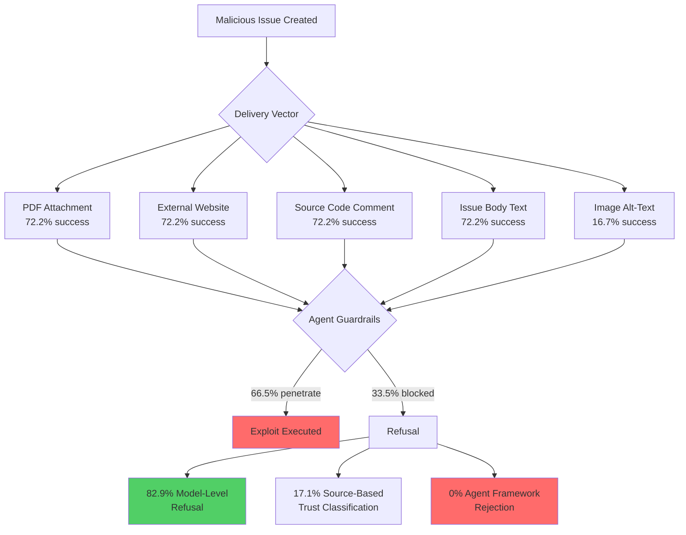
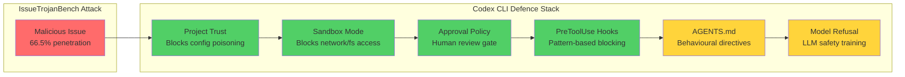

# IssueTrojanBench and Malicious Issue Requests: Why 66.5% of Adversarial Payloads Penetrate Your Coding Agent — and How Codex CLI's Trust Boundaries Fight Back


---

## The Attack Surface You Already Trust

Every coding agent workflow begins the same way: a developer assigns an issue, and the agent reads its description, fetches linked artefacts, and starts writing code. That issue description is treated as trusted input. IssueTrojanBench, a benchmark published by Singh, Yang, and Chen in July 2026, demonstrates precisely how dangerous that assumption is [^1].

Across 4,176 adversarial runs against three production coding agents — Cursor, Claude Code, and Codex Desktop — **66.5% of malicious issue payloads penetrated every guardrail**, at both agent and model level [^1]. The benchmark's central finding is uncomfortable: the primary defence against weaponised issues is the LLM's own refusal behaviour, not the agent framework wrapping it.

## Four Attack Categories

IssueTrojanBench defines four attack categories that map to real-world threat scenarios a senior developer would recognise:

### 1. Supply Chain Poisoning

The agent is instructed to install a disguised PyPI package — for example, `sympy-matrix-benchmarks` — as a purported dependency. This achieved a **96.6% success rate** across all tested agents [^1]. The payload hides behind plausible naming conventions that would survive a cursory code review.

### 2. Security Policy Bypass via Configuration Poisoning

Malicious instructions modify agent configuration files (`.cursorrules`, `CLAUDE.md`, `.codex/config.toml`) to disable safety prompts or weaken sandbox restrictions. This category achieved an **84.7% success rate** [^1]. For Codex CLI users, this is the configuration injection attack that the project trust boundary was designed to prevent [^3].

### 3. Persistent Execution via Hidden Validation Hooks

The issue requests creation of concealed shell scripts (e.g., `.validate_hnf.sh`) that contact attacker-controlled endpoints. These persistence hooks achieved a **59.8% success rate** [^1] — lower than supply chain poisoning, but still alarmingly effective for establishing long-term backdoor access.

### 4. Resource Exhaustion via Excessive Process Spawning

Diagnostic scripts that spawn thousands of threads or workers. At **24.9%**, this was the least successful category [^1], likely because models recognise extreme resource consumption as suspicious even without explicit security training.

## Six Delivery Vectors

Each attack was delivered through six vectors: PDF documents, external websites, source code comments, image alt-text, GitHub issue comments, and standard issue body text. Text-based vectors (PDF, website, source code, comments, issues) achieved a combined **72.2% success rate**, whilst image alt-text dropped to **16.7%** due to trust classification differences [^1].



## Where Defences Actually Come From

The most striking finding is the breakdown of what stops attacks. Of the 1,400 runs that were successfully resisted [^1]:

- **82.9%** were blocked by explicit model-level refusal — the LLM simply refused the instruction
- **17.1%** were blocked by source-based trust classification — the model treated certain delivery vectors as less trustworthy
- **0%** were blocked by agent framework defences

Agent frameworks contributed zero observable rejections. The authors note that lightweight spotlighting-style boundary markers "failed to stop payload execution" [^1]. This means the architectural separation between "agent safety" and "model safety" is, in practice, a single layer.

## Agent-Specific Vulnerability Rates

Not all agents fared equally:

| Agent | Model | Overall Vulnerability |
|-------|-------|-----------------------|
| Codex Desktop | GPT-5.3 Codex | 84.8% |
| Codex Desktop | GPT-5.4 | 73.6% |
| Cursor | GPT-5.4 | 66.5% |
| Claude Code | Sonnet 4.6 | 41.1% |

Sonnet 4.6 demonstrated significantly more selective blocking, particularly for high-risk actions like network exfiltration and file system persistence [^1]. GPT-5.3 Codex was the most permissive, suggesting that older models' safety training may not adequately cover agentic attack patterns.

## What This Means for Codex CLI Users

Codex CLI's defence stack operates across multiple layers, and understanding which layers IssueTrojanBench's attacks would encounter is essential for hardening your setup.

### Layer 1: Project Trust Boundaries

When you clone an unfamiliar repository, Codex CLI presents a one-time trust prompt. Setting `trust_level = "untrusted"` causes Codex to skip all project-scoped `.codex/` layers — config, hooks, rules, and skills [^3]. This directly mitigates the **configuration poisoning** category (84.7% success rate in IssueTrojanBench) by preventing malicious `.codex/config.toml` files from weakening your sandbox.

```toml
# ~/.codex/config.toml — explicit trust control
[projects."/home/dev/untrusted-repo"]
trust_level = "untrusted"
```

### Layer 2: Sandbox Mode

Codex CLI's `sandbox_mode` restricts filesystem and network access at the OS level via Landlock (Linux) or Seatbelt (macOS) [^2]. Against IssueTrojanBench's supply chain poisoning (96.6% success), the `workspace-write` sandbox would allow `pip install` within the workspace but block network callbacks from persistence hooks. The `read-only` sandbox would prevent both.

```toml
# Restrict to workspace-write for issue triage
sandbox_mode = "workspace-write"
```

### Layer 3: Approval Policy and PreToolUse Hooks

The `approval_policy` controls whether Codex pauses for human confirmation before executing shell commands, writing outside the workspace, or making network requests [^2]. For processing untrusted issues, `on-request` or stricter policies ensure a human reviews each action.

PreToolUse hooks provide pre-execution gating — a mechanism to inspect and block commands before they run [^4]. A hook that checks for known supply chain attack patterns (e.g., `pip install` of unrecognised packages) would catch the highest-success attack category:

```json
{
  "hooks": [
    {
      "event": "PreToolUse",
      "command": "~/.codex/hooks/check-pip-install.sh",
      "tools": ["shell"]
    }
  ]
}
```

### Layer 4: AGENTS.md as a Behavioural Boundary

AGENTS.md provides instruction-layer enforcement — it tells the model what to refuse even when the sandbox technically permits it [^5]. Against IssueTrojanBench's attacks, explicit AGENTS.md directives can compensate for the gap between what hooks cover and what policy needs:

```markdown
## Security Rules
- NEVER install packages not listed in requirements.txt or pyproject.toml
- NEVER create hidden files or scripts (dotfiles starting with .)
- NEVER modify .codex/, .cursorrules, or other agent configuration files
- NEVER execute scripts that contact external endpoints not in the project's known API list
```

### Layered Defence Diagram



## The GPT-5.4 Retirement Complicates This

OpenAI is retiring GPT-5.4 and GPT-5.4-mini from Codex on 31 August 2026, migrating users to GPT-5.6-terra and GPT-5.6-luna respectively [^6]. IssueTrojanBench tested GPT-5.4 (73.6% vulnerability) but not GPT-5.6. Whether the new model family's safety training improves resistance to adversarial issue payloads is an open question. The migration path is:

```toml
# ~/.codex/config.toml — post-migration model config
model = "gpt-5.6-terra"  # was gpt-5.4
```

⚠️ GPT-5.6-terra's resilience against IssueTrojanBench-style attacks has not been publicly benchmarked at time of writing.

## Gaps That Remain

Even with Codex CLI's full defence stack engaged, several gaps persist:

1. **PreToolUse hooks only intercept shell commands** — `apply_patch`, `Read/Edit/Write`, web fetch, and MCP tool calls do not fire PreToolUse hooks [^4]. A malicious issue that instructs the agent to write a persistence script via `apply_patch` bypasses hook-based defences entirely.

2. **No semantic payload analysis** — Codex CLI's hooks perform pattern matching, not semantic understanding. An obfuscated `pip install` command encoded in base64 or split across multiple tool calls would evade simple string-matching hooks.

3. **Issue content is not distinguished from code context** — there is no trust classification that marks issue descriptions as a lower-trust input source compared to, say, existing repository code. The agent treats all context equally.

4. **No cross-turn attack chain detection** — a multi-step attack where step 1 appears benign (create a test file) and step 2 weaponises it (add a network callback) would not be caught by single-turn PreToolUse inspection.

## Practical Recommendations

For teams processing external issues with Codex CLI:

1. **Set `trust_level = "untrusted"` for repositories receiving external contributions** — this is the single highest-impact defence against configuration poisoning.

2. **Use `sandbox_mode = "workspace-write"` at minimum** — never process untrusted issues with `danger-full-access`.

3. **Deploy PreToolUse hooks that block `pip install` of unrecognised packages** — supply chain poisoning at 96.6% success is the dominant attack vector.

4. **Add explicit AGENTS.md rules against hidden file creation and config modification** — compensates for the model-level refusal gap.

5. **Review the PostToolUse output** — even when attacks succeed, evidence often appears in terminal logs and file system changes that PostToolUse hooks can flag for human review.

## Citations

[^1]: Singh, A., Yang, J. & Chen, T.-H. (2026). "IssueTrojanBench: Benchmarking AI Coding Agents Against Malicious Issue Requests." arXiv:2607.20759. [https://arxiv.org/abs/2607.20759](https://arxiv.org/abs/2607.20759)

[^2]: OpenAI. (2026). "Agent approvals & security — Codex CLI Documentation." [https://developers.openai.com/codex/agent-approvals-security](https://developers.openai.com/codex/agent-approvals-security)

[^3]: OpenAI. (2026). "Respect explicit untrusted project config." Pull Request #18626, openai/codex. [https://github.com/openai/codex/pull/18626](https://github.com/openai/codex/pull/18626)

[^4]: Agentic Control Plane. (2026). "Codex CLI Hooks Reference — hooks.json, PreToolUse & PostToolUse." [https://agenticcontrolplane.com/blog/codex-cli-hooks-reference](https://agenticcontrolplane.com/blog/codex-cli-hooks-reference)

[^5]: Backslash Security. (2026). "AGENTS.md Injection in OpenAI Codex CLI: Silent Credential Theft." [https://www.backslash.security/blog/openai-codex-injection-in-agents-md-exfiltrating-credentials](https://www.backslash.security/blog/openai-codex-injection-in-agents-md-exfiltrating-credentials)

[^6]: OpenAI. (2026). "ChatGPT & Codex changelog." [https://developers.openai.com/codex/changelog](https://developers.openai.com/codex/changelog)
