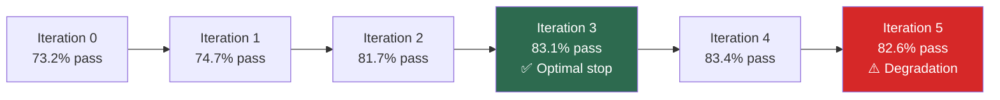
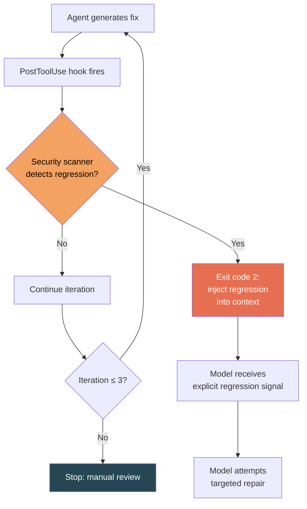

# Does Fixing Break Security? What 5,968 Iterative LLM Repair Timelines Reveal About Security Regression — and How Codex CLI's PostToolUse Hooks Defend Your Iteration Loop


---

Every developer who uses an LLM-based coding agent has experienced the loop: the model generates code, a validator flags an error, the model repairs, the validator flags again, and round it goes. The assumption baked into this workflow is that each iteration moves strictly towards correctness. A new empirical study of 5,968 iterative repair timelines demolishes that assumption and quantifies exactly how often the fixing itself breaks security.

Agyekum and Santos analysed Terraform generation scenarios from the IaC-Eval benchmark across 15 model–prompt–temperature configurations, tracking 30 CIS Benchmark security checks through up to five repair iterations[^1]. Their headline finding: between 3.3% and 13.8% of scenarios exhibit at least one security regression during iterative repair, depending on how you measure. For Codex CLI users running iterative fix loops on any codebase — not just Terraform — the implications are immediate and actionable.

## The Measurement Problem: Standard vs Strict Detection

The study's most methodologically interesting contribution is a dual-detection framework that exposes how multi-resource ambiguity inflates regression counts.

**Standard detection** counts any security check that fails after previously passing, regardless of whether it still passes on other resources in the same configuration. Under this definition, 13.8% of scenarios (823 of 5,968) exhibit regressions, with 24.8% of iteration transitions triggering at least one[^1].

**Strict detection** requires the check to have *exclusively* passed before and *exclusively* failed after — eliminating cases where the LLM restructured resources rather than degrading security. The strict rate drops to 3.3% of scenarios (194 of 5,968)[^1].

The gap matters. Approximately 76% of standard-mode flags reflect measurement artefacts from resource restructuring rather than genuine security loss[^1]. This finding alone should make any team reconsider how they instrument security gates in iterative workflows.

## Why Regressions Happen: Code Churn, Not Randomness

Security regressions are not stochastic sampling accidents. The study identifies a strong structural signal: regression transitions exhibit 2.6× more code churn than non-regression transitions (140.1 lines changed vs 53.8) and 4.9× higher check volatility in strict mode, with a Cohen's d of 1.49 — the strongest effect in the entire study[^1].

The root cause taxonomy tells the story:

| Root Cause | Standard Mode | Strict Mode |
|---|---|---|
| Resource restructuring | 79.0% | 68.4% |
| Configuration drift | 15.5% | 19.9% |
| Argument removal | 3.6% | 8.2% |

When the LLM cannot fix a validation error with a minimal patch, it restructures — adding, removing, or renaming entire resource blocks. The security configuration of the original resource is collateral damage[^1].

## The Iteration-3 Cliff

Perhaps the most actionable finding is the identification of iteration 3 as the optimal stopping point. Pass rates reach 83.1% at iteration 3, within 0.3 percentage points of the peak at iteration 4 (83.4%). By iteration 5, pass rates actually *decrease* to 82.6%, whilst cumulative regressions continue climbing[^1].



The self-correction rate offers partial comfort: 36.6% of regressions self-correct within an average of 1.2 iterations[^1]. But 28.5% of scenarios show *oscillating* checks — pass→fail→pass cycles that indicate the LLM has no stable strategy for certain security constraints, particularly IAM policy conditions (CKV_AWS_356, CKV_AWS_111, CKV_AWS_109)[^1].

## What This Means for Codex CLI

The study examines Terraform specifically, but the underlying mechanism — large code rewrites during iterative repair introduce security regressions — applies to any language and any iterative agent workflow. Codex CLI's hook system provides the primitives to defend against this pattern.

### PostToolUse Hooks as Regression Detectors

The study's most practical recommendation is to feed regression signals back to the LLM explicitly: "Warning: CKV_AWS_145 was passing but now fails"[^1]. Codex CLI's PostToolUse hooks support exactly this pattern. A hook that runs a security scanner after each tool invocation and returns regression diffs as `additionalContext` converts a silent regression into an explicit model-visible signal:

```json
{
  "hooks": {
    "PostToolUse": [
      {
        "matcher": "apply_patch|write",
        "hooks": [
          {
            "type": "command",
            "command": "./scripts/security-regression-check.sh",
            "timeout": 30,
            "statusMessage": "Running security regression check..."
          }
        ]
      }
    ]
  }
}
```

The hook script captures the scanner baseline before the turn and diffs it after. On exit code 0, execution continues normally. On exit code 2, the hook blocks continuation and injects the regression details into the model's context[^2].

```bash
#!/bin/bash
# security-regression-check.sh
# Compares security scan results before and after file modification

BASELINE="/tmp/codex-security-baseline.json"
CURRENT="/tmp/codex-security-current.json"

# Run scanner on modified files (adapt to your tool: checkov, trivy, semgrep)
checkov -d . --output json --quiet > "$CURRENT" 2>/dev/null

if [ -f "$BASELINE" ]; then
  REGRESSIONS=$(python3 -c "
import json, sys
baseline = set(json.load(open('$BASELINE')).get('passed_checks', []))
current_failed = set(json.load(open('$CURRENT')).get('failed_checks', []))
regressions = baseline & current_failed
for r in sorted(regressions):
    print(f'REGRESSION: {r} was passing, now fails')
if regressions:
    sys.exit(1)
")
  if [ $? -ne 0 ]; then
    echo "$REGRESSIONS"
    cp "$CURRENT" "$BASELINE"
    exit 2  # Feed regression back to model
  fi
fi

cp "$CURRENT" "$BASELINE"
exit 0
```

### Iteration Budget via Token Limits

Codex CLI does not expose a `max_repair_iterations` knob directly, but its token budget system achieves the same effect. The `model_auto_compact_token_limit` and the `/goal` command's token budget provide a soft ceiling that prevents unbounded iteration loops[^3]. Combined with the iteration-3 finding, a practical approach is to set budgets that accommodate roughly three repair cycles for any given task, then review manually.

### Auto-Review as a Second Check Layer

The v0.147.0 `--approve-for-me` flag routes approval requests through the Guardian auto-reviewer, which produces structured risk assessments before approving tool executions[^4]. For iterative repair workflows, this adds a model-level gate that can catch security-relevant changes that a static scanner might miss — particularly the "argument removal" category (8.2% of strict regressions) where the LLM silently deletes security-relevant configuration[^1].

### AGENTS.md: Constraining Repair Strategy

The study found that resource restructuring drives 68–79% of regressions[^1]. An AGENTS.md directive can constrain the model to minimal modifications:

```markdown
## Iterative Repair Rules

When fixing validation or security errors:
- Prefer minimal, targeted patches over wholesale resource regeneration
- Never remove or rename existing resource blocks to fix an unrelated error
- If a security check was passing before your change, it must still pass after
- After each fix, verify that previously passing security checks have not regressed
```

This maps directly to the study's recommendation of "security anchoring" — constraining the LLM to minimal modifications rather than wholesale regeneration[^1].

## The RAG Paradox

One counter-intuitive finding deserves attention. RAG-augmented configurations showed *higher* standard-mode regression rates (OR=1.67) but achieved *zero* strict-mode regressions across all RAG configurations[^1]. The explanation: RAG produces more comprehensive, multi-resource outputs (inflating standard counts via the measurement artefact) whilst maintaining individual check stability.

For Codex CLI users, this validates the Agent Plugins 1.0 approach of bundling reference documentation with skills[^5]. A plugin that includes CIS benchmark documentation or Terraform best-practice guides as retrieval context may produce more complex output but more stable security posture per individual resource.

## The Broader Lesson

The study tested Gemini 2.0 Flash and Mistral Large Latest — not the GPT-5.6 family that powers most Codex CLI sessions. The model-specific findings (Mistral's 17× higher standard-mode regression rate, which vanishes entirely in strict mode) should not be directly extrapolated[^1]. But the structural finding — that large code rewrites during iterative repair introduce security regressions at a non-trivial rate — is model-independent.

The defence architecture is straightforward:



Three iterations. Regression-aware hooks. Minimal-patch directives in AGENTS.md. The iterative repair loop remains powerful — but only if you instrument it to detect when fixing breaks security.

## Citations

[^1]: Agyekum, B. and Santos, F. (2026) "Does Fixing Break Security? An Empirical Study of Security Degradation in Iterative LLM-Driven Infrastructure-as-Code Repair", arXiv:2608.13404. Available at: [https://arxiv.org/abs/2608.13404](https://arxiv.org/abs/2608.13404)

[^2]: OpenAI (2026) "Hooks — Codex CLI Documentation". Available at: [https://developers.openai.com/codex/hooks](https://developers.openai.com/codex/hooks)

[^3]: OpenAI (2026) "Codex CLI Features — Goal Mode and Token Budgets". Available at: [https://developers.openai.com/codex/cli/features](https://developers.openai.com/codex/cli/features)

[^4]: OpenAI (2026) "Codex CLI v0.147.0 Release Notes — Agent Plugins, --approve-for-me, Conversation Sections". Available at: [https://github.com/openai/codex/releases/tag/rust-v0.147.0](https://github.com/openai/codex/releases/tag/rust-v0.147.0)

[^5]: OpenAI, Microsoft, AWS, Anysphere, Vercel (2026) "Agent Plugins 1.0.0 Specification". Available at: [https://github.com/nichochar/agent-plugins](https://github.com/nichochar/agent-plugins)
