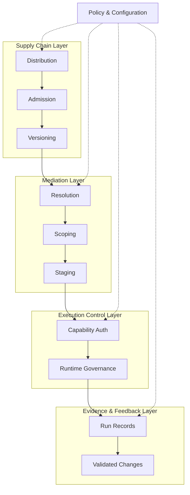
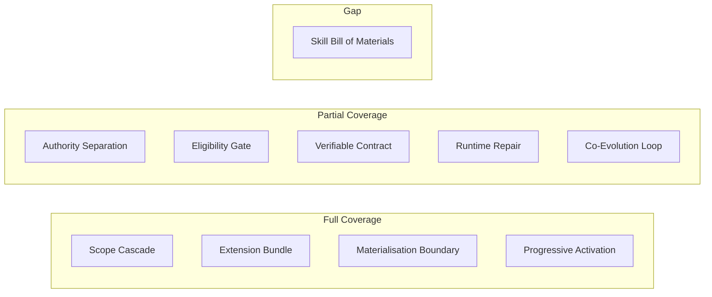

# Skill Harnessing Patterns: What a Ten-Pattern Reference Architecture Reveals About Your Codex CLI Agent Plugins Strategy


---

Agent Plugins 1.0 shipped on 6 August 2026 as an open, vendor-neutral packaging standard backed by a TSC of Core Maintainers from Amazon, Cursor, Microsoft, OpenAI, and Vercel[^1]. One day later Codex CLI v0.147.0 landed with full installation, four-scope catalogue federation, and runtime boundary enforcement[^2]. The specification is deliberately minimal — a directory, a manifest, an optional skills folder, an optional MCP declaration — and leaves policy, distribution, and governance to each client.

That minimalism is a strength for adoption but a risk for engineering. When you start building, composing, and distributing plugins across teams, the specification tells you *what goes in the box* but not *how to govern the lifecycle once the box is open*.

A recent academic paper fills that gap. Xia et al.'s "Harnessing Agent Skills: Architectural Patterns and a Reference Architecture for Skill-Mediated LLM Agents" (arXiv:2606.20631, May 2026) synthesised 209 practitioner-stream skill-practice rows from 37 systems and 133 academic-stream rows from 51 papers into ten architectural patterns organised across four responsibility layers[^3]. This article maps those patterns to what Codex CLI v0.147.0 already implements, what it partially covers, and where gaps remain.

## The Four Responsibility Layers

The reference architecture organises skill harnessing into four layers, with two cross-cutting substrates (policy/configuration and identifier management) supporting them:



Each layer addresses a distinct set of responsibilities. The supply chain manages how skill artefacts arrive and are admitted. Mediation resolves which skills apply in a given context. Execution control governs what those skills are actually permitted to do. Evidence and feedback captures what happened and routes learnings back into the artefact pool[^3].

## The Ten Patterns Mapped to Codex CLI

### Core Patterns

**1. Progressive Skill Activation**

The pattern prescribes staged transitions from available artefact to active runtime influence. Codex CLI implements this through its four-scope catalogue cascade: local (`.codex/plugins/`), personal (`~/.config/codex/plugins/`), workspace, and remote registry[^2]. A plugin is *available* when installed, *selected* when its scope matches the active project, and *active* when the agent loads its `SKILL.md` content into the prompt context. The staged approach keeps context efficient — skill descriptors are exposed for selection before full bodies are loaded.

**2. Skill–Execution Authority Separation**

This is the most architecturally significant pattern: selecting a skill must not implicitly grant execution permissions. Codex CLI enforces this through its runtime boundary system. A plugin's `mcp.json` can declare MCP servers, but the agent's `approval_policy` and `sandbox_mode` settings independently control what those servers can actually execute[^2]. Plugin-bundled hooks fire at `PreToolUse` and `PostToolUse` lifecycle points but are scoped to the plugin's context — a security plugin can block dangerous shell commands without the user writing custom hook scripts, but the hook itself cannot bypass the sandbox[^4].

**3. Verifiable Skill Contract**

The pattern attaches independently checkable criteria to validate skill enactment. In Codex CLI, `PostToolUse` hooks serve as partial contract verification — they can inspect tool outputs and return exit code 2 with `additionalContext` to provide feedback to the model[^4]. However, skill-level contracts (preconditions, postconditions, invariants) are not yet expressible in `plugin.json`. The specification's `schema` field validates manifest structure, not behavioural contracts.

**4. Runtime Skill Bill of Materials**

The pattern maintains run-scoped records linking skill artefacts to participation decisions. Codex CLI's conversation history implicitly captures which plugins were active, but there is no dedicated skill SBOM output. The `codex plugins list` command shows installed plugins, not per-session participation records. This is a gap: when auditing an agent run, you cannot currently reconstruct which skills influenced which decisions.

**5. Skill–Agent Co-Evolution Loop**

The pattern routes run evidence through validation before altering shared skill artefacts. Codex CLI's Memories system (`~/.codex/memories/`) and project-local `AGENTS.md` provide passive evolution surfaces — the agent can suggest updates based on session outcomes — but there is no automated validation gate before modifications reach shared artefacts. A developer manually reviews and commits changes. The pattern prescribes something more structured: automated evidence routing with governance checkpoints.

### Supporting Patterns

**6. Skill Eligibility Gate**

Gate admission to the selectable pool based on validation or trust conditions. Codex CLI implements this through installation-time checks: symlinks are rejected during installation, and capability filtering restricts MCP tools to declared permissions[^2]. The project-level `requirements.toml` can enforce fail-closed policies. However, there is no cryptographic signature verification or trust-chain validation for remote plugins — admission is currently based on source (the registry) rather than artefact integrity.

**7. Skill Scope Cascade**

Resolve precedence when skills exist at multiple organisational scopes. This is directly implemented: Codex CLI's four-scope system applies strict precedence where earlier scopes shadow later ones[^2]. A local plugin overrides a personal plugin of the same name, which overrides workspace, which overrides remote. This is one of the cleanest mappings between the academic pattern and the production implementation.

**8. Skill Resource Materialisation Boundary**

Separate activation from resolution of supporting material. When a plugin's `mcp.json` references `${PLUGIN_ROOT}` or `${PLUGIN_DATA}`, variable expansion happens at activation time, not installation time[^1]. This ensures resource paths resolve correctly regardless of where the plugin was installed. The `${PLUGIN_DATA}` variable points to a client-managed persistent directory, isolating each plugin's state.

**9. Skill Extension Bundle**

Package skill artefacts with dependencies as cohesive deployment units. This is the core value proposition of Agent Plugins 1.0: a directory with `plugin.json`, `skills/`, and `mcp.json` forms a self-contained deployment unit[^1]. Client-specific extensions use reverse-domain directories (e.g., `com.cursor.ide/`) to carry platform-specific data without polluting the portable core.

**10. Runtime Skill Repair**

Enable bounded same-run adaptation without modifying shared artefacts. Codex CLI supports this partially through `PostToolUse` hooks that inject corrective context via `additionalContext` feedback[^4]. The agent can adapt its interpretation of a skill mid-session without altering the underlying `SKILL.md`. However, there is no formal boundary on how far runtime adaptation can diverge from the original skill intent — no "drift budget" exists.

## Coverage Heat Map



Four patterns are fully implemented, five are partially covered, and one — the Runtime Skill Bill of Materials — represents a genuine architectural gap.

## Practical Implications

### What You Should Do Now

**Structure plugins around the separation of concerns.** The Authority Separation pattern is the most important one to internalise. When writing a `plugin.json` with an `mcp.json`, declare the minimum capabilities needed. Do not assume that bundling an MCP server grants it implicit trust:

```toml
# config.toml — restrict plugin MCP servers
[plugins.my-db-plugin]
sandbox_mode = "network-read"
approval_policy = "unless-allow-listed"
```

**Use the scope cascade deliberately.** Place shared team conventions in workspace-scope plugins, project-specific overrides in local `.codex/plugins/`, and personal preferences in `~/.config/codex/plugins/`. The precedence rules mean local always wins — use this for security-critical overrides.

**Bundle PostToolUse hooks for contract verification.** Until `plugin.json` supports declarative contracts, plugin-bundled `PostToolUse` hooks are your verification layer:

```bash
#!/bin/bash
# hooks/post-tool-use.sh — verify migration safety
if [[ "$TOOL_NAME" == "shell" ]]; then
  if echo "$TOOL_OUTPUT" | grep -q "ERROR.*migration"; then
    echo '{"exitCode": 2, "additionalContext": "Migration produced errors. Roll back before proceeding."}'
    exit 0
  fi
fi
echo '{"exitCode": 0}'
```

### What Is Missing

**Skill-level SBOM.** When an agent session produces a code change, there is no structured record of which plugins and skills influenced the outcome. For regulated environments or audit-heavy workflows, this matters. A `--skill-sbom` flag that emits a JSON manifest of active skills per session would close this gap.

**Cryptographic admission gates.** The Eligibility Gate pattern prescribes trust-chain validation. Remote plugins arrive from the OpenAI registry, but there is no signature verification at the artefact level. A compromised registry entry could inject malicious `SKILL.md` content or hostile MCP server configurations. Content-addressable hashing (similar to `npm`'s integrity fields) would strengthen admission.

**Behavioural contracts in the manifest.** The specification's `plugin.json` schema validates structure but not behaviour. A `contracts` field declaring pre/postconditions — even as natural-language assertions the model could self-verify — would enable the Verifiable Skill Contract pattern without requiring formal verification infrastructure.

**Co-evolution governance.** The gap between "Memories can be updated" and "validated evidence routes through governance before altering shared artefacts" is significant for team-scale plugin maintenance. An event-sourced changelog of skill modifications, gated by review, would implement the Co-Evolution Loop pattern properly.

## The Broader Picture

The Xia et al. reference architecture validates a direction Codex CLI is already travelling. The four-scope catalogue, plugin-bundled hooks, runtime boundary enforcement, and variable materialisation are not ad hoc features — they correspond to well-defined architectural responsibilities that recur across 37 production systems and 51 research papers[^3].

The remaining gaps — SBOM, cryptographic admission, behavioural contracts, co-evolution governance — are exactly the kind of responsibilities that mature as a plugin ecosystem grows. Agent Plugins 1.0 wisely shipped minimal. The ten patterns provide a roadmap for what comes next.

For teams adopting Codex CLI plugins today, the practical takeaway is clear: structure your plugins around authority separation, use scope cascade for governance, and instrument `PostToolUse` hooks as your interim contract verification layer. The specification gives you the packaging. The patterns give you the architecture.

## Citations

[^1]: Agent Plugins Specification v1.0.0, GitHub — [https://github.com/agentplugins/agent-plugins-spec](https://github.com/agentplugins/agent-plugins-spec)

[^2]: Codex CLI v0.147.0 release notes — Portable Agent Plugins, Multi-Catalog Federation, and the --approve-for-me Flag, Codex Knowledge Base — [https://codex.danielvaughan.com/2026/08/10/codex-cli-v0147-portable-agent-plugins-multi-catalog-federation-approve-for-me-conversation-sections/](https://codex.danielvaughan.com/2026/08/10/codex-cli-v0147-portable-agent-plugins-multi-catalog-federation-approve-for-me-conversation-sections/)

[^3]: Xia, B., Zhu, L., Xing, Z., Lu, Q., Sejdinovic, D. & Xu, X. (2026). "Harnessing Agent Skills: Architectural Patterns and a Reference Architecture for Skill-Mediated LLM Agents." arXiv:2606.20631 — [https://arxiv.org/abs/2606.20631](https://arxiv.org/abs/2606.20631)

[^4]: Codex CLI Plugin Marketplace: Remote Installation, Workspace Sharing, and Bundled Hooks, Codex Knowledge Base — [https://codex.danielvaughan.com/2026/05/08/codex-cli-plugin-marketplace-remote-install-workspace-sharing-bundled-hooks/](https://codex.danielvaughan.com/2026/05/08/codex-cli-plugin-marketplace-remote-install-workspace-sharing-bundled-hooks/)

[^5]: Agent Plugins 1.0: What the New Open Standard Means for Your Codex CLI Plugin Strategy, Codex Knowledge Base — [https://codex.danielvaughan.com/2026/08/08/agent-plugins-1-0-open-standard-codex-cli-portable-skills-mcp-packaging/](https://codex.danielvaughan.com/2026/08/08/agent-plugins-1-0-open-standard-codex-cli-portable-skills-mcp-packaging/)

[^6]: Google Developers Blog — "Agent Plugins package your skills, tools, and more" — [https://developers.googleblog.com/agent-plugins-package-your-skills-tools-and-more/](https://developers.googleblog.com/agent-plugins-package-your-skills-tools-and-more/)
