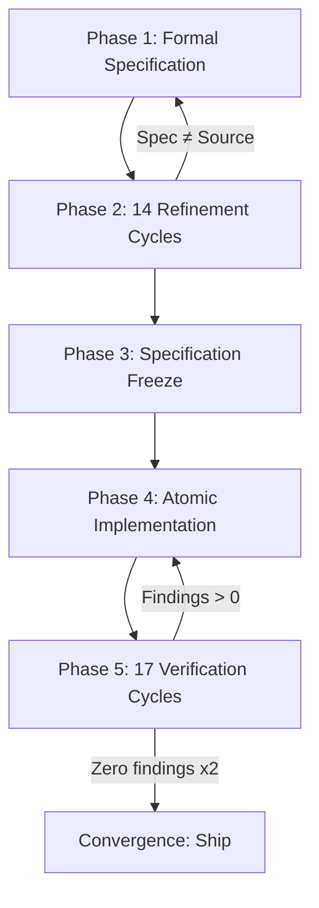
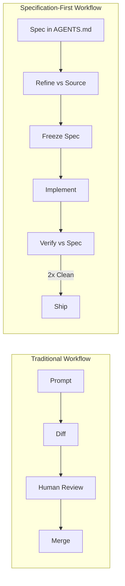

# Specification-First Convergence: What a 189-File Refactoring with Zero Post-Deployment Bugs Teaches Us About Codex CLI's Audit-Verification Workflow


---

Most developers treat AI coding agents as fast typists — describe the feature, watch the diff appear, review, merge. This works tolerably for isolated changes. It falls apart when the change is architectural, cross-cutting, and lacks a test oracle that can mechanically confirm correctness.

A case study published on 13 August 2026 demonstrates what happens when you invert the workflow: write the specification first, refine it against the source code, freeze it, implement atomically, then verify the implementation against the frozen specification until two consecutive passes find zero defects [^1]. The result — 189 files modified across a 717,725-line TypeScript codebase, 201 defects caught before execution, zero bugs observed across thirty subsequent sessions — deserves close attention from anyone using Codex CLI for non-trivial refactoring.

## The Problem: Dismantling an Architectural Invariant

The codebase in question enforced a central constraint: UI panels must remain open whilst the AI backend streams its response [^1]. Removing this invariant — allowing streaming to survive panel closure and reattach without data loss — touched state management, lifecycle hooks, event subscriptions, and rendering logic across 189 files [^1].

Two properties made this task especially hostile to conventional agentic workflows:

1. **No test oracle existed.** There was no pre-existing test suite that could confirm the new behaviour. The agent could not rely on a green CI pipeline to validate correctness [^1].
2. **The change was not incremental.** Partial removal of the invariant would leave the system in an inconsistent state. The implementation had to be atomic across all 189 files [^1].

This is precisely the class of problem where vibe coding — iterative prompting with ad hoc review — produces confident, compiling, subtly broken code.

## The Protocol: Refinement Then Verification

The methodology followed a strict five-phase protocol [^1]:



### Phase 1–2: Specification and Refinement

The agent produced a formal specification describing the target behaviour — not pseudocode, but a declarative statement of invariants the new system must satisfy. Over 14 refinement cycles, each cycle audited the specification against the actual source code, identifying mismatches between what the spec assumed and what the codebase actually did [^1].

This is the critical insight: **the specification was refined against reality, not against the developer's mental model.** Every cycle forced the spec to account for edge cases the original developer had forgotten or never documented.

### Phase 3: Specification Freeze

After 14 cycles, the specification was frozen. No further changes to the target description were permitted. This created a stable reference point — a fixed contract that the implementation phase could be audited against [^1].

### Phase 4–5: Implementation and Verification

Implementation produced two commits: 34,770 insertions and 16,422 deletions across 189 modified files and 31 newly created files [^1]. Seventeen verification cycles then audited the implementation against the frozen specification, with 31 audit passes identifying and correcting 201 defects before any human executed the code [^1].

The convergence criterion was deliberately conservative: **two consecutive verification passes with zero findings** [^1]. Not one pass — two. This guards against verification cycles that miss defects due to context window limitations or attention drift.

### The Result

Three days of elapsed time. \$2,430 in compute cost. Zero bugs observed across the initial deployment and approximately thirty subsequent sessions [^1].

## Mapping to Codex CLI: The Infrastructure Already Exists

Codex CLI v0.147.0 provides the building blocks to replicate this protocol, though assembling them requires discipline rather than tooling.

### AGENTS.md as the Specification Surface

The specification-first approach maps directly to Codex CLI's AGENTS.md layered discovery [^2]. A project-level AGENTS.md can encode the frozen specification as behavioural constraints:

```markdown
# AGENTS.md — Panel Lifecycle Refactoring Specification (FROZEN)

## Invariants
- Streaming generation MUST survive panel closure
- Panel reopening MUST reattach to the same live stream
- No data loss or duplication on reattach
- All 189 affected files MUST be modified atomically

## Constraints
- Do NOT modify files outside the panel lifecycle module without explicit approval
- Run `tsc --noEmit` after every file modification
- Do NOT change the streaming protocol wire format
```

Test commands referenced in AGENTS.md tell Codex what defines "done" for the project [^2]. When no test oracle exists, the specification itself becomes the oracle — and AGENTS.md is where it lives.

### PostToolUse Hooks as Verification Gates

Each verification cycle maps to a Codex CLI PostToolUse hook [^3]. A hook that runs after every file write can enforce compile checks, lint passes, or custom verification scripts:

```toml
# config.toml
[hooks.post_tool_use]
command = "bash scripts/verify-spec-compliance.sh"
exit_code_behavior = "stop_on_failure"
```

When a PostToolUse hook returns exit code 2, Codex feeds the hook's output back to the model as `additionalContext`, creating the feedback loop that drives convergence [^3]. The 201 defects caught in the case study would, in a Codex CLI workflow, appear as hook failures that the agent must resolve before proceeding.

### Named Profiles for Phase Separation

Codex CLI's named profiles (v0.134.0+) allow encoding the phase transitions as distinct configurations [^4]:

```toml
# ~/.codex/spec-refine.config.toml
model = "o3"
model_reasoning_effort = "xhigh"
approval_policy = "on-request"
sandbox_mode = "read-only"
```

```toml
# ~/.codex/implement.config.toml
model = "gpt-5.6-terra"
approval_policy = "unless-allow-listed"
sandbox_mode = "workspace-write"
```

```toml
# ~/.codex/verify.config.toml
model = "o3"
model_reasoning_effort = "xhigh"
approval_policy = "on-request"
sandbox_mode = "read-only"
```

The refinement and verification phases use a reasoning-heavy model in read-only mode — the agent analyses but cannot modify. The implementation phase switches to a code-generation model with write access. This enforces phase discipline at the configuration level rather than relying on prompt instructions [^4].

### The Convergence Criterion in Practice

The two-consecutive-zero-findings convergence criterion can be implemented as a shell script invoked via `codex --profile verify`:

```bash
#!/bin/bash
# converge.sh — run verification until two consecutive clean passes
CLEAN=0
PASS=0
while [ $CLEAN -lt 2 ]; do
  PASS=$((PASS + 1))
  echo "=== Verification pass $PASS ==="
  codex --profile verify \
    "Audit the implementation against the frozen specification in AGENTS.md. \
     Report ONLY deviations. If none, reply ZERO_FINDINGS."
  if grep -q "ZERO_FINDINGS" /tmp/codex-output.txt; then
    CLEAN=$((CLEAN + 1))
    echo "Clean pass $CLEAN of 2"
  else
    CLEAN=0
    echo "Findings detected — resetting counter"
    codex --profile implement \
      "Fix the deviations identified in the previous verification pass."
  fi
done
echo "Converged after $PASS passes"
```

## Why This Matters: The Specification Is the Stable Artefact

Monperrus argued in March 2026 that for AI coding agents, "the specification, not the implementation, is the stable artifact of record" — improving an agent means improving its specification, because the implementation is regenerable [^5]. The Abenhaim case study provides empirical evidence for this claim at production scale.

The implication for Codex CLI users is direct: **invest time in AGENTS.md, not in reviewing diffs.** A well-specified AGENTS.md with frozen invariants and PostToolUse verification hooks will catch more defects than manual code review of a 34,770-line diff.



## Limitations and Open Questions

The case study has clear constraints that should temper enthusiasm:

- **Single-operator protocol.** One developer, one agent. Multi-agent delegation (Codex CLI v0.107.0+) introduces coordination failures that the protocol does not address [^6].
- **Cost ceiling.** \$2,430 for a single refactoring is viable for high-value architectural changes but not for routine feature work. ⚠️ Cost scaling for larger codebases remains unverified.
- **French-language session logs.** The 1,500+ pages of published logs are in French, limiting reproducibility verification by the broader community [^1].
- **No automated convergence tooling.** The protocol was executed manually. Codex CLI provides the primitives (hooks, profiles, AGENTS.md) but no built-in convergence loop. ⚠️ The shell script above is illustrative, not battle-tested.

## Practical Takeaways

1. **Write the specification before touching code.** Encode it in AGENTS.md as frozen invariants.
2. **Separate refinement from implementation.** Use named profiles with different models, sandbox modes, and approval policies for each phase.
3. **Use PostToolUse hooks as verification gates.** Exit code 2 feeds findings back to the model.
4. **Converge on two consecutive clean passes, not one.** Single-pass verification is insufficient for large cross-cutting changes.
5. **Treat the specification as the primary artefact.** The diff is regenerable; the spec is not.

---

## Citations

[^1]: Abenhaim, J. (2026). "Specification-first convergence with an AI coding agent: a case study of dismantling a core architectural invariant across 189 files in a 717k-line codebase with no test oracle and no human code review." arXiv:2608.12440. [https://arxiv.org/abs/2608.12440](https://arxiv.org/abs/2608.12440)

[^2]: OpenAI. (2026). "AGENTS.md — Codex CLI Documentation." [https://developers.openai.com/codex/config-advanced](https://developers.openai.com/codex/config-advanced)

[^3]: OpenAI. (2026). "Codex CLI Hooks Configuration." [https://developers.openai.com/codex/config-advanced](https://developers.openai.com/codex/config-advanced)

[^4]: OpenAI. (2026). "Codex CLI Named Profiles." [https://developers.openai.com/codex/config-advanced](https://developers.openai.com/codex/config-advanced)

[^5]: Monperrus, M. (2026). "Bootstrapping Coding Agents: The Specification Is the Program." arXiv:2603.17399. To appear in IEEE Software. [https://arxiv.org/abs/2603.17399](https://arxiv.org/abs/2603.17399)

[^6]: Rafiei Oskooei, S. et al. (2026). "Deep Agentic Search for Repository-Level Code Question Answering: An Empirical Study." arXiv:2608.01507. [https://arxiv.org/abs/2608.01507](https://arxiv.org/abs/2608.01507)
