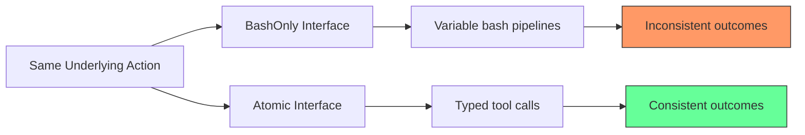
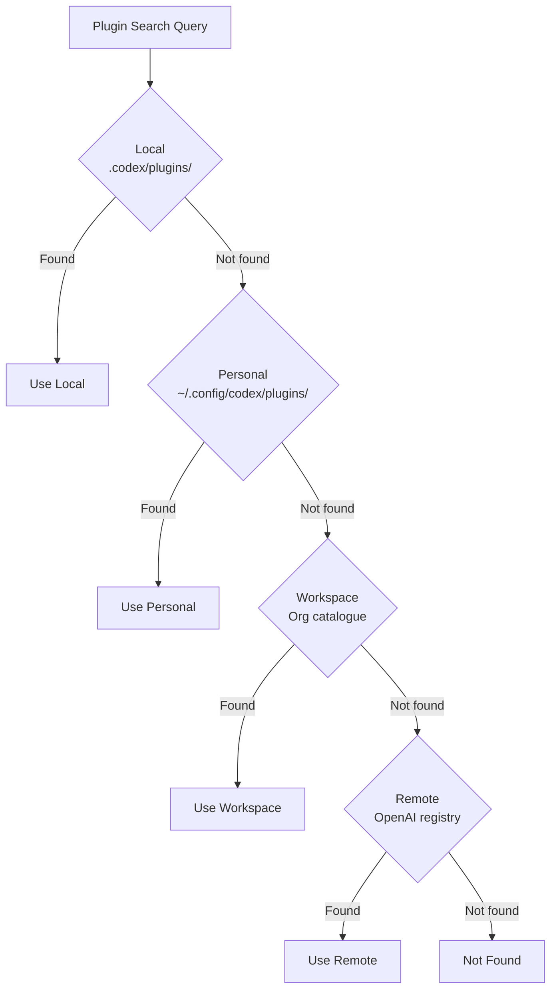

# The Devil Is in the Interface: How Tool Architecture Shapes Your Codex CLI Agent's Behaviour


---

Most teams optimise their Codex CLI workflows by choosing better models or writing sharper prompts. A new study from Purdue, Microsoft Research, and the University of Chicago demonstrates that neither matters as much as *how you expose tools to the model*. "The Devil Is in the Interface" [^1] evaluated six tool architectures across 11,700 trajectories and three frontier models, holding underlying capabilities constant while varying only the interface layer. The results are striking: structured interfaces improved consistency by up to 4.7×, natural-language search broadened file coverage by over 11%, and CodeAct-style Python interfaces cut token usage by 56.3% — all without changing the model or the available actions.

These findings land at the same moment Codex CLI v0.147.0 [^2] ships portable Agent Plugins 1.0 [^3], giving teams a concrete mechanism to package and distribute different tool architectures. The practical question is no longer whether tool design matters, but how to apply these results inside `plugin.json`, `skills/`, and `mcp.json`.

## What the Study Measured

Xu et al. selected 65 problem instances from SWE-bench Live across 25 repositories, ran 10 independent rollouts per instance per actor-setup pair, and tested three actors: Qwen3Coder-30B, Kimi K2.5, and Claude Sonnet 4.5 [^1]. Six architectures were compared:

| Architecture | Description |
|---|---|
| **BashOnly** | General-purpose shell commands only |
| **Atomic** | Bash plus explicit tools for search, view, string-replace, create |
| **NLSearch** | Atomic plus natural-language search via sub-agent |
| **Python** | CodeAct-style: agent writes executable Python blocks instead of tool calls |
| **HypoTrack** | Atomic plus hypothesis-tracking tool |
| **Scratchpad** | Atomic plus free-form thinking tool |

The critical design choice: all six architectures access the same underlying information and actions. Only the *interface* changes.

## Three Findings That Change Plugin Design

### 1. Structured Interfaces Boost Consistency

Atomic interfaces — where common operations are exposed as named tools with typed parameters — increased pass^k consistency by up to 4.7× for Qwen3Coder-30B [^1]. The weaker the base model, the larger the gain. Kimi K2.5 saw a +0.013–0.014 improvement; Claude Sonnet 4.5 gained +0.017–0.031.

The mechanism is straightforward: when the model must compose `grep`, `sed`, and `awk` pipelines from scratch, minor syntax variations across rollouts produce divergent trajectories. Explicit `str_replace` or `file_view` tools eliminate that composition noise.



**Codex CLI implication:** When building Agent Plugins that wrap shell operations, expose them as discrete MCP tools in `mcp.json` rather than relying on the model to compose bash. A plugin that provides `file_search`, `file_view`, and `string_replace` tools via a local MCP server will outperform one that simply instructs the model to use `grep` and `sed` — especially with smaller or open-weight models.

### 2. Natural-Language Search Broadens Exploration

NLSearch improved recall of high-relevance files by +0.046 (Qwen), +0.053 (Kimi), and +0.064 (Sonnet) [^1], giving the model access to over 11% more of the relevant codebase. The trade-off: precision dropped by 0.046–0.104, meaning the model also examined more irrelevant files.

This recall-precision trade-off mirrors the Codex CLI ecosystem's own tension between `code-index-mcp` semantic indexing and raw `grep`-based search. The paper confirms that semantic search is worth the precision cost when the repository is large enough that relevant files are missed by keyword patterns alone.

### 3. CodeAct Interfaces Cut Costs Without Cutting Quality

Python/CodeAct interfaces — where the agent writes executable code blocks instead of issuing individual tool calls — achieved comparable task performance with 41.6% fewer steps and 56.3% lower token usage [^1]. Step reductions were dramatic across all three actors:

- Qwen3Coder-30B: 77 → 46 steps
- Kimi K2.5: 65 → 47 steps
- Claude Sonnet 4.5: 80 → 55 steps

The efficiency comes from compound interaction: a single Python block can read a file, parse it, apply a regex, and write the result, replacing four separate tool calls.

### The Cognitive Scaffolding Null Result

HypoTrack and Scratchpad — lightweight text-based tools for intermediate reasoning — showed minimal effect [^1]. Models projected their existing reasoning patterns into these tools rather than adopting new ones. The scratchpad content closely matched reasoning already present in BashOnly trajectories; hypothesis-tracking actors rarely maintained multiple competing hypotheses.

This is a cautionary finding for teams building Codex CLI plugins that provide "thinking" or "planning" tools. Unless the scaffold enforces a retrieval mechanism, memory management, or reasoning policy, it will not change agent behaviour.

## Mapping to Agent Plugins 1.0

Agent Plugins 1.0, published 6 August 2026 [^3], is the packaging standard that makes tool architecture decisions distributable. A plugin is a directory with three components:

```bash
my-plugin/
├── plugin.json          # Manifest (name + version required)
├── skills/
│   └── code-review/
│       └── SKILL.md     # Procedural knowledge
└── mcp.json             # MCP server declarations
```

The `plugin.json` manifest follows a closed schema — unknown top-level fields are rejected [^3]. The `mcp.json` declares MCP servers using `stdio`, `streamable-http`, or legacy `sse` transports, with `${PLUGIN_ROOT}` and `${PLUGIN_DATA}` variables for dynamic path resolution.

Plugin resolution follows four scopes in precedence order [^2]:

1. **Local** — `.codex/plugins/` within the project
2. **Personal** — `~/.config/codex/plugins/`
3. **Workspace** — organisation-managed catalogue
4. **Remote** — OpenAI plugin registry

Local shadows personal, personal shadows workspace, workspace shadows remote.



### Applying the Research to Plugin Structure

The study's findings map directly onto plugin design decisions:

**For consistency** — package Atomic-style tools as MCP servers in `mcp.json`. Expose narrow, typed operations rather than broad bash wrappers:

```json
{
  "$schema": "https://agent-plugins.org/schemas/1.0.0/mcp.schema.json",
  "servers": {
    "code-tools": {
      "transport": "stdio",
      "command": "node",
      "args": ["${PLUGIN_ROOT}/scripts/code-tools-server.js"],
      "description": "Atomic code operations: search, view, replace, create"
    }
  }
}
```

**For exploration** — include a `skills/search-strategy/SKILL.md` that instructs the agent to prefer semantic search for large repositories and fall back to grep for small ones. The NLSearch finding shows this is not a minor optimisation — it changes which files the model discovers.

**For efficiency** — when targeting cost-sensitive workflows, design skills that encourage compound operations. A `SKILL.md` that says "batch file reads and writes into single code blocks where possible" leverages the CodeAct efficiency finding without requiring a different tool interface.

**Avoid empty scaffolding** — do not ship plugins whose primary value is a "thinking" or "planning" tool. Unless the tool enforces structured retrieval or state management, the study shows it will not alter agent behaviour.

## Plugin Security Boundaries

The Agent Plugins 1.0 specification is deliberately minimal on security [^3]. It specifies path containment (all file references must resolve within the plugin root; external symlinks are rejected) but explicitly excludes permission UX, code signing, secret handling, dependency resolution, sandboxing, and audit trails.

Codex CLI adds runtime boundaries on top: capability filtering, MCP data isolation, instruction caps, and symlink rejection during installation [^2]. For enterprise deployments, this means the workspace catalogue scope becomes the primary governance mechanism — organisations control which plugins are available without relying on the specification's security model.

## Plugin Management Commands

Codex CLI v0.147.0 exposes plugin operations through the CLI [^2]:

```bash
# Search across all four catalogue scopes
codex plugins search "database migration"

# Install from remote catalogue
codex plugins install db-migrate

# Install from local directory
codex plugins install ./my-plugins/lint-config

# List installed plugins with scope indicators
codex plugins list

# Remove a plugin
codex plugins remove db-migrate
```

## Practical Recommendations

1. **Audit your current tool surface.** List every tool your Codex CLI setup exposes. If most operations go through raw bash, you are leaving consistency gains on the table — particularly if your team uses open-weight models or the `o4-mini` tier.

2. **Package Atomic tools as MCP servers.** The 4.7× consistency improvement for structured interfaces is the study's strongest finding. Wrap your most-used operations (file search, content replacement, test execution) as typed MCP tools inside an Agent Plugin.

3. **Use NLSearch for large repositories.** If your codebase exceeds ~50K LOC, configure `code-index-mcp` or an equivalent semantic search MCP server in your plugin's `mcp.json`. The 11%+ recall improvement compounds over multi-step tasks.

4. **Design skills for compound interaction.** Write `SKILL.md` instructions that encourage batching operations. The 56.3% token reduction from CodeAct-style interaction translates directly to lower API costs and faster task completion.

5. **Skip cognitive scaffolding tools.** Do not build "thinking" or "hypothesis" tools unless they include retrieval or state-enforcement mechanisms. The null result is clear.

6. **Govern via workspace catalogues.** Use the organisation-managed workspace scope to distribute approved plugins. The specification's security model is intentionally thin; your governance layer fills the gap.

## Citations

[^1]: Xu, X., Saghir, H., Wu, Q., Côté, M.-A., Wang, T., Lakkaraju, K., Pei, K. & Zhang, X. (2026). "The Devil Is in the Interface: Evaluating How Tool Architecture Shapes Coding Agent Behavior." *arXiv:2608.11386*. [https://arxiv.org/abs/2608.11386](https://arxiv.org/abs/2608.11386)

[^2]: OpenAI. (2026). "Release 0.147.0 — openai/codex." *GitHub*. [https://github.com/openai/codex/releases/tag/rust-v0.147.0](https://github.com/openai/codex/releases/tag/rust-v0.147.0)

[^3]: Agent Plugins Specification. (2026). "Agent Plugins 1.0.0." *agent-plugins.org*. [https://agent-plugins.org/specification](https://agent-plugins.org/specification)

[^4]: SWE-bench. (2026). "SWE-bench Live." *swebench.com*. [https://www.swebench.com](https://www.swebench.com)

[^5]: OpenAI. (2026). "Codex CLI Documentation — Agent Plugins." *GitHub*. [https://github.com/openai/codex](https://github.com/openai/codex)

[^6]: Vaughan, D. (2026). "Agent Plugins 1.0: What the New Open Standard Means for Your Codex CLI Plugin Strategy." *Codex Knowledge Base*. [https://codex.danielvaughan.com/2026/08/08/agent-plugins-1-0-open-standard-codex-cli-portable-skills-mcp-packaging/](https://codex.danielvaughan.com/2026/08/08/agent-plugins-1-0-open-standard-codex-cli-portable-skills-mcp-packaging/)
