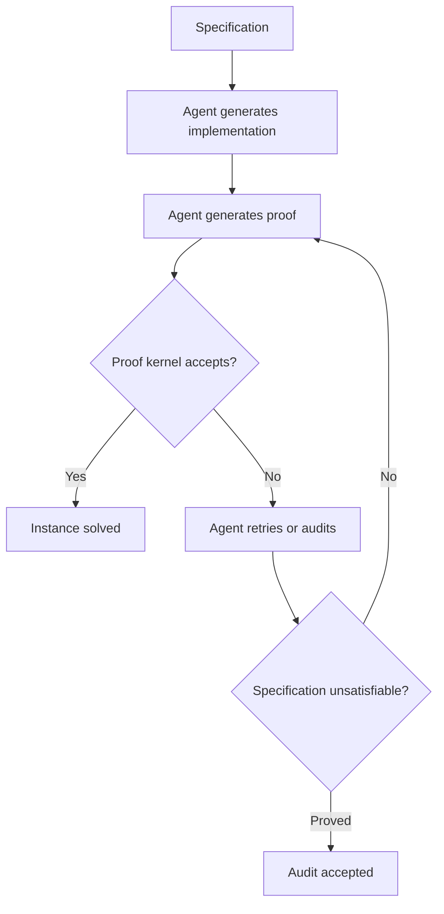
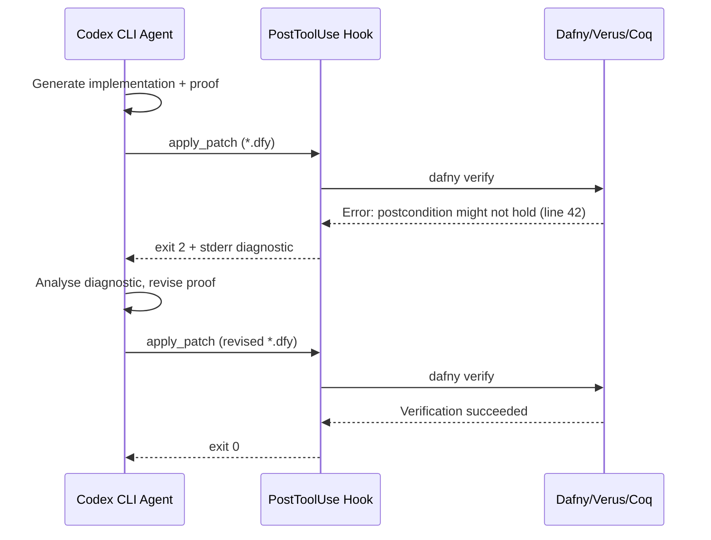

# Vero and the Verified Software Gap: What a 43-Instance Benchmark Reveals About Coding Agents and Formal Proof — and How Codex CLI's Verification Hooks Close the Distance


---

## The Problem: Code That Works Is Not Code That Is Correct

Coding agents ship code at extraordinary velocity. They pass unit tests, satisfy linters, and clear CI pipelines. But passing a test suite is not the same as proving a property holds for all inputs. As LLMs are deployed in safety-critical environments — financial systems, cryptographic protocols, distributed consensus — the gap between "code that appears to work" and "code that is provably correct" becomes a liability, not a footnote [^1].

Ye et al.'s **Vero** benchmark, published on 13 August 2026, is the first systematic attempt to measure whether frontier coding agents can produce *both* implementations *and* machine-checked proofs at repository scale [^2]. The results are sobering: the strongest agent configuration solved only 27 of 43 instances, and completed zero specifications on the most challenging codebases.

This article examines what Vero reveals about the current limits of agent-driven verified software synthesis, and maps those findings onto Codex CLI v0.147.0's hook-based verification architecture.

---

## What Vero Measures

Vero is not another SWE-bench variant. It tests a fundamentally harder problem: **joint implementation-and-proof synthesis** across multi-module repositories.

### Benchmark Structure

| Dimension | Detail |
|-----------|--------|
| **Instances** | 43 multi-module repository tasks |
| **Languages** | Python, Dafny, Verus (Rust), Coq |
| **Domains** | Cryptographic protocols, distributed systems, data structures |
| **Task** | Produce a correct implementation *and* a machine-checked proof of its specification |
| **Audit mechanism** | Agents may formally prove specification unsatisfiability or code incorrectness |

The benchmark draws from real-world projects, not synthetic toy problems. A Dafny task might require implementing a balanced tree with verified insertion invariants across three modules. A Verus task might demand a lock-free queue with linearisability proofs [^2].

### Why This Is Harder Than SWE-bench

SWE-bench asks an agent to produce a patch that passes existing tests. Vero asks an agent to produce a patch *and* a proof that the patch satisfies a formal specification — for *every* reachable state. The proof must be accepted by a verified kernel (Coq's type checker, Dafny's verifier, Verus's Rust compiler plugin). There is no partial credit and no way to game the metric.



---

## Key Findings: Where Agents Fall Short

### The 27/43 Ceiling

The strongest configuration — a frontier model with agentic scaffolding, retrieval-augmented context, and iterative feedback — solved 27 of 43 instances [^2]. That is a 62.8% success rate, which sounds respectable until you consider the composition:

- **Easy instances** (single-module, Dafny): near-100% solve rate
- **Medium instances** (multi-module, Verus): ~60% solve rate
- **Hard instances** (repository-scale, Coq, cryptographic protocols): **0% solve rate**

The pattern is clear: agents handle single-proof-obligation tasks well but collapse when proof obligations span modules, when specifications interact, and when domain-specific mathematical reasoning is required.

### Three Failure Modes

Vero's analysis identifies three recurring failure patterns:

1. **Proof fragmentation** — The agent generates correct sub-proofs for individual lemmas but cannot compose them into a coherent proof of the top-level specification. Each lemma verifies in isolation; the combination does not.

2. **Specification drift** — Under iterative repair, the agent subtly modifies the specification to match its implementation rather than the other way round. The proof then verifies against a weakened specification that no longer captures the original intent.

3. **Tactic hallucination** — The agent invokes proof tactics (Coq `auto`, Dafny `reveal`, Verus `assert_by_contradiction`) that do not apply to the current proof state. Unlike code hallucination, tactic hallucination produces immediate verifier rejection, but the agent often persists with syntactic variations rather than reconsidering the proof strategy.

### Context: Aria's Success on Iris

For comparison, the Aria system — a general LLM code agent wrapped in a verification harness — proved all 4,257 lemmas of Iris's core modules and 217 RustBelt lemmas fully automatically [^3]. The difference is that Aria operates *within* a mature proof library where tactic strategies are well-established. Vero's hard instances require *novel* proof construction across unfamiliar specifications — the frontier where agents still fail.

---

## The Vericoding Landscape in 2026

Vero sits within a broader movement towards **vericoding** — generation of formally verified code from formal specifications, in contrast to "vibe coding" that produces potentially buggy code from natural language [^4].

Current vericoding success rates vary dramatically by language:

| Language | Success Rate | Notes |
|----------|-------------|-------|
| Dafny | 82% | Richest automation, most forgiving verifier |
| Verus/Rust | 44% | Ownership model helps but complicates proofs |
| Lean 4 | 27% | Powerful but demands sophisticated tactic use |
| Coq | <20% | Highest proof burden, lowest agent success |

These figures are for single-problem benchmarks [^4]. Vero's multi-module, repository-scale setting pushes success rates significantly lower.

---

## Mapping Vero's Lessons to Codex CLI

Codex CLI v0.147.0 is not a formal verification tool. But its hook-based architecture provides the infrastructure to integrate proof checkers into the agentic loop — turning "generate and hope" into "generate, verify, and gate."

### PostToolUse Hooks as Proof Harness

PostToolUse hooks fire after every tool execution — shell commands, `apply_patch` file edits, and MCP tool calls [^5]. A proof-checking hook can intercept every code change and run the relevant verifier before the agent proceeds:

```json
{
  "hooks": [
    {
      "event": "PostToolUse",
      "match": {
        "tool": "apply_patch",
        "file_pattern": "*.dfy"
      },
      "command": "dafny verify --cores:4 ${CODEX_FILE_PATH}",
      "on_failure": "reject",
      "timeout_ms": 60000
    },
    {
      "event": "PostToolUse",
      "match": {
        "tool": "apply_patch",
        "file_pattern": "*.rs"
      },
      "command": "cargo verus --crate-type lib ${CODEX_FILE_PATH}",
      "on_failure": "reject",
      "timeout_ms": 120000
    }
  ]
}
```

When the hook returns a non-zero exit code, Codex CLI rejects the tool output and feeds the verifier's error message back to the agent as feedback. This creates the tight generate-verify loop that Vero's analysis identifies as essential for proof convergence [^2].

### AGENTS.md Verification Directives

Vero's specification drift failure mode — where the agent weakens the specification instead of fixing the implementation — can be addressed through AGENTS.md constraints:

```markdown
## Verification Rules

- NEVER modify files matching `specs/*.dfy` or `specs/*.v`
- Specifications are IMMUTABLE — fix the implementation, not the spec
- After every `apply_patch` to an implementation file, the corresponding
  proof file MUST verify before proceeding
- If a proof fails after 3 attempts, STOP and report the failure —
  do not weaken invariants or preconditions
- Use `dafny verify --isolate-assertions` to identify the specific
  failing assertion before attempting repair
```

### Sandbox Boundaries for Proof Integrity

Codex CLI's `sandbox_mode` settings can enforce proof integrity structurally:

```toml
[sandbox]
sandbox_mode = "workspace-write"
read_allow = ["/usr/local/lib/dafny", "/usr/local/lib/verus"]
write_deny = ["specs/", "proofs/trusted/"]
```

This prevents the agent from modifying trusted specifications or axiom files while granting read access to verifier libraries — a structural defence against specification drift that does not depend on the model following instructions.

### The Feedback Loop Architecture

Vero's strongest configurations use iterative feedback: the agent attempts a proof, receives verifier output, and retries. Codex CLI's PostToolUse exit-code-2 mechanism provides exactly this pattern. When a hook exits with code 2, the agent receives the hook's stderr as `additionalContext` — allowing the verifier's diagnostic output to guide the next attempt [^5].



---

## What Vero Means for Production Codex CLI Workflows

### The Verification Spectrum

Most Codex CLI users will not write Coq proofs. But Vero's findings apply across a verification spectrum:

| Level | Technique | Codex CLI Mechanism |
|-------|-----------|-------------------|
| **0 — None** | No verification | Default behaviour |
| **1 — Tests** | Unit/integration tests | PostToolUse: `pytest` / `cargo test` |
| **2 — Types** | Static type checking | PostToolUse: `mypy --strict` / `tsc --noEmit` |
| **3 — Contracts** | Runtime contracts | PostToolUse: `dafny verify` on contract-bearing code |
| **4 — Proofs** | Full formal verification | PostToolUse: Coq/Lean/Verus kernel |

Vero shows that agents reliably handle levels 0–2, struggle at level 3, and largely fail at level 4 for complex codebases. The practical implication: teams should set their PostToolUse hooks to the highest verification level their codebase supports, accepting that the agent will need more iterations (and tokens) at higher levels.

### Token Budget Implications

Vero's hardest instances required agents to make dozens of proof attempts. In a Codex CLI context, each attempt consumes a PostToolUse → verifier → feedback → retry cycle. Teams integrating formal verification hooks should expect 3–10× the token consumption of unverified workflows and configure `max_turns` and token budgets accordingly.

### The 0% Ceiling as a Safety Signal

Vero's zero-percent solve rate on its hardest instances is not a failure of the benchmark — it is a calibration signal. If your PostToolUse hooks consistently reject proof attempts after the configured retry limit, that is the system working correctly. The alternative — silently accepting unverified code — is worse. ⚠️ Current frontier models cannot reliably produce novel proofs for complex multi-module specifications; human proof engineers remain essential for level-4 verification.

---

## Practical Recommendations

1. **Start at level 2.** Add `mypy --strict` or `tsc --noEmit` PostToolUse hooks today. These catch a broad class of errors with minimal token overhead.

2. **Add contract checking where it exists.** If your codebase already uses Dafny, Verus, or SPARK, add verifier hooks. The infrastructure cost is a single `hooks.json` entry.

3. **Protect specifications structurally.** Use `write_deny` sandbox rules and AGENTS.md directives to prevent specification drift — the failure mode that Vero identifies as most insidious because it produces verified-but-wrong code.

4. **Set explicit retry limits.** Configure your AGENTS.md to cap proof attempts (3–5 is reasonable). Unbounded retries waste tokens on problems the agent cannot solve.

5. **Monitor the gap.** Track your PostToolUse hook rejection rate. A sustained high rejection rate on verification hooks indicates the task exceeds the agent's current capabilities and needs human intervention.

---

## Citations

[^1]: Ye, Z. et al. (2026). "Vero: Can AI Agents Build Formally Verified Software Repositories?" *arXiv:2608.13522*, August 13, 2026. [https://arxiv.org/abs/2608.13522](https://arxiv.org/abs/2608.13522) — Cited for the gap between "code that works" and "provably correct code."

[^2]: Ye, Z., Lou, H., Sun, Y., Song, P., Yan, Z., Kasriel, T., Zhang, Q., Yang, K., Kong, S., He, J. & Song, D. (2026). "Vero: Can AI Agents Build Formally Verified Software Repositories?" *arXiv:2608.13522*, August 13, 2026. [https://arxiv.org/abs/2608.13522](https://arxiv.org/abs/2608.13522) — Primary source for benchmark design, 27/43 results, failure modes, and audit mechanism.

[^3]: Aria verification harness results. "Harnessing Code Agents for Automatic Software Verification." *arXiv:2607.06341*, July 2026. [https://arxiv.org/abs/2607.06341](https://arxiv.org/abs/2607.06341) — 4,257 Iris lemmas proved automatically; contrast with Vero's novel-proof requirements.

[^4]: POPL 2026 Dafny Workshop. "A Benchmark for Vericoding: Formally Verified Program Synthesis." [https://popl26.sigplan.org/details/dafny-2026-papers/13/](https://popl26.sigplan.org/details/dafny-2026-papers/13/) — Vericoding success rates by language: Dafny 82%, Verus 44%, Lean 27%.

[^5]: OpenAI. "Codex CLI Hooks Reference — hooks.json, PreToolUse & PostToolUse." Codex CLI v0.147.0 documentation, August 2026. [https://github.com/openai/codex/releases/tag/rust-v0.147.0](https://github.com/openai/codex/releases/tag/rust-v0.147.0) — PostToolUse hook behaviour, exit code 2 feedback mechanism, sandbox_mode configuration.
