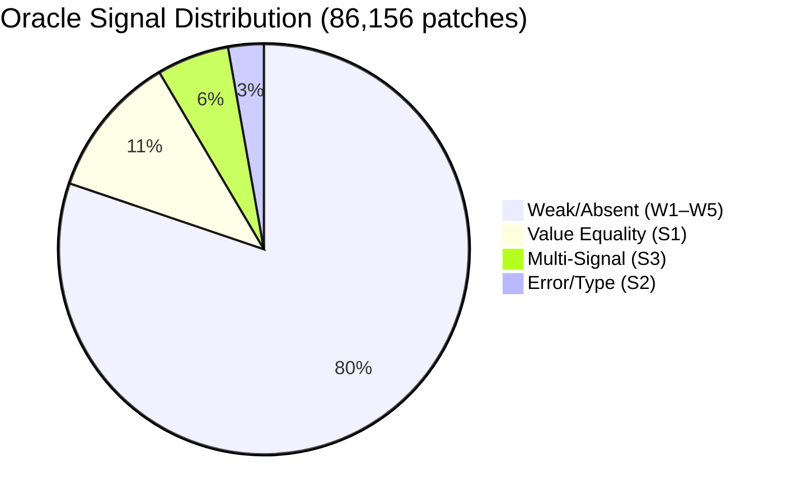
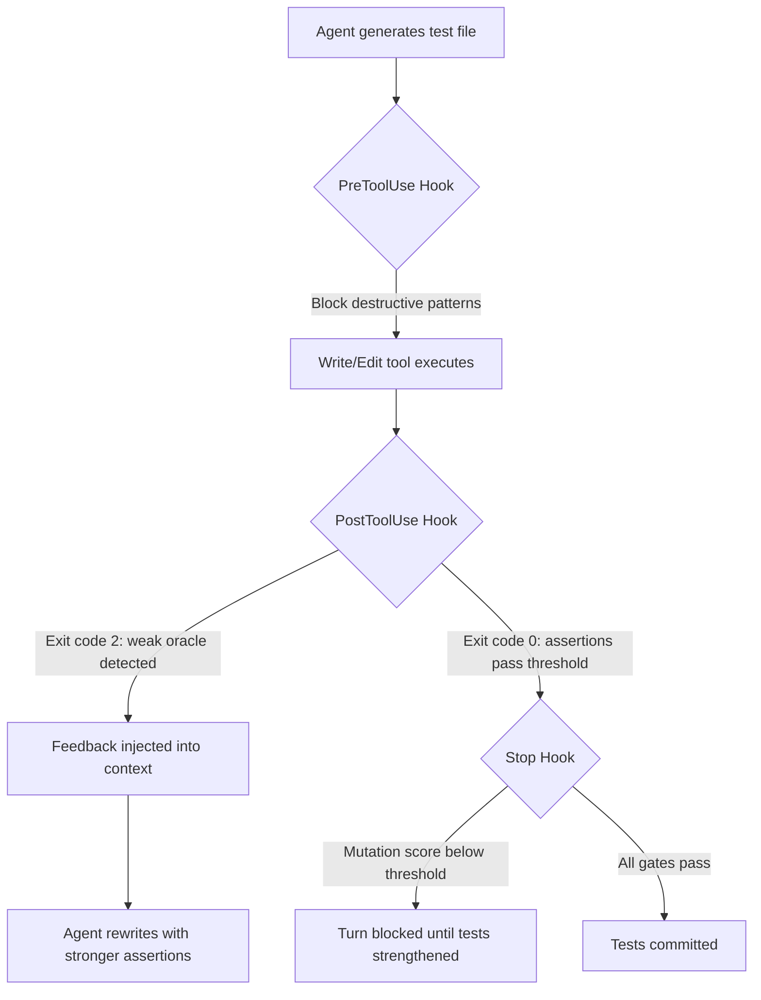

# All Smoke, No Alarm: What 86,000 Agent-Authored Test Patches Reveal About Oracle Quality — and How to Stop Codex CLI Writing Empty Tests


---

Your coding agent writes tests. Those tests pass. CI is green. Everyone moves on. But what did those tests actually verify?

A study published in June 2026 — "All Smoke, No Alarm: Oracle Signals in Agent-Authored Test Code" by Banik, Chowdhury, and Shamim — examined 86,156 test patches across 33,596 agent-authored pull requests from five production coding agents, including OpenAI Codex, GitHub Copilot, Devin, Cursor, and Claude Code [^1]. The headline finding: **80.2% of agent-authored test patches contain weak or absent oracle signals**. The tests run, but they do not meaningfully check behaviour.

This article unpacks the taxonomy, maps the findings to Codex CLI v0.147.0's defence surface, and provides concrete configuration to catch empty tests before they reach your main branch.

## What Is an Oracle Signal?

An oracle signal is the mechanism within a test that determines whether the system under test produced the correct output [^2]. A test without one is exercising code without verifying it — the software-testing equivalent of checking that a smoke detector's LED blinks without ever testing whether it sounds an alarm when smoke is present.

The distinction matters because CI pipelines report pass/fail based on test execution, not verification quality. A test file with zero assertions will pass every time, inflating coverage metrics while catching nothing.

## The Eight-Category Taxonomy

Banik et al. classified oracle signals into five weak categories and three strong ones [^1]:

### Weak Signals

| Category | Description | Example Pattern |
|----------|-------------|-----------------|
| **W1** | No assertion present | Test calls function, never checks result |
| **W2** | Existence/non-null checks only | `assertNotNull(result)` |
| **W3** | Boolean asserts without value comparison | `assertTrue(success)` |
| **W4** | Mock/call-verification only | `verify(mock).someMethod()` |
| **W5** | Snapshot match only | `expect(output).toMatchSnapshot()` |

### Strong Signals

| Category | Description | Example Pattern |
|----------|-------------|-----------------|
| **S1** | Value equality or comparison | `assertEqual(result, 42)` |
| **S2** | Error, containment, or type checks | `assertRaises(ValueError)` |
| **S3** | Two or more distinct strong types | Combines S1 + S2 in same test |

The classifier trained on 384 manually labelled patches achieved 86.7% agreement with human annotators (Cohen's κ = 0.77) [^1].

## The Numbers That Should Worry You



Across all five agents and all patch types, four out of five test patches fall into the weak category. The distribution is not uniform across agents: Claude Code achieved a 67% strong-oracle rate on newly created test files, whilst OpenAI Codex managed only 18% [^1]. The inter-agent differences were statistically significant (χ² = 2497.3, p < 0.001).

### The Merge-Rate Paradox

Raw merge rates tell a counterintuitive story: weak-oracle PRs merged at 72.6%, whilst S3 (multi-signal strong) PRs merged at only 59.7%. But this reverses under multivariate regression controlling for agent, PR size, repository stars, task type, and language. Strong oracles showed significantly higher merge likelihood with an odds ratio of 1.28 (p < 0.001) [^1].

The raw gap reflects reviewer friction — strong-oracle PRs demand more review effort (1.7× to 2.5× more within equivalent PR size buckets). Teams that skip the review, because the weak tests "just pass", are the ones most at risk.

### Task Type Matters

Feature work produced strong oracles in only 18.2% of patches, compared with 25.6% for bug fixes and 24.9% for test-focused tasks [^1]. The implication: **coding agents optimise for structural plausibility rather than behavioural verification**, and the training objective — code completion — rewards producing something that looks like a test rather than something that verifies a contract.

## Where Codex CLI's Defence Surface Intersects

Codex CLI v0.147.0 provides four layers that can intercept weak tests before they land [^3][^4]:



### Layer 1: AGENTS.md Directives

The simplest intervention is instructional. Adding explicit oracle-quality directives to your project's `AGENTS.md` steers the model before it generates:

```markdown
## Test Quality Requirements

- Every test function MUST contain at least one value-equality assertion
  (assertEqual, expect().toBe, assert ==) comparing actual output against
  an expected value derived from the specification, not from the code under test.
- Tests that only check non-null, existence, or type without comparing
  specific values are insufficient. Rewrite them with concrete expected values.
- Never generate snapshot tests unless explicitly requested.
- After writing tests, run them with mutation testing (mutmut, Stryker, pitest)
  and ensure mutation score exceeds 60% before committing.
```

This addresses the training-objective mismatch directly: the agent receives an explicit objective that overrides the default "produce something test-shaped" behaviour [^4].

### Layer 2: PostToolUse Hook — The Oracle Gate

PostToolUse hooks fire after every tool execution. When a hook exits with code 2, Codex CLI replaces the tool result with the hook's stderr, steering the agent to fix the problem without undoing the work already done [^3].

Here is a production-grade hook that scans newly written test files for weak oracle patterns:

```bash
#!/usr/bin/env bash
# hooks/oracle-gate.sh — PostToolUse hook for test oracle quality
# Exits 2 (feedback) if test file lacks strong assertions

set -euo pipefail

EVENT=$(cat -)
TOOL=$(echo "$EVENT" | jq -r '.tool_name // empty')
FILE=$(echo "$EVENT" | jq -r '.output.file_path // empty')

# Only check Write/Edit on test files
[[ "$TOOL" =~ ^(Write|Edit)$ ]] || exit 0
[[ "$FILE" =~ (test_|_test\.|\.test\.|spec\.|_spec\.) ]] || exit 0
[[ -f "$FILE" ]] || exit 0

# Count strong oracle patterns
STRONG=$(grep -cE \
  '(assertEqual|assertEquals|assert_eq|expect\(.+\)\.(toBe|toEqual|toStrictEqual)|assert .+ ==|should\.equal|\.to\.equal|\.to\.eql|assertRaises|pytest\.raises|expect\(.+\)\.toThrow|assertIn|assertContains|\.to\.contain|\.toContain)' \
  "$FILE" 2>/dev/null || echo 0)

# Count test functions
TESTS=$(grep -cE \
  '(def test_|fn test_|it\(|test\(|describe\(|@Test|func Test)' \
  "$FILE" 2>/dev/null || echo 0)

if [[ "$TESTS" -gt 0 && "$STRONG" -eq 0 ]]; then
  echo "ORACLE GATE FAILED: $FILE contains $TESTS test(s) but zero strong " \
       "assertions. Every test must include at least one value-equality or " \
       "error-expectation assertion. Rewrite with assertEqual/expect().toBe " \
       "comparing actual output to a concrete expected value." >&2
  exit 2
fi

RATIO=$(echo "scale=2; $STRONG / $TESTS" | bc 2>/dev/null || echo 0)
if (( $(echo "$RATIO < 0.5" | bc -l) )); then
  echo "ORACLE GATE WARNING: $FILE has $STRONG strong assertion(s) across " \
       "$TESTS test(s) (ratio: $RATIO). Target at least 1 strong assertion " \
       "per test function." >&2
  exit 2
fi

exit 0
```

Register it in `~/.codex/hooks.json`:

```json
{
  "hooks": {
    "PostToolUse": [
      {
        "matcher": "(Write|Edit)",
        "hooks": [
          {
            "type": "command",
            "command": "bash ~/.codex/hooks/oracle-gate.sh",
            "statusMessage": "Checking test oracle quality",
            "timeout": 15
          }
        ]
      }
    ]
  }
}
```

### Layer 3: Stop Hook — The Mutation Gate

The Stop hook fires before Codex CLI ends a turn. Wire it to a mutation-testing runner that blocks completion when the mutation score falls below threshold:

```bash
#!/usr/bin/env bash
# hooks/mutation-gate.sh — Stop hook
# Runs mutation testing on changed test files, blocks if score < 60%

CHANGED_TESTS=$(git diff --cached --name-only | grep -E '(test_|_test\.|\.test\.)' || true)
[[ -z "$CHANGED_TESTS" ]] && exit 0

# Python example with mutmut
mutmut run --paths-to-mutate src/ --tests-dir tests/ --no-progress 2>/dev/null
SCORE=$(mutmut results 2>/dev/null | grep -oP 'killed \K[0-9]+(?=%)')

if [[ "${SCORE:-0}" -lt 60 ]]; then
  echo "MUTATION GATE: Score ${SCORE}% is below the 60% threshold. " \
       "Strengthen assertions to catch more mutations." >&2
  exit 2
fi
exit 0
```

### Layer 4: Guardian Auto-Review

Codex CLI v0.147.0's `--approve-for-me` flag enables Guardian, which automatically reviews tool calls against your approval policy [^5]. When combined with the oracle gate, this creates a fully automated feedback loop: Guardian approves the write, the PostToolUse hook checks oracle quality, and the agent iterates until the assertions pass muster — no human in the loop for the mechanical verification, but strong behavioural guarantees on the output.

## A Practical AGENTS.md Template

Combining all four layers into a single project configuration:

```markdown
# AGENTS.md — Oracle-Aware Test Generation

## Test Writing Protocol

1. Before writing tests, read the specification or docstring for the function
   under test. Extract at least three concrete input/output pairs.
2. Write one test per behaviour, not one test per function.
3. Every test MUST include a value-equality assertion comparing actual output
   to an expected value derived from step 1.
4. Never use assertTrue/assertFalse without a comparison operand.
5. Never generate snapshot tests unless the PR description explicitly requests them.
6. After all tests pass, run `mutmut run` (Python) or `npx stryker run`
   (TypeScript/JavaScript) and report the mutation score. Do not commit if
   the score is below 60%.
7. If mutation testing reveals surviving mutants, add targeted assertions
   that kill them before proceeding.
```

## What Codex CLI Still Lacks

The study exposes gaps that Codex CLI's current tooling cannot fully address:

1. **No built-in assertion-density metric.** The hooks above are user-authored scripts; a native `test_oracle_threshold` in `config.toml` would standardise the gate.
2. **No per-agent oracle profiling.** When using multi-agent delegation with subagents, there is no mechanism to track which subagent produces weaker tests and route test-writing tasks accordingly.
3. **No training-signal feedback.** PostToolUse hooks steer behaviour within a session, but Memories do not currently persist oracle-quality metadata across sessions. A test that was rejected for weak oracles in one session may be regenerated identically in the next.

## Conclusion

The "All Smoke, No Alarm" findings confirm what many teams have suspected: agent-authored tests look right but verify nothing. The 80.2% weak-oracle rate is not a model limitation that will vanish with the next generation — it is a structural consequence of training objectives that reward plausibility over correctness.

The defence is architectural. AGENTS.md directives set the contract. PostToolUse hooks enforce it mechanically. Mutation testing provides the ground truth. Codex CLI v0.147.0 supplies the primitives; the wiring is yours.

## Citations

[^1]: Banik, D., Chowdhury, K., & Shamim, S. I. (2026). "All Smoke, No Alarm: Oracle Signals in Agent-Authored Test Code." *8th IEEE International Conference on Artificial Intelligence Testing*. arXiv:2606.18168. [https://arxiv.org/abs/2606.18168](https://arxiv.org/abs/2606.18168)

[^2]: Barr, E. T., Harman, M., McMinn, P., Shahbaz, M., & Yoo, S. (2015). "The Oracle Problem in Software Testing: A Survey." *IEEE Transactions on Software Engineering*, 41(5), 507–525. [https://doi.org/10.1109/TSE.2014.2372785](https://doi.org/10.1109/TSE.2014.2372785)

[^3]: OpenAI. (2026). "Hooks — Codex CLI Documentation." [https://learn.chatgpt.com/docs/hooks](https://learn.chatgpt.com/docs/hooks)

[^4]: OpenAI. (2026). "AGENTS.md — Codex CLI Repository." [https://github.com/openai/codex/blob/main/AGENTS.md](https://github.com/openai/codex/blob/main/AGENTS.md)

[^5]: OpenAI. (2026). "Codex CLI v0.147.0 Release Notes." [https://github.com/openai/codex/releases/tag/rust-v0.147.0](https://github.com/openai/codex/releases/tag/rust-v0.147.0)

[^6]: Wang, X., Wang, Z., & Nie, J. (2026). "TestEvo-Bench: An Executable and Live Benchmark for Test and Code Co-Evolution." arXiv:2607.02469. [https://arxiv.org/abs/2607.02469](https://arxiv.org/abs/2607.02469)
