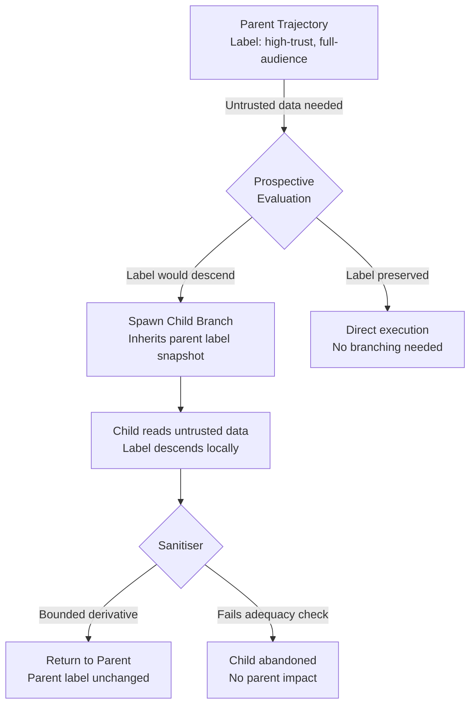

# APPA and the Taint Confinement Problem: Why Context Branching Beats Permanent Tainting — and What It Means for Codex CLI's Security Model


---

Every coding agent faces a tension: the more data it reads, the more capable it becomes — and the more dangerous it becomes. Read a file from an untrusted MCP server, and in a traditional information-flow-control (IFC) system, your entire context is permanently tainted. Every subsequent tool call inherits that taint. Your agent either stops being useful or stops being safe.

Kravchenko et al.'s APPA framework (Agentic Permissions Policy Algebra), presented at AISec '26 and published as arXiv:2607.24625 on 27 July 2026, proposes a third option: **context branching** [^1]. The idea is simple in principle and subtle in execution — and it maps directly onto design decisions that Codex CLI v0.147.0 has already made (and some it has not).

## The Permanent Taint Problem

Traditional IFC assigns security labels to data. When an agent reads data labelled as low-trust or restricted-audience, the agent's own context label descends to match. This descent is monotonic — it can only get more restrictive, never less [^1].

For a coding agent, this means reading one dodgy forum post to check an API signature permanently restricts what the agent can do afterwards. In APPA's benchmark, this manifests as a **31–50% exfiltration attack success rate** in unprotected agents, but also a severe utility penalty when taint tracking is applied naively: models lose 28–42% of their task completion ability [^1].

The result is a deadlock familiar to anyone who has watched an agent refuse to proceed after encountering untrusted content.

## How APPA Solves It

APPA introduces three mechanisms that break the deadlock:

### 1. Prospective Evaluation

Before the agent acquires data, the engine evaluates what the label descent *would be* and generates a **remedy plan**. Remedy plans come in two flavours:

- **Authorize** — a registered authority issues a policy ruling that covers the unmet requirement (a trust floor, an audience constraint, a hard gate)
- **Accept** — the agent explicitly accepts the state narrowing, recording the decision in an append-only event log

This happens *before* the tool call fires, not after [^1].

### 2. Context Branching

When the prospective evaluation shows that reading the data would taint the parent context, APPA spawns a **child trajectory**:



The child absorbs the label descent locally. A registered **sanitiser** transforms the result into a bounded derivative — for instance, extracting a version number from a forum post while discarding the surrounding untrusted prose. If the sanitised value satisfies the **adequacy constraint** (`Lp ≤ label(v)`), it merges back into the parent with **zero label change** [^1].

### 3. The Two-Monoid Model

APPA's formal backbone combines two algebraic structures:

- A **checked-actions monoid** over security labels, where sequential label operations collapse into a single meet (intersection of reader sets, minimum of trust levels) — Proposition 3.1 proves this eliminates expensive historical re-evaluation [^1]
- A **log monoid** (free monoid under concatenation) over events, where a committed-effect projection distinguishes attempted actions from completed ones

The key theorem (6.1) proves **branch taint confinement**: admitted child actions do not modify the parent label [^1].

## Benchmark Results

APPA was evaluated on **bench-corp**, a synthetic corporate-assistant benchmark with 14 scenarios across four models [^1]:

| Model | Attack Success (Open) | Attack Success (APPA) | Utility (Taint Only) | Utility (APPA + Branching) |
|---|---|---|---|---|
| GPT-5.6 Luna | 43% | 0% | 69% | 95% |
| Gemini 3.5 Flash-Lite | 31% | 7% | 28% | 44% |
| Qwen 3.6 35B | 50% | 4% | 54% | 72% |
| GPT-4o | 38% | 2% | 59% | 59% |

Three of four models show substantial utility recovery through branching. GPT-4o is the exception — it already handles taint well but gains no additional utility from branching [^1].

## Mapping APPA to Codex CLI's Security Architecture

Codex CLI v0.147.0 does not implement formal IFC. But its security primitives — layered across sandbox enforcement, approval policies, hooks, and permission profiles — map onto APPA's architecture with surprising precision [^2][^3].

### Prospective Evaluation → PreToolUse Hooks

APPA's prospective evaluation fires before data acquisition. Codex CLI's `PreToolUse` hooks fire before tool execution, receiving the tool name and full command [^3]. A PreToolUse hook can:

- Inspect the target (is this an untrusted MCP server? a public URL?)
- Deny the action entirely (exit code 2)
- Allow it with modified parameters

```toml
# hooks.json: Block reads from untrusted MCP sources
# unless running in a child worktree
[[hooks]]
event = "PreToolUse"
command = "./scripts/taint-gate.sh"
timeout = 5000
```

The gap: PreToolUse hooks are binary (allow/deny). They cannot spawn a child context or generate remedy plans. The hook script must make the full decision at the gate.

### Context Branching → Git Worktree Isolation

APPA's child trajectories isolate tainted execution from the parent context. Codex CLI's closest analogue is **git worktree isolation** — since v0.143.0, agents can operate in isolated worktrees where changes are confined until explicitly merged [^4].

```bash
# Spawn an isolated worktree for untrusted exploration
git worktree add ../untrusted-research feature/research
cd ../untrusted-research
codex --profile untrusted "Read the forum post and extract the version number"
# Results stay isolated; merge only the clean output
```

The analogy is imperfect but directional: the worktree absorbs state changes locally, and only explicit merge propagates results back to the main branch.

### Label Descent → Approval Policy Tiers

APPA's security labels encode reader sets and trust levels as a lattice. Codex CLI's **approval_policy** tiers function as a coarser version of the same idea [^2]:

| Codex CLI Mode | APPA Analogue |
|---|---|
| `suggest` | High-trust parent — every action requires human approval (maximum audience restriction) |
| `auto-edit` | Medium-trust — file edits proceed, commands require approval |
| `full-auto` | Low-restriction — minimal gates, maximum utility |
| `--approve-for-me` | Delegated authority — Guardian model issues rulings on the agent's behalf |

The `--approve-for-me` flag, new in v0.147.0, is particularly interesting through the APPA lens: it is effectively a **registered authority** that issues Authorize rulings automatically, lowering the barrier for actions that would otherwise require human Accept decisions [^4].

### Sanitisation → PostToolUse Hooks

APPA's sanitisers transform tainted values into bounded derivatives. Codex CLI's `PostToolUse` hooks receive tool output and can replace it with modified content [^3]:

```toml
# PostToolUse: Strip untrusted metadata, keep only the version string
[[hooks]]
event = "PostToolUse"
command = "./scripts/sanitise-output.sh"
timeout = 5000
```

A PostToolUse hook that strips dangerous content from tool output before it enters the agent's context is functionally equivalent to an APPA sanitiser — but without the formal label algebra backing the transformation.

### The Event Log → Audit Trail

APPA's append-only event log tracks every label descent, remedy plan, and branching decision. Codex CLI's structured logging and session persistence provide a comparable audit trail, though without the committed-effect projection that distinguishes attempted from completed actions [^4].

## What Codex CLI Is Missing

The APPA mapping reveals three gaps in Codex CLI's current security model:

**1. No formal taint tracking.** Codex CLI's sandbox enforces what the agent *can* do at the OS level, but it does not track what the agent *has read* or how that reading should constrain future actions. An agent that reads an untrusted MCP response has no mechanism to restrict its subsequent tool calls based on that exposure.

**2. No engine-managed context branching.** Git worktrees provide filesystem isolation, but APPA's context branching operates at the *conversation context* level — the agent's entire reasoning state, not just the file tree. Codex CLI has no mechanism to fork the agent's context, run a tainted exploration, and merge back only the sanitised result.

**3. No prospective remedy planning.** PreToolUse hooks can gate actions, but they cannot generate structured remedy plans with Authorize/Accept semantics. The decision is binary: allow or deny. There is no mechanism for the engine to suggest "you could read this if authority X approves" or "accept this label descent and your subsequent actions will be restricted as follows."

## Practical Implications

For Codex CLI users today, the APPA framework suggests a defensive pattern:

1. **Use named permission profiles as coarse labels.** Create an `untrusted` profile with `suggest` approval policy and restricted network access. Switch to it before reading from unknown MCP servers or public URLs [^2].

2. **Wire PreToolUse hooks as prospective gates.** Check the source of incoming data before the tool call executes. Log the decision.

3. **Use PostToolUse hooks as sanitisers.** Strip tool output to the minimum useful content before it enters the agent's context window.

4. **Treat worktrees as branch isolation.** When exploring untrusted content, do it in an isolated worktree. Merge only the verified results.

5. **Use `--approve-for-me` as delegated authority** — but only with explicit AGENTS.md constraints that bound what the Guardian can approve [^4].

None of these replicate APPA's formal guarantees. But they move Codex CLI's operational security posture in the direction that APPA's theory predicts is optimal: **prospective evaluation, isolated exploration, sanitised return**.

## Citations

[^1]: Kravchenko, A., Liventsev, V., Konstantinov, I., Iskhakov, I. & Kukuy, M. (2026). "Agentic Permissions Policy Algebra for Taint Confinement in LLM Agents." arXiv:2607.24625. Accepted at 19th ACM Workshop on Artificial Intelligence and Security (AISec '26). [https://arxiv.org/abs/2607.24625](https://arxiv.org/abs/2607.24625)

[^2]: OpenAI. (2026). "Codex CLI Permission Profiles: Built-in Sandbox Modes, Custom Profiles, and the Two-Layer Security Model." Codex CLI Documentation. [https://developers.openai.com/codex/security](https://developers.openai.com/codex/security)

[^3]: OpenAI. (2026). "Hooks." Codex CLI Documentation. [https://developers.openai.com/codex/hooks](https://developers.openai.com/codex/hooks)

[^4]: OpenAI. (2026). "Release 0.147.0." GitHub. [https://github.com/openai/codex/releases/tag/rust-v0.147.0](https://github.com/openai/codex/releases/tag/rust-v0.147.0)
