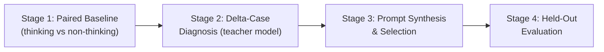
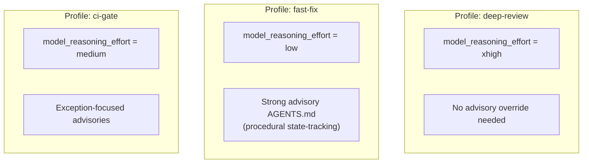

# Distilling Reasoning Traces into Advisory Prompts: What the Faisal–Devanbu–Ahmed Pipeline Means for Your AGENTS.md and Reasoning Effort Configuration


---

Thinking mode is expensive. Every time a reasoning model expands its chain-of-thought, you pay for those tokens — often ten to fifty times the length of the final answer. The question practitioners keep asking is: *can we get some of the benefit without always paying the cost?*

A paper published on 1 August 2026 by Faisal, Devanbu, and Ahmed — "Distilling Reasoning Traces into Advisory Prompts for Software Engineering Tasks" — offers a surprisingly direct answer [^1]. Their four-stage pipeline extracts the *procedural knowledge* that thinking mode uses to avoid errors and compresses it into short, reusable system prompts. Across five software engineering benchmarks and four small models, those distilled prompts lifted non-thinking accuracy by a mean of 3.1 percentage points while saving 58.6% of output tokens on average [^1].

For Codex CLI users, the implications land squarely on two features you already have: **AGENTS.md** and **`model_reasoning_effort`**. This article unpacks the research, maps the pipeline to Codex CLI's configuration surface, and proposes a practical workflow for writing advisory-style project instructions.

## The Four-Stage Distillation Pipeline

The researchers treat reasoning distillation as a paired-comparison problem:



1. **Paired Baseline Measurement** — Run a student model (e.g. Qwen3-8B) with thinking mode enabled and disabled on the same examples. Record which instances thinking fixes and which it breaks.

2. **Delta-Case Diagnosis** — A teacher model (GPT-5.4-mini for Stage 1, GPT-5.4 for aggregation) examines the improvement cases. It identifies *why* the reasoning trace prevented the error — state tracking, edge-case checking, dry-run simulation [^1].

3. **Prompt Synthesis & Selection** — Diagnoses are aggregated into candidate advisory prompts, validated on a held-out partition. The best-performing prompt per fold survives. Average prompt overhead: 54.5 tokens [^1].

4. **Held-Out Evaluation** — Final assessment on unseen test data using 5-fold cross-validation, temperature 0.7, single sample per example.

## What the Numbers Show

The pipeline was evaluated across four student models (Qwen3-4B, Qwen3-8B, Gemma-4-E2B-it, Gemma-4-E4B-it) on five benchmarks [^1]:

| Benchmark | Examples | Task Type |
|-----------|----------|-----------|
| LiveCodeBench (v1–v6) | 1,054 | Code generation |
| CRUXEval Input Prediction | 800 | Infer input from output |
| Exception Prediction | 834 | Predict runtime exceptions |
| Output Prediction (perturbed) | 7,450 | Predict outputs with mutated inputs |
| Method Hallucination | 290 | Detect nonexistent library members |

### Held-Out Accuracy Gains (Non-Thinking Mode)

Nineteen of twenty model–task combinations showed positive gains. The standout results:

- **Exception Prediction**: Qwen3-4B jumped from 0.447 to 0.562 (+11.5pp, p<0.001) [^1]
- **LiveCodeBench**: Gemma-4-E4B rose from 0.637 to 0.685 (+4.8pp, p<0.001) [^1]
- **Input Prediction**: Qwen3-8B gained from 0.569 to 0.648 (+7.9pp, p<0.001) [^1]

### The Cost–Accuracy Tradeoff

The distilled non-thinking mode saved substantial tokens compared to full thinking mode, but the tradeoff was model-family dependent:

| Model Family | Token Savings | Accuracy Gap vs Thinking |
|-------------|--------------|-------------------------|
| Gemma-4-E2B | 44.8% | −1.9pp |
| Gemma-4-E4B | 39.8% | −2.9pp |
| Qwen3-4B | 86.5% | −22.5pp |
| Qwen3-8B | 83.4% | −20.6pp |

Gemma models maintained near-parity with thinking mode while saving ~40% of output tokens. Qwen models saved far more tokens but at a steeper accuracy cost [^1].

### Cross-Model Transfer

Advisory prompts distilled from one model transferred positively to others on three of five tasks. Exception Prediction showed the strongest transfer: 48 of 60 cross-model pairs produced gains, with a mean lift of +4.4pp (Wilcoxon p<0.001) [^1].

## What the Distilled Prompts Actually Say

An audit of 100 selected advisory prompts revealed their dominant strategies [^1]:

- **49%** instruct the model to track state and transitions
- **40%** request concrete example dry runs
- **25%** emphasise edge-case checking
- Average length: 54.5 additional tokens

A representative distilled instruction: *"Trace execution in order on concrete inputs, checking runtime types, API preconditions, mutations, and loop/recursion state."* [^1]

This reads remarkably like a well-written AGENTS.md directive.

## Mapping to Codex CLI's Configuration Surface

### AGENTS.md as Advisory Prompts

Codex CLI loads AGENTS.md files hierarchically — global (`~/.codex/AGENTS.md`), repository root, intermediate directories, and working directory [^2]. Each file injects system-prompt-level instructions before every turn. This is precisely the mechanism the Faisal–Devanbu–Ahmed pipeline produces: concise procedural guidance that steers the model without chain-of-thought expansion.

The research suggests your AGENTS.md should move beyond declarative rules ("use British English", "run tests before committing") and incorporate **procedural advisory patterns** derived from the kinds of errors your projects actually encounter:

```markdown
<!-- AGENTS.md — Advisory Patterns -->
## Error-Prevention Advisories

When modifying exception-handling code:
- Trace the execution path on at least one concrete input before writing the fix
- Check runtime types at each catch boundary
- Verify API preconditions are met before the call, not after

When writing tests:
- Dry-run the test mentally against one passing and one failing case
- Check loop termination conditions explicitly
- Verify that assertions test behaviour, not implementation
```

### Reasoning Effort as the Coarse Lever

Codex CLI's `model_reasoning_effort` in `config.toml` controls how many reasoning tokens the model generates [^3]. The paper's findings suggest a nuanced strategy: rather than uniformly setting `xhigh` (expensive) or `low` (cheap), you can **pair lower reasoning effort with stronger advisory prompts** for well-understood task types.

```toml
# ~/.codex/config.toml — Base configuration
model_reasoning_effort = "medium"

# ~/.codex/profiles/fast-lint.config.toml
model_reasoning_effort = "low"
# Pair with strong AGENTS.md advisory patterns for linting tasks
```

This mirrors the paper's Gemma result: with good advisory prompts, you can drop reasoning effort and save ~40% of output tokens while losing under 3pp of accuracy [^1].

### Named Profiles for Task-Specific Advisory Levels

Codex CLI v0.147.0 supports named profiles via `--profile` [^4]. Each profile can layer its own `config.toml` with different reasoning effort, model selection, and — critically — a different `AGENTS.md` scope when combined with directory-level overrides:



The key insight from the research: advisory prompts are most effective on **discrete-semantics tasks** like exception prediction (+11.5pp for Qwen3-4B) but less reliable on open-ended prediction tasks (+0.0pp for output prediction on some models) [^1]. Match your advisory intensity to the task category.

### SKILL.md as Packaged Advisory Prompts

Codex CLI Skills (`SKILL.md` files) activate only when relevant — unlike AGENTS.md, which loads unconditionally [^5]. This maps to the paper's finding that advisory prompts are task-specific: a state-tracking advisory helps with exception handling but adds noise to simple formatting tasks.

Package your strongest advisories as skills:

```markdown
---
name: exception-audit
description: Trace execution paths and verify exception handling
---

Before modifying or reviewing exception-handling code:

1. Identify every `try`/`catch`/`finally` block in the affected function
2. Trace execution on one concrete input that should raise an exception
3. Verify the catch clause handles the correct exception type
4. Check that cleanup in `finally` runs regardless of exception path
5. Confirm no swallowed exceptions hide failure signals
```

When you type "audit the error handling in this module", Codex CLI matches the skill description and loads these advisories — procedural guidance without permanent context cost.

## A Practical Distillation Workflow for Your Project

You do not need the full academic pipeline. A lightweight version using Codex CLI itself:

1. **Collect failure cases** — Review your recent sessions where the agent made errors. The `/history` command or rollout files capture the full transcript [^6].

2. **Diagnose with high reasoning** — Re-run the failing prompt with `model_reasoning_effort = "xhigh"`. Compare the reasoning trace against the original failure. What procedural step did thinking mode add?

3. **Extract the advisory** — Write a concise instruction capturing that procedural step. Aim for 50–60 tokens, matching the paper's optimal prompt length [^1].

4. **Validate** — Test the advisory on similar tasks with `model_reasoning_effort = "low"`. Does accuracy hold?

5. **Package** — If it works, add it to your project AGENTS.md or package it as a SKILL.md for broader reuse.

```bash
# Step 1: Review recent failures
codex --profile deep-review "Review the last 5 error cases in our \
exception handling module. For each, explain what procedural step \
would have prevented the error."

# Step 2: Extract advisory patterns
codex exec --output-schema '{"type":"object","properties":{
  "advisories":{"type":"array","items":{"type":"string"}}
}}' "From these error analyses, distill 3-5 concise advisory \
instructions (50-60 tokens each) that would prevent similar errors."
```

## Limitations and Caveats

The paper has important constraints that temper the mapping to production Codex CLI usage:

- **Small models only** — All student models were 2B–8B parameters. GPT-5.6 Sol, Codex CLI's default, is orders of magnitude larger. The advisory-prompt benefit may diminish with scale, though the cost-saving argument strengthens ⚠️
- **Python-only benchmarks** — All five tasks used Python. Transfer to other languages is unverified ⚠️
- **Single-sample evaluation** — Temperature 0.7 with one sample per example. Production Codex CLI sessions involve multi-turn interaction, where advisory prompts may compound or conflict ⚠️
- **No agentic evaluation** — The benchmarks test single-turn code generation, not multi-step agent workflows. Advisory effectiveness in long-horizon sessions remains an open question ⚠️

## The Practical Takeaway

The Faisal–Devanbu–Ahmed research formalises something experienced Codex CLI users already do intuitively: writing good AGENTS.md instructions is a form of reasoning distillation. The paper gives us numbers to back the practice — a mean 3.1pp accuracy gain, 58.6% token savings, and cross-model transferability on discrete-semantics tasks [^1].

The actionable recipe:

1. **Write procedural advisories**, not just rules. "Trace execution on a concrete input" beats "be careful with edge cases".
2. **Pair advisory density with reasoning effort inversely.** Strong advisories + low reasoning = cost savings with minimal accuracy loss (the Gemma pattern: −2.9pp for 40% token savings).
3. **Use SKILL.md for task-specific advisories** so they activate only when relevant, avoiding context pollution.
4. **Treat your AGENTS.md as a living distillation document** that evolves as you collect failure cases from production sessions.

The thinking budget is a resource. Advisory prompts let you spend it more wisely.

## Citations

[^1]: Faisal, F., Devanbu, P. & Ahmed, T. (2026). "Distilling Reasoning Traces into Advisory Prompts for Software Engineering Tasks." arXiv:2608.00437. [https://arxiv.org/abs/2608.00437](https://arxiv.org/abs/2608.00437)

[^2]: OpenAI. (2026). "Best Practices — Custom Prompts and AGENTS.md." Codex CLI Documentation. [https://developers.openai.com/codex/learn/best-practices](https://developers.openai.com/codex/learn/best-practices)

[^3]: OpenAI. (2026). "Reasoning Effort Tuning." Codex CLI Documentation. [https://developers.openai.com/codex/learn/reasoning-effort](https://developers.openai.com/codex/learn/reasoning-effort)

[^4]: OpenAI. (2026). "Codex CLI v0.147.0 Release Notes." GitHub Releases. [https://github.com/openai/codex/releases/tag/rust-v0.147.0](https://github.com/openai/codex/releases/tag/rust-v0.147.0)

[^5]: OpenAI. (2026). "Build Skills." Codex CLI Documentation. [https://developers.openai.com/codex/skills](https://developers.openai.com/codex/skills)

[^6]: OpenAI. (2026). "Codex CLI Session History and Rollout Files." Codex CLI Documentation. [https://developers.openai.com/codex/learn/session-management](https://developers.openai.com/codex/learn/session-management)
