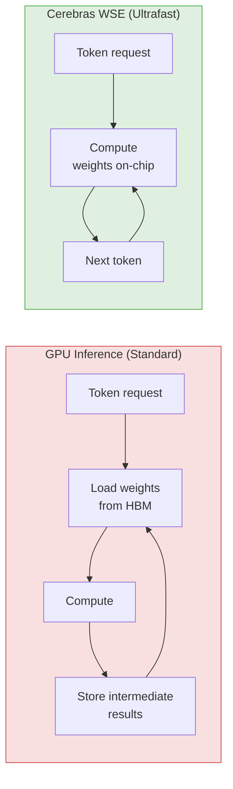
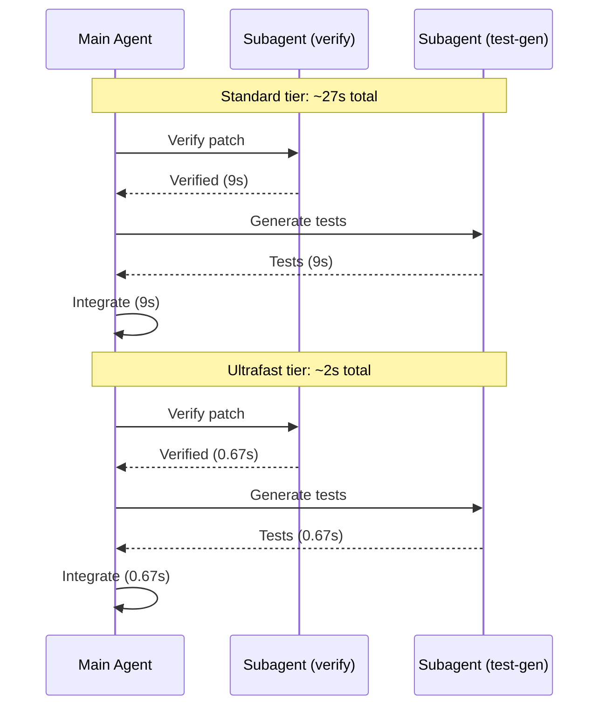
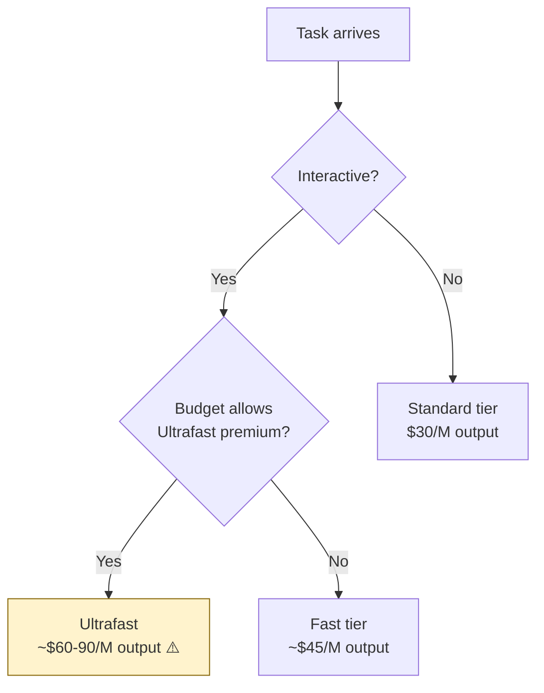

# GPT-5.6 Sol Ultrafast Preview: What 14× Inference Speed Means for Your Codex CLI Workflows


---

On 13 August 2026, OpenAI announced **Ultrafast mode** — a new API service tier that runs GPT-5.6 Sol at up to 14× the speed of Standard processing, generating up to 750 output tokens per second [^1]. The hardware behind it is Cerebras's Wafer-Scale Engine, the same partnership lineage that powered the GPT-5.3-Codex-Spark model in early 2026 [^2]. Ultrafast is currently in limited preview with no published pricing and no general availability date [^1].

This article examines the technical underpinnings, maps the implications to Codex CLI workflows, and sets out practical configuration patterns for when the tier reaches general availability.

---

## What Ultrafast Actually Is

Ultrafast is not a new model. It is a **service tier** applied to the existing GPT-5.6 Sol model — the same weights, the same context window, the same capabilities. The difference is inference hardware: requests routed through the Ultrafast tier run on Cerebras silicon instead of the GPU clusters that serve Standard and Fast tiers [^2].

The key numbers from the announcement:

| Metric | Standard (derived) | Ultrafast |
|---|---|---|
| Output throughput | ~54 tokens/s ⚠️ | Up to 750 tokens/s |
| Typical 500-token response | ~9 seconds | ~0.67 seconds |
| Speed multiple | 1× | Up to 14× |

⚠️ The Standard baseline of ~54 tokens/s is derived from the 14× claim and the 750 tokens/s ceiling; OpenAI has not published the Standard throughput figure directly.

The existing `service_tier` parameter in the OpenAI API already supports `"fast"` and `"priority"` values [^3]. When Ultrafast reaches GA, it is reasonable to expect a new value — likely `"ultrafast"` — will slot into the same parameter.

---

## The Cerebras Architecture: Why It Is Fast

GPU-based inference suffers from a fundamental bottleneck: model weights must be transferred repeatedly between on-chip memory and off-chip storage to generate each successive token. Cerebras eliminates this with its Wafer-Scale Engine, which packs **44 GB of SRAM on a single wafer-sized chip** [^2]. Weights stay on-chip; tokens flow uninterrupted.



This is the same architectural principle that powered GPT-5.3-Codex-Spark [^4], but applied to the substantially larger GPT-5.6 Sol model. Cerebras claims the approach scales smoothly to future models because the bottleneck is architectural (memory hierarchy) rather than computational [^2].

---

## From Spark to Ultrafast: The Speed Tier Lineage

The Ultrafast announcement sits in a clear lineage of Cerebras-powered speed tiers in the OpenAI ecosystem:

| Date | Model | Tier | Speed claim |
|---|---|---|---|
| March 2026 | GPT-5.3-Codex-Spark | Dedicated model | ~5× vs Standard [^4] |
| June 2026 | GPT-5.6 Sol | Fast (existing) | ~2× vs Standard |
| August 2026 | GPT-5.6 Sol | Ultrafast (preview) | Up to 14× vs Standard [^1] |

The critical shift is from a **dedicated speed model** (Spark had its own weights, tuned for lower latency at the cost of some capability) to a **speed tier on the flagship model** (Ultrafast runs the same Sol weights, preserving full capability). This is a better trade-off for coding agents, where capability regressions directly impact patch quality.

---

## What Changes for Codex CLI Workflows

The implications fall into four areas.

### 1. Interactive Coding Sessions

At 750 tokens/s, a typical 800-token code block renders in just over a second. The practical effect is that `suggest` and `steer` modes become near-real-time conversations rather than turn-by-turn exchanges. For approval workflows, the model's response arrives before the developer's attention shifts.

### 2. Subagent Coordination

Codex CLI's subagent delegation (`max_threads`, `max_depth` in `config.toml`) currently incurs compounding latency: each subagent turn adds the model's response time. At 14× speed, a three-turn subagent exchange that takes ~27 seconds on Standard would complete in under 2 seconds on Ultrafast. This makes spawning subagents for verification, test generation, or parallel file exploration significantly more viable.



### 3. PostToolUse Hook Feedback Loops

Codex CLI's `PostToolUse` hooks (exit code 2 for feedback injection) create iterative cycles where the model receives tool output, adjusts, and re-executes [^5]. On Standard, each cycle adds ~9 seconds of model think time. On Ultrafast, the feedback loop tightens to sub-second — making iterative refinement patterns like RECAP-style patch minimisation [^6] or mutation-aware test gates practical within a single interactive session.

### 4. Context Compaction Timing

The `model_auto_compact_token_limit` configuration triggers compaction when context reaches a threshold. With Ultrafast, compaction itself completes faster, but the more significant effect is that the faster throughput means more productive tokens per unit time *before* compaction is needed. The ratio of useful work to overhead improves.

---

## Preparing Your Codex CLI Configuration

Ultrafast is not yet available in Codex CLI. When it arrives, the likely configuration path mirrors the existing `service_tier` pattern [^3].

### Anticipated config.toml pattern

```toml
# ~/.codex/config.toml — base configuration
model = "openai/gpt-5.6-terra"  # default for everyday work
```

```toml
# ~/.codex/ultrafast.config.toml — speed profile
model = "openai/gpt-5.6-sol"
# service_tier = "ultrafast"  # anticipated parameter
```

Usage:

```bash
# Standard session
codex "Fix the authentication bug in auth.py"

# Ultrafast session for interactive architecture work
codex --profile ultrafast "Redesign the payment processing module"
```

### Task-routing decision framework

Not every task benefits from 14× speed. The value proposition depends on interactivity:

| Workflow | Ultrafast value | Rationale |
|---|---|---|
| Interactive `steer` mode | **High** | Sub-second responses enable conversational flow |
| Multi-subagent orchestration | **High** | Compounding latency reduction |
| PostToolUse iterative refinement | **High** | Tighter feedback loops |
| Long-running autonomous tasks | **Low** | Developer is not waiting; latency is not the bottleneck |
| Batch `codex exec` pipelines | **Low** | Throughput matters less than cost |
| CI/CD hook invocations | **Medium** | Faster but cost premium may not justify |

---

## The Economics Question

Standard GPT-5.6 Sol pricing is \$5 input / \$30 output per million tokens [^1]. Ultrafast pricing is **completely undisclosed** — no list price, no premium multiple, no volume commitments [^1].

For context, the existing Fast tier carries approximately a 1.5× premium over Standard for supported models. If Ultrafast follows a similar pattern at, say, 2–3× the Standard rate, the cost-per-solve calculus changes significantly:



⚠️ The \$60–90/M output figure is speculative, based on historical tier premium ratios. Actual pricing may differ substantially.

The key insight is that speed and cost are now independently tunable dimensions. Named profiles in Codex CLI already support this pattern: route interactive work to a speed-optimised profile, route autonomous work to a cost-optimised one.

---

## Competitive Landscape

Cerebras reports these comparisons, though all originate from vendor benchmarks rather than independent evaluation [^2]:

| Comparison | Claim |
|---|---|
| vs Claude Opus 4.8 (Fast mode) | 5× faster |
| vs Claude Fable 5 | 11× faster |
| vs Claude Fable 5 on HLE (2,500 questions) | 11 hours vs 78+ hours |

These figures should be treated with caution. The benchmark conditions, prompt configurations, and measurement methodologies are not independently verified. The practical question for Codex CLI users is not cross-vendor speed comparisons but whether the latency reduction justifies the cost premium for their specific workflows.

---

## Caveats and Open Questions

1. **Waitlist-gated access.** There is no self-serve signup. OpenAI selects preview customers and has given no timeline for broader availability [^1].

2. **No Codex CLI integration yet.** The v0.147.0 changelog makes no mention of Ultrafast or service tier configuration [^5]. It may arrive in a future release — possibly the v0.148 series currently in alpha.

3. **Unverified "same quality" claim.** OpenAI states Ultrafast delivers the "same intelligence" with "no quality compromise" [^1]. No independent evaluation exists to confirm this, and it is worth noting that inference optimisations can occasionally introduce subtle behavioural differences.

4. **No pricing.** Without pricing, any cost-benefit analysis is speculative. The premium could range from modest (1.5×) to substantial (5×+), fundamentally changing which workflows justify the tier.

5. **Reasoning effort interaction.** It is unclear how Ultrafast interacts with `reasoning_effort` configuration. High reasoning effort already increases token generation; 14× speed on high-effort reasoning could dramatically reduce wall-clock time for complex architectural tasks, but the cost implications are unknown.

---

## What to Do Now

1. **Audit your latency-sensitive workflows.** Identify sessions where you wait on model responses — interactive `steer` sessions, multi-subagent orchestration, iterative PostToolUse loops. These are your Ultrafast candidates.

2. **Set up named profiles.** If you have not already created per-profile config files (`~/.codex/<name>.config.toml`), do so now. When Ultrafast arrives, adding a speed-optimised profile will be a one-line change.

3. **Monitor the waitlist.** Sign up at [openai.com/index/previewing-ultrafast](https://openai.com/index/previewing-ultrafast/) for access when the preview expands.

4. **Do not over-optimise for speed.** For autonomous, long-running tasks, Standard tier remains the rational default. Speed matters when a human is waiting; cost matters when one is not.

---

## Citations

[^1]: OpenAI, "Previewing Ultrafast mode: GPT-5.6 Sol at up to 14X the speed", 13 August 2026. [https://openai.com/index/previewing-ultrafast/](https://openai.com/index/previewing-ultrafast/)

[^2]: Cerebras, "Accelerating GPT-5.6 Sol Ultrafast with OpenAI", 13 August 2026. [https://www.cerebras.ai/blog/accelerating-gpt-5-6-sol-ultrafast-with-openai](https://www.cerebras.ai/blog/accelerating-gpt-5-6-sol-ultrafast-with-openai)

[^3]: OpenAI API Documentation, "Fast mode", accessed 15 August 2026. [https://developers.openai.com/api/docs/guides/fast-mode](https://developers.openai.com/api/docs/guides/fast-mode)

[^4]: Codex Resources Knowledge Base, "GPT-5.3-Codex-Spark: The Cerebras-Powered Ultra-Fast Coding Model", 28 March 2026. [https://codex.danielvaughan.com/2026/03/28/codex-spark-cerebras-ultrafast-model/](https://codex.danielvaughan.com/2026/03/28/codex-spark-cerebras-ultrafast-model/)

[^5]: OpenAI, "Codex CLI Changelog — v0.147.0", 7 August 2026. [https://learn.chatgpt.com/docs/changelog](https://learn.chatgpt.com/docs/changelog)

[^6]: Luo et al., "Refine After Generation: Toward Correct and Concise Patches", arXiv:2608.13292, August 2026. [https://arxiv.org/abs/2608.13292](https://arxiv.org/abs/2608.13292)
