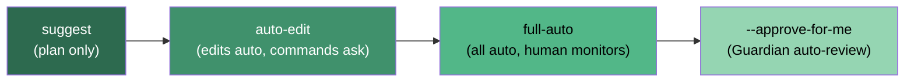
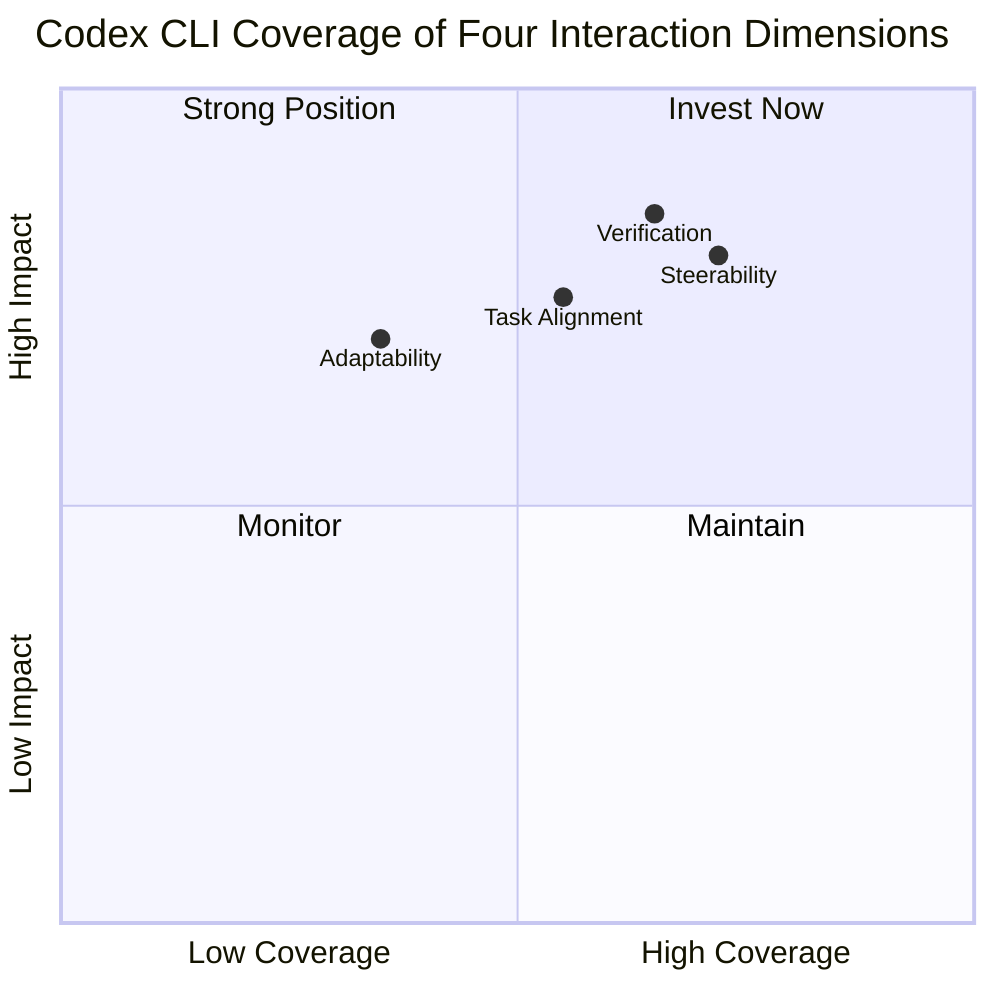

# Humans Are Missing from Coding Agent Research: What Four Interaction Dimensions Reveal About Codex CLI's Design — and Where It Still Falls Short


---

A position paper from Wang, Yang, Lieret and thirteen co-authors — spanning Carnegie Mellon, Princeton, Stanford, and the University of Washington — argues that the primary bottleneck for coding agents has shifted from raw task-solving capability to how users communicate with, supervise, and trust them [^1]. The paper proposes four interaction dimensions — task alignment, steerability, verification, and adaptability — and presents evidence that current benchmarks and research agendas systematically ignore all four.

This article maps those four dimensions onto Codex CLI v0.147.0, identifies where the tool already delivers, and flags the concrete gaps where it does not.

## The Core Thesis

The field has optimised for SWE-bench Verified resolve rates, Terminal-Bench scores, and similar autonomous benchmarks. Yet 84% of developers now use AI coding tools, and nearly half do not trust their outputs [^1]. Two-thirds report that half-baked solutions increase their debugging burden rather than reduce it. The authors' central claim: **agents designed for autonomy are not the same as agents designed for collaboration**, and the research community has overwhelmingly pursued the former.

Their proposed framework decomposes the human–agent interaction surface into four dimensions, each with a formal definition and measurable gaps.

## Dimension 1: Task Alignment

**Definition:** "The process by which humans and agents establish and maintain a shared task understanding through mutual modelling" [^1].

Task alignment measures the distance between the user's intended specification and the agent's inferred specification. When alignment fails, developers enter a **clarification spiral** — repeated correction cycles that erode trust and waste tokens.

### Where Codex CLI delivers

- **AGENTS.md** serves as a persistent, version-controlled specification surface. Rather than relying on conversational inference alone, developers can encode project conventions, forbidden patterns, and architectural constraints in a file the agent reads before every session [^2].
- **Conversation sections** (v0.147.0) let users organise long transcripts into named, manually ordered groups — reducing the ambiguity that accumulates over extended sessions [^3].
- **Named profiles** enable domain-specific configurations (model, sandbox mode, approval policy) that encode task context structurally rather than conversationally.

### Where Codex CLI falls short

- No **user modelling**. Codex CLI does not track individual developer preferences, expertise levels, or interaction patterns across sessions. The paper calls for user simulators trained on GitHub interaction data; Codex CLI has no equivalent.
- No **intent clarification protocol**. When a prompt is ambiguous, the agent proceeds with its best guess rather than asking a structured clarification question. SWE-chat data shows that users push back in 39% of turns, yet agents almost never stop to check [^4].

## Dimension 2: Steerability

**Definition:** "An agent's ability to expose and respond to human control signals throughout task execution" [^1].

Steerability is not the same as approval. The distinction matters: approval is a binary gate at execution time, while steerability enables mid-execution redirection without losing context.

### Where Codex CLI delivers

Codex CLI offers a **four-tier approval spectrum** that maps directly onto the steerability axis:



- **Steer mode** (default since v0.98.0) lets you redirect the agent while it is actively working. Your message is read mid-turn, and the agent adjusts its approach without discarding accumulated context [^2].
- **PreToolUse hooks** intercept tool calls before execution, enabling programmatic control points where external logic can approve, modify, or reject the agent's next action [^3].
- **`approval_policy`** in `config.toml` sets per-command-class approval rules — granular enough to auto-approve `git status` while requiring confirmation for `rm -rf` [^2].

### Where Codex CLI falls short

- **No principled control-point identification.** The paper argues that agents should proactively expose meaningful decision points to users — not merely respond when interrupted. Codex CLI's steer mode is reactive: the user must notice something is wrong and intervene. There is no mechanism for the agent to say "I'm about to make an architectural decision — should I proceed?"
- **No cost-of-intervention metric.** Steerability should be measurable: how many tokens, how many turns, how much cognitive load does a course correction impose? Codex CLI provides no such telemetry.

## Dimension 3: Verification

**Definition:** "A user's ability to assess if a coding agent's outputs are correct with respect to task requirements" [^1].

This is the most empirically grounded dimension in the paper. Over 50% of resolved SWE-bench patches show functional discrepancies with gold solutions, even when tests pass. Verbose implementation and scope creep account for roughly 60% and 50–65% of bloated patches respectively [^1]. The problem: agents generate code that passes tests but does not match the developer's actual intent — and the generated tests themselves lose independence as trust signals because they were written by the same agent.

### Where Codex CLI delivers

- **Guardian auto-review** (`--approve-for-me`) uses a dedicated review model to evaluate each proposed action before execution. Performance metrics: 99.1% approval rate for safe actions, 99.3% prompt-injection recall, 90.3% overeagerness recall [^3].
- **PostToolUse hooks** enable deterministic verification gates. A hook returning exit code 2 feeds structured feedback back to the agent, creating a closed-loop verification cycle [^2]:

```toml
# hooks.json — PostToolUse verification gate
[hooks.post_tool_use.lint_check]
command = "eslint --max-warnings 0 ."
on_failure = "feedback"  # exit code 2 → agent receives error context
```

- **`sandbox_mode`** provides blast-radius containment. Even if verification misses a defect, workspace-write mode prevents network access, and network-restricted mode limits connections to an explicit allowlist [^2].

### Where Codex CLI falls short

- **No task-aware verification artefacts.** The paper argues that verification should adapt to context: UI changes should produce visual previews; data pipeline changes should produce summary diffs. Codex CLI offers uniform text-based diffs regardless of the domain.
- **No independent test generation.** When the agent writes both the code and the tests, test independence is compromised. Codex CLI does not separate the test-generation model from the implementation model.
- **No verification effort measurement.** How long does a developer spend reviewing a patch? How many lines must they read? Codex CLI logs actions in JSONL but does not track human review time or cognitive load.

## Dimension 4: Adaptability

**Definition:** "An AI coding agent's ability to maintain and update itself using accumulated experience" [^1].

The paper identifies **prompt fatigue** as a core symptom: users re-establish context and restate execution details every session because the agent does not learn from previous interactions.

### Where Codex CLI delivers

- **Memories** (v0.128+) extract key facts from conversations and persist them as indexed Markdown files. These are injected into future sessions, reducing context re-establishment [^2].
- **AGENTS.md hierarchy** (project → workspace → personal) creates a layered knowledge architecture that accumulates team conventions over time.
- **Agent Plugins** (v0.147.0) package reusable skills, MCP server configurations, and behavioural instructions into distributable units searchable across local, personal, workspace, and remote catalogues [^3].

### Where Codex CLI falls short

- **No behavioural adaptation.** Memories store facts, not behavioural preferences. If a developer consistently rejects a particular code style, the agent does not learn to avoid it. The paper's adaptability formulation explicitly measures performance improvement over sessions — Codex CLI's Memories do not close this loop.
- **No cross-session poisoning detection.** As MemSecBench (arXiv:2607.27080) demonstrated, memory extraction pipelines are vulnerable to poisoning with 84.2% write-success rates [^5]. Codex CLI has no validation gate at the memory-write stage.
- **No forgetting policy.** Memories accumulate without consolidation or expiry. Over time, stale facts may contradict current project state, degrading rather than improving alignment.

## The Complementary Evidence

The "Humans are Missing" framework does not exist in isolation. Two complementary datasets ground its claims empirically:

| Dataset | Scale | Key finding |
|---------|-------|-------------|
| SWE-chat [^4] | 6,000 sessions, 63,000 prompts, 355,000 tool calls | In 41% of sessions, agents author virtually all committed code; users push back in 39% of turns |
| Developer-Agent Misalignment Study [^6] | 20,574 sessions, 1,639 repositories | 91.49% of visible resolutions require explicit user correction; misalignment patterns persist across adjacent sessions |

Together, these datasets demonstrate that the four-dimension gap is not theoretical — it manifests in measurable user friction at production scale.

## Mapping the Gap to Codex CLI's Roadmap



The pattern is clear: Codex CLI's strongest coverage is on the **control** dimensions (steerability, verification) where hooks and approval policies provide structural enforcement. Its weakest coverage is on the **learning** dimensions (adaptability, user modelling) where the tool lacks closed-loop behavioural feedback.

## Practical Configuration for Human-Centred Sessions

For teams that take the four-dimension framework seriously, here is a `config.toml` pattern that maximises human oversight without sacrificing agent utility:

```toml
# config.toml — human-centred session configuration
[profile.collaborative]
model = "gpt-5.6-terra"
approval_policy = "auto-edit"          # auto-approve edits, ask for commands
sandbox_mode = "workspace-write"       # blast-radius containment
model_auto_compact_token_limit = 90000 # preserve context for steerability

[profile.collaborative.hooks]
pre_tool_use = ["lint-check", "scope-guard"]
post_tool_use = ["test-runner", "diff-size-gate"]
```

The `auto-edit` policy strikes a deliberate balance: the agent can modify files without interruption (reducing approval fatigue), but every shell command requires explicit confirmation (preserving steerability at the command boundary). PostToolUse hooks enforce verification structurally, compensating for the absence of task-aware artefacts.

## What the Paper Gets Wrong

The authors dismiss customisability as a "complementary property" rather than a core dimension, arguing it "complements agent learning" but does not drive it [^1]. This undersells tools like AGENTS.md, which function as **externalised user models** — developers encode their preferences declaratively rather than relying on the agent to infer them. In practice, a well-maintained AGENTS.md file delivers much of what the adaptability dimension demands, without the risks of autonomous behavioural learning.

The paper also assumes that autonomous adaptation is inherently desirable. MemSecBench's 84.2% memory-poisoning success rate [^5] suggests that some forms of adaptation are actively dangerous. The conservative position — externalised, version-controlled, human-authored adaptation via AGENTS.md — may be the safer default.

## Conclusion

The four-dimension framework is the most useful analytical lens to emerge from the human-centred coding agent literature in 2026. It moves the conversation beyond resolve rates and token costs to the interaction surface that determines whether developers actually trust and use their agents.

Codex CLI v0.147.0 already covers significant ground — steer mode, approval tiers, Guardian auto-review, PostToolUse hooks, and Memories collectively address meaningful slices of all four dimensions. But the gaps are real: no user modelling, no proactive control-point exposure, no task-aware verification artefacts, and no closed-loop behavioural adaptation.

The teams that close these gaps first — whether through AGENTS.md discipline, custom hook pipelines, or MCP-based memory servers — will be the ones whose agents are not merely capable, but actually trusted.

## Citations

[^1]: Z. Z. Wang, J. Yang, K. Lieret, A. Tartaglini, V. Chen, Y. Wei, Z. Wang, L. Zhang, K. Narasimhan, L. Schmidt, G. Neubig, D. Fried, and D. Yang, "Position: Humans are Missing from AI Coding Agent Research," arXiv:2608.12355, August 2026. [https://arxiv.org/abs/2608.12355](https://arxiv.org/abs/2608.12355)

[^2]: OpenAI, "Codex CLI Documentation," 2026. [https://github.com/openai/codex](https://github.com/openai/codex)

[^3]: OpenAI, "Codex CLI v0.147.0 Release Notes," August 7, 2026. [https://github.com/openai/codex/releases/tag/rust-v0.147.0](https://github.com/openai/codex/releases/tag/rust-v0.147.0)

[^4]: J. Baumann, V. Padmakumar, X. Li, J. Yang, D. Yang, and S. Koyejo, "SWE-chat: Coding Agent Interactions From Real Users in the Wild," arXiv:2604.20779, April 2026. [https://arxiv.org/abs/2604.20779](https://arxiv.org/abs/2604.20779)

[^5]: L. Chen et al., "MemSecBench: Tracking Agent Memory Poisoning from Persistence to Consequence and Repair," arXiv:2607.27080, July 2026. [https://arxiv.org/abs/2607.27080](https://arxiv.org/abs/2607.27080)

[^6]: S. Li et al., "How Coding Agents Fail Their Users: A Large-Scale Analysis of Developer-Agent Misalignment in 20,574 Real-World Sessions," arXiv:2605.29442, May 2026. [https://arxiv.org/abs/2605.29442](https://arxiv.org/abs/2605.29442)
