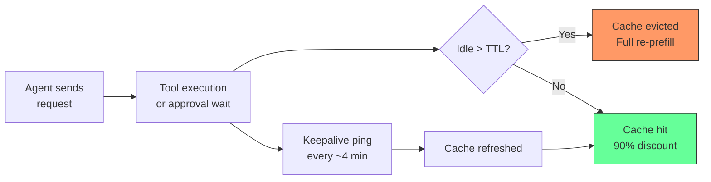
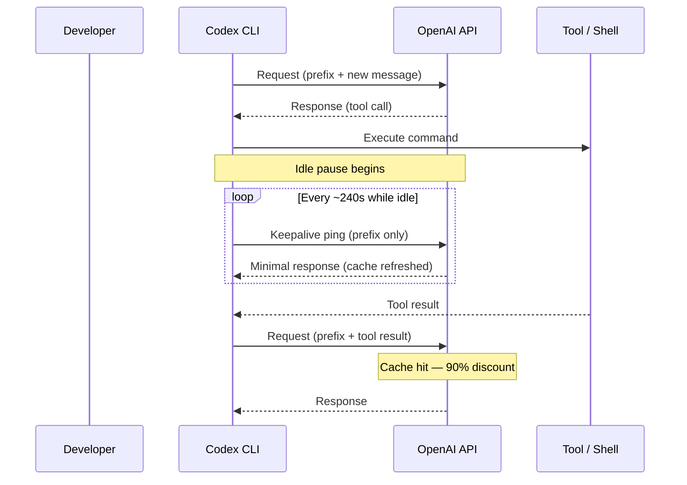

# Keepalive Economics: What Prompt Cache Eviction During Idle Pauses Costs Your Codex CLI Sessions — and How to Stop Bleeding Tokens


---

Every Codex CLI session accumulates a prefix — system instructions, tool definitions, sandbox configuration, environment context, and the growing conversation history — that the inference server caches as pre-computed key–value state [^1]. When the next request shares that prefix byte-for-byte, the server skips re-processing and charges roughly 10% of the standard input price [^2]. On a 100k-token prefix, that is the difference between paying for 100,000 tokens and paying for 10,000. The saving is automatic and invisible — until the cache evicts.

Agentic workflows systematically destroy this benefit. The agent sends a request, executes a shell command, waits for your approval, runs a test suite, or stalls on a long MCP tool call. By the time the follow-up request arrives, the cached prefix has been evicted, and the agent pays the full prefill again [^3]. A new paper — *Keeping the Cache Warm Pays: Keepalive Economics for Agentic Workloads* by Maxim Khailo (arXiv:2607.19214, July 2026) — measures this problem across four providers and proposes a client-side fix that cuts post-pause costs by up to 12.5× [^3].

This article maps those findings onto Codex CLI's agent loop and shows where the savings land, where they do not, and what configuration choices you can make today.

---

## The Eviction Problem

Prompt caching relies on exact prefix matching with recency-based eviction. Each provider sets a time-to-live (TTL) after which unused cache entries are discarded:

| Provider | TTL | Cached-Read Discount | Write Surcharge |
|---|---|---|---|
| Anthropic (default) | 5 min | 90% off | 1.25× input [^4] |
| Anthropic (1-hour tier) | 60 min | 90% off | 2.00× input [^4] |
| OpenAI | 5–10 min (up to 30 min for GPT-5.6) | 50% off | None [^2] |
| Google | User-set | 75% off | None [^5] |
| DeepSeek | ≤10 min | 90% off | None [^3] |

Anthropic silently reduced its default TTL from one hour to five minutes in March 2026, inflating agentic API bills by 17–26% for users who had designed their pipelines around the longer window [^4]. OpenAI's cache is automatic with no write surcharge, but the TTL is opaque and varies with load [^2].

For Codex CLI, the critical observation is this: a single `cargo test` invocation, a Docker build, or a human approval pause of more than five minutes wipes the cached prefix. The next model request re-processes the entire conversation from scratch.

---

## The Keepalive Strategy

The fix is conceptually simple: during idle pauses, replay the cached prefix on a timer to refresh its recency. Khailo formalises this as a cost model [^3]:

**Keepalive cost per token over idle duration *I* with ping interval *τ*:**

```
C_keepalive = (⌊I/τ⌋ + 1) × r
```

where *r* is the cached-read price ratio (typically 0.10).

**Break-even horizon** — the maximum idle duration before keepalive costs exceed a single cold re-prefill:

```
I_max = τ × (w/r − 1)
```

where *w* is the write (re-prefill) price ratio.

For Anthropic's 5-minute TTL with *r* = 0.10 and *w* = 1.25, a 240-second ping interval breaks even at roughly 46 minutes. For OpenAI (*w* = 1.00), break-even is around 36 minutes [^3].



### The 8× Overspend Trap

The conventional keepalive interval is 30 seconds. Khailo's analysis shows this wastes 8× more than necessary [^3]. Since keepalive spend per unit time is *r/τ* (monotonically decreasing with interval), you want the *largest* interval that stays safely under the TTL — approximately 240 seconds for a 5-minute TTL, not 30.

---

## Empirical Results

Khailo measured cache hit rates across providers with a 600-second idle gap and 100k-token prefix [^3]:

| Provider | Baseline (no keepalive) | With keepalive (240s) |
|---|---|---|
| Anthropic | 0/24 warm | 20/20 warm |
| DeepSeek | 1/24 warm | 21/21 warm |
| OpenAI | 19/24 warm | 23/23 warm |

OpenAI's higher baseline reflects its longer and more variable TTL — but even there, keepalive pushes the hit rate to 100%.

The hourly cost of maintaining a 100k-token prefix warm at the optimal interval [^3]:

| Provider | Hourly rental cost |
|---|---|
| Anthropic | \$0.45/hour |
| OpenAI | \$0.19/hour |
| DeepSeek | \$0.04/hour |

Against a Codex CLI session that triggers a cold re-prefill every 10 minutes on a 100k-token conversation, the keepalive strategy saves roughly \$2–4 per hour on Anthropic-routed models and \$0.50–1.50 on OpenAI models.

---

## Where Codex CLI Fits

### The Agent Loop and Natural Idle Points

Codex CLI's agent loop follows a strict request–execute–request cycle [^1]. Several points in this cycle introduce pauses long enough to trigger eviction:

1. **Approval waits** — in `suggest` or `auto-edit` mode, the agent blocks until the human approves or rejects a tool call. A developer reading a diff for three minutes is fine; stepping away for a coffee break is not.
2. **Long tool execution** — `cargo test` on a large Rust project, `docker build`, or a CI pipeline triggered via MCP can easily exceed five minutes.
3. **Guardian auto-review** — when `--approve-for-me` delegates to the Guardian subagent, the reviewer model's own inference time adds to the pause [^6].
4. **MCP server round-trips** — under the MCP 2026-07-28 protocol, multi-round-trip requests (MRTR) introduce additional latency as the server processes paginated results.

### What Codex CLI Already Does Right

The agent loop keeps system instructions, tool definitions, and sandbox configuration in a consistent, identically ordered prefix across every request [^1]. New messages are appended, never inserted into the prefix. This design maximises cache-hit eligibility — the problem is not prefix instability but idle-gap eviction.

### What Codex CLI Does Not Do

Codex CLI does not implement client-side keepalive pings during idle pauses. There is no `cache_keepalive_interval` in `config.toml`, no background heartbeat thread, and no per-tool-call keepalive wrapper. The agent loop simply waits for the tool to finish or the human to approve, then sends the next request — cold or warm, depending on whether the TTL has elapsed.

---

## Practical Mitigation Today

Until Codex CLI ships native keepalive support, you can reduce cache eviction costs with existing configuration levers:

### 1. Shorten Approval Latency

Switch to `auto-edit` or use `--approve-for-me` to delegate approvals to the Guardian reviewer. Every second shaved from the approval pause is a second closer to a cache hit.

```toml
# config.toml — reduce manual approval pauses
[profiles.fast]
approval_policy = "auto-edit"
model_reasoning_effort = "medium"
```

### 2. Use Resume, Not Restart

`codex resume --last` continues the existing conversation, preserving the prefix that may still be cached. Starting a fresh session on the same codebase forces a new cache entry [^1].

### 3. Limit Tool Output Size

Large tool outputs push the conversation beyond cacheable windows. Cap them:

```toml
# config.toml — keep turns within cacheable prefix
tool_output_token_limit = 12000
```

### 4. Prefer GPT-5.6 Models

OpenAI's GPT-5.6 family retains cached prefixes for up to 30 minutes — 3–6× longer than older models [^2]. If you are on GPT-5.5 or earlier, the cache evicts faster:

```toml
# config.toml — longer cache TTL with Sol
model = "gpt-5.6-sol"
service_tier = "standard"
```

### 5. Batch Approvals Where Possible

In `suggest` mode, review and approve multiple pending operations in one sitting rather than approving one, walking away, and returning. Clustered approvals keep the idle gap under the TTL.

---

## The Equilibrium Problem

Khailo raises a market-design concern: if every agent harness adopts keepalive pings, providers face a tragedy of the commons [^3]. Universal recency manufacturing eliminates the eviction signal that LRU caches rely on to free memory. The predicted response is a shift from per-read pricing to token-hour metering — charging for cache residency time rather than cache reads. One provider reportedly already implements this approach [^3].

For Codex CLI users, the implication is that today's keepalive arbitrage may have a limited window. The rational move is to optimise now while the pricing model permits it, but design your workflows to be cache-friendly regardless — short idle gaps, consistent prefixes, and minimal mid-session configuration changes will remain cost-effective even under token-hour metering.

---

## What Should Change in Codex CLI

Three features would close the gap:

1. **`cache_keepalive_interval`** — a `config.toml` key (default: off) that fires a lightweight prefix-replay request during tool execution and approval waits. The interval should default to `240s` for OpenAI and be configurable per provider.

2. **Per-tool-call keepalive toggle** — tools known to be slow (Docker builds, CI pipelines, MCP servers with MRTR) should automatically activate keepalive; fast tools (file reads, grep) should not.

3. **Break-even horizon reporting** — `codex doctor` could report the current prefix size, estimated TTL, and the idle duration at which keepalive stops paying. This would help developers decide whether to enable keepalive for their workflow.



---

## Key Takeaways

- Prompt cache eviction during idle pauses is the single largest hidden cost in agentic LLM workflows. A five-minute test suite wipes a 100k-token cache and forces a full re-prefill.
- Client-side keepalive pings at 240-second intervals (not 30 seconds) cut post-pause costs by up to 12.5× on Anthropic and remain cost-effective for idle durations up to 46 minutes [^3].
- Codex CLI does not currently implement keepalive pings. You can mitigate the problem today by shortening approval latency, using `resume`, capping tool output, and preferring GPT-5.6 models with longer TTLs.
- The keepalive arbitrage window may close as providers shift to token-hour metering. Design for cache-friendly workflows regardless.

---

## Citations

[^1]: OpenAI, "Unrolling the Codex Agent Loop," openai.com, 2026. [https://openai.com/index/unrolling-the-codex-agent-loop/](https://openai.com/index/unrolling-the-codex-agent-loop/)

[^2]: OpenAI, "Prompt Caching," OpenAI API Documentation, 2026. [https://developers.openai.com/api/docs/guides/prompt-caching](https://developers.openai.com/api/docs/guides/prompt-caching)

[^3]: M. Khailo, "Keeping the Cache Warm Pays: Keepalive Economics for Agentic Workloads," arXiv:2607.19214, July 2026. [https://arxiv.org/abs/2607.19214](https://arxiv.org/abs/2607.19214)

[^4]: "Anthropic Cut Claude's Cache TTL: 2026 Fix to Reclaim API Bill," keepmyprompts.com, 2026. [https://www.keepmyprompts.com/en/blog/claude-cache-ttl-cut-2026-reclaim-api-bill](https://www.keepmyprompts.com/en/blog/claude-cache-ttl-cut-2026-reclaim-api-bill)

[^5]: Google, "Context Caching," Google AI for Developers, 2026. [https://ai.google.dev/gemini-api/docs/caching](https://ai.google.dev/gemini-api/docs/caching)

[^6]: Daniel Vaughan, "Codex CLI v0.147.0: Portable Agent Plugins, Multi-Catalog Federation, and the –approve-for-me Flag," codex.danielvaughan.com, August 2026. [https://codex.danielvaughan.com/2026/08/10/codex-cli-v0147-portable-agent-plugins-multi-catalog-federation-approve-for-me-conversation-sections/](https://codex.danielvaughan.com/2026/08/10/codex-cli-v0147-portable-agent-plugins-multi-catalog-federation-approve-for-me-conversation-sections/)
