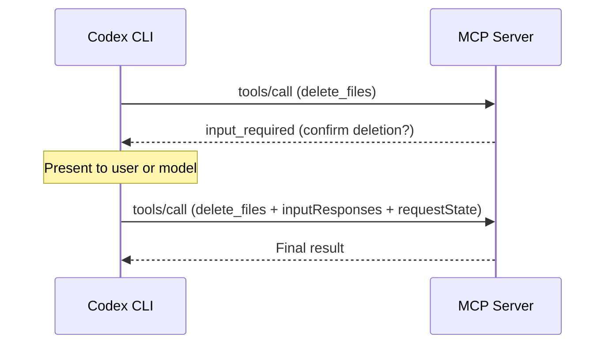

# MCP Goes Stateless: What the 2026-07-28 Specification Means for Your Codex CLI MCP Server Stack


---

The Model Context Protocol specification published on 28 July 2026 is the most disruptive revision since the protocol's launch [^1]. It drops the initialisation handshake, removes protocol-level sessions entirely, adds Multi Round-Trip Requests, introduces header-based routing, makes list responses cacheable, hardens authorisation, and deprecates three previously core capabilities. Codex CLI v0.147.0, released on 7 August 2026, shipped opt-in support for the new spec alongside an upgrade to MCP SDK (rmcp) 3.0.0 [^2]. If you run MCP servers — whether local stdio tools, remote HTTP endpoints, or anything in between — you need to understand what changed, what breaks, and how Codex CLI handles the transition.

## The Core Shift: Stateless by Default

The 2025-11-05 specification required a two-step `initialize` / `notifications/initialized` handshake before any work could happen. The server and client exchanged capabilities, agreed on a protocol version, and established a session tracked by the `Mcp-Session-Id` header. That session state had real infrastructure consequences: sticky routing, shared session stores, and servers that could not be trivially scaled horizontally behind a load balancer.

The 2026-07-28 revision eliminates all of this [^1]. Every request is now self-contained. Protocol version, client identity, and capabilities travel in a `_meta` field on each request:

```json
{
  "jsonrpc": "2.0",
  "method": "tools/call",
  "params": {
    "_meta": {
      "protocolVersion": "2026-07-28",
      "io.modelcontextprotocol/clientInfo": {
        "name": "codex-cli",
        "version": "0.147.0"
      }
    },
    "name": "run_query",
    "arguments": { "sql": "SELECT count(*) FROM orders" }
  }
}
```

A remote MCP server that previously needed sticky sessions and deep packet inspection at the gateway can now run behind a plain round-robin load balancer [^1]. For Codex CLI users, this means MCP servers start faster (no handshake round-trip), reconnect transparently after network interruptions, and scale more predictably in team environments where multiple Codex instances share the same remote server.

## Discovery Without Initialisation

With the handshake gone, servers expose a new `server/discover` RPC that returns supported protocol versions, capabilities, and server identity on demand [^3]. Clients call it when they need the information rather than paying the cost upfront on every connection.

Codex CLI v0.147.0 implements this as part of its non-blocking server startup: MCP servers can begin accepting tool calls before the client has enumerated every capability, with discovery deferred until actually needed [^2].

## Cacheable List Results

The `tools/list`, `prompts/list`, `resources/list`, and `resources/read` responses now include `ttlMs` and `cacheScope` fields [^1]:

```json
{
  "tools": [ ... ],
  "_meta": {
    "ttlMs": 300000,
    "cacheScope": "shared"
  }
}
```

`ttlMs` tells the client how long the result remains fresh. `cacheScope` indicates whether the result can be shared across users or must remain private. For Codex CLI, this matters because tool definitions are included in the prompt sent to the model — unnecessary re-fetches burn tokens and add latency. With `ttlMs`, a stable tool catalogue is fetched once and reused for the duration specified by the server.

## Header-Based Routing

Every Streamable HTTP request must now include `Mcp-Method` and `Mcp-Name` headers [^1]:

```
POST /mcp HTTP/1.1
Mcp-Method: tools/call
Mcp-Name: delete_project
Content-Type: application/json
```

This is a gateway-friendly change. Rate limiters, WAFs, and authorisation policies can inspect headers without parsing JSON bodies. For organisations running shared MCP server infrastructure behind API gateways, this is the difference between a simple header-match rule and a custom body-parsing plugin.

## Multi Round-Trip Requests

The most architecturally significant addition is Multi Round-Trip Requests (MRTR) [^1]. Previously, when an MCP tool needed user input mid-execution — a confirmation dialog, a credential, a disambiguation choice — the protocol relied on server-initiated elicitation over held-open streams. That required bidirectional communication and complicated stateless deployment.

MRTR replaces this with a request-response pattern. When a tool needs input, the server returns an `input_required` result:

```json
{
  "resultType": "input_required",
  "inputRequests": {
    "confirmation": {
      "type": "elicitation",
      "message": "Delete these three files?",
      "schema": { "type": "boolean" }
    }
  },
  "requestState": "opaque-server-state-token"
}
```

The client presents the question to the user (or to the model, depending on the approval policy), collects the answer, and retries the same `tools/call` with `inputResponses` and the preserved `requestState` [^3]. No long-lived stream required.



For Codex CLI's approval spectrum — from `suggest` through `auto-edit` to `full-auto` — MRTR integrates naturally. In `suggest` or `auto-edit` mode, the CLI can surface the input request to the developer. In `full-auto` with `--approve-for-me`, the Guardian auto-review agent can evaluate whether the requested action is safe to confirm without human intervention.

## Authorisation Hardening

Three changes tighten the authorisation model [^1]:

1. **RFC 9207 issuer validation**: authorisation servers must return an `iss` parameter, and clients must validate it before redeeming authorisation codes. This defends against authorisation-server mix-up attacks.

2. **Client ID Metadata Documents (CIMD)**: Dynamic Client Registration is formally deprecated. Clients now use stable HTTPS URLs as identifiers, publishing metadata at well-known endpoints.

3. **Application type declaration**: desktop and CLI clients specify `application_type` during registration, enabling appropriate redirect handling for localhost flows — directly relevant to Codex CLI's OAuth flows for remote MCP servers.

## Deprecations and the Twelve-Month Clock

Three previously core capabilities are deprecated with a minimum twelve-month support window [^1]:

| Deprecated Feature | Replacement |
|---|---|
| Roots | Application-defined context passing |
| Sampling | MRTR with model-mediated input |
| Logging | Standard observability (OpenTelemetry) |

The legacy HTTP+SSE transport is also deprecated. Servers should migrate to Streamable HTTP, which Codex CLI has supported since v0.140.0.

## Tasks Extension

Long-running operations move from the experimental core to a formal `io.modelcontextprotocol/tasks` extension [^1]. The blocking `tasks/result` method is replaced by poll-based `tasks/get` and `tasks/update`, with change notifications channelled through a single `subscriptions/listen` stream with per-type opt-in. This aligns with how Codex CLI's goal mode already manages long-running agent work — polling for status rather than holding connections open.

## Codex CLI v0.147.0: What Shipped

Codex CLI v0.147.0 implements the 2026-07-28 specification as an opt-in protocol version [^2]. The key changes:

- **rmcp SDK upgraded to 3.0.0** from 2.x, with full 2026-07-28 support [^2]
- **Paginated discovery**: tool lists fetched incrementally rather than in a single blocking call
- **Multi-round requests**: MRTR flow wired into the approval pipeline
- **Non-blocking server startup**: MCP servers initialise in the background; tool calls queue until ready

The opt-in nature is important. If your MCP servers still speak 2025-11-05, Codex CLI continues to work with them using the old protocol. The client negotiates the highest mutually supported version. You are not forced to migrate servers on day one.

### Configuration

To opt in to the new protocol for a specific server in your `config.toml`:

```toml
[mcp_servers.my_server]
command = "npx"
args = ["-y", "@my-org/mcp-server"]
protocol_version = "2026-07-28"
```

If `protocol_version` is omitted, Codex CLI defaults to 2025-11-05 for backward compatibility.

## Migration Checklist for MCP Server Authors

If you maintain MCP servers used with Codex CLI, here is what to address:

1. **Remove session state dependencies**: if your server stores per-session state keyed by `Mcp-Session-Id`, refactor to pass state explicitly as tool arguments or use `requestState` tokens in MRTR flows [^3].

2. **Implement `server/discover`**: this is mandatory for 2026-07-28 servers. Return your supported versions, capabilities, and server identity [^3].

3. **Add cache metadata to list responses**: set `ttlMs` and `cacheScope` on `tools/list` responses. For stable tool catalogues, a `ttlMs` of 300000 (five minutes) with `cacheScope: "shared"` is a reasonable starting point.

4. **Emit routing headers**: if you serve over Streamable HTTP, ensure your responses include `Mcp-Method` and `Mcp-Name` headers for gateway compatibility.

5. **Replace elicitation with MRTR**: if your tools use server-initiated elicitation, migrate to `input_required` / `inputResponses` patterns.

6. **Upgrade your SDK**: the TypeScript, Python, Go, and C# Tier 1 SDKs all support 2026-07-28 [^4]. The Rust SDK has beta support.

## What This Means for the Codex CLI Ecosystem

The stateless shift has second-order effects worth tracking:

- **Agent Plugins 1.0** (released 6 August 2026) packages MCP server configurations into distributable plugin directories [^5]. Stateless servers are easier to package because they carry no session lifecycle assumptions.

- **Multi-agent coordination**: when Codex CLI delegates work to TOML-defined subagents, each subagent establishes its own MCP connections. Stateless servers handle this naturally — no session affinity conflicts between parent and child agents.

- **Remote Codex sessions**: Codex Remote (GA since June 2026) drives sessions from the ChatGPT mobile app. Stateless MCP connections survive the intermittent connectivity patterns of mobile networks far better than session-dependent ones.

The 2026-07-28 specification is not a minor version bump — it is a fundamental architectural rethink of how MCP clients and servers communicate. Codex CLI v0.147.0 gives you opt-in access today while maintaining backward compatibility with existing servers. The twelve-month deprecation window for legacy features provides breathing room, but the direction is clear: stateless, cacheable, and gateway-friendly is where the protocol is heading.

---

## Citations

[^1]: "The 2026-07-28 Specification", Model Context Protocol Blog, 28 July 2026. [https://blog.modelcontextprotocol.io/posts/2026-07-28/](https://blog.modelcontextprotocol.io/posts/2026-07-28/)

[^2]: "ChatGPT & Codex changelog", OpenAI, August 2026. Codex CLI v0.147.0 entry (7 August 2026): MCP 2026-07-28 support, rmcp 3.0.0 upgrade. [https://learn.chatgpt.com/docs/changelog](https://learn.chatgpt.com/docs/changelog)

[^3]: "MCP 2026-07-28: every breaking change, with fixes", Stacktree, July 2026. [https://stacktr.ee/blog/mcp-2026-spec-changes](https://stacktr.ee/blog/mcp-2026-spec-changes)

[^4]: "Beta SDKs for the 2026-07-28 MCP Spec Release Candidate Are Here", Model Context Protocol Blog, July 2026. [https://blog.modelcontextprotocol.io/posts/sdk-betas-2026-07-28/](https://blog.modelcontextprotocol.io/posts/sdk-betas-2026-07-28/)

[^5]: "Agent Plugins 1.0: What the New Open Standard Means for Your Codex CLI Plugin Strategy", Codex Knowledge Base, 8 August 2026. [https://codex.danielvaughan.com/2026/08/08/agent-plugins-1-0-open-standard-codex-cli-portable-skills-mcp-packaging/](https://codex.danielvaughan.com/2026/08/08/agent-plugins-1-0-open-standard-codex-cli-portable-skills-mcp-packaging/)
