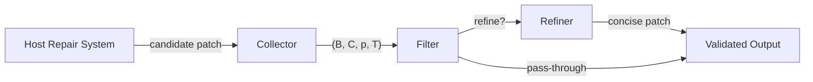
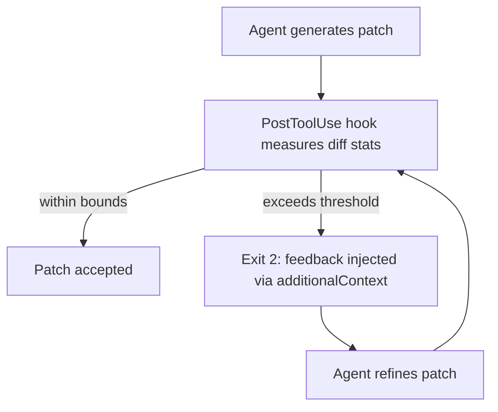

# Patch Verbosity and the RECAP Refinement Adapter: Why Your Codex CLI Patches Are Twice the Size of Human Ones — and What to Do About It


---

Your coding agent solves the issue. The tests pass. You approve the change. Then, during code review, a colleague asks: *why does a two-line bug fix touch fourteen files and add forty lines of speculative refactoring?*

A new empirical study from Luo et al. — "Refine After Generation: Toward Correct and Concise Patches" (August 2026) — puts hard numbers on a problem every Codex CLI user has felt: LLM-generated patches are consistently and significantly larger than the patches a human developer would write for the same issue [^1]. The median inflation across four state-of-the-art repair frameworks is **121.78% more total changes**, **80.91% more net changes**, and **43.99% higher cyclomatic complexity** than the corresponding developer-authored patches on SWE-bench Verified [^1].

This article unpacks the study's findings, examines the proposed RECAP refinement adapter, and maps both the problem and the solution onto Codex CLI's current configuration surface — AGENTS.md directives, PostToolUse hooks, and approval workflows.

## The Verbosity Problem Is Structural, Not Prompting

The first temptation is to add a line to your prompt: *"Make minimal changes."* Luo et al. tested this. Surface-level controls — output format constraints, minimality prompts, chain-of-thought compression — fail to reduce verbosity in any meaningful way [^1]. The bloat comes from deeper design choices:

- **Iterative refinement loops** accumulate speculative fixes across retries, each adding lines rather than removing them.
- **Broad context retrieval** encourages the model to touch files it retrieved but did not need to edit.
- **Training signal bias** — models are trained on (issue, patch) pairs where larger patches correlate with higher test-pass rates, reinforcing verbosity as a proxy for correctness.

This finding aligns with what Codex CLI practitioners already know: AGENTS.md directives like "fix the problem at the root cause rather than applying surface-level patches" improve structural decisions but do not mechanically reduce line count [^2].

## RECAP: Post-Generation Refinement That Preserves Correctness

RECAP (Refine After Candidate Patch) is a lightweight, plug-and-play adapter that attaches *after* the repair framework has produced its candidate patch [^1]. It does not modify the host system's generation pipeline. The architecture has three components:



### Collector

Standardises heterogeneous framework outputs — Agentless diffs, SWE-agent trajectories, OpenHands edits — into a unified tuple of issue description, code context, candidate patch, and test resources [^1].

### Filter

Implements three deployment policies:

| Policy | Gate | Trade-off |
|--------|------|-----------|
| Unconditional Refinement (UR) | None — refine every patch | Maximum compression, slight correctness risk |
| Judge-Guided Refinement (JGR) | LLM evaluates whether the patch is verbose | No test execution needed, lower cost |
| Oracle-Guided Refinement (OGR) | Test suite validates both original and refined | Highest correctness preservation |

### Refiner

A fine-tuned **Qwen-3.5-27B** model generating refined patches in SEARCH/REPLACE block notation rather than Git diffs [^1]. The training pipeline uses a two-phase curriculum:

1. **Supervised fine-tuning (SFT)** on 5,540 instances spanning function-level, commit-level, and repository-level refinement pairs, with a curriculum that gradually increases difficulty across six epochs [^1].
2. **Direct preference optimisation (DPO)** on 822 preference pairs contrasting concise gold patches against model-sampled bloated alternatives [^1].

The DPO phase is critical. SFT alone produces an over-aggressive refiner that resolves only 275.8 instances on average; adding DPO lifts this to 332 instances — a 20% improvement in correctness preservation [^1].

## The Numbers: Verbosity Down, Correctness Up

RECAP was evaluated across four host systems on SWE-bench Verified:

| Host System | Model | Resolved Δ | Total Changes | Net Changes |
|-------------|-------|-----------|---------------|-------------|
| Agentless | Claude 3.5 Sonnet | +26 | −7.64% vs dev | −47.71% vs dev |
| SWE-agent | Claude 4 Sonnet | +42 | +52.39% vs dev | +50.64% vs dev |
| Moatless | Claude 4 Sonnet | +24 | +14.10% vs dev | −32.76% vs dev |
| OpenHands | GPT-5 | +23 | +15.36% vs dev | +0.26% vs dev |

The aggregate shift is dramatic. Unrefined patches across all four hosts averaged **+242.14% total changes** relative to developer patches. After RECAP-OGR, this drops to **+18.55%** [^1]. Cyclomatic complexity goes from +43.99% to **−1.64%** — meaning refined patches are actually *slightly simpler* than the human originals [^1].

Crucially, refinement does not sacrifice correctness. Every host system gained resolved instances (between +23 and +42), because concise patches sometimes fix edge-case failures that bloated patches introduced through unintended side effects [^1].

## Mapping RECAP to Your Codex CLI Workflow

You cannot drop a 27B refiner model into your Codex CLI session today. But RECAP's architecture maps cleanly onto Codex CLI's existing extension points, letting you approximate the same collect → filter → refine pipeline.

### 1. AGENTS.md: Structural Minimality Directives

AGENTS.md directives do not solve verbosity on their own, but they shift the distribution. The evidence-based approach is to be specific rather than aspirational [^2]:

```markdown
## Patch Discipline

- Touch only files directly related to the failing test or reported bug.
- Do not refactor adjacent code in the same commit.
- If a fix requires more than 3 files, explain why before proceeding.
- Prefer the smallest diff that makes the test suite green.
```

Developer-written AGENTS.md files improve agent task success rates by approximately 4% and reduce agent-generated bugs by 35–55% [^2]. The key is concrete constraints the agent can verify, not abstract quality aspirations.

### 2. PostToolUse Hooks: Automated Patch-Size Gate

A PostToolUse hook can act as RECAP's Filter component — intercepting patches after generation and blocking those that exceed a verbosity threshold:

```bash
#!/usr/bin/env bash
# hooks/patch-size-gate.sh — PostToolUse hook
# Block patches that touch more than N files or add more than M net lines

MAX_FILES=5
MAX_NET_LINES=100

CHANGED_FILES=$(git diff --cached --name-only | wc -l)
NET_LINES=$(git diff --cached --stat | tail -1 | grep -oP '\d+ insertion' | grep -oP '\d+')

if [ "$CHANGED_FILES" -gt "$MAX_FILES" ]; then
  echo "Patch touches $CHANGED_FILES files (limit: $MAX_FILES). Review for verbosity." >&2
  exit 2
fi

if [ "$NET_LINES" -gt "$MAX_NET_LINES" ]; then
  echo "Patch adds $NET_LINES net lines (limit: $MAX_NET_LINES). Review for verbosity." >&2
  exit 2
fi

exit 0
```

Exit code 2 feeds the violation message back into the model's context via `additionalContext`, prompting it to self-refine — a lightweight analogue of RECAP's Judge-Guided Refinement policy [^3]. Configure this in `hooks.json`:

```json
{
  "hooks": [
    {
      "event": "PostToolUse",
      "command": "./hooks/patch-size-gate.sh",
      "timeout_ms": 5000
    }
  ]
}
```

### 3. Approval Policy: Human-in-the-Loop Refinement Gate

For high-stakes repositories, the `--approve-for-me` flag with Guardian auto-review acts as an oracle-guided filter [^4]. Guardian evaluates each proposed tool call and can reject patches that appear unnecessarily broad. Combined with `approval_policy: "on-failure"`, the agent must seek explicit approval when its patch exceeds expected bounds [^5]:

```toml
# config.toml
[profile.careful]
model = "gpt-5.6-terra"
approval_policy = "on-failure"
sandbox_mode = "workspace-write"
```

### 4. The Refinement Loop via Iterative Feedback

RECAP's insight that *decoupling minimisation from generation* works better than baking it in applies directly to Codex CLI's hook architecture. Rather than asking the model to generate a minimal patch in one shot, let it generate freely, then use PostToolUse hooks to measure the result and feed back a refinement signal:



This mirrors RECAP's collect-filter-refine pipeline using only built-in Codex CLI primitives. The AGENTS.md directive should explicitly instruct the agent how to respond to the hook feedback:

```markdown
## Hook Feedback Response

When a PostToolUse hook reports patch verbosity:
1. Identify lines that are not strictly required for the fix.
2. Remove speculative refactoring, whitespace-only changes, and import reordering.
3. Resubmit the minimal diff.
```

## What RECAP Reveals About Evaluation Blind Spots

The study exposes a deeper issue: the standard evaluation metric for coding agents — *did the tests pass?* — is insufficient. A patch that passes tests but doubles the codebase's cyclomatic complexity is not equivalent to a patch that passes tests with a two-line change [^1].

This has implications for how teams evaluate Codex CLI effectiveness. Pass rate alone rewards verbosity, because larger patches are more likely to accidentally satisfy test suites through compensating changes. Teams should track:

- **Net lines changed** relative to the scope of the issue
- **Files touched** as a proxy for blast radius
- **Cyclomatic complexity delta** to catch structural bloat
- **Review time** — verbose patches take longer to review, negating the productivity gain

## Current Gaps and Future Directions

RECAP's two-phase training (SFT + DPO) demonstrates that preference optimisation is essential for balancing conciseness against correctness. Codex CLI's current hook architecture provides the filter mechanism but lacks a native refinement model. Three gaps remain:

1. **No built-in diff-complexity analysis.** PostToolUse hooks can measure line counts, but cyclomatic complexity and semantic redundancy require external tooling (e.g., `radon` for Python, `gocyclo` for Go).

2. **No cross-patch learning.** RECAP trains on thousands of (verbose, concise) pairs. Codex CLI's Memories feature could theoretically accumulate per-project patch-quality signals, but there is no mechanism to feed these into model behaviour beyond AGENTS.md text.

3. **No framework-independent refinement adapter.** ⚠️ As of v0.147.0, Agent Plugins could theoretically package a RECAP-style refiner as a portable plugin with PostToolUse hooks, but no such plugin exists in the public catalogue.

## Conclusion

Patch verbosity is not a cosmetic problem. It inflates review burden, increases merge-conflict surface area, and — as RECAP demonstrates — sometimes introduces bugs that a minimal patch would avoid. The study's core finding — that *post-generation refinement outperforms in-generation minimality constraints* — gives Codex CLI teams a clear architectural pattern: generate freely, measure rigorously, and refine through hooks rather than hoping the prompt will produce clean output on the first pass.

## Citations

[^1]: Luo, W., Keung, J., Shi, X., Sun, Y., Yang, B., Yang, Z. & Tian, H. (2026). "Refine After Generation: Toward Correct and Concise Patches." arXiv:2608.13292. [https://arxiv.org/abs/2608.13292](https://arxiv.org/abs/2608.13292)

[^2]: OpenAI. (2026). "AGENTS.md — Agent Instruction Files." Codex CLI Documentation. [https://learn.chatgpt.com/docs/cli/agents-md](https://learn.chatgpt.com/docs/cli/agents-md)

[^3]: OpenAI. (2026). "Hooks — PreToolUse and PostToolUse Events." Codex CLI Documentation. [https://learn.chatgpt.com/docs/cli/hooks](https://learn.chatgpt.com/docs/cli/hooks)

[^4]: OpenAI. (2026). "Codex CLI v0.147.0 Changelog — --approve-for-me Flag and Guardian Auto-Review." [https://learn.chatgpt.com/docs/changelog](https://learn.chatgpt.com/docs/changelog)

[^5]: OpenAI. (2026). "Codex CLI Configuration Reference — config.toml." [https://learn.chatgpt.com/docs/cli/reference](https://learn.chatgpt.com/docs/cli/reference)
