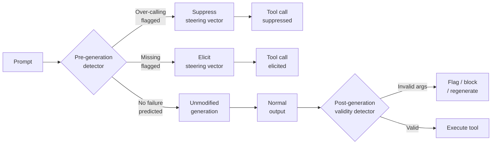
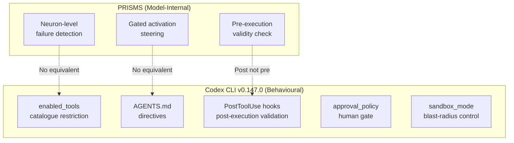

# A Few Neurons Reveal Tool-Use Failures: What PRISMS Means for Your Codex CLI Defence Stack


---

Your coding agent calls a tool it should not, omits one it needs, or passes garbled arguments to a perfectly good API. You discover the damage three turns later. The question is not whether these failures happen — they do, routinely — but whether the model itself contains signals that predict them *before* the consequences propagate.

Ke et al.'s "A Few Neurons Reveal When LLMs Misuse Tools" (arXiv:2608.00218, July 2026) answers with an emphatic yes [^1]. Their PRISMS framework identifies failure-specific neurons inside MLP layers, fits a sparse detector over them, and steers the model away from predicted mistakes — all without retraining. This article unpacks the research, maps its three failure categories onto Codex CLI v0.147.0's existing defence mechanisms, and identifies where the gaps remain.

## The Three Failure Modes

PRISMS classifies tool-use failures into three categories that will feel familiar to anyone who has debugged an agentic session:

### Validity

The model generates a tool call with incorrect argument values. The function name is right, the schema is respected, but the parameter content is wrong — a file path that does not exist, a query that targets the wrong table, an off-by-one range. PRISMS evaluates validity *after* a parseable call has been generated, scanning the entire call span (tool name, argument keys, values, delimiters) [^1].

### Over-calling

The model invokes a tool when no suitable tool is available. PRISMS subdivides this into NTA (non-existent tool — calling when no tools are offered) and DT (distractor — calling an inapplicable tool when only wrong tools are available) [^1]. In a Codex CLI context, this manifests as the agent reaching for `shell` when a read-only file operation would suffice, or invoking an MCP tool that has no bearing on the current task.

### Missing

The model fails to invoke an available, required tool. The prompt clearly requires tool use, the tool is registered and capable, but the model produces a plain-text response instead [^1]. In practice, this means the agent describes what it *would* do rather than doing it — a pattern Codex CLI users encounter when the model hedges on sandbox-restricted operations.

## Inside PRISMS: Sparse Detection and Gated Steering

The framework operates in two stages: detect, then steer.

### Detection

PRISMS ranks MLP neurons across all transformer layers using a WANDA-style contribution score:

```
c(ℓ, i) = |activation(ℓ, i)| × ||down_projection_column(ℓ, i)||₂
```

This combines activation magnitude with the neuron's downstream influence on the residual stream. The top 3% of neurons (by contribution) from both failure and correct examples form a shared basis. An L1-regularised logistic regression classifier is then fitted over this basis, and only the non-zero support set is deployed at inference — typically 10 to 110 features depending on the failure type [^1].

The sparsity profile varies dramatically:

| Failure type | Typical neuron count | ROC-AUC range |
|---|---|---|
| Missing | 1–2 neurons | 0.90–1.00 |
| Over-calling | 2–16 neurons | 0.91–1.00 |
| Validity | ~128 neurons | 0.86–0.90 |

Missing failures are the easiest to catch — sometimes a single neuron suffices. Validity is the hardest, requiring roughly two orders of magnitude more features [^1].

### Steering

When the detector flags a likely failure, PRISMS computes layerwise correction vectors by comparing mean residual-stream writes between correct and failed examples:

```
d̂(ℓ) = (mean_correct(ℓ) − mean_failed(ℓ)) / ||mean_correct(ℓ) − mean_failed(ℓ)||₂
```

The intervention perturbs the MLP output: `MLP_corrected(ℓ) = MLP(ℓ) + α × γ(ℓ) × d̂(ℓ)`, where α ≈ 0.2 is a validation-selected strength and γ(ℓ) is a per-layer scaling factor [^1].

Crucially, steering is *gated*: it fires only when the detector predicts a failure above threshold. Unconditional steering — always applying the correction — trades one failure mode for another (suppressing over-calling also suppresses legitimate calls). Gated steering avoids this collateral damage.

### Results Across Model Families

Evaluated across six models spanning Qwen3, Llama 3.1, and Gemma 3 families [^1]:

| Metric | Baseline (pooled) | PRISMS (pooled) | Change |
|---|---|---|---|
| Over-calling rate | 0.131 | 0.026 | −80% |
| Capability accuracy | 0.689 | 0.831 | +14.2pp |

On Qwen3-4B specifically, non-existent-tool hallucination dropped from 0.534 to 0.000 at maximum suppression. Gemma-3-4B's capability accuracy recovered from 0.078 to 0.508 with missing-call steering [^1].



## Chain-of-Thought Changes Everything

A critical finding for Codex CLI users: when reasoning mode is enabled (chain-of-thought), the failure signals *relocate*. At the standard prompt boundary, over-calling average precision is 0.083. At the token immediately before `</think>`, it jumps to 0.676 — a Δ of +0.59 [^1].

This means detection calibration must differ between reasoning and non-reasoning models. Codex CLI's default models (o3, o4-mini) use extended thinking, so any future integration of neuron-level monitoring would need to read signals at the think-boundary rather than the prompt boundary.

Validity detection, by contrast, remains layer-flat (0.85–0.89 AUC per layer) regardless of reasoning mode, and actually *improves* with chain-of-thought: 0.889 → 0.934 AUC on Qwen3-4B [^1].

## Mapping to Codex CLI's Existing Defence Stack

Codex CLI v0.147.0 does not perform neuron-level inspection — it operates at the behavioural layer. But its defence mechanisms address the same three failure modes through different means.

### Over-calling: `enabled_tools` and `approval_policy`

The `enabled_tools` configuration in `config.toml` restricts which tools are available to the agent, functioning as a coarse-grained over-calling suppressor [^2]. If a tool is not in the catalogue, the model cannot call it. The `approval_policy` setting adds a human gate: at the `untrusted` level, only pre-approved commands execute without prompting [^3].

These are static defences — they do not adapt to the model's internal uncertainty about whether a tool call is appropriate. PRISMS's contribution is showing that the model *already knows* when it is about to over-call, and that knowledge is readable from as few as two neurons.

### Missing: AGENTS.md Directives

When the model fails to invoke a required tool, Codex CLI's primary remedy is AGENTS.md: explicit behavioural directives that instruct the agent to prefer tool use over text responses [^4]. Directives like "always run tests before claiming completion" or "use shell for file operations" push the model toward tool invocation.

This is prompt engineering — effective but brittle. PRISMS suggests that a lightweight probe could detect the model's intent to abstain and apply a targeted correction, potentially more reliable than hoping the directive survives the context window.

### Validity: PostToolUse Hooks

PostToolUse hooks in `hooks.json` run after every tool execution and can inspect the result, returning exit code 2 to provide feedback to the model [^2]. This is Codex CLI's closest analogue to PRISMS's validity detection — but it operates *after* execution rather than before.

```toml
# config.toml — restricting tool access (over-calling defence)
[tools]
enabled_tools = ["shell", "file_read", "file_write"]
```

```json
{
  "hooks": {
    "PostToolUse": [
      {
        "command": "python validate_args.py ${TOOL_NAME} ${TOOL_ARGS}",
        "on_failure": "feedback"
      }
    ]
  }
}
```

The key difference: PRISMS detects validity failures *before* the tool executes by reading neuron activations from the generated call span. PostToolUse hooks detect them *after*, when the damage may already be done. For idempotent operations (read-only queries), the distinction matters less. For state-mutating operations (file writes, API calls), pre-execution detection is strictly superior.

## What PRISMS Reveals About the Gap



Three gaps emerge:

1. **No pre-execution validity gate.** PostToolUse hooks run after the fact. A PreToolUse hook that validates argument plausibility (schema conformance, path existence, parameter range checks) before execution would close this gap without requiring neuron-level access.

2. **No adaptive over-calling suppression.** `enabled_tools` is a static allowlist. The model's confidence about whether a tool call is appropriate is discarded. A future integration could expose the model's tool-selection uncertainty as a hookable signal — even without PRISMS's neuron probes, the model's logit distribution over tool-call tokens carries information.

3. **No missing-call detection.** When the model produces text instead of a tool call, Codex CLI has no mechanism to detect this was a mistake rather than an intentional response. PRISMS shows that a single neuron can distinguish the two cases with near-perfect accuracy on some model families.

## Practical Implications

PRISMS is a research prototype, not a deployable system. Its neuron probes require access to MLP activations during inference — access that OpenAI's API does not expose for o3 or o4-mini. The technique is immediately applicable to open-weight models (Qwen3, Llama, Gemma) running locally or via self-hosted inference, but not to Codex CLI's default cloud-hosted models [^5].

However, the *insight* is deployable today. If the model internally represents its own tool-use failures with separable signals, then:

- **Token-level logit analysis** at the API layer could approximate the same detection, even without neuron access.
- **PostToolUse hooks** can be extended with argument validation scripts that catch validity failures before they propagate.
- **AGENTS.md directives** can be tuned to address the specific failure modes PRISMS identifies — explicit instructions about when *not* to call tools (over-calling) and when tool use is mandatory (missing).

The 80% over-calling reduction and 14.2pp accuracy gain that PRISMS achieves represent the ceiling for what model-internal intervention can deliver. Codex CLI's behavioural defences will not match these numbers, but they can be sharpened by understanding which failures are most detectable and which require the heaviest intervention.

## Citations

[^1]: Ke, Y., Yin, M., Zhao, C. & Huang, K. (2026). "A Few Neurons Reveal When LLMs Misuse Tools: Sparse Detection and Selective Steering for Reliable Tool Use." *arXiv:2608.00218*. [https://arxiv.org/abs/2608.00218](https://arxiv.org/abs/2608.00218)

[^2]: OpenAI. (2026). "Codex CLI Hooks Reference — hooks.json, PreToolUse & PostToolUse." [https://agenticcontrolplane.com/blog/codex-cli-hooks-reference](https://agenticcontrolplane.com/blog/codex-cli-hooks-reference)

[^3]: OpenAI. (2026). "Codex CLI v0.147.0 Release Notes." [https://github.com/openai/codex/releases/tag/rust-v0.147.0](https://github.com/openai/codex/releases/tag/rust-v0.147.0)

[^4]: OpenAI. (2026). "AGENTS.md Patterns: What Actually Changes Agent Behaviour." [https://blakecrosley.com/blog/agents-md-patterns](https://blakecrosley.com/blog/agents-md-patterns)

[^5]: Codex CLI Guide 2026. "Setup, Sandbox, AGENTS.md & MCP." [https://blakecrosley.com/guides/codex](https://blakecrosley.com/guides/codex)
