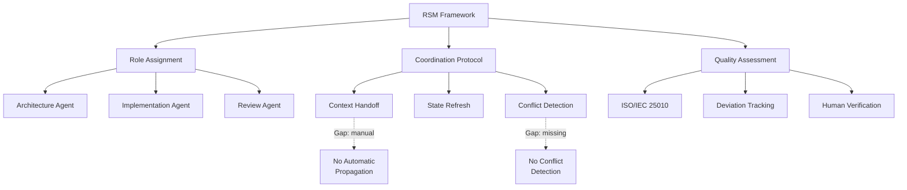
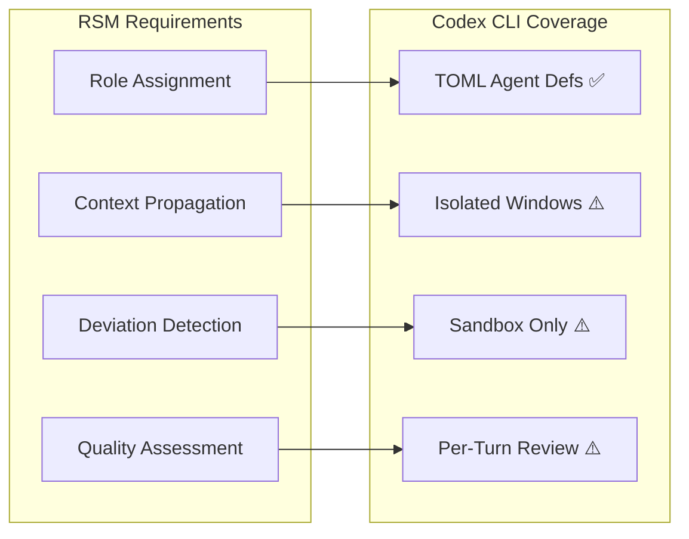

# The Role Specialization Model: What a Three-Tool Coordination Study Reveals About Your Codex CLI Multi-Agent Strategy


---

Most teams adopting multi-agent coding workflows treat role assignment as an afterthought — spinning up subagents with vague instructions and hoping the orchestrator sorts it out. A new exploratory case study from Fernández-y-Fernández and Aguilar-Cisneros formalises what experienced practitioners already suspect: explicit role coordination materially improves architectural quality, but demands deliberate strategies for context management and human verification that no current tool provides out of the box [^1].

Their proposed **Role Specialization Model (RSM)** is the first structured framework for assigning, coordinating and evaluating specialised roles across heterogeneous LLM-based coding tools. The findings map directly onto Codex CLI's TOML-based subagent definitions, and the gaps they identify are precisely the ones your `config.toml` and `AGENTS.md` need to address.

## What RSM Proposes

The RSM framework assigns each LLM-based tool a distinct role within the software development lifecycle, then coordinates their outputs through explicit handoff protocols rather than ad-hoc prompting. The case study deploys three tools — Google Antigravity (Gemini 3.5 Flash backend), Gemini CLI, and Qwen Code — to build a Python desktop application for climate-data visualisation [^1].

Each tool receives a bounded responsibility:

- **Antigravity** handles high-level architectural design and UI scaffolding, leveraging its IDE integration and agent-manager surface [^2]
- **Gemini CLI** manages data-pipeline implementation and API integration, exploiting its terminal-native workflow
- **Qwen Code** performs code review, testing and quality assurance

The key insight is that role assignment is not merely about dividing labour — it is about constraining each agent's decision space so that architectural coherence survives the handoffs between tools.

## The Three Research Questions and What They Found

### RQ1: How does RSM coordinate tools with different capabilities?

The study finds that explicit role boundaries reduce the overlap and contradiction that emerges when multiple agents operate on the same codebase without coordination. However, coordination requires **deliberate context management** — each tool must receive sufficient state about what the others have done, and that state must be refreshed at each handoff [^1].

### RQ2: What deviations occur during execution?

This is where it gets interesting. The study documents systematic deviations from planned roles:

- **Role drift**: agents progressively expand beyond their assigned scope, particularly when encountering errors in another agent's output
- **Context loss**: information established in one agent's session fails to propagate to the next, leading to contradictory implementations
- **Unilateral architectural decisions**: agents make structural choices (dependency selection, API design) that conflict with the overall plan because they lack visibility into the broader design context

These deviations required human intervention to detect and correct — none of the tools flagged them automatically [^1].

### RQ3: How does the output align with ISO/IEC 25010?

The resulting application was assessed against ISO/IEC 25010:2023's nine product-quality characteristics [^3]. RSM-coordinated development produced acceptable results for functional suitability, reliability and maintainability, but scored poorly on consistency and integration quality — precisely the areas where role drift and context loss cause the most damage [^1].



## Mapping RSM to Codex CLI's Multi-Agent Architecture

Codex CLI v0.147.0 ships a multi-agent system that addresses several of RSM's coordination challenges — and leaves others wide open [^4]. Here is how the mapping works.

### Role Definition via TOML Agent Files

RSM's role assignment maps directly to Codex CLI's custom agent definitions. Each role becomes a `.toml` file in `.codex/agents/`:

```toml
# .codex/agents/architect.toml
name        = "architect"
description = "Designs module boundaries, API contracts and dependency selections."
model       = "gpt-5.6-terra"
model_reasoning_effort = "high"
sandbox_mode = "read-only"

developer_instructions = """
You are the architecture agent. Your responsibilities:
- Define module boundaries and public API surfaces
- Select dependencies and justify each choice
- Produce interface contracts as typed stubs
- Never write implementation code — delegate to the implementer agent
- Output architectural decisions as structured JSON for downstream agents
"""

[mcp_servers.dependency-audit]
command = "npx"
args = ["-y", "@security-tools/advisory-mcp-server"]
```

```toml
# .codex/agents/implementer.toml
name        = "implementer"
description = "Writes implementation code within architectural constraints."
model       = "gpt-5.6-sol"
model_reasoning_effort = "medium"
sandbox_mode = "workspace-write"

developer_instructions = """
You are the implementation agent. Your responsibilities:
- Implement modules according to the architect's interface contracts
- Do not alter public API surfaces without escalating to the architect
- Write unit tests alongside implementation
- Call report_agent_job_result with implementation status when complete
"""
```

```toml
# .codex/agents/reviewer.toml
name        = "reviewer"
description = "Reviews code for correctness, security and style compliance."
model       = "o4-mini"
model_reasoning_effort = "high"
sandbox_mode = "read-only"

developer_instructions = """
You are the review agent. Your responsibilities:
- Verify implementation matches architectural contracts
- Flag security vulnerabilities with CWE identifiers
- Check test coverage and edge cases
- Rate findings: CRITICAL, HIGH, MEDIUM, LOW
- Never modify code directly — report findings only
"""
```

This three-agent decomposition mirrors RSM's role structure whilst exploiting Codex CLI's model-to-task routing: Terra for deep architectural reasoning, Sol for balanced implementation work, and o4-mini for high-throughput review [^4] [^5].

### Coordination Through Config.toml

The agents are registered and concurrency-controlled centrally:

```toml
[features]
multi_agent = true

[agents]
max_threads = 4
max_depth   = 1
job_max_runtime_seconds = 900

[agents.architect]
config_file = ".codex/agents/architect.toml"
nickname_candidates = ["Vitruvius"]

[agents.implementer]
config_file = ".codex/agents/implementer.toml"
nickname_candidates = ["Mason"]

[agents.reviewer]
config_file = ".codex/agents/reviewer.toml"
nickname_candidates = ["Argus"]
```

Each subagent operates in its own context window with its own sandbox, and results flow back through structured channels — Codex CLI's path-based addressing (`/root/architect`, `/root/implementer`) provides the explicit routing that RSM demands [^4].

### Where Codex CLI Already Addresses RSM's Gaps

**Sandbox inheritance with restrictions.** RSM's deviation analysis highlights agents making unilateral architectural decisions. Codex CLI's sandbox model prevents this structurally: a `read-only` reviewer physically cannot modify source files, regardless of what the model decides to attempt [^4].

**AGENTS.md as shared context.** RSM's context-loss problem — where one agent's decisions fail to propagate — can be partially addressed through `AGENTS.md`. Because Codex CLI re-reads this file at session start, architectural constraints encoded there survive across agent invocations [^6]:

```markdown
## Architectural Constraints (set by architect agent)

- All HTTP handlers MUST use the `handlers/` package
- Database access MUST go through the `store/` interface
- No direct dependency on `net/http` outside `handlers/`
- API versioning follows `/api/v{N}/` URL structure
```

**Multi-agent delegation modes.** Codex CLI's experimental `multiAgentMode` parameter (`explicitRequestOnly` vs `proactive`) gives teams control over when subagents spawn — a governance lever RSM identifies as essential but does not implement [^4].

## Where Codex CLI Falls Short of RSM's Requirements

The RSM study exposes three coordination gaps that Codex CLI's current architecture does not close:

### 1. No Cross-Agent Context Propagation

RSM's most critical finding is that context must be refreshed at each handoff between agents. Codex CLI subagents operate in isolated context windows with no shared state beyond what the parent orchestrator explicitly passes in the spawn instruction. There is no mechanism for Agent A's architectural decisions to automatically appear in Agent B's context [^4].

**Workaround:** Encode decisions in files (`ARCHITECTURE.md`, typed interface stubs) that downstream agents are instructed to read. This is manual and brittle — the RSM study shows agents routinely ignore or override file-based constraints when they encounter implementation friction [^1].

### 2. No Deviation Detection

RSM documents three categories of role deviation (scope expansion, context loss, unilateral decisions). Codex CLI has no mechanism to detect when a subagent exceeds its assigned role. A reviewer agent instructed to "never modify code" might still attempt to do so — the `read-only` sandbox will block the write, but the model wastes tokens attempting the action and may hallucinate success [^4].

**Workaround:** PostToolUse hooks can inspect agent outputs for deviation signals, but this requires custom scripting and heuristic matching rather than structured role-boundary enforcement.

### 3. No Quality Assessment Integration

RSM's ISO/IEC 25010 evaluation happens entirely outside the agent loop. Codex CLI has no built-in mechanism for assessing whether the combined output of multiple agents meets quality standards. The `--approve-for-me` Guardian auto-review flag operates at the individual turn level, not at the cross-agent integration level [^4] [^3].



## Practical Recommendations

If you are building multi-agent workflows in Codex CLI today, the RSM study suggests three structural investments:

**1. Encode role boundaries in both TOML and AGENTS.md.** The TOML `developer_instructions` field constrains the agent at spawn time; the `AGENTS.md` file constrains it at session start. Use both — they reinforce each other through different mechanisms.

**2. Design explicit handoff artefacts.** Do not rely on the orchestrator to summarise Agent A's output for Agent B. Instead, have each agent write structured output files (JSON contracts, typed stubs, review reports) that downstream agents consume directly. This reduces context-loss deviations.

**3. Budget for human verification at integration points.** RSM's most sobering finding is that no combination of tools and coordination protocols eliminated the need for human review at the boundaries between agent outputs. Use `approval_policy` to require manual approval at integration commits, even if individual agent actions are auto-approved.

## Conclusion

The RSM framework is modest in scope — a single case study with three tools on one project — but its findings align with what the broader multi-agent coordination literature consistently shows: role specialisation improves individual agent outputs, but the integration seams between agents remain the primary failure mode [^1].

Codex CLI's TOML-based agent definitions, sandbox inheritance and multi-agent delegation modes provide the strongest role-assignment infrastructure of any current CLI-based coding agent. But the coordination layer — cross-agent context propagation, deviation detection, and integration-level quality gates — remains largely manual. The gap between defining roles and governing their interaction is where the next round of tooling investment needs to land.

---

## Citations

[^1]: Fernández-y-Fernández, C. A. & Aguilar-Cisneros, J. R. (2026). "The Role Specialization Model (RSM): Coordinating LLM-Based Tools in Agentic Software Development — An Exploratory Case Study." arXiv:2608.12311. [https://arxiv.org/abs/2608.12311](https://arxiv.org/abs/2608.12311)

[^2]: Google. (2026). "Transitioning Gemini CLI to Antigravity CLI." Google Developers Blog. [https://developers.googleblog.com/an-important-update-transitioning-gemini-cli-to-antigravity-cli/](https://developers.googleblog.com/an-important-update-transitioning-gemini-cli-to-antigravity-cli/)

[^3]: ISO/IEC 25010:2023. "Systems and software engineering — Systems and software Quality Requirements and Evaluation (SQuaRE) — Product quality model." International Organization for Standardization. [https://www.iso.org/standard/35733.html](https://www.iso.org/standard/35733.html)

[^4]: OpenAI. (2026). "Codex CLI v0.147.0 Release Notes." GitHub. [https://github.com/openai/codex/releases/tag/rust-v0.147.0](https://github.com/openai/codex/releases/tag/rust-v0.147.0)

[^5]: OpenAI. (2026). "Codex Models." ChatGPT Learn. [https://developers.openai.com/codex/models](https://developers.openai.com/codex/models)

[^6]: OpenAI. (2026). "AGENTS.md Reference." Codex CLI Documentation. [https://developers.openai.com/codex/agents-md](https://developers.openai.com/codex/agents-md)
