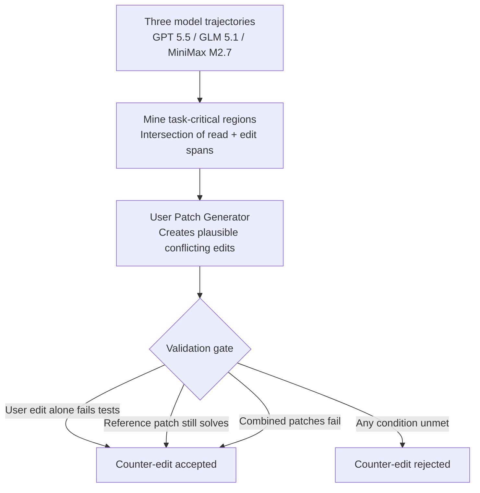
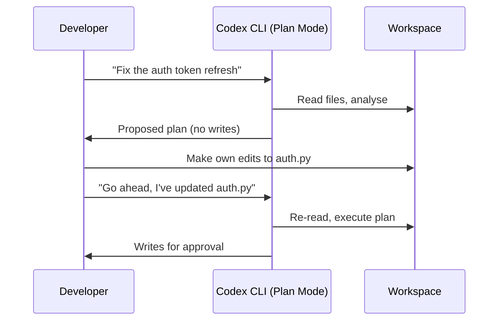

# SWE-Touch and the Shared Workspace Problem: What Happens When You Edit Code While Your Agent Is Working — and How Codex CLI's Isolation Primitives Respond


---

Every coding agent benchmark makes the same assumption: the agent works alone. It receives an issue description, explores the repository, writes a patch, and is judged on whether the tests pass. The developer is absent. The workspace is frozen. Nobody touches the code between the moment the agent starts reading and the moment it commits.

That is not how software development works.

Tan et al.'s SWE-Touch benchmark, published on 3 August 2026, is the first systematic attempt to measure what happens when a developer edits task-relevant code while the agent is mid-flight [^1]. The results are sobering: counter-edits — plausible user modifications that conflict with the task — lower the average resolve rate by 7.7 percentage points across nine frontier models on SWE-bench Verified [^1]. The best agent (Claude Opus 4.8) loses 1.8 points; the worst (Qwen3-Coder-480B) loses 16.5 points [^1]. The gap between benchmark performance and real-world reliability is, for most models, a double-digit chasm.

This article unpacks the SWE-Touch methodology, examines the failure taxonomy, and maps both the attack surface and the defences onto Codex CLI v0.147.0's workspace isolation primitives.

## The Counter-Edit Framework

### How SWE-Touch Manufactures Conflict

SWE-Touch does not inject random noise. It uses a three-stage pipeline to produce validated counter-edits that are simultaneously plausible (a developer might reasonably make them) and task-conflicting (they prevent the correct fix from working) [^1].



The validation gate enforces three conditions: the user edit alone must fail the task's tests, the reference patch must still solve the task independently, and applying both the user edit and the reference patch together must still fail [^1]. This ensures the counter-edit is genuinely conflicting rather than merely additive.

The resulting patches are small — averaging 7.0 lines and 1.04 files on SWE-bench Verified [^1] — mirroring the kind of quick fix a developer might push while the agent is still exploring.

### Delivery Mechanism

Counter-edits are injected at the moment the agent first accesses overlapping code regions, accompanied by a contextual user message explaining the change [^1]. This mimics the real-world scenario of a developer saying "I've already tweaked that function — check before you overwrite it." Up to three intervention attempts are made per task.

## The Performance Landscape

### Resolve Rate Degradation

The nine models tested span three tiers of resilience [^1]:

| Model | Vanilla | Counter-Edit | Drop |
|---|---|---|---|
| Claude Opus 4.8 | 85.2% | 83.3% | −1.8pp |
| GPT 5.5 | 80.5% | 79.2% | −1.3pp |
| Qwen 3.7 Max | 75.2% | 70.3% | −4.8pp |
| GLM 5.1 | 72.7% | 68.3% | −4.3pp |
| MiniMax M2.7 | 76.5% | 62.7% | −13.8pp |
| DeepSeek V4 Pro | 74.8% | 63.8% | −11.0pp |
| MiniMax M2.5 | 75.7% | 66.2% | −9.5pp |
| Kimi K2.6 | 70.3% | 64.3% | −6.0pp |
| Qwen3-Coder-480B | 57.2% | 40.7% | −16.5pp |

The retention rate — how many tasks that were solved in vanilla runs remain solved under counter-edits — tells a sharper story. Claude Opus 4.8 retains 96.0% of its solves; Qwen3-Coder-480B retains only 60.8% [^1]. Strong autonomous performance does not guarantee state awareness.

### Failure Taxonomy

Analysis of 526 failed runs reveals four failure categories [^1]:

1. **Retained conflict (63.3%)** — the user's conflicting code remains active in the final patch. The agent either never noticed the change or noticed it and did nothing.
2. **Incorrect replacement (13.9%)** — the agent detected the conflict and attempted a fix, but the replacement was wrong.
3. **Incomplete reconciliation (11.6%)** — the agent partially corrected the conflict but missed dependent code elsewhere.
4. **Off-target implementation (5.5%)** — the agent introduced defects in unrelated code regions, suggesting the counter-edit disrupted its broader reasoning.

The dominant failure mode — retained conflict — is an awareness problem, not a reasoning problem. The agent does not re-read changed files.

### The Token Tax

Counter-edits increase token consumption without proportional recovery. Claude Opus 4.8 uses 37.8% more tokens under counter-edits; GLM 5.1 uses 26.3% more [^1]. Seven of nine models increase their tool-call counts. The agents are working harder, but not smarter.

## What This Means for Codex CLI

Codex CLI v0.147.0 does not currently track external filesystem changes and re-inject them into the agent's context window mid-session ⚠️. Like every other coding agent, it assumes workspace stability during execution. But its architecture provides three layers of defence against the shared-workspace problem — and a clear gap where a fourth is needed.

### Layer 1: Git Worktree Isolation

The most direct defence is preventing workspace conflicts entirely. Codex CLI's subagent runtime creates per-agent git worktrees automatically, giving each parallel task its own physical directory and branch [^2]. The developer's edits to the main working copy cannot collide with the agent's writes because they operate on different filesystem paths.

For CLI users, worktree isolation requires manual setup:

```bash
# Create an isolated worktree for the agent
git worktree add ../codex-fix-auth fix/auth-refactor

# Run Codex CLI in the worktree
cd ../codex-fix-auth
codex "Fix the authentication token refresh logic"
```

This eliminates the SWE-Touch failure mode at source: if the developer edits `src/auth.py` in the main worktree, the agent's copy in `../codex-fix-auth/src/auth.py` is untouched [^2].

### Layer 2: The Writes Approval Mode

Codex CLI's `writes` approval mode (shipped in v0.144.0) interposes a human checkpoint before every file modification [^3]. The agent can read freely but must obtain approval before writing. This creates a natural reconciliation point: the developer reviews each proposed write against the current state of the file, catching conflicts that the agent missed.

```toml
# config.toml — writes approval mode
[sandbox]
sandbox_mode = "workspace-write"

[approval]
approval_policy = "on-request"
```

In SWE-Touch terms, the writes approval mode converts "retained conflict" failures (63.3% of all failures) into human-reviewed decisions. The developer sees the proposed diff, notices that the file has changed since the agent last read it, and either rejects or modifies the write.

### Layer 3: Plan Mode as Pre-Commit Review

Codex CLI's plan mode instructs the agent to analyse the codebase and propose an implementation plan without writing anything [^4]. For tasks where the developer expects to be editing concurrently, starting in plan mode lets the agent build a strategy that the developer can review and adjust before any code is generated.

The workflow becomes:



This sequence naturally avoids the counter-edit problem because the agent re-reads files at the transition from plan to execution.

### The Gap: No Filesystem Watch

The defence that Codex CLI does not yet provide is the one SWE-Touch's data most strongly argues for: **real-time workspace state awareness** ⚠️. When the developer edits a file that the agent has already read and cached in its context window, the agent has no mechanism to detect the change, invalidate its cached understanding, and re-read the file before writing its patch.

SWE-Touch's component analysis confirms this matters. Code-edit-only interventions (without an accompanying user message) consistently degrade performance by 1.0 to 9.5 percentage points, whilst helpful co-edits that do not conflict with the task cause only a −0.1 point average loss [^1]. The problem is not external modification per se — it is conflicting modification that the agent does not detect.

A filesystem watcher integrated into the Codex CLI runtime could:

1. Monitor `inotify` (Linux) or `FSEvents` (macOS) for changes to files the agent has read
2. Inject a context update when a watched file changes: "File `src/auth.py` was modified externally at line 47"
3. Prompt the agent to re-read before writing to conflicting regions

The `PostToolUse` hook system in v0.147.0 could support a user-space implementation today — a hook script that checksums read files and compares before writes — but this is fragile and not integrated with the agent's reasoning [^5].

## Practical Recommendations

For Codex CLI users working in shared workspaces today:

1. **Use worktrees for autonomous tasks.** If you plan to edit code while the agent works, isolate the agent in a git worktree. This eliminates the shared-workspace problem entirely.

2. **Use `writes` mode for collaborative tasks.** When worktree isolation is impractical (e.g. you need the agent to see your latest changes), the writes approval mode gives you a human checkpoint before every file modification.

3. **Start in plan mode when concurrent editing is likely.** Let the agent build its strategy whilst you make your changes, then transition to execution once the workspace is stable.

4. **Add re-read directives to AGENTS.md.** A simple instruction can reduce retained-conflict failures:

    ```markdown
    ## Workspace Awareness

    Before writing to any file, re-read it to check for external modifications.
    If the file has changed since you last read it, acknowledge the changes
    and adjust your approach before proceeding.
    ```

5. **Build a checksum hook for critical files.** A `PostToolUse` hook that compares file checksums between reads and writes can catch conflicts programmatically:

    ```bash
    #!/usr/bin/env bash
    # hooks/check-file-freshness.sh
    # Compare stored checksum against current file state
    FILE=$(jq -r '.tool_call.file_path // empty' < /dev/stdin)
    if [ -n "$FILE" ] && [ -f "$FILE" ]; then
      CURRENT=$(sha256sum "$FILE" | cut -d' ' -f1)
      STORED=$(cat "/tmp/codex-checksums/$(echo "$FILE" | md5sum | cut -d' ' -f1)" 2>/dev/null)
      if [ -n "$STORED" ] && [ "$CURRENT" != "$STORED" ]; then
        echo '{"decision":"block","reason":"File modified externally since last read"}'
        exit 2
      fi
    fi
    echo '{"decision":"approve"}'
    ```

## The Broader Signal

SWE-Touch's 7.7-point average degradation is not a catastrophic result — it is a calibration. Frontier models like Claude Opus 4.8 and GPT 5.5 lose fewer than 2 points, suggesting that strong general reasoning provides some natural resilience to workspace perturbation [^1]. But the long tail matters: mid-tier models lose 10–16 points, and the dominant failure mode (retained conflict at 63.3%) is entirely preventable with workspace isolation [^1].

The benchmark also validates a design choice that Codex CLI made early: treating the workspace as a shared resource that requires explicit coordination primitives (worktrees, approval gates, plan mode) rather than assuming exclusive access. SWE-Together's earlier work on interactive multi-turn sessions showed that 39% of real developer sessions involve course corrections [^6]; SWE-Touch now quantifies the cost when those corrections are made directly in the codebase rather than through conversation.

For senior developers running Codex CLI in production workflows, the practical takeaway is straightforward: match your isolation level to your concurrency level. Solo work in `workspace-write` mode is fine. Concurrent editing demands worktree isolation or, at minimum, the writes approval gate. The agent does not watch your filesystem — so you must structure the workflow to compensate.

## Citations

[^1]: Tan, Y., Meng, J., Lei, F., Wang, M., He, S., Zhao, J. & Liu, K. (2026). "SWE-Touch: Benchmarking Coding Agents When Users Touch the Code." arXiv:2608.02499. [https://arxiv.org/abs/2608.02499](https://arxiv.org/abs/2608.02499)

[^2]: OpenAI. (2026). "Worktree-Based Parallel Development with Codex CLI." Codex CLI Documentation. [https://learn.chatgpt.com/docs/parallel-development](https://learn.chatgpt.com/docs/parallel-development)

[^3]: OpenAI. (2026). "Agent Approvals & Security." Codex CLI Documentation. [https://developers.openai.com/codex/agent-approvals-security](https://developers.openai.com/codex/agent-approvals-security)

[^4]: OpenAI. (2026). "Plan Mode Mechanics: Enter vs Tab, Syntax Highlighting and Inline Editing." Codex CLI Documentation. [https://learn.chatgpt.com/docs/plan-mode](https://learn.chatgpt.com/docs/plan-mode)

[^5]: OpenAI. (2026). "Codex CLI Hooks Reference — hooks.json, PreToolUse & PostToolUse." Codex CLI Documentation, v0.147.0. [https://learn.chatgpt.com/docs/hooks](https://learn.chatgpt.com/docs/hooks)

[^6]: Wang, Z. Z. et al. (2026). "Position: Humans are Missing from AI Coding Agent Research." arXiv:2608.12355. [https://arxiv.org/abs/2608.12355](https://arxiv.org/abs/2608.12355)
