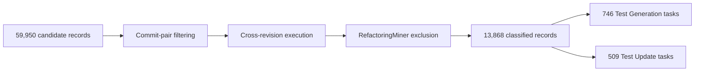
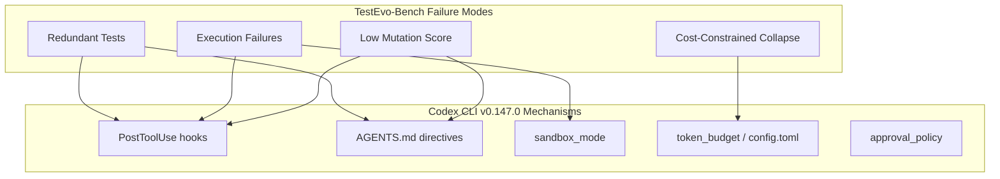

# TestEvo-Bench and the Test Co-Evolution Problem: What 1,255 Real-World Tasks Reveal About Coding Agents and Test Maintenance — and How to Wire Codex CLI for It


---

Most coding agent benchmarks treat tests as an afterthought — a gate to pass, not an artefact to maintain. TestEvo-Bench, published by Wang, Wang and Nie in July 2026, flips this assumption [^1]. It mines real commit histories from 152 open-source Java repositories to construct 1,255 tasks across two tracks: writing new tests for changed behaviour, and updating existing tests that now fail against changed production code. The results expose a gap that Codex CLI users will recognise: agents are surprisingly good at generating passing tests, but materially weaker at producing tests that actually detect faults — and they degrade sharply under cost constraints.

This article unpacks the benchmark, maps its findings onto Codex CLI v0.147.0's hook and directive system, and proposes concrete configurations to close the quality gap.

## What TestEvo-Bench Measures

Traditional benchmarks like SWE-bench evaluate whether an agent can fix a bug. TestEvo-Bench asks a different question: when production code changes, can the agent keep the test suite in step? This matters because stale or missing tests are a compounding liability — every undetected regression drifts further from the specification.

The benchmark defines two tracks [^1]:

- **Test Generation** (746 tasks): given a code diff that introduces new behaviour, write tests that pass on the new code but fail on the old. A test that passes on both is classified as *redundant* — syntactically valid but semantically useless.
- **Test Update** (509 tasks): given code changes that break existing tests, adapt those tests so they pass again without losing fault-detection capability.

Tasks are mined from adjacent commits with a maximum twelve-hour gap, filtered through RefactoringMiner to exclude pure refactorings, and validated with cross-revision execution triples to confirm feasibility [^1] [^4].



Crucially, TestEvo-Bench is a *live* benchmark: each task records its commit timestamp, and the mining pipeline periodically adds new tasks. Evaluations can be restricted to tasks postdating a model's training cutoff, reducing data-leakage risk [^1].

## Agent Performance: The Headlines

Four agent configurations were benchmarked, combining three harnesses (Claude Code, Gemini CLI, SWE-Agent) with two foundation models (Claude Opus 4.7, Gemini 3.1 Pro) [^1].

### Test Generation

| Configuration | Success | Redundant | CmplFail | HrnsFail | CovOnPass | MutOnPass |
|---|---|---|---|---|---|---|
| Claude Code / Opus 4.7 | 77.5% | 19.9% | 2.3% | 0.0% | 76.8% | 56.6% |
| Gemini CLI / 3.1 Pro | 77.5% | 19.9% | 2.2% | 0.0% | 75.1% | 55.0% |
| SWE-Agent / Opus 4.7 | 66.1% | 17.4% | 2.1% | 14.1% | 78.0% | 57.1% |
| SWE-Agent / Gemini 3.1 Pro | 68.6% | 19.2% | 2.0% | 10.1% | 74.3% | 55.6% |

### Test Update

| Configuration | Success | ExecFail | CmplFail | HrnsFail | CovOnPass | MutOnPass |
|---|---|---|---|---|---|---|
| Claude Code / Opus 4.7 | 74.4% | 23.8% | 1.8% | 0.0% | 79.4% | 44.6% |
| Gemini CLI / 3.1 Pro | 74.6% | 23.6% | 1.4% | 0.4% | 79.1% | 44.9% |
| SWE-Agent / Opus 4.7 | 65.6% | 19.1% | 4.3% | 11.0% | 79.2% | 46.0% |
| SWE-Agent / Gemini 3.1 Pro | 73.9% | 19.8% | 2.8% | 3.5% | 79.1% | 44.7% |

The headline numbers — 77.5% generation success, 74.6% update success — look strong. Dig deeper and three problems emerge.

## Three Problems Hidden in the Numbers

### 1. The Redundancy Tax

Roughly one in five generated tests (17–20%) are *redundant*: they pass on both old and new code, meaning they exercise no change-specific behaviour [^1]. These tests inflate suite size and coverage numbers without adding fault-detection value. For Codex CLI users relying on `PostToolUse` hooks that simply check exit code zero, a redundant test is invisible — it passes, so the hook reports success.

### 2. The Mutation Score Plateau

On successfully passing tasks, agent-generated tests achieve mutation kill rates of 55–57% for generation and 44–46% for update [^1]. Developer-written tests score 54–55% and 46–48% respectively. The delta is marginal — agents match humans on average. But the *variance* is the issue: mutation scoring is only computed on the 70.9% (generation) and 48.7% (update) of methods where mutants could be generated. On the remaining methods, there is no signal at all about test quality. ⚠️ The paper does not report per-task mutation score distributions, so the median may differ substantially from the mean.

### 3. Cost-Constrained Collapse

Under a \$1 per-task budget cap, success rates collapse unevenly [^1]:

| Configuration | Gen Success (default) | Gen Success (\$1 cap) | Update Success (default) | Update Success (\$1 cap) |
|---|---|---|---|---|
| Claude Code / Opus 4.7 | 70.6% | 44.2% | 86.1% | 54.8% |
| Gemini CLI / 3.1 Pro | 71.3% | 69.8% | 86.6% | 85.8% |
| SWE-Agent / Opus 4.7 | 59.5% | 18.8% | 73.2% | 18.1% |
| SWE-Agent / Gemini 3.1 Pro | 63.5% | 59.1% | 86.0% | 79.9% |

Claude Code/Opus drops 26 percentage points on generation and 31 on update. Gemini CLI barely flinches. This is directly relevant for Codex CLI users setting `token_budget` in `config.toml` — the model and harness combination determines whether budget limits degrade gracefully or catastrophically.

## Mapping TestEvo-Bench Findings to Codex CLI

Codex CLI was not evaluated in TestEvo-Bench. However, the benchmark's failure modes map directly onto configurable Codex CLI mechanisms in v0.147.0 [^2][^3].



### Countering Redundancy: Mutation-Aware PostToolUse Hooks

The core problem with redundant tests is that pass/fail is a necessary but insufficient quality signal. A `PostToolUse` hook can enforce a stronger gate by running mutation testing after test generation:

```toml
# config.toml — hook configuration
[hooks]
post_tool_use = "scripts/test-quality-gate.sh"
```

```bash
#!/usr/bin/env bash
# scripts/test-quality-gate.sh
# Exit 0 = accept, exit 2 = reject with feedback

set -euo pipefail

# Run the test suite
mvn test --quiet 2>&1 || { echo "Tests failed"; exit 2; }

# Run PIT mutation testing on changed classes
CHANGED_CLASSES=$(git diff --name-only HEAD~1 | grep '\.java$' | sed 's|src/main/java/||;s|\.java$||;s|/|.|g' | paste -sd,)

if [ -n "$CHANGED_CLASSES" ]; then
    mvn org.pitest:pitest-maven:mutationCoverage \
        -DtargetClasses="$CHANGED_CLASSES" \
        -DmutationThreshold=50 \
        --quiet 2>&1

    if [ $? -ne 0 ]; then
        echo "Mutation score below 50% threshold — tests may be redundant"
        exit 2
    fi
fi

exit 0
```

When the hook returns exit code 2, Codex CLI feeds the output back to the model as corrective context, prompting a retry with higher-quality assertions [^3]. This directly targets the 20% redundancy rate TestEvo-Bench identifies.

### AGENTS.md Directives for Co-Evolution

TestEvo-Bench's test-update track reveals that 19–24% of failures are execution errors — the agent produces tests that do not run [^1]. Structured `AGENTS.md` directives can reduce this by anchoring the agent to the project's test conventions:

```markdown
## Test Co-Evolution Rules

1. When modifying production code, identify all tests in `src/test/` that
   exercise the changed methods (use `mvn dependency:tree` or grep for
   class references).
2. Run identified tests BEFORE modifying them to confirm they now fail
   against the new code. If they still pass, they are redundant — flag
   and skip.
3. Updated tests MUST compile and pass. Run `mvn test -pl <module>`
   after every test change.
4. New tests MUST fail when run against the pre-change code. Verify by
   checking out the previous commit and running the new test.
5. Prefer assertion-rich tests over lenient ones. Each test method should
   assert at least one behaviour specific to the code change.
```

These directives encode the same cross-revision validation that TestEvo-Bench's construction pipeline uses — the four execution triples (T_old on C_old, T_new on C_new, T_old on C_new, T_new on C_old) [^1]. Instructing the agent to verify failure on old code directly targets redundancy.

### Budget-Aware Model Selection

TestEvo-Bench's cost analysis shows per-task costs ranging from \$0.33 (Gemini CLI) to \$1.77 (SWE-Agent/Opus) for test generation [^1]. Codex CLI's `config.toml` profiles allow budget-sensitive model routing:

```toml
# config.toml — named profiles for test tasks
[profiles.test-gen]
model = "o4-mini"
approval_policy = "unless-allow-listed"
token_budget = 8000

[profiles.test-gen-thorough]
model = "o3"
approval_policy = "unless-allow-listed"
token_budget = 32000
```

The TestEvo-Bench data suggests that cheaper models with integrated harnesses (Gemini CLI at \$0.33/task) outperform expensive models with generic harnesses (SWE-Agent/Opus at \$1.77/task) [^1]. For Codex CLI, this argues for investing in richer `AGENTS.md` directives and hooks rather than scaling to larger models for test maintenance tasks.

### Temporal Degradation and Live Evaluation

TestEvo-Bench reports that test-generation success rates decline on more recent tasks, suggesting models trained on older data generalise poorly to newer codebases [^1]. For Codex CLI users maintaining long-lived projects, this has a practical implication: periodically re-evaluating agent performance on recent project commits is essential. A `PostToolUse` hook that logs test-generation success rates over time can surface this degradation before it compounds.

## What Codex CLI Still Lacks

Despite its rich hook and directive system, Codex CLI has no built-in mechanism for several capabilities that TestEvo-Bench's methodology highlights:

1. **Cross-revision test validation.** There is no native way to instruct Codex to check out a prior commit, run a test, confirm it fails, then return to HEAD. This must be scripted manually in hooks or `AGENTS.md` instructions. ⚠️
2. **Mutation-aware test quality metrics.** Codex CLI's `PostToolUse` hooks can run mutation testing tools, but the results are not integrated into the agent's internal quality model — they are external feedback only. ⚠️
3. **Redundancy detection at the assertion level.** TestEvo-Bench classifies a test as redundant if it passes on both code revisions. Codex CLI cannot perform this classification natively; it requires hook-level scripting with git stash or branch checkout logic. ⚠️
4. **Test co-evolution tracking across sessions.** Codex CLI's Memories feature stores general preferences, not per-file test-coverage state. There is no mechanism to track which production methods have co-evolved tests and which have drifted. ⚠️

## Practical Takeaways

TestEvo-Bench's contribution is not just another leaderboard — it reframes test maintenance as a first-class agent capability, distinct from test generation in isolation. For Codex CLI practitioners:

- **Wire mutation testing into PostToolUse hooks.** A pass/fail gate catches compilation and runtime errors but misses the 20% of tests that are semantically redundant. PIT, Stryker, or equivalent tools in your language provide the missing signal.
- **Encode cross-revision checks in AGENTS.md.** Instruct the agent to verify that new tests fail on old code. This is the single most effective redundancy filter in TestEvo-Bench's methodology.
- **Profile your budget sensitivity.** If you are using `token_budget` constraints, test whether your model+prompt combination degrades gracefully or collapses. TestEvo-Bench shows this varies enormously by configuration.
- **Treat test co-evolution as a separate task type.** Do not assume that an agent skilled at bug fixes will maintain tests well. TestEvo-Bench demonstrates that test update (adapting existing tests) and test generation (writing new ones) are distinct capabilities with different failure profiles.

The benchmark's live-evaluation design — mining fresh tasks from ongoing commit histories — also suggests a model for internal evaluation: periodically running Codex CLI against your own recent commits to measure test co-evolution quality, rather than relying on static benchmarks that age out [^5].

## Citations

[^1]: Wang, J. A., Wang, K. & Nie, P. (2026). "TestEvo-Bench: An Executable and Live Benchmark for Test and Code Co-Evolution." *arXiv:2607.02469*. [https://arxiv.org/abs/2607.02469](https://arxiv.org/abs/2607.02469)

[^2]: OpenAI. (2026). "Codex CLI Documentation." [https://developers.openai.com/codex/cli](https://developers.openai.com/codex/cli)

[^3]: OpenAI. (2026). "Codex CLI Changelog." [https://www.gradually.ai/en/changelogs/codex-cli/](https://www.gradually.ai/en/changelogs/codex-cli/)

[^4]: Wang, J. A., Wang, K. & Nie, P. (2026). "TestEvo-Bench: An Executable and Live Benchmark for Test and Code Co-Evolution." *arXiv:2607.02469v1*. [https://arxiv.org/html/2607.02469v1](https://arxiv.org/html/2607.02469v1)

[^5]: Vaughan, D. (2026). "Test-Driven Development with Codex CLI: The Red-Green-Refactor Loop, AGENTS.md Test Gates, and Hook-Based Verification." *Codex Knowledge Base*. [https://codex.danielvaughan.com/2026/04/10/codex-cli-test-driven-development-workflow/](https://codex.danielvaughan.com/2026/04/10/codex-cli-test-driven-development-workflow/)
