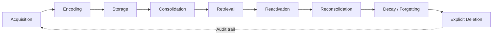

# Always-On Agents and the Governance Gap: What a 435-Paper Survey of Persistent State Reveals About Codex CLI's Memory Lifecycle


---

## The Problem: We Build State but Rarely Govern It

Coding agents that persist across sessions accumulate state: memories, preferences, session traces, task ledgers, permissions, and credentials. The industry has invested heavily in making agents *remember*. It has invested far less in making them *forget*, *audit*, or *recover*.

A June 2026 survey by Ding, Nannapaneni, Liu, and Zhang — *Always-On Agents: A Survey of Persistent Memory, State, and Governance in LLM Agents* [^1] — quantifies this imbalance across 435 papers. Their six diagnostic axes and nine-phase lifecycle model provide a rigorous framework for evaluating any agent's state management. When applied to Codex CLI v0.147.0, the framework reveals that OpenAI's tool covers acquisition through retrieval well, but leaves governance, recovery, and explicit deletion largely to the operator.

This article maps the survey's framework onto Codex CLI's memory architecture, identifies the structural gaps, and offers practical mitigations you can deploy today.

---

## The Six Diagnostic Axes

The survey evaluates every persistent-state item along six axes [^1]:

| Axis | Definition | What It Asks |
|------|-----------|--------------|
| **Authority** | Who can access, modify, or delete state | Is there RBAC? Can a plugin write to your memories? |
| **Scope** | What information is stored and its boundaries | Per-session, per-project, or global? |
| **Mutability** | Whether state can change after creation | Are memories append-only or editable? |
| **Provenance** | Where state originates and its derivation history | Can you trace a memory to its source session? |
| **Recoverability** | Ability to retrieve and restore previous states | Can you roll back a corrupted memory file? |
| **Actionability** | How state influences agent behaviour | Does the agent *use* the memory or just store it? |

Across the 435-paper corpus, 78% of work addresses scope and actionability — what to store and how to use it. Fewer than 19% address authority or recoverability [^1]. The research community, in other words, builds accumulation pipelines and neglects governance.

---

## The Nine-Phase Lifecycle

The survey identifies nine phases through which persistent state passes [^1]:



The critical insight: phases 1–5 (acquisition through retrieval) receive the bulk of research and engineering attention. Phases 6–9 (reactivation, reconsolidation, decay, and deletion) are where governance failures accumulate. An agent that remembers everything but forgets nothing is a liability, not an asset.

---

## Codex CLI's Memory Architecture Through the Lens

Codex CLI v0.147.0 implements a two-phase memory pipeline [^2] [^3]:

### Phase 1: Extraction

When a session has been idle for at least `min_rollout_idle_hours` (default: 6 hours), Codex spawns extraction jobs that distil the raw `.jsonl` rollout into two outputs:

- **`raw_memory`** — a detailed Markdown summary of discoveries, decisions, and lessons
- **`rollout_summary`** — a compressed version for quick recall

The extraction agent uses `gpt-5.4-mini` and applies a strict-schema prompt. Secrets are redacted before anything reaches disk [^3].

### Phase 2: Consolidation

A consolidation sub-agent acquires a global lock, merges accumulated `raw_memory` entries into `MEMORY.md`, and writes a diff. The consolidated view lands in `memory_summary.md`, which the next session reads first [^3].

### Recall

At session start, Codex reads `memory_summary.md` whole, token-truncates it to fit the context budget, and instructs the agent to `grep` over `MEMORY.md` when it needs more detail [^2].

---

## Axis-by-Axis Assessment

### Authority: Weak

Codex CLI has no role-based access control over memories. Any process with filesystem access to `~/.codex/memories/` can read, modify, or delete memory files. The Computer History feature (launched August 2026) writes ambient interaction memories into `~/.codex/memories/extensions/skysight/` — also unencrypted, also unprotected [^4]. Agent Plugins 1.0 inherit the host's memory context with no per-plugin scoping.

**Mitigation today:** Use filesystem permissions (`chmod 700 ~/.codex/memories/`) and consider separate OS users for different trust contexts.

### Scope: Strong

Codex CLI layers scope well. Memories are global (in `~/.codex/memories/`), session traces are per-thread (`.jsonl` in `~/.codex/sessions/`), and project context lives in `AGENTS.md` files at the repository level. The v0.147.0 conversation sections feature adds manual organisation within sessions [^5]. This maps cleanly to the survey's scope axis.

### Mutability: Moderate

Memories are mutable — the consolidation agent rewrites `MEMORY.md` and `memory_summary.md` on each pass. However, raw `.jsonl` session files are append-only by design. There is no versioning of the consolidated memory files themselves. A bad consolidation pass silently overwrites the previous state.

**Mitigation today:** Back up `~/.codex/memories/` before long consolidation runs, or set up a cron job:

```bash
# Daily memory backup
0 2 * * * tar czf ~/.codex/memory-backups/$(date +%Y%m%d).tar.gz ~/.codex/memories/
```

### Provenance: Weak

Raw memories carry no metadata linking them to their source session, timestamp, or project context. Once consolidated into `MEMORY.md`, the derivation chain is lost. You cannot answer "which session produced this memory?" without manually correlating timestamps against `.jsonl` files.

**Mitigation today:** Add structured prefixes to your `AGENTS.md` that instruct the agent to tag memories with session context:

```toml
# In AGENTS.md
# When saving memories, prefix each entry with:
# [YYYY-MM-DD] [project-name] [session-id-first-8-chars]
```

### Recoverability: Weak

There is no built-in rollback mechanism for memories. If a consolidation pass produces a hallucinated or corrupted memory, it persists until the next consolidation or manual deletion. The 30-day decay window [^3] means stale memories age out eventually, but corrupted *active* memories have no expiry.

### Actionability: Strong

Codex CLI's memory recall is well-integrated into the session lifecycle. The agent reads `memory_summary.md` at startup and can grep `MEMORY.md` on demand. Memories directly influence tool selection, coding patterns, and project context. This is the survey's strongest axis for Codex CLI.

---

## The AOEP-v0 Evaluation Protocol

The survey introduces the Always-On Evaluation Protocol (AOEP-v0) [^1], a pilot evaluation contract that scores state management systems on their mutation and recovery obligations rather than retrieval accuracy alone. AOEP-v0 asks five questions:

1. **State mutation fidelity** — Does the system correctly update state when instructed?
2. **Recovery obligation** — Can the system restore a previous state on demand?
3. **Decay compliance** — Does the system honour TTL and retention policies?
4. **Provenance traceability** — Can every state item be traced to its source?
5. **Authority enforcement** — Are access controls respected under adversarial conditions?

Codex CLI would score well on mutation fidelity (the consolidation pipeline works) and decay compliance (30-day rollout ageing, 30-day memory pruning [^3]). It would score poorly on recovery, provenance, and authority.

---

## What's Missing: The Governance Layer

The survey identifies a pattern across the literature: teams build sophisticated accumulation pipelines and then bolt governance on as an afterthought — or not at all [^1]. Codex CLI follows this pattern precisely.

### Gap 1: No Memory Versioning

`MEMORY.md` is overwritten in place. There is no git-like history, no diff log, no ability to compare the memory state before and after a consolidation pass. For an agent that edits code in version-controlled repositories, the irony is pointed.

**Practical fix:** Wrap consolidation in a git-tracked directory:

```bash
cd ~/.codex/memories
git init
git add -A && git commit -m "memory snapshot $(date -Iseconds)"
```

### Gap 2: No Per-Plugin Memory Isolation

Agent Plugins 1.0 share the host's memory context [^5]. A plugin installed from a remote catalogue can read memories accumulated by other plugins or by your direct sessions. The survey's authority axis demands scoped access; Codex CLI provides none.

### Gap 3: No Audit Trail

There is no log of which memories were created, modified, or deleted — and by which process. The survey links this gap to compliance obligations: GDPR Article 17 (right to erasure) requires demonstrable deletion, not just file removal [^6].

### Gap 4: No Structured Forgetting

The 30-day decay is a blunt instrument. There is no way to mark specific memories as "forget after this project ends" or "retain indefinitely". The survey's reconsolidation phase — where retrieved memories are re-evaluated and potentially modified — has no analogue in Codex CLI.

---

## Practical Defence Configuration

Until Codex CLI gains a native governance layer, operators can close the most critical gaps with existing primitives.

### PostToolUse Hook: Memory Audit Logger

```bash
#!/usr/bin/env bash
# .codex/hooks/post-tool-use-memory-audit.sh
# Log all file operations touching the memories directory

TOOL_NAME="$1"
FILE_PATH="$2"

if [[ "$FILE_PATH" == *"/.codex/memories/"* ]]; then
  echo "$(date -Iseconds) | $TOOL_NAME | $FILE_PATH" >> ~/.codex/memory-audit.log
fi
```

### AGENTS.md: Structured Memory Governance Directives

```markdown
## Memory Governance

- Tag every new memory with `[date] [project] [source-session]`
- Do not store credentials, API keys, or PII in memories
- When consolidating, preserve the source session reference
- Flag any memory older than 90 days for review before reuse
- Never modify memories from other projects without explicit approval
```

### Cron: Automated Memory Snapshots

```bash
# Hourly memory state snapshots with git
*/60 * * * * cd ~/.codex/memories && git add -A && git diff --cached --quiet || git commit -m "auto-snapshot $(date -Iseconds)"
```

---

## The Broader Implication

The Always-On Agents survey makes a claim that extends beyond any single tool: **the industry's accumulation-first, governance-later approach to agent state is a structural risk** [^1]. As coding agents move from session-scoped assistants to persistent collaborators — with memories, credentials, task ledgers, and committed effects — the governance gap becomes a liability gap.

Codex CLI's memory pipeline is well-engineered for its primary purpose: making the next session smarter than the last. But the survey's framework reveals that "smarter" is not enough. Agents that accumulate state must also *govern* it — with versioning, provenance, scoped authority, and auditable deletion.

The AOEP-v0 protocol offers a concrete evaluation contract. Whether OpenAI adopts it or builds something equivalent, the diagnostic axes provide a useful checklist for any team deploying persistent coding agents in production.

---

## Citations

[^1]: Ding, T., Nannapaneni, A., Liu, B., & Zhang, L. (2026). "Always-On Agents: A Survey of Persistent Memory, State, and Governance in LLM Agents." arXiv:2606.30306. [https://arxiv.org/abs/2606.30306](https://arxiv.org/abs/2606.30306)

[^2]: Codex CLI Memories documentation. "Codex CLI Memories: Native Session Persistence, Third-Party Memory MCP Servers, and Cross-Session Context Strategies." [https://codex.danielvaughan.com/2026/05/01/codex-cli-memories-persistent-context-session-memory-ecosystem/](https://codex.danielvaughan.com/2026/05/01/codex-cli-memories-persistent-context-session-memory-ecosystem/)

[^3]: Codex CLI Memory Internals. "Codex CLI Memory Internals: Pipelines, Secret Sanitisation and Intelligent Forgetting." [https://codex.danielvaughan.com/2026/04/08/codex-cli-memory-internals/](https://codex.danielvaughan.com/2026/04/08/codex-cli-memory-internals/)

[^4]: OpenAI. "Computer History feature announcement." August 13, 2026. Via OpenAI changelog and release notes.

[^5]: OpenAI. "Codex CLI v0.147.0 Release Notes." August 7, 2026. [https://github.com/openai/codex/releases/tag/rust-v0.147.0](https://github.com/openai/codex/releases/tag/rust-v0.147.0)

[^6]: European Parliament and Council. "General Data Protection Regulation (GDPR), Article 17: Right to Erasure." 2016/679. [https://gdpr-info.eu/art-17-gdpr/](https://gdpr-info.eu/art-17-gdpr/)
