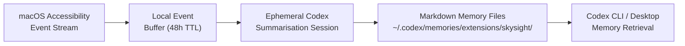
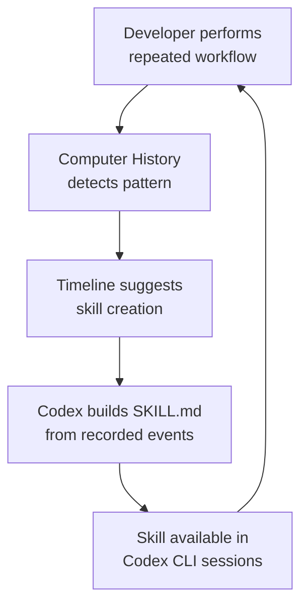

# Computer History and the Ambient Memory Pipeline: What macOS Interaction Events Mean for Your Codex CLI Memories, Skills, and Privacy Posture


---

On 13 August 2026, OpenAI shipped **Computer History** — an opt-in feature in the ChatGPT desktop app for macOS that records interaction events across permitted applications and websites, then converts those events into searchable timeline entries and Markdown memory files that both ChatGPT and Codex can reference [^1]. For Codex CLI developers, this is not a minor desktop convenience. Computer History introduces an *ambient memory pipeline* that feeds context into the same Memories subsystem your CLI sessions already rely on, and it surfaces a skill-synthesis pathway that turns repeated workflows into reusable Codex skills. It also raises questions about the security boundary between desktop observation and terminal-first development. This article maps the architecture, identifies the integration points with Codex CLI v0.147.0, and flags the privacy trade-offs you need to evaluate before enabling it.

## From Chronicle to Computer History

Computer History replaces **Chronicle**, an earlier research preview that captured periodic screenshots of active windows [^2]. The architectural shift is fundamental: Computer History records *interaction events* exposed through macOS Accessibility APIs — clicks, typing, keyboard shortcuts, and app switches — rather than images of the screen [^1]. This matters because event-based capture produces structured, parseable data (which app, which action, what text was typed) rather than pixel buffers requiring OCR. The result is a more reliable extraction pipeline and significantly smaller local storage footprint.

The three design goals OpenAI frames for Computer History are [^3]:

1. **Resuming interrupted work** — reconstructing context after a break
2. **Fuzzy recall** — finding recent material using imperfect human recollection ("that thing I was reading about dependency injection")
3. **Workflow detection** — identifying repeated patterns worth turning into skills or automations

Each of these maps directly onto Codex CLI capabilities that already exist but currently require manual maintenance.

## The Skysight Pipeline

Under the hood, Computer History runs through a subsystem internally called **Skysight**. The pipeline has four stages:



1. **Event capture**: The ChatGPT desktop app registers as an Accessibility client and logs interaction events — clicks, keystrokes, keyboard shortcuts, and application switches — for permitted applications [^1].
2. **Local buffering**: Temporary event files persist for up to 48 hours in the ChatGPT App Group container on-device [^3]. They are not encrypted by Computer History, though standard macOS file permissions apply.
3. **Ephemeral summarisation**: Codex periodically starts a short-lived session with access to the event stream. This session distils raw events into structured Markdown memory files with YAML frontmatter containing timestamps, app usage context, activity summaries, and sections flagged as "Important non-obvious context" [^2].
4. **Local storage and retrieval**: Generated memory files land in `~/.codex/memories/extensions/skysight/` as plain-text Markdown [^3]. From this point, they participate in the standard Codex Memories retrieval pipeline — both desktop Codex sessions and CLI sessions can reference them.

The critical detail for CLI developers: **Computer History memories are stored in the same `~/.codex/memories/` directory tree that Codex CLI's own Memories system reads**. If you enable Computer History on the desktop app, your next `codex` terminal session gains access to those memories automatically. There is no separate opt-in at the CLI level.

## What This Means for Codex CLI Developers

### Ambient Context Without Manual Curation

Before Computer History, the only way to populate Codex CLI Memories was through explicit actions: writing memory files manually, letting the agent record observations during sessions, or using the `/memories` command. Computer History adds a passive channel — your desktop activity feeds context that subsequent CLI sessions can retrieve without you doing anything.

This is powerful for continuity. If you spent 20 minutes reading API documentation in your browser, that context can inform a Codex CLI session you start immediately afterwards. If you reviewed a pull request in the GitHub web UI, the memory of which files you examined and which comments you left can orient a follow-up CLI session.

### Skill Synthesis from Workflow Patterns

When Computer History detects repeatable patterns in the activity stream, timeline entries can propose turning that workflow into a reusable **skill** or a scheduled **automation** [^1]. The user says "I just did X. Turn it into a skill," and Codex builds a `SKILL.md` from the recorded workflow.

For CLI-heavy developers, this creates a feedback loop:



This is the ambient equivalent of the Record & Replay feature that shipped for explicit desktop demonstrations [^4]. The difference is that Computer History works *retroactively* — it identifies patterns after the fact rather than requiring the developer to press record before performing the workflow.

### Memory Scope and the CLI Boundary

Computer History memories sit in the `extensions/skysight/` subdirectory, which means they are scoped as *extension memories* rather than *project memories*. They carry global context (what you did across your Mac) rather than repository-specific context (what happened in this codebase). This distinction matters because:

- **AGENTS.md** provides repository-scoped instructions that apply to a specific codebase
- **Project memories** (in `.codex/memories/` within a repo) carry project-specific observations
- **Skysight memories** carry cross-application context that may or may not be relevant to the current repo

In practice, this means Computer History memories are most useful at the *start* of a session — orienting Codex about what you have been doing — and less useful for deep, repo-specific coding work where AGENTS.md and project memories dominate.

## Privacy and Security Considerations

### What Is Captured

Computer History captures interaction events through macOS Accessibility APIs. It does **not** capture screenshots, screen recordings, microphone input, or system audio [^3]. Private browsing activity is excluded automatically. Users can configure allow and deny lists for specific applications and websites.

### What Is Transmitted

When a Codex session (desktop or CLI) references Computer History memories, the local Markdown memory files are included as context in the prompt sent to OpenAI's servers [^2]. This means the *summarised* content of your desktop activity — not the raw events, but the distilled memories — travels to OpenAI during inference. OpenAI states that raw event files are processed server-side to generate memories but are not retained after processing and are not used for training [^3].

### Developer-Specific Risks

For Codex CLI developers, several risks deserve attention:

1. **Credential exposure**: If you type API keys, tokens, or passwords in a monitored application, those keystrokes are captured as interaction events. The summarisation step *should* filter sensitive data, but the 48-hour raw event window creates a local attack surface.
2. **Memory files are unencrypted**: The Markdown files in `~/.codex/memories/extensions/skysight/` are plain text readable by any process running as your macOS user [^3]. If your machine is compromised, these files provide a structured timeline of your recent work.
3. **Cross-context leakage**: Memories from personal browsing or non-work activities could leak into professional Codex CLI sessions. The allow/deny list is your primary defence here.
4. **Prompt injection via memories**: If a monitored website contains adversarial text, it may end up in a memory file that is later injected into a Codex session's context. The attack surface here mirrors the broader Memories prompt-injection risk but adds a passive ingestion channel.

### Recommended Configuration for Developers

```toml
# In the ChatGPT desktop app settings (not config.toml):
# 1. Enable Computer History (opt-in)
# 2. Set application allow list to development-relevant apps only:
#    - Terminal, iTerm2, VS Code, browsers (for documentation)
# 3. Deny list: password managers, banking apps, messaging apps
# 4. Review timeline entries weekly and delete irrelevant memories
```

For sensitive work environments, consider pausing Computer History collection entirely and relying on explicit Codex CLI Memories instead. The menu-bar toggle provides instant pause/resume control.

## Integration with Codex CLI v0.147.0 Features

### Conversation Sections

v0.147.0's persistent conversation sections [^5] complement Computer History by providing manual structure within a session. Computer History provides ambient context *before* a session starts; conversation sections organise what happens *during* the session. Together, they address the two halves of long-horizon context management.

### Agent Plugins 1.0

Skills synthesised from Computer History patterns can be packaged as Agent Plugins using the v0.147.0 portable plugin structure [^5]. The workflow becomes: Computer History detects a pattern → Codex generates a SKILL.md → you wrap it in a `plugin.json` manifest → it is shareable via the federated catalog. This creates a pipeline from observed behaviour to distributable automation.

### The --approve-for-me Flag

The `--approve-for-me` flag [^5] enables automated review of approval requests. When combined with skills generated from Computer History, you get a path toward fully autonomous execution of previously manual workflows — with the caveat that the Guardian review step provides a safety check that pure automation would lack.

## Gaps and Limitations

Several limitations constrain Computer History's utility for CLI-centric developers:

| Gap | Impact | Workaround |
|-----|--------|------------|
| **macOS only** | Linux and Windows CLI users get no ambient memory pipeline | Use explicit `/memories` commands |
| **No API-key sessions** | Computer History requires ChatGPT account sign-in; API-key authenticated CLI sessions cannot trigger it [^3] | Maintain both auth methods |
| **No terminal event capture** | Terminal emulators expose limited Accessibility data; command-line workflows may not be fully captured | Rely on Codex's own session traces for terminal context |
| **No memory curation TTL** | Skysight memories accumulate without automatic expiry | Manual review and deletion via Settings or filesystem |
| **Unencrypted local storage** | Memory files readable by any user-level process | Restrict filesystem permissions; consider FileVault |
| **EEA/UK/Switzerland excluded at launch** | European developers cannot use the feature initially [^1] | Wait for regional rollout |

## Practical Guidance

**Enable Computer History if** you frequently switch between desktop research (documentation, code review in browser, design tools) and Codex CLI coding sessions, and you want that cross-application context to flow automatically into your agent's memory.

**Do not enable it if** you work in regulated environments where ambient data collection requires compliance review, you handle credentials or sensitive data in monitored applications, or your threat model includes local file exfiltration.

**For teams**: Business and Enterprise administrators must enable Computer History access before individual team members can activate it [^1]. This provides a centralised policy control point. Consider publishing an internal policy specifying which applications should appear on the allow list and requiring developers to exclude password managers and internal communication tools.

## Conclusion

Computer History represents a meaningful architectural shift: from explicit, developer-curated context to ambient, system-observed context. For Codex CLI users, it adds a passive memory channel that can improve session orientation and enable automated skill synthesis from repeated workflows. But it also widens the attack surface for credential exposure and prompt injection, and it currently only serves macOS desktop users — leaving the majority of CLI-first developers on Linux without access to the feature.

The right approach is selective adoption: enable Computer History with a tight application allow list, review generated memories regularly, and treat Skysight memories as *supplementary* context rather than a replacement for well-structured AGENTS.md files and project-scoped memories. The ambient memory pipeline is a useful addition to the Codex CLI developer's toolkit, but it is not yet a substitute for deliberate context engineering.

## Citations

[^1]: OpenAI, "Computer History", ChatGPT Learn documentation, 13 August 2026. [https://learn.chatgpt.com/docs/customization/computer-history](https://learn.chatgpt.com/docs/customization/computer-history)

[^2]: Federico Viticci, "Hands-On with Computer History: OpenAI's Take on Agent Memory", MacStories, 13 August 2026. [https://www.macstories.net/stories/hands-on-with-computer-history-openais-take-on-agent-memory/](https://www.macstories.net/stories/hands-on-with-computer-history-openais-take-on-agent-memory/)

[^3]: Chance Miller, "ChatGPT for Mac adds opt-in Computer History feature, replacing Chronicle", 9to5Mac, 13 August 2026. [https://9to5mac.com/2026/08/13/chatgpt-for-mac-adds-opt-in-computer-history-feature-replacing-chronicle/](https://9to5mac.com/2026/08/13/chatgpt-for-mac-adds-opt-in-computer-history-feature-replacing-chronicle/)

[^4]: OpenAI, "Record & Replay: Workflow-to-Skill on macOS", ChatGPT & Codex changelog, August 2026. [https://developers.openai.com/codex/changelog](https://developers.openai.com/codex/changelog)

[^5]: Daniel Vaughan, "Codex CLI v0.147.0: Portable Agent Plugins, Multi-Catalog Federation, and the --approve-for-me Flag", Codex Knowledge Base, 10 August 2026. [https://codex.danielvaughan.com/2026/08/10/codex-cli-v0147-portable-agent-plugins-multi-catalog-federation-approve-for-me-conversation-sections/](https://codex.danielvaughan.com/2026/08/10/codex-cli-v0147-portable-agent-plugins-multi-catalog-federation-approve-for-me-conversation-sections/)

[^6]: Kingy.ai, "OpenAI Computer History: How It Works and Key Risks", 14 August 2026. [https://kingy.ai/news/openai-computer-history/](https://kingy.ai/news/openai-computer-history/)
