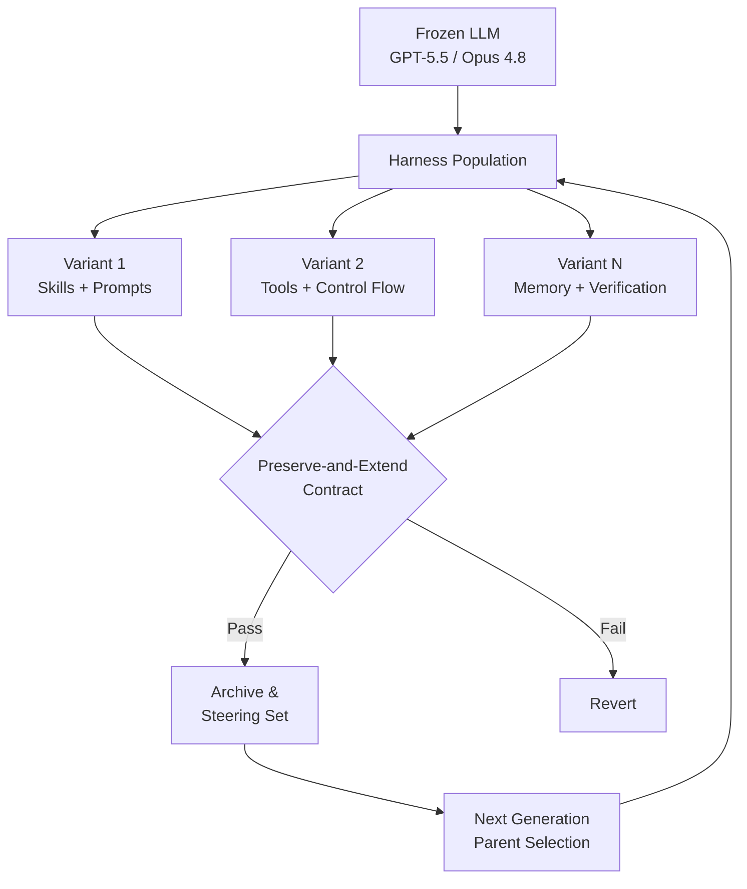
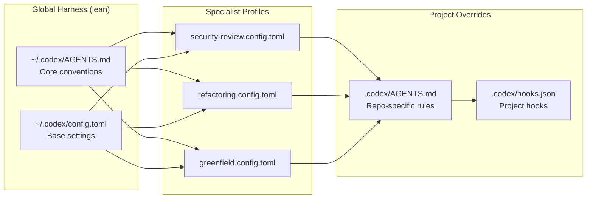

# DarwinX and the Evolved Harness Thesis: What Population-Based Natural Selection Over Agent Configurations Means for Your Codex CLI Skills, Profiles, and Hooks


Most practitioners treat their Codex CLI configuration — AGENTS.md, skills, hooks, named profiles — as static preferences: write once, tweak occasionally, forget. DarwinX, a new framework from Zhang et al. (arXiv:2608.07545, July 2026), demonstrates that treating these harness components as an *evolvable population* under selection pressure yields gains that rival or exceed switching to a stronger model [^1]. The implications for how you manage your Codex CLI configuration stack are significant.

## The Core Insight: Evolve the Harness, Not the Model

DarwinX freezes the base LLM entirely and evolves only the harness — the combination of prompts, skills, tools, memory, and control flow that wraps the model [^1]. It maintains an archive of harness variants organised as a tree, where each node stores edit deltas, per-task scores, trial evidence, and distilled lessons. Children are admitted only when they satisfy a **preserve-and-extend contract**: net improvement on at least one task (g(c) > 0) and bounded regression on others (R(c) ≤ δ) [^1].

This mirrors what Codex CLI practitioners already do informally — adjusting AGENTS.md instructions, adding skills, tuning hooks — but DarwinX formalises the process with population-based search and rigorous fitness evaluation.



## What Gets Evolved

DarwinX modifies two layers of the harness [^1]:

- **Skill layer**: prompts, memory structures, and distilled knowledge — analogous to AGENTS.md instructions, SKILL.md files, and Memories in Codex CLI
- **Code layer**: tools, control flow, and the agent loop implementation — analogous to hooks (PreToolUse/PostToolUse), MCP server selection, and sandbox configuration

Three learning signals drive evolution:

1. **Failure-derived (∇)**: failed trajectories are summarised to localise missing capabilities
2. **Teacher-derived (π*)**: reference solver trajectories are distilled into reusable approaches
3. **Self-derived (A)**: the agent's own passing versus failing rollouts reveal reliable success patterns

## The Numbers That Matter

DarwinX was evaluated across four benchmarks, each testing a different generalisation dimension [^1]:

### Terminal-Bench 2.1 (In-Domain)

On 89 terminal tasks with GPT-5.5 frozen throughout, DarwinX achieved **83.2% avg@5** — a **+7.7 point** gain over the base Monet harness (75.5%) [^1]. The largest improvements appeared in ML/scientific-computing tasks (+14.8 points) and data/database tasks (+13.8 points). For context, the Codex CLI leaderboard entry on Terminal-Bench 2.1 sits at 83.1% with GPT-5.5 [^1].

### WebArena-Infinity (Synthetic-to-Real Transfer)

Evolution used 300 synthetic intents scored by an LLM judge — the system never read the benchmark task suites. On 1,260 real tasks across 10 applications, audit-clean pass@1 jumped from **43.5% to 93.0%** (+49.5 points) [^1]. The validity audit is particularly striking: base invalid trajectories dropped from 293 (23.5%) to 17 (1.4%), with all evaluation-plane exploits and privileged-host mechanisms eliminated.

### SWE-bench Verified (Cross-Benchmark Transfer)

A Terminal-Bench-evolved harness transferred **unchanged** to 500 SWE-bench Verified issues, achieving **84.2% pass@1** on Opus 4.8 — a +3.4 point lift over the fix-skill reference (80.8%) [^1]. No in-domain evolution was conducted; the harness generalised purely from terminal task selection pressure.

### TerminalWorld (Held-Out Generalisation)

Evolution on 94 training tasks reached 100% solve rate, but the 41-task held-out split achieved 68.3% pass@1 [^1]. The 31.7-point gap reveals a proxy overfitting risk that Codex CLI users should recognise: optimising AGENTS.md for your current test suite does not guarantee generalisation to new tasks.

## What DarwinX Evolved: The Verification-Contract Pattern

The seven skills that DarwinX's evolution converged on all belong to what the authors call the **verification/artifact-contract family** [^1]:

- `verifier-contract` / `contract-candidate`
- `graded-artifact-final-check` / `artifact-verification-loop`
- `real-tool-artifact` / `tool-grounded-artifact`
- `security-contract-repair`

The pattern is clear: the evolutionary process independently discovered that **explicit acceptance contracts** and **tool-grounded output verification** before finalising results are the highest-value harness additions. Extra compute on newly solved tasks doubled turns (22 vs. 11) and quadrupled tokens (380K vs. 89K), but compute on already-solved tasks barely moved [^1].

## Mapping DarwinX to the Codex CLI Configuration Stack

The Codex CLI v0.147.0 configuration stack already provides the building blocks that DarwinX evolves over [^2][^3]:

| DarwinX Component | Codex CLI Equivalent | Configuration Location |
|---|---|---|
| Skill layer (prompts) | AGENTS.md instructions | `<repo>/.codex/AGENTS.md` or `~/.codex/AGENTS.md` |
| Skill layer (memory) | Memories system | `~/.codex/memories/` |
| Skill layer (knowledge) | SKILL.md files | `~/.agents/skills/<name>/SKILL.md` |
| Code layer (tools) | MCP servers, enabled_tools | `config.toml` `[mcp_servers]` |
| Code layer (control flow) | PreToolUse / PostToolUse hooks | `config.toml` `[[hooks.PreToolUse]]` |
| Code layer (verification) | PostToolUse validation hooks | `<repo>/.codex/hooks.json` |
| Population management | Named profiles | `~/.codex/<profile>.config.toml` |
| Fitness evaluation | OpenTelemetry export | `config.toml` `[otel]` |

### Treating Named Profiles as a Population

DarwinX's archive of harness variants maps directly to Codex CLI's named profile system [^3]. Each profile overlays the base configuration with different model settings, reasoning effort, and approval policies:

```toml
# ~/.codex/verification-heavy.config.toml
model = "gpt-5.5"
model_reasoning_effort = "xhigh"
approval_policy = "on-request"
```

```toml
# ~/.codex/speed-specialist.config.toml
model = "o4-mini"
model_reasoning_effort = "low"
approval_policy = "never"
```

Invoking `codex --profile verification-heavy` or `codex --profile speed-specialist` switches the entire harness in one argument [^3]. What DarwinX suggests is that you should maintain multiple profiles and **measure which performs best on your actual task distribution**, rather than settling on a single configuration.

### Implementing the Verification-Contract Pattern

The evolved verification skills map to PostToolUse hooks in Codex CLI. A basic artifact-verification hook:

```toml
[[hooks.PostToolUse]]
matcher = "^(Write|Edit)$"

[[hooks.PostToolUse.hooks]]
type = "command"
command = '/usr/bin/python3 ~/.codex/scripts/verify-artifact.py'
timeout = 30
statusMessage = "Verifying artifact contract"
```

The DarwinX evidence suggests this kind of post-execution verification is the single highest-value harness addition you can make [^1].

## The Proxy Overfitting Warning

DarwinX's TerminalWorld results — 100% on training tasks, 68.3% on held-out — carry a direct warning for Codex CLI practitioners [^1]. If you optimise your AGENTS.md and skills for a specific codebase or task type, you risk overfitting your harness. The archive and merge mechanisms in DarwinX address this by maintaining diversity: four specialist harnesses solved 24–27 of 41 held-out tasks individually, but the merged harness achieved 28 [^1].

The Codex CLI equivalent is maintaining **task-specific profiles** rather than cramming everything into a single AGENTS.md. Use project-level `.codex/AGENTS.md` for repository-specific instructions and keep `~/.codex/AGENTS.md` lean and general-purpose [^3].



## What Codex CLI Still Lacks

DarwinX highlights several capabilities that Codex CLI's configuration stack does not yet support:

1. **Automated fitness evaluation**: DarwinX uses benchmark-specific verifiers to score harness variants. Codex CLI's OpenTelemetry export (`[otel]` in config.toml) provides raw telemetry [^3], but there is no built-in mechanism to automatically score configuration changes against a task suite and accept or revert them.

2. **Preserve-and-extend enforcement**: when you edit AGENTS.md or add a skill, there is no automated check that the change improves some tasks without regressing others. DarwinX's contract-based admission policy prevents exactly this failure mode [^1].

3. **Archive and lineage tracking**: DarwinX maintains the full tree of harness variants with edit deltas. Codex CLI profiles are flat files with no lineage, branching, or merge semantics [^3].

4. **Cross-specialist merging**: DarwinX's merge operator combines complementary specialist harnesses under a union-coverage criterion [^1]. Named profiles in Codex CLI are mutually exclusive — you cannot compose two profiles into one.

5. **Failure-signal distillation**: DarwinX automatically distils failed trajectories into harness improvements. Codex CLI captures JSONL traces [^2] but does not automatically extract actionable configuration changes from them.

## Practical Takeaways

The DarwinX results suggest a concrete workflow for Codex CLI practitioners:

1. **Version your harness**: treat `.codex/AGENTS.md`, `config.toml`, hooks, and skills as code — commit them, review them, track changes
2. **Maintain multiple profiles**: create task-specific named profiles rather than one monolithic configuration
3. **Measure before and after**: use `[otel]` telemetry or manual benchmarking to quantify the effect of configuration changes
4. **Add verification hooks first**: the evolved harness converged on post-execution verification as the highest-value addition — implement PostToolUse hooks before investing in prompt engineering
5. **Keep global config lean**: resist the urge to grow `~/.codex/AGENTS.md` into a comprehensive manual — the TerminalWorld overfitting gap shows that specificity costs generality

The +7.7 point gain on Terminal-Bench 2.1 from harness evolution alone — without changing the model — is the clearest evidence yet that your configuration is not a preference; it is a performance lever [^1].

## Citations

[^1]: Zhang, Y., Dai, Y., Tan, J., Yang, L., Mullur, R., Hoang, T., Hu, Z., Zhu, J., Mui, P., Savarese, S., Xu, R. & Chen, Z. (2026). "DarwinX: Evolving Agent Harnesses Through Natural Selection." arXiv:2608.07545. [https://arxiv.org/abs/2608.07545](https://arxiv.org/abs/2608.07545)

[^2]: OpenAI. (2026). "Codex CLI Documentation." [https://developers.openai.com/codex/cli](https://developers.openai.com/codex/cli)

[^3]: OpenAI. (2026). "Codex CLI Advanced Configuration." [https://learn.chatgpt.com/docs/config-file/config-advanced](https://learn.chatgpt.com/docs/config-file/config-advanced)

[^4]: Chen, Z. et al. (2026). "HarnessX: A Composable Agent Harness Foundry." arXiv:2606.14249. [https://arxiv.org/abs/2606.14249](https://arxiv.org/abs/2606.14249)

[^5]: OpenAI. (2026). "Codex CLI v0.147.0 Release." [https://github.com/openai/codex/releases](https://github.com/openai/codex/releases)

[^6]: Codex CLI Named Profiles Cookbook. (2026). Codex Knowledge Base. [https://codex.danielvaughan.com/2026/04/30/codex-cli-named-profiles-cookbook-configuration-templates/](https://codex.danielvaughan.com/2026/04/30/codex-cli-named-profiles-cookbook-configuration-templates/)
