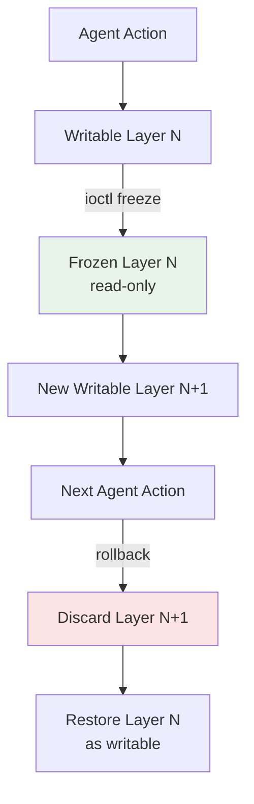
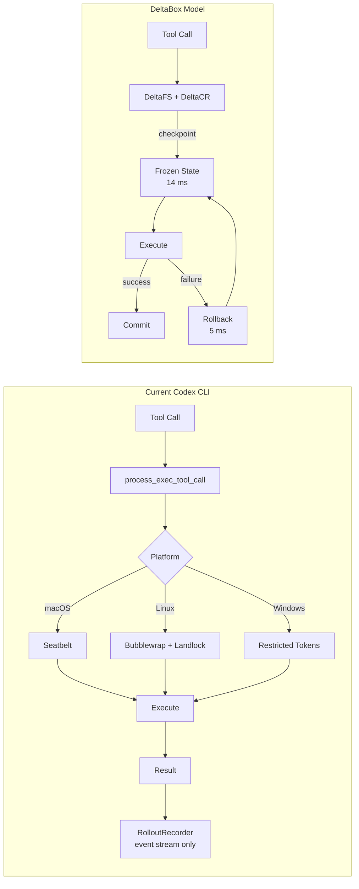

# DeltaBox and the Millisecond Checkpoint Problem: What Change-Based Sandbox State Management Means for Codex CLI's Exploration Budget


---

Every time a coding agent explores a search tree — trying one patch, rolling back, trying another — the sandbox must checkpoint its entire state and restore it later. In Docker-based approaches, that costs 48–52 ms to checkpoint and over 1,300 ms to restore.[^1] At those latencies, deep search is prohibitively expensive. DeltaBox, a research sandbox from Shanghai Jiao Tong University, reduces checkpoint to ~14 ms and restore to ~5 ms by capturing only the *delta* between consecutive states.[^1] This article examines what that architecture reveals about the state-exploration constraints in Codex CLI's current sandbox — and what it would take to close the gap.

## The State Exploration Bottleneck

Modern coding agents increasingly use tree-search strategies — Monte Carlo Tree Search (MCTS), best-of-N sampling, or reinforcement-learning-style rollouts — to explore multiple solution paths before committing. Each branch requires:

1. **Checkpoint** the sandbox (filesystem + process state)
2. **Execute** the candidate action
3. **Evaluate** the result
4. **Rollback** to the checkpoint if the path fails

The cost of steps 1 and 4 directly determines how many branches the agent can explore within a fixed time budget. On SWE-bench MCTS workloads, DeltaBox's authors measured state management overhead consuming 47–77% of total trajectory time on baseline systems.[^1] That means the majority of agent compute goes not to reasoning or code generation, but to waiting for the sandbox to save and restore itself.

## How DeltaBox Works

The core insight is straightforward: consecutive checkpoints in agent workloads are *highly similar*. A coding agent modifying three files between checkpoints should not duplicate the entire filesystem — only the three changed files.

DeltaBox implements this through two subsystems:

### DeltaFS: Change-Based Filesystem Checkpoint

DeltaFS extends Linux overlayfs with runtime reconfiguration.[^1] Rather than unmounting and remounting overlay layers (which costs tens of milliseconds), a custom kernel `ioctl` dynamically freezes the current writable layer and inserts a fresh one without unmounting. A per-inode generation counter enables "lazy switch" for open file descriptors, transparently redirecting them across checkpoint boundaries.



Write amplification scales with actual modifications at 4 KB granularity via XFS reflink, not with the working directory size. Only physically modified blocks incur duplication costs.[^1]

### DeltaCR: Incremental Process State Management

DeltaCR employs a dual-path checkpoint strategy:[^1]

- **Asynchronous incremental CRIU dumps** provide durability for crash recovery
- **Concurrent template-creating `fork()` operations** enable sub-5 ms restores by maintaining frozen process templates in a bounded LRU pool

An `async-warm` background thread pre-touches hot memory pages off the agent's critical path, absorbing copy-on-write faults before the agent needs the restored process.

### Performance Compared to Alternatives

| Approach | Checkpoint | Restore | Full State |
|----------|-----------|---------|------------|
| Docker commit + replay | 48–52 ms | ~1,350 ms | Partial |
| CRIU + file copy | 118–390 ms | 145–532 ms | Yes |
| Firecracker VM snapshot | 200–2,000 ms | 120–700 ms | Yes |
| **DeltaBox** | **14.57 ms** | **5.14 ms** | **Yes** |

On SWE-bench MCTS workloads, DeltaBox reduced state management overhead from 47–77% to 3–6% of total trajectory time.[^1]

## Codex CLI's Current Sandbox Architecture

Codex CLI v0.147.0 ships one of the strongest *isolation* sandboxes among coding agents, but it is architecturally designed for *per-execution isolation*, not for checkpoint/restore.[^2]

### Platform-Specific Isolation

- **macOS:** Seatbelt profiles generated dynamically via `create_seatbelt_command_args`, executed through `/usr/bin/sandbox-exec`. `.git`, `.agents`, and `.codex` directories are enforced read-only even in workspace-write mode.[^2]
- **Linux:** Bubblewrap provides namespace isolation (`--unshare-user`, `--unshare-pid`, `--unshare-net`) with Landlock as fallback or additional layer and seccomp restricting syscalls like `connect`, `bind`, and `ptrace`.[^2]
- **Windows:** Restricted tokens with ACL manipulation via `add_deny_read_ace`/`add_deny_write_ace`, plus elevated sandbox capture over framed IPC pipes.[^2]

### No Checkpoint/Restore Primitives

Commands pass through `process_exec_tool_call` with `PermissionProfile` and `ExecParams` routed to platform-specific helpers. Each execution is isolated independently — there is no mechanism to snapshot the sandbox state between commands and restore it later.[^2] Sessions persist as rollout files containing event streams via `RolloutRecorder`, enabling *replay* but not inter-command sandbox state preservation.[^2]



## Where the Gaps Are

### 1. No Speculative Execution

Codex CLI's agent loop is strictly sequential: propose action → approve → execute → observe. There is no mechanism to speculatively execute multiple candidate actions in parallel and select the best result. The `--approve-for-me` flag (v0.147.0) automates *approval* but does not enable *branching*.[^3]

### 2. Git as the Only Rollback Mechanism

When a Codex CLI action fails, the primary recovery path is `git checkout` or `git stash` — filesystem-level rollback via version control rather than sandbox-level checkpoint/restore. This works for file changes but cannot undo process-level side effects (installed packages, modified environment variables, running services).[^4]

### 3. No Search-Tree Integration

DeltaBox's fork primitive scales sub-linearly from 0.57 ms (N=1) to 5.47 ms (N=64 children), enabling MCTS-style fan-outs.[^1] Codex CLI has no equivalent — its subagent definitions in TOML can delegate work but cannot branch the sandbox state for parallel exploration.

### 4. Rollout Files Are Replay-Only

Codex CLI's JSONL session traces record what happened but cannot be used to *restore* a sandbox to a prior state. DeltaBox's layered architecture makes restoration a first-class operation rather than an observability afterthought.

## What DeltaBox Would Enable in Practice

Consider a concrete scenario: fixing a flaky test suite. The agent suspects three possible root causes. Today, Codex CLI must:

1. Try fix A → run tests → observe failure → `git checkout .`
2. Try fix B → run tests → observe failure → `git checkout .`
3. Try fix C → run tests → observe success → commit

Each iteration includes the full test run plus git operations. With DeltaBox-style checkpointing:

1. Checkpoint (14 ms) → try fix A → run tests → rollback (5 ms)
2. Try fix B → run tests → rollback (5 ms)
3. Try fix C → run tests → success → commit delta

The 19 ms round-trip per branch (versus hundreds of milliseconds for git operations plus any side-effect cleanup) enables exploring tens of candidates where Codex CLI currently explores single digits.

## Practical Mitigations Today

While Codex CLI lacks native checkpoint/restore, several strategies approximate the benefit:

### Git Worktree Isolation

```bash
# Create isolated exploration branches
git worktree add ../fix-attempt-a -b fix/attempt-a
git worktree add ../fix-attempt-b -b fix/attempt-b
```

Combined with Codex CLI's subagent definitions, each worktree can host an independent agent exploring a different fix path. This provides filesystem-level isolation but not process-level checkpointing.[^4]

### AGENTS.md Exploration Directives

```markdown
## Exploration Strategy
When facing multiple possible fixes:
1. List all candidate approaches before implementing any
2. Evaluate each candidate's likelihood of success
3. Implement the most promising first
4. If it fails, explicitly revert ALL changes before trying the next
```

This is a prompt-level mitigation — it guides the agent toward disciplined exploration but cannot enforce sandbox-level guarantees.[^5]

### PostToolUse Hooks as State Guards

```toml
# In config.toml — validate state cleanliness after each tool call
[hooks.PostToolUse]
command = "git diff --stat && git status --porcelain"
```

A PostToolUse hook can verify that the workspace is clean between exploration attempts, catching cases where the agent leaves behind partial changes.[^5]

### Docker-Based External Sandboxing

For workloads that genuinely require checkpoint/restore, Docker's `commit` and container restart provide a coarser-grained alternative:

```bash
# Checkpoint
docker commit codex-sandbox codex-checkpoint-1

# Restore
docker run --name codex-sandbox-restored codex-checkpoint-1
```

This trades DeltaBox's 14 ms checkpoint for Docker's 48–52 ms — still far better than no checkpointing at all, though restore latency of ~1,350 ms makes deep search impractical.[^1]

## Integration Paths

DeltaBox offers two integration modes that could inform future Codex CLI architecture:[^1]

1. **Transparent adapter:** Wraps existing framework checkpointers to trigger OS-level checkpoint/restore automatically. For Codex CLI, this could intercept the `process_exec_tool_call` boundary.
2. **Explicit tool nodes:** Exposes `checkpoint` and `rollback` as callable tools. An agent could invoke `/checkpoint` before a risky action and `/rollback` on failure.

The second approach aligns naturally with Codex CLI's tool-call architecture and approval pipeline. A `checkpoint` tool could be gated by `PreToolUse` hooks, and `rollback` could be triggered automatically by `PostToolUse` failure detection.

## Limitations and Open Questions

DeltaBox requires Linux kernel modifications (custom `ioctl` for overlayfs reconfiguration), making it incompatible with macOS Seatbelt and Windows restricted-token sandboxes without significant porting work.[^1] Codex CLI's cross-platform sandbox strategy would need platform-specific checkpoint backends — potentially APFS snapshots on macOS and Volume Shadow Copy on Windows.

The 14 ms checkpoint latency assumes XFS with reflink support. On ext4 or other filesystems, copy-on-write semantics are unavailable, and checkpoint costs would increase substantially.[^1]

⚠️ DeltaBox has been evaluated on SWE-bench MCTS workloads and RL micro-benchmarks but has not been tested with Codex CLI specifically. The performance figures assume a research prototype environment, not production deployment.

## Conclusion

DeltaBox demonstrates that millisecond-level sandbox checkpointing is achievable and that the state-exploration bottleneck in coding agents is an infrastructure problem, not an inherent limitation. Codex CLI's current sandbox excels at isolation — preventing agents from causing harm — but does not yet address *exploration* — enabling agents to efficiently search solution spaces. As coding agents increasingly adopt tree-search and multi-path strategies, the gap between Codex CLI's per-execution isolation model and DeltaBox's checkpoint/restore architecture will become a meaningful constraint on agent capability.

For now, git worktrees, disciplined AGENTS.md directives, and Docker-based checkpointing offer partial mitigations. The long-term path likely involves either integrating a DeltaBox-style layer beneath Codex CLI's existing sandbox or exposing checkpoint/restore as first-class tool-call primitives in the agent loop.

---

## Citations

[^1]: Dong, Y., He, J., Liu, S., Hou, Y., Du, D., Xu, Z., Yu, S., Yang, B., Xia, Y. & Chen, H. (2026). "DeltaBox: Scaling Stateful AI Agents with Millisecond-Level Sandbox Checkpoint/Rollback." arXiv:2605.22781. [https://arxiv.org/abs/2605.22781](https://arxiv.org/abs/2605.22781)

[^2]: OpenAI. (2026). Codex CLI Sandboxing Implementation — Seatbelt, Bubblewrap/Landlock, Restricted Tokens. DeepWiki. [https://deepwiki.com/openai/codex/5.6-sandboxing-implementation](https://deepwiki.com/openai/codex/5.6-sandboxing-implementation)

[^3]: OpenAI. (2026). Codex CLI v0.147.0 Release Notes — Agent Plugins, --approve-for-me, Conversation Sections. GitHub. [https://github.com/openai/codex/releases/tag/rust-v0.147.0](https://github.com/openai/codex/releases/tag/rust-v0.147.0)

[^4]: OpenAI. (2026). Codex CLI Repository — Git Worktree Integration and Sandbox Architecture. GitHub. [https://github.com/openai/codex](https://github.com/openai/codex)

[^5]: OpenAI. (2026). Codex CLI Documentation — AGENTS.md, Hooks, and Configuration. [https://github.com/openai/codex/blob/main/codex-rs/docs](https://github.com/openai/codex/blob/main/codex-rs/docs)

[^6]: Wincent, G. (2026). "List of coding agent sandboxes 2026-05." GitHub Gist. [https://gist.github.com/wincent/2752d8d97727577050c043e4ff9e386e](https://gist.github.com/wincent/2752d8d97727577050c043e4ff9e386e)
