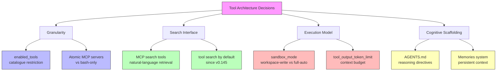

# The Devil Is in the Interface: How Tool Architecture Shapes Coding Agent Behaviour — and What It Means for Your Codex CLI Tool Stack


---

## The Question Nobody Was Asking

Most discussions about coding agent tooling fixate on *what* tools an agent can use: can it search? can it edit files? can it run tests? A new paper from Xu et al. forces a harder question: *how* you organise and expose those same capabilities to the model changes agent behaviour in ways that matter — consistency, exploration breadth, token efficiency — even when the underlying actions are identical [^1].

"The Devil Is in the Interface: Evaluating How Tool Architecture Shapes Coding Agent Behavior" (arXiv:2608.11386, August 2026) reports controlled experiments across six tool architectures, three actor models, and 11,700 trajectories on repository-level issue fixing [^1]. The findings map directly onto decisions you make every day when configuring Codex CLI's tool surface: which MCP servers to attach, whether to constrain `enabled_tools`, how to balance granularity against token cost, and whether cognitive scaffolding tools are worth the context overhead.

---

## What the Paper Tests

The researchers define **tool architecture** as the organisation and exposure of capabilities to the model, distinct from the capabilities themselves [^1]. They hold information access and available actions roughly constant while varying interface design across six architectures:

| Architecture | Description |
|---|---|
| **BashOnly** | General-purpose shell — the baseline |
| **Atomic** | Dedicated tools for search, file viewing, string replacement, file creation |
| **NLSearch** | Natural-language query interface for repository exploration |
| **Python** | Executable Python code blocks (CodeAct-style) instead of individual tool calls |
| **HypoTrack** | Cognitive scaffolding — tool for recording and updating task hypotheses |
| **Scratchpad** | Cognitive scaffolding — free-form intermediate reasoning interface |

Three actor models were evaluated: **Qwen3Coder-30B** (open-weight, 30B), **Kimi K2.5** (open-weight), and **Claude Sonnet 4.5** (proprietary) [^1]. Each ran 65 benchmark instances with 10 independent attempts, yielding the 11,700-trajectory dataset.

---

## Four Findings That Should Change How You Think About Tool Design

### 1. Structured Interfaces Improve Consistency, Not Just Capability

Atomic tools — where each operation (search, view, edit, create) is a discrete tool call — improved consistency by up to **4.7×** compared to BashOnly [^1]. The mechanism is error reduction: for Qwen3Coder-30B, mis-edit errors dropped from 1.64 to 0.19 per trajectory, and wrong-syntax errors from 0.96 to 0.01 [^1].

Raw resolve rates stayed broadly similar across architectures, confirming the experimental design successfully isolated *architectural* effects rather than *capability* differences. The consistency gain matters because in agentic workflows you rarely run a task once — you retry, branch, and iterate. An architecture that produces the same correct answer more often is strictly superior even if the peak success rate is identical.

### 2. Natural-Language Search Broadens Exploration

NLSearch increased access to relevant files by more than **11%** across all three actors [^1]. Qwen3Coder-30B achieved recall of 0.452 (versus BashOnly's lower baseline) — but at a precision cost, dropping from 0.938 to 0.891 [^1]. The model retrieved more relevant files but also more noise.

The implication: natural-language search tools trade precision for coverage. For complex, cross-cutting issues where the agent needs to discover dependencies across a large codebase, that trade-off pays. For focused, single-file fixes, the noise can hurt.

### 3. CodeAct-Style Interfaces Crush Token Costs

Python (CodeAct) architectures achieved similar task performance with **41.6% fewer steps** and **56.3% lower token usage** [^1]. Step reductions were consistent: Qwen dropped from 77 to 46 steps, Kimi from 65 to 47, Sonnet from 80 to 55 [^1].

The mechanism is operation compounding — bundling multiple actions into a single executable block. Models naturally operating at higher granularity (Sonnet at 1.50 operations per step vs Qwen at 1.15) benefit most from interfaces that match their compound reasoning style [^1].

### 4. Cognitive Scaffolding Tools Have Limited Effect

HypoTrack and Scratchpad — tools designed to let the agent externalise intermediate reasoning — showed minimal behavioural impact [^1]. The actors "mostly project their original reasoning patterns" into these interfaces without meaningfully altering their approach. The paper concludes that lightweight text-based cognitive scaffolding requires additional mechanisms (memory management, retrieval augmentation) to produce genuine behavioural changes [^1].

---

## Mapping to Codex CLI v0.147.0



### Granularity: `enabled_tools` and MCP Server Design

Codex CLI v0.147.0 exposes its built-in capabilities through a set of core tools — shell execution, file operations, and web search [^2]. The `enabled_tools` configuration in `config.toml` lets you restrict which tools the model sees [^3]. The paper's findings on Atomic vs BashOnly suggest a direct practical implication: **if you are building custom MCP servers for Codex CLI, prefer atomic, single-purpose tools over monolithic do-everything endpoints** — especially when targeting weaker or smaller models.

However, the granularity mismatch finding cuts both ways. For stronger models (GPT-5.6 Terra/Sol, Claude Sonnet 4.5), Atomic imposed greater overhead because these models naturally operate at higher compound granularity [^1]. If you are running Codex CLI with a frontier model, too many fine-grained MCP tools may fragment compound workflows into unnecessary turns.

```toml
# config.toml — match granularity to model capability
[profiles.fast]
model = "gpt-5.6-sol"
# Stronger model: fewer, broader tools
# Let the model compound operations naturally

[profiles.efficient]
model = "o4-mini"
# Smaller model: benefit from atomic, structured tools
# enabled_tools restricts to curated set
```

### Search: MCP Tool Discovery and Natural-Language Retrieval

Since v0.145, Codex CLI uses **tool search by default** when supported — instead of loading every tool definition upfront, it discovers tools on demand [^4]. This directly addresses the paper's finding that natural-language search broadens exploration: Codex's tool search mechanism is itself a natural-language interface over the tool catalogue.

The recall-versus-precision trade-off the paper identifies maps to a practical Codex CLI problem: attaching too many MCP servers creates context pollution [^4]. The model spends tokens scanning irrelevant tool lists. The paper's data suggests this is not merely a token-cost issue — it actively changes agent behaviour, broadening exploration at the expense of precision.

### Execution Model: Token Budget and Sandbox Configuration

The Python/CodeAct finding — 56.3% lower token usage through compound operations — maps to Codex CLI's `tool_output_token_limit` setting [^3]. When the model can pack multiple operations into fewer tool calls, the per-call output budget stretches further. Teams running high-volume agentic workloads should benchmark their token spend against tool granularity: a well-designed MCP server that returns structured, compound results may save more tokens than aggressive `tool_output_token_limit` capping.

```toml
# Tuning for compound efficiency
tool_output_token_limit = 16000  # room for compound results
```

### Cognitive Scaffolding: AGENTS.md and Memories

The paper's negative finding on HypoTrack and Scratchpad is sobering for anyone investing heavily in cognitive scaffolding approaches. Codex CLI's **AGENTS.md** serves a similar function — it provides reasoning directives and project context [^5]. However, AGENTS.md differs from the paper's scaffolding tools in a crucial way: it is injected as *system context* rather than offered as a discretionary tool the model can choose to invoke.

The **Memories** system in Codex CLI v0.147.0 adds persistent, retrievable context across sessions [^2] — closer to the "additional mechanisms (memory management, retrieval)" the paper recommends as necessary for cognitive scaffolding to work [^1]. The implication: **static reasoning tools are insufficient; scaffolding needs to be wired into retrieval and persistence** to change agent behaviour.

---

## Practical Recommendations

Based on the paper's findings, mapped to Codex CLI v0.147.0:

1. **Audit your MCP server granularity.** If you have built MCP servers with single, monolithic tools that accept complex JSON payloads, consider refactoring into atomic operations — particularly if your team uses smaller models like o4-mini. The consistency gains (up to 4.7×) are substantial [^1].

2. **Watch for granularity mismatch.** If you are running GPT-5.6 Terra or Sol, too many fine-grained tools may actually hurt efficiency. Profile your token spend and step counts across tool configurations.

3. **Use `enabled_tools` deliberately.** The paper demonstrates that *removing* tools from the visible set can be as impactful as adding them. Curate your tool catalogue per-profile rather than exposing everything.

4. **Leverage tool search.** Codex CLI's default tool-search behaviour since v0.145 is a natural-language discovery mechanism [^4]. Ensure your MCP servers provide descriptive tool names and descriptions — the model's ability to find the right tool depends on them.

5. **Do not rely on passive cognitive scaffolding.** If your AGENTS.md contains extensive "think step by step" directives, the paper suggests these have limited behavioural impact unless coupled with retrieval and persistence. Invest in Memories and structured hooks instead.

6. **Benchmark architecturally.** Run the same task with different tool configurations and measure resolve rate, consistency (pass@k), step count, and token usage. The paper shows these metrics can vary dramatically even when capabilities are identical.

---

## The Broader Implication

The paper's core insight — that *how* you expose capabilities matters as much as *what* capabilities you expose — challenges the prevailing "more tools = better agent" assumption in the MCP ecosystem. For Codex CLI users, the takeaway is that tool architecture is a first-class engineering decision, not a configuration afterthought. The `enabled_tools` key in `config.toml` is not just a restriction mechanism — it is a design lever that shapes agent behaviour, consistency, and cost.

As the Agent Plugins 1.0 ecosystem grows [^6] and teams federate tool catalogues across local, personal, workspace, and remote scopes, the architectural choices embedded in each plugin will compound. The devil, as Xu et al. demonstrate, is indeed in the interface.

---

## Citations

[^1]: Xu, X., Saghir, H., Wu, Q., Côté, M.-A., Wang, T., Lakkaraju, K., Pei, K. & Zhang, X. (2026). "The Devil Is in the Interface: Evaluating How Tool Architecture Shapes Coding Agent Behavior." arXiv:2608.11386. [https://arxiv.org/abs/2608.11386](https://arxiv.org/abs/2608.11386)

[^2]: OpenAI. (2026). "Codex CLI v0.147.0 Release Notes." GitHub. [https://github.com/openai/codex/releases/tag/rust-v0.147.0](https://github.com/openai/codex/releases/tag/rust-v0.147.0)

[^3]: OpenAI. (2026). "Codex CLI Configuration Reference — config.toml." OpenAI Developer Documentation. [https://developers.openai.com/codex/cli](https://developers.openai.com/codex/cli)

[^4]: OpenAI. (2026). "Codex CLI MCP Integration — Tool Search and Discovery." OpenAI Developer Documentation. [https://developers.openai.com/codex/mcp](https://developers.openai.com/codex/mcp)

[^5]: OpenAI. (2026). "AGENTS.md — Agent Instruction File Specification." OpenAI Developer Documentation. [https://developers.openai.com/codex/agents-md](https://developers.openai.com/codex/agents-md)

[^6]: OpenAI. (2026). "Agent Plugins 1.0 Specification." OpenAI Developer Documentation. [https://developers.openai.com/codex/agent-plugins](https://developers.openai.com/codex/agent-plugins)
