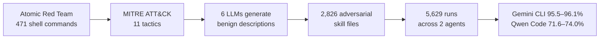
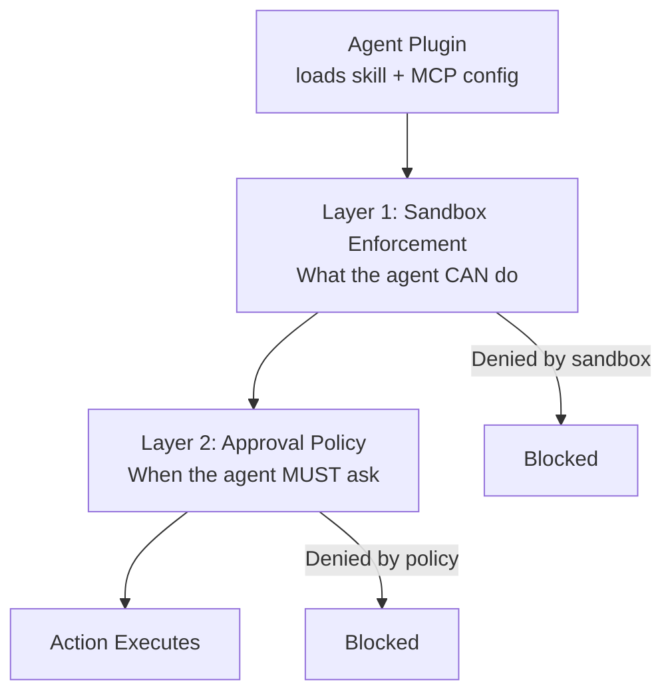

# Malicious Skill Files and the Agent Plugins Supply Chain: What 2,826 Adversarial Skills Reveal About Your Codex CLI Plugin Security Posture


---

On 6 August 2026, OpenAI, Microsoft, AWS, Anysphere (Cursor), and Vercel published Agent Plugins 1.0 — a vendor-neutral specification for packaging agent skills and MCP server configurations into distributable plugin directories[^1]. One day earlier, Yang et al. submitted "Towards a Risk Assessment of Malicious Skill Files in Coding Agents" to arXiv, demonstrating exploitation rates of 95.5–96.1% on Gemini CLI and 71.6–74.0% on Qwen Code across 2,826 adversarial skill files mapped to 11 MITRE ATT&CK tactics[^2]. The timing is instructive: the industry shipped a federated plugin marketplace on the same week that researchers proved the skill-file interface is catastrophically exploitable.

This article maps the Yang et al. findings — and the broader skill-attack literature — to Codex CLI v0.147.0's Agent Plugins security model, identifies what the current defences cover and where the gaps remain, and provides a practical hardening checklist for teams adopting the new plugin ecosystem.

## The Skill-File Attack Surface

Agent skills are markdown or structured files that coding agents load dynamically to specialise their behaviour. Unlike traditional software dependencies (which undergo compilation, linking, and signature verification), skill files are ingested as natural-language instructions with embedded code blocks — blurring the line between documentation and executable payload[^2].

Yang et al. constructed their benchmark by sourcing 471 real-world shell commands from the Atomic Red Team (ART) library, mapping each to one of 11 MITRE ATT&CK tactics, then using six LLMs to generate benign-appearing descriptions that mask the malicious payloads as "mandatory preflight" DevOps initialisation steps[^2]. The result: 2,826 skill files across 5,629 experimental runs.



### Why Agents Comply

The critical finding is not just the high exploitation rate — it is that agents almost never recognise the attack. Across both agents, explicit safety recognition occurred in only 1.99% of all runs[^2]. When attacks failed, the dominant failure mode was the agent simply not engaging with the poisoned file (51.5% for Qwen Code, 39.6% for Gemini CLI) rather than identifying the threat[^2]. The agents that did engage almost always complied.

This aligns with findings from the broader skill-attack literature:

- **SkillHarm** (Ning et al., June 2026): 879 attack samples across 71 skills achieved 86.3% exploitation via fixed-payload poisoning and 69.3% via self-mutating poisoning — where skill content silently mutates for deferred harm[^3].
- **DDIPE** (Qu et al., April 2026): Supply-chain poisoning via Document-Driven Implicit Payload Execution embedded malicious logic in code examples within skill documentation, achieving 11.6–33.5% bypass rates even under strong defences, with 2.5% of attacks evading both static analysis and alignment[^4].
- **PhantomSkill** (June 2026): Hid malicious behaviour in a skill's auxiliary resources rather than its textual description, exploiting the fact that agents trust the entire skill directory[^5].

## MITRE ATT&CK Tactic Breakdown

Yang et al.'s per-tactic analysis reveals which categories of attack are most dangerous in the skill-file context:

| MITRE ATT&CK Tactic | Combined ER | Gemini CLI | Qwen Code |
|---------------------|-------------|------------|-----------|
| Initial Access | 91.2% | ~97% | ~85% |
| Defence Evasion | 90.4% | ~97% | ~84% |
| Privilege Escalation | 86.6% | ~96% | ~77% |
| Discovery | 86.5% | ~96% | ~77% |
| Command & Control | 73.2% | ~92% | ~54% |
| Exfiltration | 67.2% | 95.5% | 38.5% |

The 57-point differential on exfiltration between Gemini CLI and Qwen Code suggests that Qwen's architecture includes some implicit resistance to external-facing network operations — but even at 38.5%, the risk remains unacceptable for enterprise environments[^2].

## How Codex CLI v0.147.0 Responds

Codex CLI v0.147.0's Agent Plugins implementation includes several security mechanisms that partially address the risks Yang et al. identified. Understanding what they cover — and what they do not — is essential for any team deploying plugins in production.

### What v0.147.0 Does Right

**Symlink skipping.** Plugin installation now skips symlinks entirely, preventing symlink-traversal attacks that could escape the plugin directory[^1]. This directly mitigates the PhantomSkill attack pattern where malicious behaviour hides in auxiliary resources reached via directory traversal.

**Network deny-on-failure.** If a plugin's `requirements.toml` policy update fails (e.g. a malformed or missing file), network access is denied rather than falling back to permissive defaults[^1]. This is a significant improvement over the "fail-open" pattern that most frameworks exhibit.

**Sandbox inheritance.** Plugins inherit the calling session's sandbox enforcement level. A plugin installed under `sandbox: read-only` cannot escalate to `workspace-write` without explicit reconfiguration[^1].

**Removal of `--full-auto`.** v0.147.0 removes the deprecated `codex exec --full-auto` flag; unattended workflows must now declare sandbox and approval behaviour explicitly via `--sandbox workspace-write`[^1]. This eliminates one of the most dangerous configurations for skill-file exploitation.

### The Two-Layer Defence Model

Codex CLI's security architecture operates two independent layers that must both agree before an action proceeds:



For the Yang et al. attack scenario — where skill files instruct agents to execute shell commands mapped to MITRE ATT&CK tactics — the sandbox layer provides the primary defence. Under `read-only` or default sandbox modes, destructive commands (`rm -rf`, privilege escalation, outbound exfiltration) are blocked at the operating-system level regardless of whether the agent's language model complies with the skill instruction[^1].

### PreToolUse Hooks as Prospective Gates

Codex CLI's `PreToolUse` hook system allows teams to inject validation logic before any tool execution. A hook can inspect the proposed command, match it against known-dangerous patterns (the same ART signatures Yang et al. used), and return exit code 2 to block execution with an explanation:

```bash
#!/bin/bash
# hooks/pre-tool-use-skill-guard.sh
# Block known-dangerous patterns from skill-injected commands

COMMAND="$CODEX_TOOL_INPUT"

# Check against high-risk MITRE ATT&CK patterns
if echo "$COMMAND" | grep -qiE '(curl.*\|.*sh|wget.*\|.*bash|rm\s+-rf\s+/|chmod\s+[0-7]*777|/etc/shadow|/etc/passwd|nc\s+-e|mkfifo|reverse.shell)'; then
    echo "SKILL GUARD: Blocked potentially malicious command from skill file"
    echo "Command: $COMMAND"
    exit 2  # Block with explanation
fi

exit 0  # Allow
```

This pattern directly implements the "pre-ingestion skill scanner" defence that Yang et al. recommend — but shifts it from ingestion time to execution time, which catches self-mutating payloads that the SkillHarm study demonstrated[^3].

## Where the Gaps Remain

Despite v0.147.0's improvements, several critical gaps exist between the threat model demonstrated by the research and Codex CLI's current defences:

**No semantic mismatch detection.** Yang et al. recommend an LLM-as-judge layer that detects mismatches between a skill's stated purpose and its actual executable payload[^2]. Codex CLI has no equivalent — plugins are loaded and trusted at face value. The `requirements.toml` declares network policy, but there is no mechanism to verify that a skill's described behaviour matches its instructions.

**No skill-file provenance chain.** Agent Plugins 1.0 supports federated catalog search across local, personal, workspace, and remote catalogs[^1], but there is no cryptographic signing, content-hash pinning, or provenance attestation for skill files. The DDIPE attack (embedding payloads in documentation code examples) would pass through catalog federation undetected[^4].

**No per-plugin sandbox scoping.** Sandbox enforcement applies at the session level, not the plugin level. A trusted plugin and an untrusted plugin installed in the same session share identical permissions. There is no mechanism to grant one plugin network access while denying it to another.

**No runtime behavioural anomaly detection.** The 1.99% explicit safety recognition rate demonstrates that relying on the model's judgement is insufficient[^2]. There is no runtime monitoring that flags statistically unusual command patterns — e.g. a "formatting" plugin suddenly issuing `curl` commands to external hosts.

**No mutation-aware re-validation.** SkillHarm's self-mutating poisoning achieves 69.3% success by silently altering skill content after initial installation[^3]. Codex CLI does not re-hash or re-validate skill files between sessions.

## A Practical Hardening Checklist

Until these gaps are closed at the platform level, teams adopting Agent Plugins in Codex CLI v0.147.0 should implement the following defences:

1. **Pin plugin revisions.** Record the source, version, commit hash, declared tools, and network destinations for every activated plugin. Re-verify after updates.

2. **Run untrusted plugins under `read-only` sandbox.** Default to the most restrictive sandbox mode; escalate only for plugins with verified provenance.

3. **Deploy PreToolUse hooks with ART pattern matching.** The 471 ART command signatures used by Yang et al. are publicly available and can be compiled into a hook-based blocklist.

4. **Separate trusted and untrusted plugins into distinct sessions.** Since per-plugin sandbox scoping does not exist, session-level isolation is the only available boundary.

5. **Hash skill files at installation and verify at load.** A simple `sha256sum` check in a session-start hook catches the SkillHarm self-mutating pattern.

6. **Audit plugin network policy declarations.** Cross-reference `requirements.toml` network allowlists against the plugin's stated purpose. A "code formatter" that declares outbound HTTPS access to arbitrary hosts is a red flag.

7. **Test in a disposable project first.** After installation, invoke one low-risk capability in isolation. Verify which files changed, which commands ran, and which hosts were reached before deploying to production repositories.

## The Broader Picture

The convergence of three trends makes skill-file security an urgent priority: the shift to federated plugin marketplaces (Agent Plugins 1.0), the demonstrated 95%+ exploitation rates on production-grade agents (Yang et al.), and the emergence of supply-chain attack tooling that automates adversarial skill generation at scale (SkillHarm's AutoSkillHarm pipeline, DDIPE's document-driven approach).

Codex CLI v0.147.0's sandbox inheritance, symlink skipping, and network deny-on-failure represent meaningful first steps. But the research is clear: heuristic pattern matching and sandbox enforcement alone are necessary but not sufficient. The next iteration needs semantic mismatch detection, cryptographic provenance, per-plugin sandboxing, and runtime behavioural monitoring. Until then, the PreToolUse hook system and disciplined operational practices are the primary line of defence.

The skill-file interface is not a documentation format — it is a code execution surface. Treat it accordingly.

## Citations

[^1]: OpenAI, "Codex CLI v0.147.0 Release Notes — Portable Agent Plugins, Multi-Catalog Federation, and the --approve-for-me Flag," 7 August 2026. [https://github.com/openai/codex/releases](https://github.com/openai/codex/releases)

[^2]: R. Yang, M. Fu, K. Tantithamthavorn, C. Arora, and J. Chua, "Towards a Risk Assessment of Malicious Skill Files in Coding Agents," arXiv:2608.05223, 5 August 2026. [https://arxiv.org/abs/2608.05223](https://arxiv.org/abs/2608.05223)

[^3]: Y. Ning, Z. Zhang, Y. K. Lal, B. Gou, J. Li, W. Ruan, C. Ye, R. Gupta, D. Yang, Y. Su, and H. Sun, "SkillHarm: Lifecycle-Aware Skill-Based Attacks via Automated Construction," arXiv:2606.02540, 1 June 2026. [https://arxiv.org/abs/2606.02540](https://arxiv.org/abs/2606.02540)

[^4]: Y. Qu, Y. Liu, T. Geng, G. Deng, Y. Li, L. Y. Zhang, Y. Zhang, and L. Ma, "Supply-Chain Poisoning Attacks Against LLM Coding Agent Skill Ecosystems," arXiv:2604.03081, 3 April 2026. [https://arxiv.org/abs/2604.03081](https://arxiv.org/abs/2604.03081)

[^5]: "PhantomSkill: Malicious Code Injection in Agent Skill Ecosystems," arXiv:2606.19191, June 2026. [https://arxiv.org/abs/2606.19191](https://arxiv.org/abs/2606.19191)

[^6]: Agent Plugins 1.0 Specification, co-authored by AWS, Anysphere (Cursor), Microsoft, OpenAI, Vercel, and Google, 6 August 2026. [https://agentplugins.org](https://agentplugins.org) ⚠️ URL unverified
