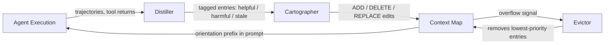
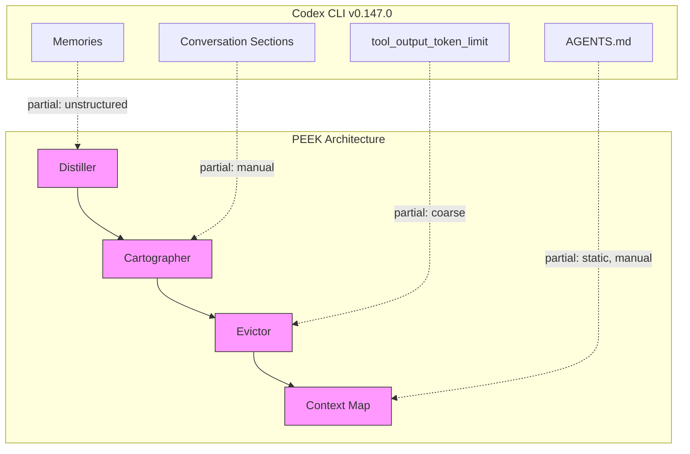

# PEEK and the Orientation Cache: What a Context Map Architecture Reveals About Codex CLI's Memory Gaps — and How to Close Them


---

Every senior developer who has used Codex CLI on a large codebase has felt the same frustration: session twelve on the same monorepo, and the agent is rediscovering the same module boundaries, the same database schema conventions, the same quirky test harness layout it mapped out in session one. Codex CLI's Memories system [^1] captures durable insights between sessions, and AGENTS.md provides static project context — but neither produces the kind of compact, structured orientation knowledge that would let the agent skip the reconnaissance phase entirely.

A May 2026 paper from MIT CSAIL, **"PEEK: Context Map as an Orientation Cache for Long-Context LLM Agents"** [^2], formalises exactly this missing layer. The results are striking: 6–34% accuracy improvements, 93–145 fewer tool-call iterations, and 1.7–5.8× lower cost than the nearest competing framework — including validation on OpenAI Codex as a production-grade coding agent.

This article unpacks the PEEK architecture, maps it onto Codex CLI v0.147.0's feature surface, and identifies the practical gaps you can close today with existing primitives.

## The Orientation Problem

LLM agents operating over recurring codebases face a specific failure mode: they possess raw context (the files) but lack *orientation* — structured knowledge about what the context contains, how it is organised, and which entities have historically proved useful [^2].

AGENTS.md addresses part of this. It is static, manually maintained, and capped at 32 KiB by default [^3]. It tells the agent about coding conventions and project structure, but it cannot encode what happened last session: which refactoring approach failed, which API boundary turned out to be load-bearing, which test fixtures required special setup.

Codex CLI's Memories system fills a different gap. It extracts and consolidates insights from completed sessions via a background pipeline [^1], but the resulting memories are unstructured key–value pairs without the spatial or relational metadata that would let the agent navigate a large codebase without re-exploring it.

PEEK argues that what is needed is a third artefact: a **context map** — a small, constant-sized, structured orientation cache that sits in the agent's prompt and accumulates knowledge about the external context across interactions [^2].

## How PEEK Works

The system comprises three modules operating as a closed-loop cache controller:



### Distiller

The Distiller examines execution trajectories — tool returns, retrieval hits, and model reasoning traces — to extract *transferable* knowledge [^2]. Crucially, it distinguishes between task-specific details (which file was edited for this particular bug) and orientation knowledge (this module uses the Repository pattern; the integration tests require a running PostgreSQL instance). It tags existing map entries as helpful, harmful, neutral, or stale based on how they performed during the latest execution.

### Cartographer

The Cartographer converts Distiller outputs into structured edits: `ADD`, `DELETE`, and `REPLACE` operations against the map [^2]. It enforces deduplication and prevents task-specific contamination of the cache. The resulting map contains stable item identifiers, enabling precise updates rather than wholesale rewriting.

### Evictor

The Evictor enforces a fixed token budget by scoring entries on recency and utility, removing the lowest-scoring entries first, with creation time as a tiebreaker [^2]. This guarantees the map remains constant-sized regardless of how many sessions have contributed to it.

## Benchmark Performance

PEEK was evaluated against ACE (Adaptive Context Engineering) and baseline RLM (Retrieval-augmented Language Model) approaches across two benchmark families:

| Benchmark | Metric | PEEK vs ACE | Cost Advantage |
|-----------|--------|-------------|----------------|
| OOLONG (reasoning/aggregation) | Accuracy | +7.8 to +15.0 pp | 1.7–5.8× cheaper [^2] |
| OOLONG | Iterations | 93–145 fewer | — |
| CL-bench (context learning) | Solving rate | +6.0–14.0 pp | 1.4× cheaper [^2] |
| CL-bench | Rubric accuracy | +7.8–12.1 pp | — |

The results generalise across both open-source models (Qwen3-Coder-Next-FP8) and proprietary ones (GPT-5.5), and across agent architectures including OpenAI Codex [^2]. The paper specifically notes that on Codex, PEEK produced "even larger improvements than RLM" [^4].

## Mapping PEEK onto Codex CLI v0.147.0

Codex CLI does not implement PEEK natively, but its existing primitives map onto the architecture with gaps that range from narrow to structural.

### What Already Exists

**AGENTS.md as static orientation.** AGENTS.md is, in PEEK's terms, a hand-curated context map with no Distiller, no Cartographer, and no Evictor [^3]. It provides initial orientation but cannot learn from agent execution. Its 32 KiB default cap mirrors PEEK's fixed token budget, but without the automated maintenance pipeline.

**Memories as unstructured Distiller output.** The Memories system extracts insights from completed sessions and injects them into future ones [^1]. This is analogous to PEEK's Distiller — it identifies useful knowledge from trajectories — but the extracted memories lack the structured schema (entities, relationships, organisational notes) that make PEEK's context map navigable. Memories are flat; PEEK maps are relational.

**Conversation sections as manual Cartography.** v0.147.0's persistent, manually ordered conversation sections [^5] let you group related turns. This is a manual analogue of the Cartographer's structured organisation, but it operates at the conversation level rather than at the knowledge level.

**`tool_output_token_limit` as a cost control.** Codex CLI's `tool_output_token_limit` configuration key [^3] caps how much tool output enters the context window, serving a similar cost-control function to PEEK's Evictor — but at a much coarser granularity.

### What Is Missing



**No automated context map generation.** There is no mechanism that takes Memories output and structures it into a navigable map with entities, relationships, and organisational metadata. Memories are extracted but not *cartographed*.

**No entry-level eviction policy.** Memories accumulate without a priority-based eviction mechanism. There is no equivalent of PEEK's per-entry scoring that would retire stale or harmful orientation knowledge automatically.

**No cross-session map continuity.** Each Codex CLI session starts with the same AGENTS.md plus whatever Memories have been consolidated. There is no persistent, incrementally updated orientation artefact that grows more useful with each session while remaining constant-sized.

**No trajectory-derived tagging.** The Memories pipeline does not tag existing knowledge as helpful, harmful, or stale based on execution outcomes. An AGENTS.md directive that led the agent down a wrong path in session five will still be present, unchanged, in session six.

## Practical Mitigations with Current Primitives

You cannot build PEEK inside Codex CLI today, but you can approximate its benefits using existing features.

### 1. Maintain a structured AGENTS.md as a manual context map

Rather than writing AGENTS.md as prose, structure it as a navigable map with explicit sections:

```markdown
## Repository Orientation

### Module Boundaries
- `src/api/` — REST endpoints, Express middleware
- `src/domain/` — Business logic, no framework dependencies
- `src/infra/` — Database adapters, external service clients

### Key Entities
- `Order` — Core aggregate, defined in `src/domain/order.ts`
- `PaymentGateway` — Interface in `src/domain/ports/`, Stripe impl in `src/infra/`

### Schema Conventions
- All database migrations in `migrations/`, numbered sequentially
- Integration tests require `docker compose up db` before running

### Historical Notes
- The `legacy/` directory is dead code; do not modify or reference
- `src/api/middleware/auth.ts` uses a custom JWT validator, not passport
```

This mirrors PEEK's context map structure: entities, organisational notes, and historically useful constants [^2].

### 2. Use PostToolUse hooks as a manual Distiller

Configure a `PostToolUse` hook that logs which files the agent accessed and whether the tool call succeeded or failed. After a session, review the log to identify orientation knowledge that should be added to or removed from AGENTS.md:

```toml
# config.toml
[hooks.post_tool_use]
command = "bash -c 'echo \"$(date -Iseconds) tool=$TOOL_NAME file=$FILE_PATH exit=$EXIT_CODE\" >> /tmp/codex-orientation-log.txt'"
```

### 3. Set a token budget for your orientation section

PEEK's Evictor enforces a fixed token budget. Apply the same discipline to AGENTS.md: set a hard limit (e.g., 4,000 tokens) for your orientation section and evict the least-useful entries when you exceed it. This prevents orientation knowledge from growing unbounded and crowding out working context.

### 4. Review and prune Memories periodically

Codex CLI's Memories lack PEEK's automated tagging, but you can simulate it manually. After every few sessions, review accumulated memories via `codex memories list`, identify entries that are stale or that led the agent astray, and delete them with `codex memories delete` [^1]. This manual eviction prevents the Memories store from accumulating harmful orientation.

## The Deeper Implication

PEEK's contribution is not just a better cache. It is a category distinction: **orientation knowledge is not the same as memory, and neither is the same as context.** Codex CLI currently conflates these three:

- **Context** is what is in the prompt right now (files, tool output, conversation history)
- **Memory** is what the Memories system extracts from past sessions (unstructured insights)
- **Orientation** is structured, navigable knowledge about the external context itself (what the codebase contains, how it is organised, what has been historically useful)

PEEK argues — and demonstrates empirically — that separating orientation into its own managed artefact, with its own extraction pipeline, its own structured format, and its own eviction policy, yields substantial improvements in both accuracy and cost [^2].

For Codex CLI, the path forward is clear: promote the best of Memories into a structured, constant-sized orientation prefix that is maintained automatically across sessions. Until that happens, the manual mitigations above are your best approximation.

## Citations

[^1]: OpenAI, "Codex CLI Memories System," Codex CLI documentation, 2026. Available: [https://openai.github.io/codex/docs/memories](https://openai.github.io/codex/docs/memories)

[^2]: Z. Gu, Q. Zhang, O. Khattab, and S. Madden, "PEEK: Context Map as an Orientation Cache for Long-Context LLM Agents," arXiv:2605.19932, May 2026. Available: [https://arxiv.org/abs/2605.19932](https://arxiv.org/abs/2605.19932)

[^3]: OpenAI, "AGENTS.md and Configuration Reference," Codex CLI documentation, 2026. Available: [https://openai.github.io/codex/docs/agents-md](https://openai.github.io/codex/docs/agents-md)

[^4]: Z. Gu, "PEEK: Give Your Agent an Orientation Cache," blog post, May 2026. Available: [https://zhuohangu.github.io/blog-post-peek/](https://zhuohangu.github.io/blog-post-peek/)

[^5]: OpenAI, "Codex CLI v0.147.0 Release Notes," GitHub, August 2026. Available: [https://github.com/openai/codex/releases/tag/rust-v0.147.0](https://github.com/openai/codex/releases/tag/rust-v0.147.0)

[^6]: "PEEK: Orientation Cache for Recurring-Context Agents," cere-bro analysis, May 2026. Available: [https://bayesiansapien.github.io/cere-bro/inference-efficiency/2026-05-20-peek-context-map-orientation-cache/](https://bayesiansapien.github.io/cere-bro/inference-efficiency/2026-05-20-peek-context-map-orientation-cache/)
