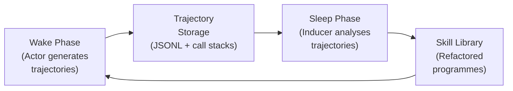
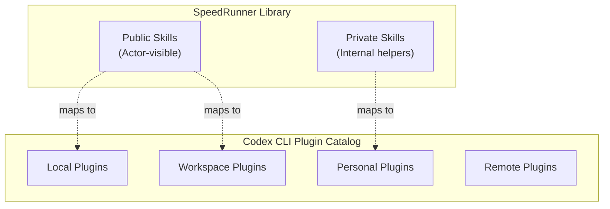

# Programmatic Skill Learning and the SpeedRunner Thesis: What Wake-Sleep Trajectory Analysis Means for Your Codex CLI Skill Library and Token Budget


---

The paper *Better, Faster, Stronger: Programmatic Skill Learning Best Reduces Agent Cost* (Huang, Wang, Wang, Jurayj, Gutiérrez, Khashabi & Andrews, August 2026) makes a deceptively simple claim: if you want an agent that gets cheaper over time rather than more expensive, its skills must be executable programmes, not prompt patches [^1]. The claim carries direct consequences for how senior developers structure their Codex CLI skill libraries, manage session trajectories, and control token spend across long-running projects.

## The Core Finding: Programmes Beat Prompts for Cost

Huang et al. compare four skill-learning strategies across three embodied environments (ScienceWorld, BabyAI, Crafter):

| Strategy | Learning Mechanism | Cost Trend |
|---|---|---|
| **ReAct** | No learning between episodes | Flat / increasing |
| **Online Prompt Optimisation (OPO)** | Updates actor prompt after each batch | Increases |
| **ASI (Agent Skill Induction)** | Code-based, from successful trajectories | Increases |
| **SpeedRunner** | Trajectory analysis → refactored skill library | **Decreases** |

SpeedRunner is the only method whose cost decreases over training across all three benchmarks [^1]. On BabyAI, output tokens fall to roughly one-eighth of the ReAct baseline. On Crafter, SpeedRunner's token spend is more than 3× lower than both OPO and ASI by the end of training [^1].

The mechanism is straightforward: a programmatic skill replaces repeated LLM reasoning with deterministic code execution. Rather than the agent re-deriving the same multi-step procedure each time, it calls a function. The reasoning cost drops to zero for that sub-task.

## The Wake-Sleep Architecture

SpeedRunner operates on a wake-sleep cycle that maps neatly onto a development workflow:



1. **Wake phase** — the actor agent executes tasks using its current skill library, generating trajectories.
2. **Trajectory storage** — trajectories and past library versions are indexed by library generation, with call stacks recorded for every invoked skill.
3. **Sleep phase** — a separate coding agent (the *Inducer*) analyses trajectories using code execution, call-graph analysis, and abstract syntax trees, then edits the skill library.
4. **Cycle repeats** — the actor uses the updated library on the next batch.

The critical insight is that the Inducer is itself a coding agent with access to a code execution environment [^1]. It can programmatically identify recurring behaviour patterns, measure skill usage and success metrics, and refactor skills — not merely append them.

## Distribution Shift: Skills That Transfer

SpeedRunner's robustness under distribution shift is particularly relevant for real-world development. When trained on ScienceWorld Task 3 (Electricity) and then shifted to Task 4 (Classification), SpeedRunner loses only 3.3 percentage points on the original task whilst reducing inference cost by 27.1% [^1]. By contrast, ASI gains 4.4 points but increases cost by 40.6%, and OPO loses 5.6 points whilst increasing cost by 6.8%.

The difference comes down to library management. SpeedRunner maintains approximately 40 functions versus ASI's approximately 160 [^1]. Deeper, denser call graphs (SpeedRunner averages 8.7 max depth on Crafter versus Voyager's 5.7) indicate hierarchical abstraction — skills calling skills — rather than flat accumulation of independent wrappers [^1].

## Mapping to Codex CLI: Where the Primitives Align

Codex CLI v0.147.0 already provides several primitives that partially implement the SpeedRunner pattern. The gap analysis reveals both the strengths and limitations of the current tooling.

### SKILL.md as Programmatic Skill

Codex CLI loads SKILL.md files from `~/.codex/skills/` (personal) and `.codex/skills/` (project) at session startup [^2]. Each skill file provides structured context that activates when the task matches the skill's description. This is conceptually similar to SpeedRunner's skill library, but with a critical difference: SKILL.md files are static natural-language instructions, not executable programmes.

```toml
# config.toml — controlling skill catalogue scope
[skills]
personal_dir = "~/.codex/skills"
project_dir = ".codex/skills"
```

The SpeedRunner finding suggests that skills delivering the greatest cost reduction would be those that encode deterministic procedures as executable code — shell scripts, Python modules, or MCP tool compositions — rather than natural-language guidance that the model must re-interpret each session.

### Agent Plugins 1.0 as Distributable Skill Units

Agent Plugins 1.0, shipping with v0.147.0, introduces portable, federated skill distribution across local, personal, workspace, and remote catalogues [^3]. This maps to SpeedRunner's skill library management, where visibility controls (public/private access modifiers) determine which skills the actor can invoke.



The federation model provides the distribution mechanism, but lacks SpeedRunner's automated promotion path: there is no built-in process for a skill discovered in one session to be automatically promoted into the personal or workspace catalogue.

### JSONL Session Traces as Trajectory Data

Codex CLI emits cumulative token-count events in its session JSONL files, stored in `~/.codex/sessions/` [^4]. Each turn records running totals for input, cached input, output, and reasoning tokens, tagged with the active model. Tools like `ccusage` and `codex-trace` extract per-turn usage by subtracting consecutive `token_count` events [^4].

This is the raw material for SpeedRunner's sleep-phase analysis. The trajectory data exists; what is missing is the Inducer — the coding agent that analyses these traces and synthesises new skills from recurring patterns.

### Memories as Partial Inducer Output

After each session, Codex CLI summarises the interaction and writes it to `~/.codex/memories/` [^5]. The next session reads those files, providing prior context without the user repeating anything. This is a partial implementation of the sleep phase: the system extracts experience from trajectories. But Memories produce natural-language summaries, not refactored executable skills.

The SpeedRunner finding implies that a memory system producing code artefacts — reusable functions, shell scripts, MCP tool compositions — would deliver greater cost reduction than one producing prose summaries.

## The Gap: What Codex CLI Cannot Do Yet

Mapping SpeedRunner's architecture against Codex CLI v0.147.0 reveals five structural gaps:

### 1. No Automated Trajectory-to-Skill Pipeline

SpeedRunner's Inducer analyses call stacks, measures McCabe complexity, and refactors skills using AST manipulation [^1]. Codex CLI has no equivalent automated pipeline from session JSONL to SKILL.md or Agent Plugin. The promotion from "observed pattern" to "reusable skill" is entirely manual.

### 2. No Skill Library Refactoring

SpeedRunner doesn't just add skills — it edits and refactors them, merging overlapping functions and deepening call hierarchies. Codex CLI's skill system is append-only. There is no mechanism for an automated pass that consolidates redundant skills or restructures the call graph.

### 3. No Cross-Session Call-Graph Analysis

SpeedRunner records call stacks for every invoked skill and indexes them by library generation [^1]. Codex CLI's JSONL traces record tool calls and token counts, but do not capture skill invocation hierarchies or enable cross-session structural analysis of skill usage patterns.

### 4. No Cost-Aware Skill Evaluation

SpeedRunner explicitly measures whether a skill reduces or increases token spend. Codex CLI's `tool_output_token_limit` provides per-call budgeting, but there is no mechanism to evaluate whether a skill is cost-positive or cost-negative across sessions.

### 5. No Wake-Sleep Cycle Automation

The entire wake-sleep pattern — batch trajectories, analyse, refactor library, re-deploy — must be orchestrated manually. There is no built-in mechanism for periodic skill library maintenance based on accumulated session data.

## Practical Mitigations

Until Codex CLI develops native support for programmatic skill learning, developers can approximate the pattern:

### Manual Inducer Pass

Periodically review session JSONL files for recurring multi-step patterns. Extract these as shell scripts or Python modules and install them as MCP tools or Agent Plugins:

```bash
# Extract high-token-spend patterns from recent sessions
ccusage --sessions ~/.codex/sessions/ --top-turns 20 --format json \
  | jq '.[] | select(.output_tokens > 5000)' > high-cost-turns.json

# Review and identify repeating patterns manually
# Then create a skill:
mkdir -p ~/.codex/skills/db-migration-checker/
cat > ~/.codex/skills/db-migration-checker/SKILL.md << 'EOF'
---
description: "Check database migrations for safety issues"
---
# Database Migration Checker
Run the migration safety script instead of reasoning about each check:
```bash
./scripts/check-migration-safety.sh $MIGRATION_FILE
```
EOF
```

### Structured AGENTS.md for Skill Routing

Use AGENTS.md to direct the agent toward existing programmatic skills rather than re-reasoning:

```markdown
## Cost-Reduction Directives

When performing database migration checks, ALWAYS use the
`db-migration-checker` skill rather than reasoning through
each safety check manually.

When generating API client code, ALWAYS use the `openapi-gen`
MCP tool rather than writing client code from scratch.
```

### PostToolUse Hooks for Cost Tracking

Wire PostToolUse hooks to track per-skill token spend across sessions, building the data foundation for cost-aware skill evaluation:

```bash
#!/bin/bash
# .codex/hooks/post-tool-use.sh
SKILL_NAME="${CODEX_SKILL_NAME:-unknown}"
TOKENS="${CODEX_OUTPUT_TOKENS:-0}"
echo "$(date -Iseconds),$SKILL_NAME,$TOKENS" >> ~/.codex/skill-cost-log.csv
```

## Cross-Model Robustness

SpeedRunner's results hold across GPT-5.4-mini, Gemini-3-Flash, and Qwen-3.5-27B, dominating in five of nine settings and remaining on the cost-performance frontier in the remainder [^1]. This cross-model robustness is relevant for Codex CLI users who route different tasks to different model tiers (Sol, Terra, Luna) via named profiles — programmatic skills transfer across model boundaries because the cost savings come from avoiding reasoning entirely, not from model-specific optimisations.

## The Deeper Lesson

The SpeedRunner paper quantifies something experienced developers already know intuitively: the most expensive code is code the agent writes from scratch every time. Automation — extracting recurring patterns into deterministic programmes — is the oldest cost-reduction strategy in software engineering. SpeedRunner merely proves it works for agent reasoning tokens too.

For Codex CLI practitioners, the actionable takeaway is to treat your skill library as production infrastructure, not disposable prompt context. Invest in executable skills (shell scripts, MCP tools, Agent Plugins with real code) over natural-language guidance. Track per-skill token spend. Periodically refactor your skill library using the same engineering discipline you apply to application code.

The wake-sleep cycle may not be automated in Codex CLI today, but nothing stops you from running it manually — and the SpeedRunner data suggests the cost savings are substantial enough to justify the effort.

## Citations

[^1]: Huang, Z., Wang, X., Wang, A., Jurayj, W., Gutiérrez, B.J., Khashabi, D. & Andrews, N. (2026). "Better, Faster, Stronger: Programmatic Skill Learning Best Reduces Agent Cost." *arXiv:2608.11338*. [https://arxiv.org/abs/2608.11338](https://arxiv.org/abs/2608.11338)

[^2]: Agensi. (2026). "Codex CLI Skills: Install & Use SKILL.md (2026 Guide)." [https://www.agensi.io/learn/codex-cli-skills-install-skill-md](https://www.agensi.io/learn/codex-cli-skills-install-skill-md)

[^3]: OpenAI. (2026). "Agent Plugins 1.0." Codex CLI v0.147.0 release. [https://codex.danielvaughan.com/2026/08/10/codex-cli-v0147-portable-agent-plugins-multi-catalog-federation-approve-for-me-conversation-sections/](https://codex.danielvaughan.com/2026/08/10/codex-cli-v0147-portable-agent-plugins-multi-catalog-federation-approve-for-me-conversation-sections/)

[^4]: PixelPaw Labs. (2026). "codex-trace: OpenAI Codex CLI session log viewer for JSONL files." [https://github.com/PixelPaw-Labs/codex-trace](https://github.com/PixelPaw-Labs/codex-trace)

[^5]: OpenAI. (2026). "Memories." Codex CLI Developer Documentation. [https://developers.openai.com/codex/memories](https://developers.openai.com/codex/memories)

[^6]: ccusage. (2026). "Coding (Agent) CLI Usage Analysis." [https://ccusage.com/guide/codex/](https://ccusage.com/guide/codex/)
