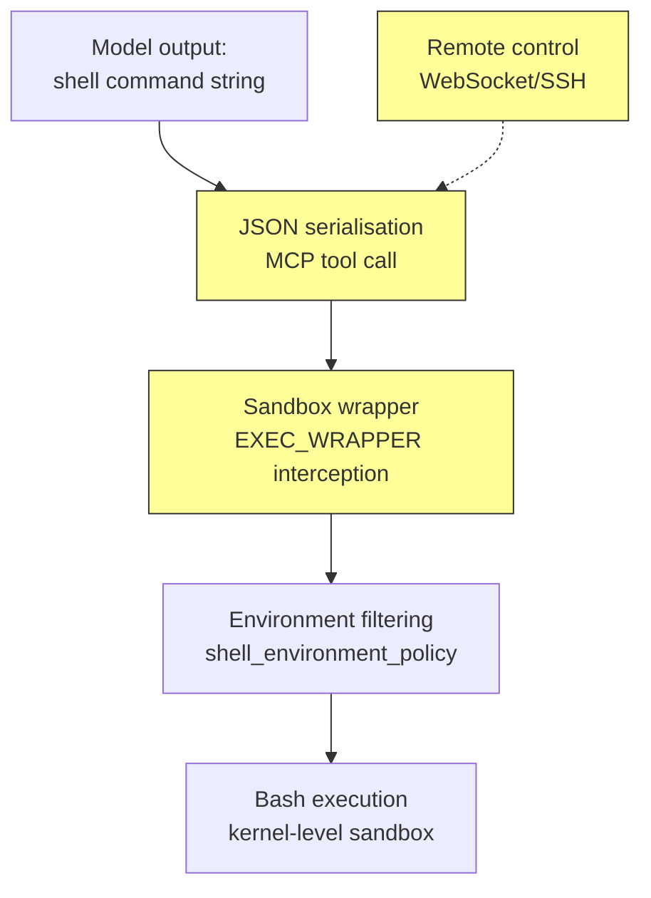

# QuoteBench and the Command-Path Problem: Why Your Codex CLI Agent's Shell Commands Break Between Generation and Execution


---

A model generates a correct Bash command. The command reaches the shell. The shell produces the wrong result. Nobody notices because the evaluation score still says "pass."

Li, Zhang, Tresp, and Yang formalised this failure mode in *QuoteBench: How Matched Scores Can Hide Command-Path Failures* (August 2026), a crossed-design benchmark that separates what a model writes from how that output reaches the shell[^1]. Their headline finding is stark: moving a correctly-generated command through a single additional interpolation boundary — the kind introduced by `bash -c "…"`, SSH wrappers, or container entry points — costs **55.4 to 73.2 percentage points** of task success, even when the command itself is syntactically perfect[^1].

For Codex CLI users, this is not an academic curiosity. Every command your agent generates passes through at least one execution boundary — the sandbox wrapper, the MCP shell tool, or a remote-control transport — before it touches the filesystem[^2].

---

## What QuoteBench Measures

Traditional coding-agent benchmarks score the final outcome: did the file end up with the right contents? QuoteBench adds a dimension by independently varying two factors:

- **Generation contract** — what the model is told about the execution boundary (raw shell, nested `bash -c "…"`, or native tool API).
- **Execution transport** — how the model's output actually reaches the shell (direct execution, double-quoted interpolation, or provider-hosted tool call).

The benchmark uses 56 one-shot Bash tasks drawn from 14 incident families, each containing one benign control and three hazardous payload variants. Hazards include apostrophes, backticks, command substitution (`$(…)`), multiline payloads, and leading dashes in filenames[^1].

```mermaid
flowchart LR
    A[Model generates<br/>shell command] --> B{Execution<br/>transport}
    B -->|Raw path| C[Direct shell<br/>execution]
    B -->|Nested path| D["bash -c \"R\"<br/>double-quote<br/>interpolation"]
    B -->|Native tool| E[Provider-hosted<br/>shell API]
    C --> F[Final-state<br/>validation]
    D --> F
    E --> F
    style D fill:#f96,stroke:#333
```

The critical insight: by **replaying the same model output** through different transports, QuoteBench attributes failures to the transport layer rather than to model capability. This fixed-reply replay design eliminates confounders from prompt variation or model stochasticity[^1].

---

## The Transport Damage Effect

When a raw-path reply (generated for direct execution) is replayed through a nested transport (`bash -c "R"`), special characters active within double quotes — `$`, `` ` ``, `\`, `"` — undergo re-parsing. The model's output was correct for direct execution but is now corrupted during transmission.

QuoteBench quantifies this as **transport damage**: a loss of 55.4–73.2 percentage points across all tested configurations[^1].

Models that receive disclosure about the nested boundary can compensate, recovering 30.4–60.7 points through adjusted escaping. But two models (Qwen3.5-27B and Gemini-3.1-Flash-Lite) show zero or negative compensation, meaning they cannot adapt their output to the boundary even when told about it[^1].

The matched gap — the difference an end-to-end evaluation would report — can approach zero while hiding massive opposing effects:

> GPT-5.6-sol's matched gap of −3.6 points hides −64.3 points of damage and +60.7 points of compensation.

This means aggregate scores are actively misleading. A model that appears to lose only 3.6 points is actually suffering catastrophic transport damage, masked by its ability to compensate when warned[^1].

---

## Ranking Instability Under Configuration Change

QuoteBench demonstrates that the execution path can reorder model rankings. The Kendall rank correlation between raw-path ordering and nested-path ordering is only **0.57** (95% bootstrap interval [0.32, 0.82])[^1].

Of 28 pairwise orderings, only 22 remain stable at 95% confidence. The estimated mean reversals: 4.6 pairs across configurations. One unambiguous reversal: GPT-5.6-sol finishes one task behind Gemini-3.5-Flash on raw path but eighteen tasks ahead on nested path[^1].

The practical consequence: choosing a model based on benchmark results obtained under one execution path may produce worse outcomes when deployed under a different path.

---

## Where Codex CLI Hits the Boundary

Codex CLI v0.147.0 interposes multiple execution boundaries between the model's generated command and the underlying shell[^2][^3]:

### The Sandbox Wrapper

Every command passes through a patched Bash that honours `EXEC_WRAPPER`. This interceptor makes a request to the MCP server for each `execve(2)` call to determine whether the proposed command should be allowed[^2]. On macOS, Apple's Seatbelt framework adds kernel-level restrictions; on Linux, Landlock + seccomp filter filesystem and syscall access[^2].

The sandbox wrapping introduces exactly the kind of interpolation boundary QuoteBench measures. When a model generates `echo "It's $HOME"`, the command is syntactically correct for direct execution but may be re-parsed if the sandbox wrapper uses double-quoted interpolation internally.

### MCP Shell Tool Transport

The `@openai/codex-shell-tool-mcp` server provides a `shell` tool that runs commands inside a sandboxed Bash instance[^3]. Tool calls are serialised as JSON — the command string passes through JSON encoding, then JSON decoding, before reaching the shell. This is a different transport boundary from direct execution, and characters like backslashes and quotes require correct handling at each layer.

### Remote Control Transport

When Codex CLI operates via `codex remote-control start` and commands are issued from a mobile client or SSH session, an additional boundary is introduced[^4]. The command travels over a WebSocket or SSH channel before reaching the local daemon, adding another serialisation/deserialisation step.

### The `shell_environment_policy` Layer

Even when the command itself survives transport, the execution environment may differ. The `[shell_environment_policy]` configuration controls which environment variables reach subprocesses[^5]. A command that works in the developer's shell may fail when `PATH`, `HOME`, or tool-specific variables are filtered out — a failure mode orthogonal to but compounding the escaping problem.



Each yellow node is a potential interpolation boundary where QuoteBench-style transport damage can occur.

---

## The 14 Incident Families and Their Codex CLI Relevance

QuoteBench's incident families map directly to common Codex CLI tasks[^1]:

| Incident Family | Mechanism | Codex CLI Scenario |
|---|---|---|
| **write-file** | Apostrophes, backticks in content | Agent writing config files with special characters |
| **JSON writing** | Nested quotes in JSON payloads | Agent generating `package.json`, API configs |
| **Git commit** | Special characters in commit messages | Agent committing with messages containing quotes |
| **argv passing** | Word splitting on spaces | Agent passing file paths with spaces to tools |
| **hostile filenames** | Leading dashes, spaces, newlines | Agent processing user-uploaded files |
| **sed replace** | Embedded regex delimiters | Agent performing search-and-replace refactoring |
| **heredoc writing** | Delimiter collision in multiline output | Agent writing multi-line scripts or configs |
| **SSH nested execution** | Second parser in remote commands | Remote-control and CI/CD pipeline execution |

The "hostile filenames" family is particularly relevant: Codex CLI agents frequently work with repositories where filenames contain spaces, hyphens, or Unicode characters, and incorrect escaping during `git add` or `mv` operations can silently corrupt the working tree.

---

## Two Working Mitigations

QuoteBench identifies two solutions that fully recover raw-path outcomes[^1]:

### 1. Correct Escaping at the Interpolation Point (Harness-Side)

Escaping the model's reply at the interpolation boundary reproduces the raw-path outcome exactly for all 448 public task pairs. This is a **zero-cost harness fix** — the model's output remains unchanged; only the transport layer adds escaping before insertion into the wrapper[^1].

For Codex CLI, this means the sandbox wrapper and MCP shell tool should handle escaping transparently. The current `EXEC_WRAPPER` design, which intercepts at the `execve(2)` level rather than at the string-interpolation level, largely avoids this problem — but custom MCP servers, PostToolUse hooks that re-execute commands, and remote-control transports may not[^2][^3].

### 2. Temporary Script Bypass

Writing the command to a temporary file and executing that file avoids the interpolation boundary entirely. This adds file I/O overhead but eliminates the entire class of transport damage[^1].

Codex CLI's sandbox already uses a variant of this approach for complex multi-line commands, but simple one-liners may still be passed as string arguments to `bash -c`.

---

## Defence Configuration for Codex CLI

Given QuoteBench's findings, practitioners should consider the following configuration and practice adjustments:

### AGENTS.md Directives

Add explicit escaping guidance to your `AGENTS.md`:

```markdown
## Shell Command Escaping Rules

- Always use single quotes for string literals containing special characters
- Use heredocs for multi-line content rather than escaped newlines
- Never embed unescaped `$`, backticks, or double quotes inside double-quoted strings
- For file paths with spaces, use `"${path}"` not bare `$path`
- When writing JSON to files, use `cat <<'EOF'` (quoted heredoc) to prevent expansion
```

### PostToolUse Hook: Escaping Validator

A PostToolUse hook can flag commands with likely escaping hazards before execution completes:

```bash
#!/usr/bin/env bash
# .codex/hooks/post-tool-use-escaping-check.sh
# Flags commands with unescaped interpolation hazards

COMMAND="$CODEX_TOOL_INPUT"

# Check for common escaping hazards in bash -c wrappers
if echo "$COMMAND" | grep -qP 'bash\s+-c\s+"[^"]*(\$\(|`|\\n)[^"]*"'; then
  echo "⚠️ Potential escaping hazard in bash -c wrapper" >&2
  exit 2  # Request review
fi

exit 0
```

### MCP Server Authors: Transport-Aware Design

If you maintain custom MCP servers that execute shell commands, QuoteBench's findings are a direct call to action. Ensure your server either:

1. Passes commands through `execve` directly (array form, no shell interpolation), or
2. Uses the temporary-script bypass pattern, or
3. Applies correct escaping at the interpolation boundary before wrapping in `bash -c`

---

## Evaluation Implications

QuoteBench's decomposition into transport damage and contract-conditioned compensation has implications for anyone evaluating Codex CLI workflows:

1. **Test under your actual execution path.** A model that scores well on raw-path benchmarks may underperform when its commands pass through your sandbox, MCP server, or remote-control transport.

2. **Report the full stack.** When comparing models for Codex CLI use, specify the sandbox mode, MCP SDK version, and transport configuration alongside task success rates.

3. **Beware matched-score masking.** A small aggregate performance difference between models may hide large, opposing transport-damage and compensation effects. The model that appears equivalent on aggregate may be catastrophically worse in your specific deployment configuration.

---

## What's Still Missing

Codex CLI v0.147.0 provides robust kernel-level sandboxing and `execve`-level interception, which avoids the worst string-interpolation hazards[^2]. However, several gaps remain:

- **No transport-damage telemetry.** Codex CLI does not report whether a command's output differed from what the model intended due to serialisation artefacts. Adding a pre/post comparison at the interpolation boundary would surface these failures.
- **No per-MCP-server escaping audit.** When multiple MCP servers provide shell-like tools, each may handle escaping differently. There is no unified validation that all transports preserve command semantics.
- **No automatic heredoc promotion.** Commands with detected escaping hazards could be automatically rewritten to use the temporary-script bypass, but this is not currently implemented.
- **No execution-path disclosure in AGENTS.md.** The model is not systematically told which transport boundaries its commands will traverse, limiting its ability to apply contract-conditioned compensation.

---

## Citations

[^1]: Li, S., Zhang, Y., Tresp, V., & Yang, Y. (2026). "QuoteBench: How Matched Scores Can Hide Command-Path Failures." *arXiv:2608.13547*. [https://arxiv.org/abs/2608.13547](https://arxiv.org/abs/2608.13547)

[^2]: OpenAI. (2026). "Codex CLI Sandbox Analysis." *Agent Safehouse*. [https://agent-safehouse.dev/docs/agent-investigations/codex](https://agent-safehouse.dev/docs/agent-investigations/codex)

[^3]: npm. (2026). "@openai/codex-shell-tool-mcp." [https://www.npmjs.com/package/@openai/codex-shell-tool-mcp](https://www.npmjs.com/package/@openai/codex-shell-tool-mcp)

[^4]: OpenAI. (2026). "Remote Connections." *ChatGPT Learn*. [https://developers.openai.com/codex/remote-connections](https://developers.openai.com/codex/remote-connections)

[^5]: OpenAI. (2026). "Advanced Configuration." *ChatGPT Learn*. [https://developers.openai.com/codex/config-advanced](https://developers.openai.com/codex/config-advanced)

[^6]: OpenAI. (2026). "Codex CLI v0.147.0 Release Notes." *GitHub*. [https://github.com/openai/codex/releases/tag/rust-v0.147.0](https://github.com/openai/codex/releases/tag/rust-v0.147.0)
