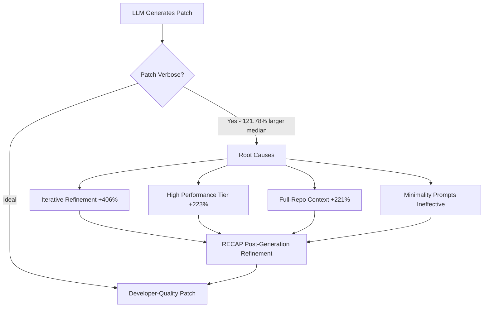

# Refine After Generation: What RECAP Reveals About Patch Verbosity in Coding Agents — and How to Defend Against It in Codex CLI


---

Every experienced developer has reviewed a pull request that fixes a one-line bug with forty lines of refactoring nobody asked for. When LLM-based coding agents generate those patches, the problem is structural, not accidental. A new study by Luo, Keung, Shi, Sun, Yang, Yang, Tian and Haoye characterises the scale of patch verbosity across 28 state-of-the-art automated program repair (APR) approaches on SWE-bench Verified and proposes RECAP — a post-generation refinement adapter that decouples minimality from the generation step itself [^1]. The findings have direct implications for anyone running Codex CLI in production, where bloated diffs slow review, obscure intent, and introduce unnecessary risk.

## The Verbosity Problem Is Universal

The study benchmarked 28 APR systems — including SWE-agent, Agentless, OpenHands, Moatless, AutoCodeRover, DeepSWE, Trae, Lingma, and Augment — against developer-written gold patches on SWE-bench Verified [^1]. The median approach produced:

- **+121.78% more total changes** than the corresponding developer patch
- **+80.91% more net changes** (additions minus deletions)
- **+43.99% higher cyclomatic complexity**

Every single one of the 28 systems exceeded the gold patch in total changes. This is not a model problem — it is a systemic property of how agentic repair pipelines construct patches.

## Four Root Causes of Bloat

Statistical analysis identified four design-factor associations driving verbosity [^1]:

### 1. Iterative Refinement Amplifies Size

Systems using iterative refinement produced +406.46% total changes versus +95.60% for non-iterative approaches (p<0.001). Each retry-and-revise cycle adds defensive code, alternative approaches, and compensatory logic that accumulates rather than converges.

### 2. Higher Performance Correlates with Larger Patches

Top-ranked systems generated +223.39% total changes versus +118.09% for bottom-ranked ones (p<0.001). The systems that resolve the most issues do so partly by over-generating — casting a wide net of changes increases the probability that the fix is somewhere in the patch.

### 3. Context Scope Drives Expansion

Full-repository context approaches produced +221.23% total changes versus +72.93% for structured context (p<0.001). When the agent can see everything, it changes everything it thinks could be relevant.

### 4. Minimality Instructions Do Not Work

This is the finding that should concern every AGENTS.md author: "Explicitly instructing minimality (+208.83% total) yields patches as large as no instruction (+191.39%)" [^1]. Prompting the model to produce minimal changes has negligible effect. The verbosity is capability-driven, not instruction-driven.



## RECAP: Decoupling Minimality from Generation

RECAP addresses verbosity by treating it as a post-generation concern rather than a generation constraint [^1]. The architecture has three components:

1. **Collector** — standardises the interface between the host APR system and the refiner, gathering the original patch, issue context, and repository state
2. **Filter** — decides whether refinement should proceed, supporting both oracle-guided and fully automated deployment modes
3. **Refiner** — a specialised small LLM (Qwen3.5-27B) that generates a concise replacement patch

### Two-Phase Training

The refiner is trained in two stages:

**Supervised Fine-Tuning (SFT)** uses curriculum learning across three difficulty levels — function-level pairs from ACPR, tangled-commit pairs from CCS, and synthetic repository-level instances — progressing from 0% to 100% hard data over six epochs. Reasoning traces are distilled from Gemini-3-Flash to teach the refiner *why* certain changes are unnecessary [^1].

**Direct Preference Optimization (DPO)** then contrasts concise gold patches (preferred) against model-sampled verbose alternatives (rejected), using the SFT checkpoint as the reference policy. This aligns the refiner's output distribution towards minimality without sacrificing correctness [^1].

### Results

Evaluated on patches from four host systems (Agentless, SWE-agent, Moatless, OpenHands), RECAP reduced average total changes from +242.14% to +4.24% relative to developer patches — nearly eliminating the verbosity gap [^1]. Net changes dropped from +348.24% to −39.75%.

Critically, RECAP preserved or improved resolution rates. Under oracle-guided refinement, SWE-agent gained +42 resolved instances. The four baseline approaches that attempted similar compression (direct prompting with Claude 4.5 Sonnet, Atomizer, AdaPatcher, PRepair) all sacrificed between 29 and 217 resolved instances to achieve smaller patches [^1].

| Approach | Instances Lost | Failure Mode |
|----------|---------------|--------------|
| Direct Prompting (Claude 4.5 Sonnet) | 29–44 | Over-aggressive reduction |
| Atomizer | up to 217 | Drops code needed for correctness |
| AdaPatcher | 50–89 | Function-level assumptions fail at repo scale |
| PRepair | 49–102 | Designed for function-level only |
| **RECAP** | **0 (gained up to +42)** | **Decoupled refinement preserves correctness** |

## Mapping to Codex CLI v0.147.0

The RECAP findings map directly onto several Codex CLI configuration surfaces.

### AGENTS.md: Beyond "Make Minimal Changes"

The paper's most uncomfortable finding for Codex CLI users is that minimality instructions in system prompts do not reduce patch size [^1]. If your `AGENTS.md` contains lines like "make the smallest possible change" or "do not refactor unrelated code," those instructions are doing less than you think.

What *does* work, per the paper's root-cause analysis, is constraining the context scope and limiting iterative refinement cycles. In Codex CLI terms:

```toml
# config.toml — constrain context to reduce patch bloat
[model]
model_reasoning_effort = "medium"    # reduces over-exploration

[tools]
tool_output_token_limit = 16000     # limits context flooding
```

In your `AGENTS.md`, rather than instructing minimality, instruct *structure*:

```markdown
## Patch Discipline
- Identify the root cause before writing any code
- Change only the file(s) containing the bug
- Do not refactor, rename, or reorganise code outside the fix scope
- If a test file needs updating, explain why in a comment
```

This addresses root cause 3 (context scope) and root cause 1 (iterative refinement) by constraining the agent's operational boundary rather than its aspirational intent [^2].

### PostToolUse Hooks: Automated Diff Auditing

RECAP's Filter component — which decides whether a patch needs refinement — maps onto Codex CLI's PostToolUse hooks [^3]. A hook that runs after every file write can measure patch verbosity in real time:

```bash
#!/bin/bash
# .codex/hooks/post-tool-use-diff-audit.sh
# Reject patches that exceed a change-to-fix ratio threshold

DIFF_STATS=$(git diff --stat HEAD 2>/dev/null)
LINES_CHANGED=$(echo "$DIFF_STATS" | tail -1 | grep -oP '\d+ insertion' | grep -oP '\d+')
FILES_CHANGED=$(echo "$DIFF_STATS" | tail -1 | grep -oP '\d+ file' | grep -oP '\d+')

if [ "${LINES_CHANGED:-0}" -gt 200 ]; then
    echo "REJECT: Patch exceeds 200 lines changed (${LINES_CHANGED} lines across ${FILES_CHANGED} files). Consider a more targeted fix."
    exit 1
fi
exit 0
```

This acts as a lightweight Filter that forces the agent to retry with a narrower scope when patches grow beyond a threshold — addressing the iterative-refinement bloat pattern by introducing a hard boundary [^3].

### Guardian Auto-Review: The Refinement Analogue

RECAP's Refiner — a separate model that rewrites the patch for conciseness — parallels Codex CLI's `--approve-for-me` guardian auto-review subagent [^4]. The guardian already evaluates tool-call requests for safety; extending its review criteria to include patch minimality would create an in-loop RECAP equivalent:

```markdown
## Guardian Review Criteria (AGENTS.md)
When reviewing patches for approval:
1. Does the patch change only files related to the stated objective?
2. Is the cyclomatic complexity delta proportional to the fix?
3. Are there any changes that could be removed without breaking the fix?
If criteria 1 or 3 fail, request a more targeted patch.
```

### The /diff Command as Manual Filter

Codex CLI's `/diff` command displays the full Git diff of all agent changes [^5]. The RECAP paper's finding that verbosity is universal — every system produces patches at least 80% larger than necessary — means that `/diff` review is not optional. Treat every agent-generated patch as a first draft requiring human judgement on scope, not just correctness.

## What Codex CLI Still Lacks

The RECAP architecture exposes several gaps in Codex CLI's current patch-quality tooling:

1. **No automated verbosity metrics** — Codex CLI does not report change-to-fix ratios, cyclomatic complexity deltas, or net-versus-total change statistics. A `codex diff --stats` flag would surface the same signals RECAP's Filter uses [^1].

2. **No post-generation refinement pipeline** — The `/refine` or `/minimise` command does not exist. Users who want RECAP-style refinement must manually re-prompt or build it into their PostToolUse hooks.

3. **No preference-aligned patch training** — RECAP's DPO stage specifically trains for conciseness. Codex CLI's underlying models (o3, o4-mini, GPT-5.6) are general-purpose; they have no patch-minimality preference signal [^1]. ⚠️ It is unclear whether OpenAI's internal training includes any minimality-oriented RLHF for code patches.

4. **No per-session verbosity tracking** — Across a multi-turn session, patch bloat compounds. Codex CLI does not track cumulative diff size or flag when total changes exceed a session-level threshold.

5. **No structured context restriction** — While `tool_output_token_limit` caps individual tool outputs, there is no mechanism to restrict the agent's file-access scope to only the files identified as relevant during localisation [^2].

## Practical Recommendations

For teams using Codex CLI for automated repair or feature implementation:

1. **Stop relying on minimality prompts.** The evidence shows they do not work [^1]. Invest instead in structural constraints: restricted file access, capped iteration counts, and explicit scope boundaries in AGENTS.md.

2. **Implement diff-auditing PostToolUse hooks.** Even a simple line-count threshold catches the worst offenders and forces the agent to retry with narrower scope.

3. **Review every patch with `/diff`.** The median coding agent produces patches 122% larger than necessary. Assume verbosity and review accordingly.

4. **Consider named profiles for repair tasks.** A Codex CLI named profile with `model_reasoning_effort = "medium"` and tight `tool_output_token_limit` values may produce more focused patches than the default configuration [^6].

5. **Watch for the RECAP pattern in tooling.** Post-generation refinement as a separate step — rather than a prompt instruction — is likely to appear in coding agent toolchains throughout 2026. The architectural insight (decouple minimality from generation) is more valuable than any specific implementation.

## Citations

[^1]: Luo, W., Keung, J., Shi, X., Sun, Y., Yang, B., Yang, Z., & Tian, H. (2026). "Refine After Generation: Toward Correct and Concise Patches in LLM-based Program Repair." arXiv:2608.13292. [https://arxiv.org/abs/2608.13292](https://arxiv.org/abs/2608.13292)

[^2]: OpenAI. (2026). "Codex CLI AGENTS.md Reference." GitHub. [https://github.com/openai/codex/blob/main/docs/AGENTS.md](https://github.com/openai/codex/blob/main/docs/AGENTS.md)

[^3]: OpenAI. (2026). "Codex CLI Hooks Documentation — PreToolUse and PostToolUse." GitHub. [https://github.com/openai/codex/blob/main/docs/hooks.md](https://github.com/openai/codex/blob/main/docs/hooks.md)

[^4]: OpenAI. (2026). "Codex CLI v0.147.0 Release Notes — --approve-for-me flag." GitHub. [https://github.com/openai/codex/releases/tag/rust-v0.147.0](https://github.com/openai/codex/releases/tag/rust-v0.147.0)

[^5]: OpenAI. (2026). "Codex CLI Changelog." GitHub. [https://github.com/openai/codex/blob/main/CHANGELOG.md](https://github.com/openai/codex/blob/main/CHANGELOG.md)

[^6]: OpenAI. (2026). "Codex CLI Configuration Reference — Named Profiles." GitHub. [https://github.com/openai/codex/blob/main/docs/configuration.md](https://github.com/openai/codex/blob/main/docs/configuration.md)
