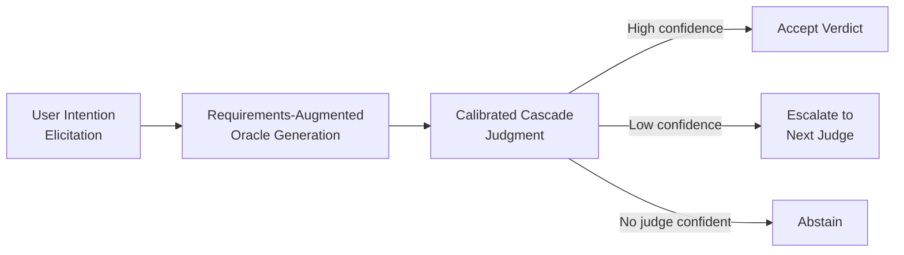
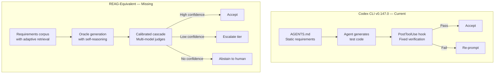

# Requirements-Augmented Generation and Trustworthy Acceptance Testing: What Calibrated Cascade Judgments Mean for Your Codex CLI Verification Workflow


---

Acceptance testing LLM-generated code is fundamentally harder than testing deterministic software. The same prompt can produce structurally different — yet functionally equivalent — patches, making classical test oracles useless. Wang, Arora, Xie, Liu, Tantithamthavorn, Aleti and Jiang tackle this head-on in *Requirements-Augmented Generation for Trustworthy Acceptance Testing of LLM-Based Software* (arXiv:2608.12970, August 2026) [^1]. Their REAG framework retrieves software requirements to generate context-aware test oracles, then routes verdicts through a confidence-calibrated cascade of LLM judges — achieving 98.8% agreement with human experts at 86% coverage and 31.7% lower cost than single-evaluator baselines [^1].

This article unpacks what REAG reveals about verification gaps in Codex CLI v0.147.0 and shows how to approximate its architecture using AGENTS.md, PostToolUse hooks, and approval policy tiers.

## The Problem: Stochastic Outputs Break Classical Oracles

When a coding agent patches a function, the "correct" answer is not unique. Two patches may differ in variable naming, loop structure, or error-handling style while both satisfying requirements. Traditional pass/fail assertions cannot adjudicate this. Wang et al. frame this as the **oracle problem for LLM-based software**: the same query may require fundamentally different responses depending on user personas and software context [^1].

For Codex CLI users, this manifests every time `--approve-for-me` auto-accepts a patch. The guardian model judges correctness against whatever context it has — but that context is typically the conversation history and AGENTS.md, not a structured requirements corpus with persona-specific constraints.

## REAG: Requirements as First-Class Oracle Inputs

REAG operates in three stages:



### Stage 1: Intention Elicitation

The framework pairs real user queries with predefined persona categories drawn from software requirements. A simulated user agent (GPT-5-nano, temperature 0.9) generates enriched test scenarios — 346 scenarios across 46 user profiles in the study's nutrition-advisory application [^1].

### Stage 2: Adaptive Retrieval and Self-Reasoning

REAG retrieves relevant requirements documents using ICRALM scoring — estimating semantic correlation via LLM log probabilities — then applies **adaptive top-k selection** by computing discrete score differences and cutting where the largest similarity drop occurs [^1]. Retrieved documents pass through three self-reasoning substeps: relevance checking, evidence checking, and application analysis. This yields oracle quality of 3.91/5 on average, with 82% of test cases reaching qualified or marginal quality [^1].

The critical finding: **retrieval precision, not generation quality, is the primary bottleneck for oracle correctness** [^1]. When retrieval pulls from the wrong functional layer — service-level constraints when health-critical ones apply — oracle quality drops to 1/5 across all dimensions.

### Stage 3: Confidence-Calibrated Cascade

Rather than using a single expensive judge, REAG routes verdicts through three tiers of LLM judges from different model families:

| Tier | Model | Relative Cost |
|------|-------|---------------|
| 1 | Gemini 2.5 Flash-Lite | 1.0× |
| 2 | GPT-4.1-mini | 3.0× |
| 3 | Gemini 2.5 Flash | 4.6× |

Each tier estimates confidence using a simulated-annotators approach (N=5 annotators, K=3 in-context examples each). If confidence meets the calibrated threshold λ̂, the verdict is accepted; otherwise it escalates. **Conformal risk control** calibrates these thresholds using 246 expert-labelled items, guaranteeing that `P(LLM_verdict = human_verdict | confidence ≥ λ̂) ≥ 1 − α` [^1].

At α = 0.14 (risk tolerance), the cascade achieves 98.8% accuracy on 86% of cases. At α = 0.16, it covers 99% of cases at 90.9% accuracy — a 31.7% cost-efficiency improvement over running a single high-capability judge on everything [^1].

## Mapping REAG to Codex CLI v0.147.0

The parallels are structural, not superficial.

### AGENTS.md as the Requirements Corpus

REAG's retrieval precision finding translates directly: the quality of your AGENTS.md determines the ceiling on Codex CLI's test generation quality. If AGENTS.md specifies only code-style rules but omits acceptance criteria, behavioural constraints, or persona-specific requirements, any test oracle the agent generates will inherit that gap.

A requirements-aware AGENTS.md structure:

```markdown
## Acceptance Criteria

### Functional Requirements
- All API endpoints must return structured error responses (RFC 9457)
- Authentication flows must handle token refresh without user intervention
- Batch operations must be idempotent across retries

### Persona Constraints
- Admin users: full CRUD, audit log entries for mutations
- Read-only users: GET-only, no mutation endpoints exposed
- API consumers: rate-limited, API-key authenticated, no session state

### Non-Functional Requirements
- P95 latency < 200ms for read operations
- No N+1 query patterns in ORM-generated SQL
- Test coverage > 80% with strong oracle assertions (no empty catch blocks)
```

This gives Codex CLI's agent loop the equivalent of REAG's requirements corpus — structured, retrievable constraints that constrain oracle generation [^2].

### PostToolUse Hooks as Cascade Tiers

REAG's three-tier cascade maps onto Codex CLI's hook system. A PostToolUse hook can implement a lightweight first-pass check (Tier 1), escalating failures to more expensive verification:

```toml
# config.toml — cascade verification hooks

[[hooks]]
event = "PostToolUse"
tool = "shell"
command = "python3 .codex/hooks/verify-cascade.py"
timeout_ms = 30000
```

The hook script implements tiered verification:

```python
#!/usr/bin/env python3
"""Cascade verification hook for Codex CLI PostToolUse events."""
import json
import subprocess
import sys

def tier1_static_checks(changed_files: list[str]) -> bool:
    """Fast lint and type checks — cheap, catches obvious failures."""
    result = subprocess.run(
        ["ruff", "check", "--select", "E,F,W"] + changed_files,
        capture_output=True, timeout=10
    )
    return result.returncode == 0

def tier2_test_suite(changed_files: list[str]) -> bool:
    """Run targeted tests for changed modules."""
    test_files = [f.replace("src/", "tests/test_") for f in changed_files]
    existing = [t for t in test_files if subprocess.run(
        ["test", "-f", t], capture_output=True
    ).returncode == 0]
    if not existing:
        return True  # No tests to run — escalate via exit code
    result = subprocess.run(
        ["pytest", "--tb=short", "-q"] + existing,
        capture_output=True, timeout=60
    )
    return result.returncode == 0

def tier3_mutation_score(changed_files: list[str]) -> bool:
    """Expensive mutation testing — only for high-risk changes."""
    result = subprocess.run(
        ["mutmut", "run", "--paths-to-mutate",
         ",".join(changed_files), "--no-progress"],
        capture_output=True, timeout=120
    )
    return result.returncode == 0

def main():
    event = json.loads(sys.stdin.read())
    changed = event.get("changed_files", [])

    if not tier1_static_checks(changed):
        print("Tier 1 FAIL: static analysis errors", file=sys.stderr)
        sys.exit(2)  # Exit code 2 = block and re-prompt

    if not tier2_test_suite(changed):
        print("Tier 2 FAIL: test failures detected", file=sys.stderr)
        sys.exit(2)

    # Tier 3 only for files in critical paths
    critical = [f for f in changed if "auth" in f or "payment" in f]
    if critical and not tier3_mutation_score(critical):
        print("Tier 3 FAIL: mutation score below threshold",
              file=sys.stderr)
        sys.exit(2)

    sys.exit(0)  # All tiers passed

if __name__ == "__main__":
    main()
```

Exit code 2 blocks the tool call and re-prompts the agent — functioning as REAG's "escalate" signal [^3].

### Approval Policy as Risk Tolerance α

REAG's α parameter — the risk tolerance that determines how aggressively the cascade filters verdicts — maps to Codex CLI's approval policy tiers [^3]:

| REAG α | Codex CLI Equivalent | Behaviour |
|--------|---------------------|-----------|
| α = 0.05 (strict) | `approval_policy: "suggest"` | Human reviews every action |
| α = 0.14 (balanced) | `approval_policy: "auto-edit"` | Auto-approve reads and edits, human approves shell |
| α = 0.16 (permissive) | `--approve-for-me` | Guardian model auto-reviews; human intervenes only on flags |

The key insight from REAG is that **below a certain α threshold, over-filtering occurs because LLMs are systematically overconfident** [^1]. In Codex CLI terms: setting `approval_policy: "suggest"` for every operation wastes developer time on approvals that a calibrated automated check would handle with 98.8% accuracy.

### Conformal Risk Control as a Missing Primitive

REAG's conformal calibration — computing threshold λ̂ from expert-labelled data using binomial statistics — has no equivalent in Codex CLI. The approval policy is a static configuration, not a data-driven threshold [^3]. You cannot currently:

- Calibrate approval thresholds from labelled historical sessions
- Track per-tool-call confidence scores
- Adjust risk tolerance dynamically based on session context
- Provide statistical guarantees on verdict reliability

This is the sharpest gap the paper exposes. Codex CLI's PostToolUse hooks can implement fixed verification logic, but they cannot implement **adaptive confidence routing** — deciding whether a particular verdict is reliable enough to accept based on a calibrated statistical model.

## The Retrieval Precision Bottleneck in Practice

REAG's finding that retrieval quality dominates oracle quality has a direct operational consequence: poorly structured AGENTS.md files produce poor test oracles regardless of model capability.

The failure modes mirror REAG's two dominant patterns [^1]:

1. **Wrong functional layer**: AGENTS.md specifies coding conventions but not acceptance criteria. The agent generates tests that verify formatting rather than behaviour.

2. **Scope drift with underspecified constraints**: AGENTS.md mentions "handle errors gracefully" without specifying which errors, what "graceful" means per persona, or what the recovery contract is. The agent generates catch-all exception handlers with no assertions.

The fix is structural: segment AGENTS.md into retrievable layers — functional requirements, persona constraints, non-functional requirements, and coding standards — so the agent's context retrieval pulls from the correct layer for the task at hand [^2].

## What Codex CLI Would Need for Full REAG Parity



Five gaps separate the current state from REAG parity:

1. **No adaptive requirements retrieval**: AGENTS.md is injected as a static system prompt, not retrieved adaptively per task. A requirements-aware retrieval layer would select relevant sections based on the current tool call context.

2. **No multi-model cascade for verification**: PostToolUse hooks invoke a single verification command. There is no built-in mechanism to route verification through multiple judges with confidence-based escalation.

3. **No confidence quantification**: Codex CLI does not expose or track model confidence on individual verdicts. The `--approve-for-me` guardian makes binary approve/reject decisions without reporting calibrated confidence scores.

4. **No conformal calibration pipeline**: There is no mechanism to calibrate verification thresholds from expert-labelled historical data. Approval policy is a configuration constant, not a statistically tuned parameter.

5. **No persona-aware test generation**: Named profiles [^4] select model and configuration but do not inject persona-specific acceptance criteria into test oracle generation.

## Practical Mitigations Today

While full REAG parity requires platform-level changes, three mitigations are available now:

**1. Structure AGENTS.md as a retrievable requirements corpus.** Segment by functional area, persona, and quality attribute. Use headings that match task vocabulary so the agent's context window naturally surfaces relevant requirements.

**2. Chain PostToolUse hooks as a manual cascade.** Use a wrapper script that runs cheap checks first and expensive checks only on high-risk file paths, as shown in the hook example above. Exit code 2 forces re-prompting; exit code 0 accepts.

**3. Use named profiles as risk-tier selectors.** Configure a `strict` profile with `approval_policy: "suggest"` for security-critical work and a `standard` profile with `auto-edit` for routine changes [^4]. This approximates REAG's α parameter as a per-task configuration rather than a per-verdict statistical threshold.

```toml
# ~/.config/codex/config.toml

[profile.strict]
model = "o3"
approval_policy = "suggest"
model_reasoning_effort = "high"

[profile.standard]
model = "o4-mini"
approval_policy = "auto-edit"
model_reasoning_effort = "medium"
```

## Conclusion

REAG demonstrates that requirements-driven oracle generation combined with confidence-calibrated cascade judgment can achieve near-human reliability at a fraction of the cost. For Codex CLI, the immediate lesson is that **AGENTS.md is your requirements corpus and its structure determines your verification ceiling**. The deeper lesson is that static approval policies are a blunt instrument — what the ecosystem needs is data-driven, confidence-calibrated verification routing that knows when to accept, when to escalate, and when to abstain.

Until Codex CLI ships adaptive retrieval and conformal calibration, structured AGENTS.md files and cascading PostToolUse hooks remain the best approximation of trustworthy acceptance testing available.

---

## Citations

[^1]: Wang, F., Arora, C., Xie, Z., Liu, Y., Tantithamthavorn, K., Aleti, A. & Jiang, S. (2026). "Requirements-Augmented Generation for Trustworthy Acceptance Testing of LLM-Based Software." arXiv:2608.12970. [https://arxiv.org/abs/2608.12970](https://arxiv.org/abs/2608.12970)

[^2]: OpenAI. (2026). "AGENTS.md — Codex CLI Agent Instruction File." GitHub. [https://github.com/openai/codex/blob/main/AGENTS.md](https://github.com/openai/codex/blob/main/AGENTS.md)

[^3]: OpenAI. (2026). "Codex CLI v0.147.0 Release Notes." GitHub. [https://github.com/openai/codex/releases/tag/rust-v0.147.0](https://github.com/openai/codex/releases/tag/rust-v0.147.0)

[^4]: OpenAI. (2026). "Codex CLI Configuration — Named Profiles." Codex Documentation. [https://developers.openai.com/codex/guides/configuration](https://developers.openai.com/codex/guides/configuration)

[^5]: Jung, C. et al. (2024). "Batch Calibration: Rethinking Calibration for In-Context Learning and Prompt Engineering." ICLR 2024. Referenced by Wang et al. for conformal risk control methodology.

[^6]: Banik, S., Chowdhury, S.A. & Shamim, A. (2026). "All Smoke, No Alarm: Oracle Signals in Agent-Authored Test Code." arXiv:2606.18168. [https://arxiv.org/abs/2606.18168](https://arxiv.org/abs/2606.18168)
