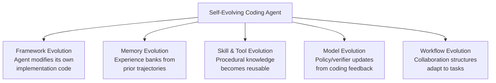
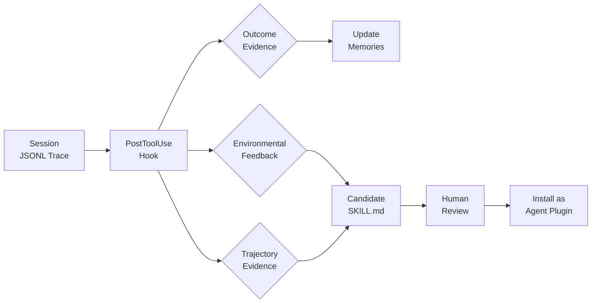

# Self-Evolving Coding Agents: What a Five-Category Taxonomy Reveals About Codex CLI's Evolution Primitives — and Where the Gaps Remain


---

Most coding agents are static. You install them, configure them, and they behave identically on day one hundred as they did on day one. The codebase evolves, the team's conventions shift, the dependency landscape mutates — but the agent does not learn from any of it.

Zhou, Hu, Shang and Zhang's survey "Self-Evolving Coding Agents" (arXiv:2608.03392, August 2026) is the first systematic attempt to categorise how coding agents *can* improve through experience [^1]. Their five-category taxonomy — framework, memory, skill, model, and workflow evolution — provides a useful lens for auditing what Codex CLI v0.147.0 already supports and where it still falls short.

## The Taxonomy: Five Objects of Evolution

The survey distinguishes self-evolving agents from conventional ones by a single criterion: the agent must update some durable component of itself based on prior coding interactions [^1]. The five evolution objects are:



Each category has a distinct temporal pattern. *Task-time* evolution adapts mid-task using immediate feedback (compiler errors, test failures). *Post-task* evolution distils completed trajectories into experience for future sessions. *Stage-wise* evolution accumulates verified trajectories across batches to drive model updates [^1].

### Framework Self-Evolution

Systems like SICA, SIFT, and the Darwin/Mendel/Huxley Gödel Machines maintain archives of agent variants and select improvements via benchmark performance [^1]. The agent literally rewrites its own scaffolding code. This is the most radical category — and the most dangerous, since a self-modifying agent can optimise for benchmark scores rather than genuine quality.

### Memory Self-Evolution

SWE-Exp constructs an experience bank from prior issue-resolution trajectories, including both successful and failed repair attempts [^1]. EvoCoder applies a hierarchical experience pool that separates general experience from repository-specific experience [^1]. The key insight: memory self-evolution is not about storing chat history — it is about constructing explicit mechanisms for recording and retrieving localization strategies, patching decisions, and failure lessons.

### Skill and Tool Self-Evolution

CODESKILL extracts reusable skills from trajectories at different granularities [^1]. Socratic-SWE (Xiao et al., arXiv:2606.07412, June 2026) takes this further by distilling execution traces into structured agent abilities — synthesised skills that capture common failure patterns and successful repair strategies, achieving 50.40% on SWE-bench Verified after three iterations [^2]. Live-SWE-Agent creates custom tools *during* task solving rather than beforehand [^1].

### Model Self-Evolution

Self-play SWE-RL couples bug generation and repair using verified outcomes [^1]. Coder-verifier systems (CURE, ZeroCoder, ACE) co-evolve generation and testing capabilities. This category requires compute-intensive training loops and is largely out of reach for individual developers, but it shapes the foundation models that Codex CLI consumes.

### Workflow Self-Evolution

SEMAG and EvoMAC modify multi-agent workflows based on test results, while AgentConductor generates task-adaptive communication patterns for code generation [^1]. This is multi-agent coordination that restructures itself — the topology changes, not just the messages.

## How Codex CLI v0.147.0 Maps to the Taxonomy

Codex CLI does not describe itself as "self-evolving," but it ships primitives that cover three of the five categories. Let us map them.

### Memory Evolution: Memories

Codex CLI v0.128 introduced native Memories — a consolidation pass that extracts durable insights from completed sessions and writes them to `~/.codex/memories/` [^3]. The next session reads them back automatically, giving the agent prior context without manual pasting. This is structurally similar to SWE-Exp's experience bank, though less sophisticated: Codex Memories store natural-language summaries rather than structured localization-repair pairs.

```toml
# config.toml — memory-related configuration
[memory]
enabled = true
# Memories are consolidated automatically at session end
# and injected into future sessions
```

The gap is in memory *curation*. SWE-Exp and EvoCoder distinguish general from repository-specific experience and actively prune stale entries [^1]. Codex Memories accumulate without structured quality gates — there is no mechanism to detect when a memory has become misleading due to codebase evolution.

### Skill Evolution: SKILL.md and Agent Plugins

Skills (`~/.agents/skills/`) are SKILL.md files that Codex loads automatically when the task matches [^4]. Agent Plugins 1.0, shipped in v0.147.0, extend this with a portable packaging standard: a `plugin.json` manifest bundling Agent Skills and MCP server configurations into a searchable, installable unit [^5].

```bash
~/.agents/plugins/
└── my-plugin/
    ├── plugin.json          # Manifest: name, version, skills, MCP servers
    ├── skills/
    │   ├── lint-fix/
    │   │   └── SKILL.md     # Reusable procedural knowledge
    │   └── test-gen/
    │       └── SKILL.md
    └── mcp.json             # MCP server declarations
```

This maps cleanly to CODESKILL's skill extraction concept, with one critical difference: Codex Skills are *human-authored* or imported, not *agent-derived*. The agent does not watch its own trajectories and promote recurring patterns into new SKILL.md files. Socratic-SWE's trace-derived skill synthesis [^2] has no equivalent in Codex CLI today.

### Workflow Evolution: Subagent Configuration

Codex CLI supports custom TOML agent definitions, `max_threads`/`max_depth` concurrency controls, and Guardian auto-review subagents [^3]. These define a workflow topology — but it is static. You configure it once; it does not adapt based on task outcomes. SEMAG's test-driven topology mutation [^1] is architecturally absent.

### Framework and Model Evolution: Not Supported

Codex CLI does not modify its own scaffolding code (framework evolution) and cannot fine-tune or update the models it uses (model evolution). Both are reasonable exclusions — self-modifying scaffolding is a safety hazard, and model training requires infrastructure beyond a CLI tool. But this means the most powerful evolution categories in the taxonomy are out of scope.

## Wiring Post-Task Skill Promotion with Hooks

The survey's most actionable insight for Codex CLI users is that *post-task* evolution — extracting reusable knowledge after completing a task — can be approximated today using PostToolUse hooks and AGENTS.md directives.

Consider a pattern where the agent records successful repair strategies:

```bash
#!/usr/bin/env bash
# hooks/post-session-skill-candidate.sh
# PostToolUse hook: after session ends, check for promotable patterns

TRAJECTORY_FILE="$1"
SKILLS_DIR="$HOME/.agents/skills"
CANDIDATES_DIR="$SKILLS_DIR/.candidates"

mkdir -p "$CANDIDATES_DIR"

# Extract repeated patterns from session trajectory
# (simplified — a production version would use structured analysis)
if [ "$(grep -c "PATTERN_REPEATED" "$TRAJECTORY_FILE")" -gt 2 ]; then
    cp "$TRAJECTORY_FILE" "$CANDIDATES_DIR/$(date +%Y%m%d-%H%M%S).md"
    echo "Skill candidate recorded for manual review"
    exit 0
fi
```

And the corresponding AGENTS.md directive:

```markdown
## Post-Task Learning

When you complete a task successfully:
1. Note any patterns you applied more than twice during this session
2. Record them as structured observations in the session summary
3. Flag patterns that could become reusable SKILL.md files

When you encounter a failure:
1. Record the failure category (localization, patch, test, build)
2. Note what eventually resolved it
3. Store the failure-resolution pair in the session summary
```

This is manual, fragile, and depends on the model following instructions reliably — exactly the kind of approximation that the survey's taxonomy helps us see clearly as a gap.

## The Evidence Problem

The survey identifies three types of evidence that drive evolution: outcome evidence (pass rates), environmental feedback (compiler diagnostics, test logs), and trajectory-derived evidence (complete coding records) [^1].

Codex CLI's `--json` flag produces JSONL traces that contain all three evidence types. The raw material for self-evolution exists — but no closed-loop pipeline consumes it. A PostToolUse hook could parse JSONL traces, extract trajectory-derived evidence, and update Memories or SKILL.md files. Today, this is a DIY exercise.



## Critical Challenges the Survey Raises

Three challenges from the survey deserve particular attention for Codex CLI practitioners:

**Feedback reliability.** Incomplete test suites, misleading logs, and weak verifiers can corrupt evolving components [^1]. If your Memories accumulate lessons from sessions where tests passed but the code was subtly wrong, the agent inherits bad habits. The survey calls this the *feedback reliability problem* — and it is amplified in Codex CLI because Memories have no verification gate.

**Benchmark overfitting.** Agents that evolve by optimising for benchmark scores risk becoming worse at real-world tasks [^1]. This is less relevant for Codex CLI users directly, but it matters when choosing foundation models: a model fine-tuned via SWE-RL self-play on SWE-bench may perform brilliantly on SWE-bench tasks and poorly on your actual codebase.

**Memory staleness.** Experience banks may become stale, redundant, or repository-specific [^1]. Codex CLI Memories persist indefinitely in `~/.codex/memories/`. There is no TTL, no repository-scoping mechanism, and no deduplication. A memory that says "this project uses Jest" remains even after a migration to Vitest.

## What Codex CLI Needs

Mapping the five-category taxonomy against Codex CLI v0.147.0 reveals three structural gaps:

| Evolution Category | Codex CLI Support | Gap |
|---|---|---|
| Framework | None (by design) | Acceptable — self-modification is a safety risk |
| Memory | Memories system | No curation, no TTL, no repo-scoping, no quality gates |
| Skill & Tool | SKILL.md + Agent Plugins | No agent-derived skill promotion — all skills are human-authored |
| Model | None (by design) | Acceptable — model training is out of scope for a CLI |
| Workflow | Static TOML subagents | No task-adaptive topology mutation |

The most impactful addition would be **automated skill promotion**: a pipeline that watches session trajectories, identifies recurring patterns, drafts candidate SKILL.md files, and surfaces them for human review before installation. This is what Socratic-SWE does with trace-derived skills [^2] — but packaged as an Agent Plugin rather than requiring a separate training infrastructure.

The second priority is **memory curation**: TTL-based expiry, repository-scoped memories, and a verification gate that validates memories against current codebase state before injecting them into new sessions.

## Conclusion

The self-evolving coding agents taxonomy gives us a vocabulary for what most agents lack: the ability to improve through experience. Codex CLI has the raw primitives — Memories, Skills, Plugins, hooks, JSONL traces — but no closed-loop pipeline connecting them. The gap between "has the building blocks" and "evolves autonomously" is the gap between a tool and a teammate. For now, humans remain the evolution engine — curating memories, authoring skills, reviewing plugins. The survey makes clear that this will not remain the case for long.

---

## Citations

[^1]: Zhou, H., Hu, H., Shang, Y. & Zhang, Q. (2026). "Self-Evolving Coding Agents." arXiv:2608.03392. [https://arxiv.org/abs/2608.03392](https://arxiv.org/abs/2608.03392)

[^2]: Xiao, C., Jiao, Z., Wang, S., Wang, W., Zhao, B., Wei, H., Zhang, L. & Qu, L. (2026). "Socratic-SWE: Self-Evolving Coding Agents via Trace-Derived Agent Skills." arXiv:2606.07412. [https://arxiv.org/abs/2606.07412](https://arxiv.org/abs/2606.07412)

[^3]: OpenAI. (2026). "Codex CLI v0.147.0 Changelog." ChatGPT Learn. [https://learn.chatgpt.com/docs/changelog](https://learn.chatgpt.com/docs/changelog)

[^4]: OpenAI. (2026). "Skills — Codex CLI Documentation." Agensi.io Guide. [https://www.agensi.io/learn/codex-cli-skills-install-skill-md](https://www.agensi.io/learn/codex-cli-skills-install-skill-md)

[^5]: OpenAI. (2026). "Agent Plugins 1.0: One Package Format for Every AI Agent." Blake Crosley. [https://blakecrosley.com/blog/agent-plugins-standard](https://blakecrosley.com/blog/agent-plugins-standard)

[^6]: OpenAI. (2026). "Codex CLI Memories: Native Session Persistence." Codex Knowledge Base. [https://codex.danielvaughan.com/2026/05/01/codex-cli-memories-persistent-context-session-memory-ecosystem/](https://codex.danielvaughan.com/2026/05/01/codex-cli-memories-persistent-context-session-memory-ecosystem/)
