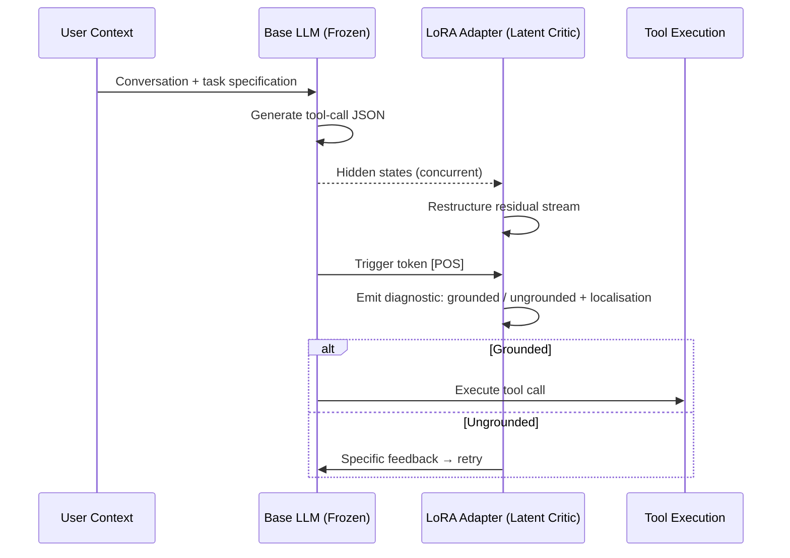
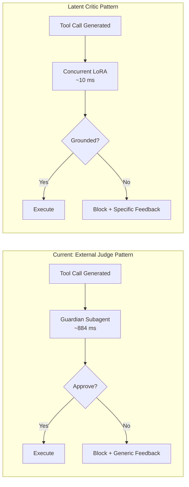

# Actionable Hallucination Detection and the Latent Critic: What Real-Time Specification-Grounding Means for Your Codex CLI Hook and Guardian Strategy


---

Your coding agent just fabricated a database port number. The value is syntactically valid, the tool call compiles, and the model's output confidence sits above 80%. Every surface-level check passes. But the user never specified that port — the agent hallucinated a plausible parameter to force a resolution rather than expressing uncertainty.

This is the *specification-grounding* problem, and it is structurally distinct from the factual hallucination problem that dominates the literature. A new paper from Samsung Research America — "Actionable Hallucination Detection: Translating Latent Uncertainty into Agentic Critique" [^1] — demonstrates that the model's own internal representations already encode whether a generated parameter is grounded in user context. The trick is extracting that signal cheaply enough to use it in real time.

This article unpacks the Latent Critic architecture, maps its implications onto Codex CLI's hook and guardian stack, and identifies the structural gaps that remain.

## The Specification-Grounding Problem

Factual hallucination asks: *Is this statement true about the world?* Specification-grounding hallucination asks: *Did the user actually specify this parameter?*

The distinction matters because a parameter can be factually correct — a valid date, a real API endpoint, a working port number — yet remain entirely ungrounded in the conversation history [^1]. Traditional confidence-based detection fails here: Vijayvargiya and Lokesh show that grounded and ungrounded parameter logits exhibit strong overlap, with models confidently fabricating plausible tokens at above 80% confidence while simultaneously generating low-confidence grounded actions [^1].

Simple string-matching baselines fare no better. The paper reports that 51.1% of hallucinated values appear somewhere in the conversation context (coincidental lexical overlap), whilst 26.8% of genuinely grounded values are not lexically present (paraphrased or implicit references) [^1]. A string-match baseline achieves only 0.670 in-distribution AUROC — barely above chance for practical deployment.

## The Latent Critic Architecture

The Latent Critic is a lightweight LoRA adapter (rank 64, alpha 128) that operates *concurrently* with the frozen base model's tool-call generation [^1]. Rather than spawning a secondary inference pass — the pattern used by external judge systems — the adapter processes hidden states during generation, then emits a diagnostic label and localised natural-language feedback upon encountering a trigger token.



### Why It Works: The Geometric Story

The paper's mechanistic analysis reveals three properties that make concurrent detection feasible:

1. **Reactive emergence.** The uncertainty signal appears in hidden states precisely when the ungrounded parameter key is formulated — confidence spikes to 95.24% at the exact generation step [^1]. The adapter does not need prescience; it reads the signal as it forms.

2. **Rank-invariant transformation.** Linear separability between grounded and ungrounded states increases sharply at layer 15, even with bottlenecked adapters at rank 4 [^1]. Specification-grounding occupies a low-dimensional subspace of the residual stream — a property that makes LoRA the right tool for the job.

3. **Causal verification.** Cross-trajectory activation patching at layer 32 forces the ungrounded classification 96% of the time, regardless of surrounding context [^1]. The signal is not merely correlated; it is causally sufficient.

## Performance Against Baselines

The results across 5,000 training scenarios and 500 in-distribution test tasks demonstrate a clear hierarchy [^1]:

| Detector | ID AUROC | OOD AUROC | ID F1 | Latency |
|----------|----------|-----------|-------|---------|
| **Latent Critic** | **0.966** | **0.925** | **0.870** | <10 ms |
| External Judge (4B) | 0.915 | 0.884 | 0.695 | 884 ms |
| Linear Probe (SVM) | 0.782 | 0.616 | 0.697 | ~1 ms |
| Semantic Entropy (10-sample) | 0.639 | 0.460 | 0.623 | >12 s |

Three observations stand out for Codex CLI practitioners:

- **Semantic entropy collapses.** The sampling-based approach fails on high-confidence hallucinations — exactly the failure mode that makes specification-grounding hard [^1]. Entropy-based methods are not viable guardrails for tool-calling agents.
- **External judges are slow.** At 884 ms per tool call, an external judge adds perceptible latency to every command execution [^1]. In an interactive Codex CLI session running dozens of tool calls, this compounds into minutes of dead time.
- **The Critic's OOD robustness matters.** On ToolAlpaca out-of-distribution scenarios, the Critic maintains 0.925 AUROC versus the external judge's 0.884 [^1]. Distribution shift is the norm in real-world development — your project's tool schemas differ from any training set.

## Closed-Loop Self-Correction

Detection alone is insufficient. The paper evaluates three closed-loop configurations in a ReAct environment [^1]:

| Configuration | Precision | Recall | F1 | Trajectory Success | False Block Rate |
|---------------|-----------|--------|-------|-------------------|------------------|
| Base Agent (no guard) | 49.7% | 54.8% | 52.1% | 16.4% | — |
| + Generic Block | 66.1% | 41.9% | 51.3% | 20.3% | 9.4% |
| + Specific Feedback | 69.8% | 54.4% | 61.2% | 22.1% | 2.9% |

Specific feedback — telling the agent *which* parameter was ungrounded and *why* — delivers a 54.8% relative improvement in recovery rate over generic blocking, with a 69% reduction in false blocks [^1]. The agent recovers in 1.06 failed attempts versus 1.47 for generic intervention.

This maps directly to Codex CLI's exit code 2 hook pattern. A PostToolUse hook that returns exit code 2 with specific stderr feedback replaces the tool result the agent sees, steering the next action without undoing what already ran [^2].

## Mapping to Codex CLI's Defence Stack

### PostToolUse Hooks as the Integration Surface

Codex CLI's PostToolUse hooks fire after every tool execution — shell commands, `apply_patch` edits, and MCP tool calls [^2]. A Latent Critic integration would sit at this layer:

```toml
# hooks.json sketch — Latent Critic as PostToolUse guard
{
  "hooks": [
    {
      "event": "PostToolUse",
      "command": "latent-critic-check --context-window $CODEX_CONTEXT --tool-call $CODEX_TOOL_OUTPUT",
      "timeout_ms": 50
    }
  ]
}
```

The 50 ms timeout is generous: the paper reports sub-10 ms inference latency under vLLM deployment [^1]. Even the slower HuggingFace standalone path (58 ms) fits within Codex CLI's hook timeout budget.

Exit code semantics:
- **Exit 0**: Grounded — proceed normally.
- **Exit 2**: Ungrounded — stderr contains localised feedback (e.g., `"ungrounded: database_port was never specified in conversation"`), which replaces the tool result and steers the agent's next attempt [^2].

### Guardian Auto-Review as the Current Analogue

Codex CLI v0.147.0's `--approve-for-me` flag routes approval requests through a Guardian auto-review subagent [^3]. This is architecturally an *external judge* — a secondary inference pass that evaluates the proposed action before execution.

The Latent Critic paper positions concurrent detection as structurally superior to this pattern:



The difference is not merely latency. Specific feedback ("parameter X was ungrounded") yields 37.0% recovery versus generic blocking's 23.9% [^1]. The Guardian's approve/reject binary maps to the generic-block pattern — the weaker of the two strategies.

### AGENTS.md as the Specification Surface

The Latent Critic evaluates grounding against conversational context [^1]. In Codex CLI, the richest specification surface is AGENTS.md — the layered configuration files that define project conventions, constraints, and expectations [^4].

A specification-grounding detector for Codex CLI would evaluate tool-call parameters against:

1. **AGENTS.md directives** — explicit project constraints (e.g., "database runs on port 5432", "use British English", "never modify migration files directly").
2. **Conversation history** — parameters the developer explicitly provided in the current session.
3. **Memories** — persisted context from previous sessions via `~/.codex/memories/` [^3].

The current gap: Codex CLI's hook system passes tool output and exit codes, but does not expose the full conversation context or AGENTS.md contents to hook scripts as structured data. A Latent Critic integration would require either API-level access to the context window or a sidecar process maintaining a parallel context buffer.

## What Is Missing from Codex CLI Today

The paper exposes four structural gaps in Codex CLI's current architecture:

### 1. No Concurrent Detection Layer

Codex CLI's hooks are *sequential* — they fire after tool execution completes [^2]. The Latent Critic operates *during* generation, intercepting hallucinations before the tool call is even dispatched. Codex CLI has no equivalent of a pre-dispatch, concurrent monitoring layer that can inspect the model's hidden states.

**Practical mitigation:** PreToolUse hooks can intercept tool calls before execution, but they operate on surface text (the generated JSON), not on internal model representations. A PreToolUse hook running a local Latent Critic inference against the proposed tool call would approximate concurrent detection, albeit with an additional inference pass rather than true concurrency.

### 2. No Parameter-Level Grounding Feedback

PostToolUse exit code 2 feedback is free-text on stderr [^2]. There is no structured schema for communicating *which specific parameter* was ungrounded or *what the grounding source should have been*. The paper shows that specific, localised feedback is 54.8% more effective than generic blocking [^1].

**Practical mitigation:** Adopt a structured stderr convention in hook scripts:

```bash
# PostToolUse hook stderr convention
echo '{"ungrounded_params": ["database_port"], "reason": "port never specified in conversation", "suggested_action": "ask user for port number"}' >&2
exit 2
```

### 3. No Context Serialisation for Hooks

Hooks receive environment variables for tool output but not the full conversation context or AGENTS.md contents [^2]. A specification-grounding detector needs access to the specification against which to evaluate grounding.

**Practical mitigation:** Export conversation context to a temporary file that hooks can read, or use the `--json` JSONL session traces as a context source for a sidecar grounding checker.

### 4. No Adapter Integration Path

The Latent Critic requires LoRA adapter weights merged with the base model's inference path [^1]. Codex CLI's model routing (GPT-5.6 Sol/Terra/Luna via API) does not expose adapter injection [^5]. This technique is currently viable only for self-hosted models behind MCP tool servers or local inference endpoints.

**Practical mitigation:** Run a local Latent Critic as an MCP tool server. The tool accepts the proposed tool-call JSON and recent conversation context, returns a grounding verdict, and the PreToolUse hook calls this MCP tool before approving execution.

## The Cost Arithmetic

Training a Latent Critic requires approximately 3–5 GPU-hours on a single A100 [^1]. Inference adds under 10 ms per tool call. For a typical Codex CLI session generating 50 tool calls, the total overhead is under 500 ms — compared to 44 seconds for an external judge approach or over 10 minutes for semantic entropy [^1].

At GPT-5.6 Luna pricing, each false tool call costs tokens for the failed attempt plus tokens for the retry. The paper's 37.0% recovery rate on first retry suggests that even a modestly effective grounding check pays for itself within a few intercepted hallucinations per session.

## Practical Recommendations

For Codex CLI practitioners working with v0.147.0:

1. **Treat AGENTS.md as a grounding specification.** Write explicit parameter constraints — ports, paths, API versions, naming conventions — so that any future grounding checker has a clear specification surface [^4].

2. **Use PostToolUse exit code 2 with specific feedback.** When writing hooks that detect suspicious tool calls, include the parameter name and grounding reason in stderr. The paper's evidence shows this is not cosmetic — it directly improves recovery rates [^1] [^2].

3. **Watch for adapter-aware inference APIs.** The Latent Critic's architecture requires adapter injection during generation. As OpenAI and other providers expose LoRA serving (custom model endpoints, fine-tuning API), this detection pattern becomes deployable without self-hosting.

4. **Do not rely on confidence scores.** The paper conclusively demonstrates that output-level confidence is non-discriminative for specification-grounding hallucinations [^1]. If your hooks check model confidence, they are checking the wrong signal.

## Citations

[^1]: Vijayvargiya, S. & Lokesh, R. (2026). "Actionable Hallucination Detection: Translating Latent Uncertainty into Agentic Critique." arXiv:2608.10430. Samsung Research America. [https://arxiv.org/abs/2608.10430](https://arxiv.org/abs/2608.10430)

[^2]: Codex CLI Hooks Reference — hooks.json, PreToolUse & PostToolUse. Agentic Control Plane. [https://agenticcontrolplane.com/blog/codex-cli-hooks-reference](https://agenticcontrolplane.com/blog/codex-cli-hooks-reference)

[^3]: OpenAI. (2026). Codex CLI v0.147.0 Release Notes. GitHub. [https://github.com/openai/codex/releases/tag/rust-v0.147.0](https://github.com/openai/codex/releases/tag/rust-v0.147.0)

[^4]: Cai, Y. et al. (2026). "Rule Taxonomy and Evolution in AI IDEs: A Mining and Survey Study." arXiv:2606.12231. [https://arxiv.org/abs/2606.12231](https://arxiv.org/abs/2606.12231)

[^5]: OpenAI. (2026). GPT-5.6 Sol, Terra, and Luna: Model Documentation. [https://openai.com/index/gpt-5-6/](https://openai.com/index/gpt-5-6/)
