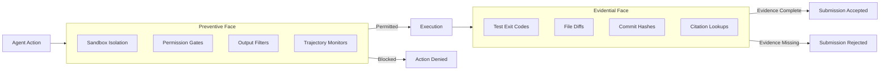
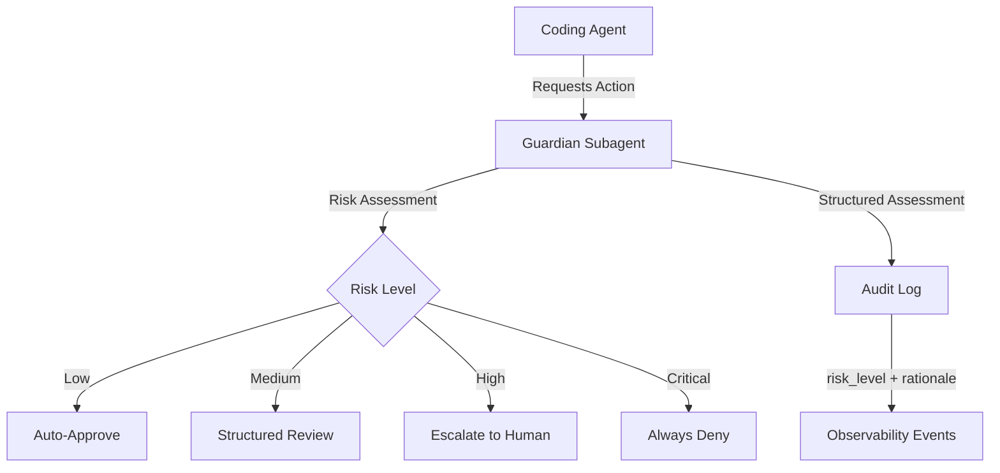

# Agent Safety as a Runtime Contract: What Preventive–Evidential Enforcement Means for Your Codex CLI Sandbox, Hook, and Guardian Strategy


---

A position paper published on 11 August 2026 by Ng, Han, Zhang, and Wang argues that the dominant approach to AI safety — instilling alignment during training via RLHF, DPO, or Constitutional AI — is "structurally insufficient for autonomous agents" [^1]. Their alternative: treat safety as a **runtime contract** enforced by the agent's harness, split into a *preventive face* that blocks dangerous actions before execution and an *evidential face* that gates task completion on verifiable proof. The argument draws on a 52-incident survey, a 32-case false-completion audit, and a trajectory-schema review of 12 public agent systems including Claude Code, Cursor, and Devin [^1].

The framing resonates because Codex CLI v0.147.0 already ships most of the primitives the paper describes — sandboxed execution, approval-policy permission gates, PreToolUse/PostToolUse hooks, and the Guardian auto-review subagent [^2][^3]. What Codex CLI does not yet do is compose those primitives into the formal evidence chains the paper demands. This article maps the paper's architecture onto Codex CLI's concrete mechanisms, identifies where the harness already satisfies the contract, and highlights the gaps practitioners must bridge themselves.

## The Two-Face Architecture

The paper formalises agent safety into two complementary enforcement surfaces [^1]:



**Preventive mechanisms** stop harmful actions from reaching the world. They break down into four categories: *preventive* (tool whitelisting, input sanitisation), *detective* (execution tracing, anomaly detection), *corrective* (human escalation, automatic rollback), and *structural* (sandboxed execution, resource quotas, network isolation) [^1].

**Evidential mechanisms** demand hard artefacts — test suite exit codes, file diffs, commit hashes, citation lookups against external sources — as proof that the agent's claimed completion is genuine. Critically, the paper distinguishes *hard evidence* (externally verifiable: a test passed, a citation exists) from *soft evidence* (trusting the model's self-report) and argues that only the former satisfies the contract [^1].

The key insight: an attacker must defeat **all** preventive layers **and** forge consistent evidence. The test output must match execution traces without contradiction.

## How Codex CLI Already Satisfies the Preventive Face

### Kernel-Level Sandbox Isolation

Codex CLI translates high-level `SandboxPolicy` settings into OS-native primitives: Seatbelt profiles on macOS, Bubblewrap plus Landlock on Linux, and Restricted Tokens with synthetic SIDs on Windows [^2]. The paper's *structural* category — sandboxed execution, resource quotas, network isolation — maps directly:

```toml
# codex.toml — structural preventive layer
[sandbox]
mode = "locked-down"      # kernel-enforced filesystem + network isolation
network = "none"           # no egress — structural isolation
```

The `locked-down` sandbox mode enforces filesystem restrictions at the kernel level, independent of anything the model generates. This is precisely what the paper means by "distribution-agnostic constraints": a Landlock policy functions identically regardless of how the model's output distribution shifts [^1][^2].

### Approval Policies as Permission Gates

The paper's *preventive* category — tool whitelisting, permission gates — corresponds to Codex CLI's layered approval architecture:

```toml
# codex.toml — preventive permission gates
[approval_policy]
auto_approve = ["read", "glob", "grep"]        # low-risk: auto-approved
suggest = ["write", "edit"]                     # medium-risk: Guardian review
always_ask = ["bash:rm *", "bash:git push"]     # high-risk: human required
```

The architecture is deliberately layered: kernel-level sandbox enforcement provides the hard security boundary, approval policies add consent gates, permission profiles offer per-context switching, and managed requirements give administrators an unbreakable ceiling [^2][^3].

### Guardian as Detective and Corrective Layer

The Guardian auto-review subagent, enabled via `approvals_reviewer = "guardian_subagent"` or the `--approve-for-me` flag in v0.147.0, maps to both the paper's *detective* and *corrective* categories [^3][^4]:



The Guardian produces a structured assessment with discrete `risk_level`, `authorisation`, `outcome`, and `rationale` fields [^4]. The lifecycle events `item/autoApprovalReview/started` and `item/autoApprovalReview/completed` provide the observability the paper demands for trajectory monitoring [^4].

### PreToolUse Hooks as Pre-Dispatch Gates

PreToolUse hooks fire before tool execution and can block actions with exit code 2 [^5]. This is the paper's *preventive* face in its purest form — a programmable gate that intercepts every tool call:

```json
{
  "hooks": [
    {
      "event": "PreToolUse",
      "command": "python3 /hooks/block-destructive.py",
      "timeout_ms": 5000
    }
  ]
}
```

A hook returning exit code 2 blocks the action entirely. The agent sees the hook's stderr as feedback — which the paper would classify as a *corrective* mechanism, since it redirects the agent rather than silently failing [^5].

## Where Codex CLI Falls Short: The Evidential Face

The paper's most pointed finding is that only 2 of the 12 agent systems surveyed implement *submission gates* — mechanisms that refuse to accept a task as complete unless hard evidence exists [^1]. Codex CLI is not one of those two.

### No Evidence-Chain Gating

Codex CLI has no built-in mechanism that prevents the agent from claiming a task is done without providing test results, diffs, or other hard artefacts. The agent can declare completion — and the user can accept it — without any verification that the claimed changes are correct [^1].

### PostToolUse Hooks as a Partial Bridge

PostToolUse hooks offer the closest approximation. A hook can enforce evidence requirements after each tool execution:

```bash
#!/bin/bash
# PostToolUse hook: require tests to pass after file writes
if [[ "$CODEX_TOOL_NAME" == "write" || "$CODEX_TOOL_NAME" == "edit" ]]; then
    cd "$CODEX_WORKSPACE" && make test 2>&1
    if [ $? -ne 0 ]; then
        echo "Evidence contract violated: test suite failed after edit" >&2
        exit 2
    fi
fi
```

Exit code 2 on PostToolUse does not undo the execution (the command already ran), but it replaces the tool result the agent sees with the hook's stderr feedback [^5]. This forces the agent to address the failure — a corrective mechanism, not a true submission gate.

### Hard Evidence vs Self-Report

The paper emphasises a distinction Codex CLI does not enforce: **hard evidence** (test exit codes, file diffs verified against the working tree) versus **soft evidence** (the agent reporting "all tests pass") [^1]. A PostToolUse hook that runs `make test` produces hard evidence. But nothing prevents the agent from simply claiming completion without triggering any tool call that would fire the hook.

## What the Gap Analysis Reveals

The paper's trajectory-schema audit found that while 7 of 12 systems capture structured logs, 11 capture tool outputs, and 9 capture file diffs, the critical missing piece is **composition into submission gates** [^1]. Mapping this to Codex CLI:

| Paper Requirement | Codex CLI Status | Gap |
|---|---|---|
| Sandboxed execution | ✅ Seatbelt/Landlock/Bubblewrap | — |
| Permission gates | ✅ Approval policies + profiles | — |
| Tool whitelisting | ✅ `enabled_tools` in TOML | — |
| Trajectory monitoring | ✅ Guardian + lifecycle events | — |
| Human escalation | ✅ `always_ask` + Guardian escalation | — |
| Structured tool logs | ✅ JSONL session traces | — |
| File diffs captured | ✅ Git integration + rollout files | — |
| Test exit code verification | ⚠️ Via PostToolUse hooks only | No built-in gate |
| Evidence-chain composition | ❌ Not implemented | No submission gate |
| Tamper-evident trajectory hash chain | ❌ Not implemented | No hash chaining |

## Bridging the Gap: A Practitioner's Evidence Contract

Until Codex CLI ships native submission gates, practitioners can approximate the evidential face using existing primitives:

```toml
# AGENTS.md directive — evidence requirements
## Completion Contract
Before marking any task complete, you MUST:
1. Run the full test suite and confirm exit code 0
2. Run the linter and confirm zero errors
3. Produce a git diff showing all changes
4. List every file modified with line counts
Do NOT claim completion without executing these steps.
```

This is soft enforcement — the agent may ignore it. Hardening requires a PostToolUse hook on the final tool call pattern, or a wrapper script that validates the session's JSONL trace before accepting the result.

For teams that need stronger guarantees, the paper suggests a formal evidence chain:

```
exists(commit) ∧ test_exit_code(commit) == 0 ∧ diff(commit) ≠ ∅
```

This can be approximated with a CI gate on the PR that Codex CLI produces — GitHub Copilot's approach, and one of only two systems the paper found implementing submission gates [^1].

## The Publication Imbalance

The paper's proceedings audit of 28,560 papers across NeurIPS, ICML, and ICLR (2023–2025) found that training-time alignment publications outnumber deployment-time harness work by an 8–12× pooled ratio [^1]. This matters for practitioners: the research community is overwhelmingly focused on making models *intrinsically safe* through training, whilst the mechanisms that actually prevent harm in production — sandboxes, permission gates, evidence chains — receive comparatively little formal study.

Codex CLI's harness architecture is arguably ahead of the research literature in the preventive dimension. What remains is closing the evidential gap — and that requires either OpenAI to ship native submission gates, or practitioners to build them from hooks, AGENTS.md directives, and CI integration.

## Practical Implications

The paper's two-face framework offers a useful audit checklist for any Codex CLI deployment:

1. **Preventive audit**: Is the sandbox mode appropriate for the task's risk level? Are approval policies configured to gate destructive operations? Are PreToolUse hooks blocking known-dangerous patterns?

2. **Evidential audit**: Does your workflow require hard evidence before accepting agent output? Are PostToolUse hooks running tests after writes? Does your CI pipeline gate PRs on test passage?

3. **Composition check**: Do your preventive and evidential layers operate independently, so that defeating one does not compromise the other?

The paper's central argument — that training-time safety and deployment-time safety serve different functions, and that both are necessary — aligns with Codex CLI's existing architecture. The preventive face is well-covered. The evidential face is where the work remains.

## Citations

[^1]: Ng, A. W., Han, Y., Zhang, J., & Wang, W. (2026). "Agent Safety Should Be a Runtime Contract." arXiv:2608.11274. [https://arxiv.org/abs/2608.11274](https://arxiv.org/abs/2608.11274)

[^2]: OpenAI. (2026). "Codex CLI Sandboxing Implementation." DeepWiki. [https://deepwiki.com/openai/codex/5.6-sandboxing-implementation](https://deepwiki.com/openai/codex/5.6-sandboxing-implementation)

[^3]: OpenAI. (2026). "Agent Approvals & Security." OpenAI Developer Documentation. [https://developers.openai.com/codex/agent-approvals-security](https://developers.openai.com/codex/agent-approvals-security)

[^4]: Vaughan, D. (2026). "Codex CLI Guardian Approval: Configuring Auto-Review Policies." Codex Knowledge Base. [https://codex.danielvaughan.com/2026/04/20/codex-cli-guardian-approval-configuring-auto-review-policies/](https://codex.danielvaughan.com/2026/04/20/codex-cli-guardian-approval-configuring-auto-review-policies/)

[^5]: Vaughan, D. (2026). "Codex CLI Hooks: Complete Guide to Events, Policy Engines and Production Patterns." Codex Knowledge Base. [https://codex.danielvaughan.com/2026/04/15/codex-cli-hooks-complete-guide-events-policy-patterns/](https://codex.danielvaughan.com/2026/04/15/codex-cli-hooks-complete-guide-events-policy-patterns/)
