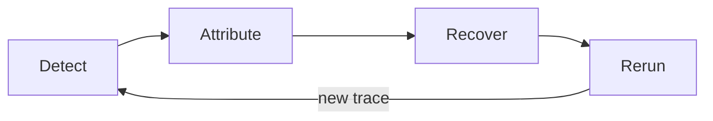
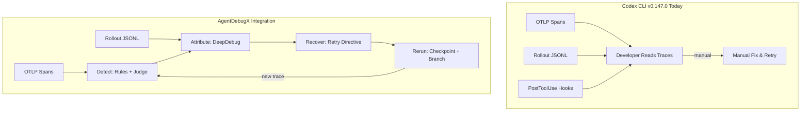

# AgentDebugX and the Closed-Loop Debugging Gap: What Detect-Attribute-Recover-Rerun Means for Your Codex CLI Observability Stack


---

When a Codex CLI session fails, the diagnostic surface you reach for — OTLP spans, rollout JSONL files, `codex doctor --json` — tells you *what* happened and roughly *when*. What it cannot tell you is *which earlier step actually caused the failure*, nor can it propose a concrete recovery. Zhu, Ye, Han et al.'s AgentDebugX (arXiv:2607.18754, July 2026) formalises exactly that missing layer: a closed Detect-Attribute-Recover-Rerun loop that turns passive traces into actionable root-cause diagnoses and structured retry directives[^1]. This article maps AgentDebugX's architecture against Codex CLI v0.147.0's observability features, identifies the gaps, and sketches practical integration paths.

## The Core Problem: Failures Propagate, Symptoms Mislead

Every senior developer who has debugged a multi-step agent session knows the pattern: the step where an error surfaces is rarely the step that caused it. An early hallucinated file path at step 4 cascades through tool calls until a `FileNotFoundError` appears at step 19. Traditional observability — OpenTelemetry spans, structured logs, session replays — captures the full timeline faithfully but leaves the causal reasoning to you[^2].

AgentDebugX's thesis is that this reasoning can be systematised. The toolkit decomposes debugging into four discrete phases:



Each phase has a well-defined contract, and the loop iterates until the task succeeds or a human decides to stop.

## The DARR Architecture in Detail

### Detect: Rule Packs Before Model Calls

Detection begins with deterministic rule packs targeting mechanically verifiable failures — malformed tool calls, no-progress loops, invalid outputs, premature success claims — without any model call[^1]. Only when rules fail to classify does an LLM judge read the goal and a bounded trace window, returning typed findings against a 19-mode failure taxonomy spanning planning, memory, tool use, verification, and coordination[^1].

This two-tier approach matters for cost. In AgentDebugX's evaluation, the deterministic layer resolves the majority of clear-cut failures at zero inference cost, reserving model budget for genuinely ambiguous cases.

### Attribute: DeepDebug's Multi-Turn Diagnosis

Attribution is where AgentDebugX diverges most sharply from existing observability tools. The DeepDebug algorithm operates read-only over captured traces in four stages[^1]:

1. **Global Read** — reconstruct the objective and full history, naming an initial candidate for the decisive step.
2. **Structure-Guided Investigation** — for multi-agent runs, walk the handoff cascade upstream from the visible failure; for single-agent runs, bisect the step range and re-read the surviving region, yielding an independent second candidate.
3. **Cross-Examination** — if candidates disagree, inspect both side-by-side with context, inputs, outputs, and downstream effects, reducing selection from a whole-trace search to a focused two-hypothesis adjudication.
4. **Diagnosis and Suggestion** — output the responsible agent and step, a plain-language explanation, quoted evidence, one concrete fix, and a full audit trail.

On the Who&When benchmark (184 annotated traces), DeepDebug achieves 28.8% exact agent-and-step attribution accuracy on Qwen 3.5-9B versus 21.7% for the strongest single-pass baseline — a meaningful lift on traces exceeding 40 events[^1]. The cost overhead is modest: 12.8K tokens on average versus 8.1K for a single whole-trace pass (1.6×)[^1].

### Recover and Rerun: From Diagnosis to Retry

Recovery converts the root-cause finding into a concrete retry directive. The native path reuses DeepDebug's own correction suggestion, requiring no extra model call after diagnosis[^1]. Alternative strategies — Reflexion, CRITIC, AutoManual — ship as pluggable baselines.

On GAIA (73 failed tasks from a qwen3.5-9b Open-Deep-Research agent), DeepDebug repairs 13 tasks in a single rerun versus 4–6 for the three self-correction baselines, lifting overall accuracy from 55.8% to 63.6%[^1].

## Mapping to Codex CLI v0.147.0

Codex CLI already has a layered diagnostic surface. The question is how each layer maps to AgentDebugX's four phases.

### What Codex CLI Already Provides

| DARR Phase | Codex CLI Feature | Coverage |
|---|---|---|
| **Detect** | OTLP spans (`invoke_agent`, `chat`, `execute_tool`), `codex doctor --json`, turn analytics correlating tool calls with model responses[^3] | Partial — captures events but no typed failure taxonomy |
| **Detect** | PostToolUse hooks with exit codes (0 = pass, 1 = block, 2 = steering feedback)[^4] | Partial — user-authored rules, not a systematic rule pack |
| **Attribute** | Rollout JSONL files recording full session trajectories[^5] | Raw material only — no automated root-cause analysis |
| **Attribute** | Guardian auto-review subagent[^4] | Detects issues in real time but does not perform post-hoc attribution |
| **Recover** | `--approve-for-me` enabling automated re-approval after Guardian steering[^3] | Coarse — retries the same approach, no diagnosis-driven correction |
| **Rerun** | `/resume` command to reload a past session transcript[^3] | Manual — no structured checkpoint-and-branch mechanism |

### What Codex CLI Lacks

The gaps cluster around three capabilities:

**1. No Typed Failure Taxonomy.** Codex CLI's OTLP spans record tool execution duration, API latency, and approval wait time, but they do not classify *why* a step failed. AgentDebugX's 19-mode taxonomy — with extensible induction for novel failure modes — provides a structured vocabulary that PostToolUse hooks could consume but currently cannot generate[^1].

**2. No Automated Root-Cause Attribution.** Rollout files contain the raw trajectory, and turn analytics correlate tool calls with model responses[^3], but no built-in mechanism walks the trace backwards to identify the causal origin. DeepDebug's bisection-and-cross-examination pattern requires read-only trace access — exactly what rollout JSONL files provide — yet no pipeline connects the two.

**3. No Structured Recovery Pipeline.** When a Codex CLI session fails, the developer's options are: resume the session manually, start fresh, or write a PostToolUse hook to catch the specific pattern next time. There is no mechanism to package a diagnosis, select a checkpoint, and rerun with a targeted correction directive. AgentDebugX's rerun executor model — where runtime-specific adapters consume a standardised retry request — has no analogue in Codex CLI's architecture.



## Practical Integration Paths

AgentDebugX ships as a Python library (`pip install agentdebugx`), a CLI (`agentdebug ingest`, `diagnose`, `inspect`, `act`, `serve`), a web console, and — critically — an installable agentic skill[^1]. The skill integration is the most direct path for Codex CLI users.

### Path 1: MCP Server Wrapping the AgentDebugX CLI

Codex CLI v0.147.0 supports MCP 2026-07-28 with non-blocking server startup[^3]. An MCP server that wraps the `agentdebugx` CLI could expose four tools:

```toml
# .codex/config.toml
[mcp_servers.debugx]
command = "agentdebug-mcp-server"
args = ["--trace-dir", ".codex/sessions"]
```

The server would ingest rollout JSONL on session completion, run detection and attribution, and surface findings as tool responses within a follow-up Codex session.

### Path 2: PostToolUse Hook Feeding the Detect Phase

A PostToolUse hook could implement AgentDebugX's deterministic rule packs — checking for no-progress loops, malformed tool outputs, and premature success patterns — and return exit code 2 with structured feedback when triggered:

```bash
#!/usr/bin/env bash
# hooks/post-tool-use-detect.sh
# Deterministic failure detection based on AgentDebugX rule packs
TOOL_OUTPUT="$1"

# Check for no-progress loop (same output repeated 3+ times)
if echo "$TOOL_OUTPUT" | grep -q "REPEATED_OUTPUT_MARKER"; then
  echo "AgentDebugX Detect: no-progress loop detected at this step"
  exit 2  # steering feedback
fi

exit 0
```

This captures the cheapest layer of AgentDebugX's detection without any model call, steering the agent away from unproductive loops in real time rather than post-hoc.

### Path 3: Error Hub as Cross-Session Memory

AgentDebugX's Error Hub stores scrubbed failure-diagnosis-repair bundles that seed future diagnoses[^1]. Codex CLI's Memories system — with its two-phase pipeline and `MEMORY.md` consolidation — is architecturally adjacent but stores general session learnings, not structured failure cases[^4]. A PostToolUse hook that writes failure bundles to a project-local `.codex/error-hub/` directory, formatted for both AgentDebugX retrieval and Codex Memories ingestion, would bridge the gap.

## The Failure Taxonomy Question

AgentDebugX's 19-mode taxonomy spans five categories: planning, memory, tool use, verification, and coordination[^1]. The taxonomy is extensible — when the judge encounters a recurring failure outside the seed set, it records novel-mode candidates, clusters them by similarity, and proposes new categories gated by a support threshold. Proposals never overwrite the curated taxonomy; human acceptance is required[^1].

This governance model matters for Codex CLI adoption. A project team could maintain a project-scoped failure taxonomy in `AGENTS.md`, seeded from AgentDebugX's defaults and extended with project-specific failure modes (e.g., "migration script leaves orphaned foreign keys"). The taxonomy becomes a shared contract between human reviewers and automated detection.

## Cost and Latency Considerations

AgentDebugX's DeepDebug pipeline adds approximately 1.6× the token cost of a single trace read[^1]. For a typical 25-trace debugging batch, that translates to roughly 12.8K tokens per trace — modest compared to the cost of a senior developer manually inspecting rollout files.

The real cost question is whether attribution should run synchronously (blocking the session) or asynchronously (post-session batch analysis). Codex CLI's architecture favours the latter: rollout files persist after session completion, and a scheduled `agentdebug diagnose` run could process failed sessions overnight, populating the Error Hub for the next morning's work.

## What This Means for Your Workflow

If you are running Codex CLI in production — overnight development workflows, CI-triggered agent runs, multi-agent V2 delegations — the observability gap AgentDebugX addresses is not theoretical. Every failed session currently requires manual trace inspection. The DARR loop offers a structured alternative:

1. **Today**: write PostToolUse hooks implementing deterministic rule packs for your most common failure modes.
2. **Near-term**: wrap `agentdebugx` as an MCP server, feeding it rollout JSONL files from failed sessions.
3. **Medium-term**: integrate the Error Hub with Codex Memories, building project-specific failure libraries that improve both human and agent debugging over time.

The gap between Codex CLI's raw observability data and actionable failure diagnosis is real and measurable. AgentDebugX provides a concrete, open-source architecture for closing it[^6].

## Citations

[^1]: Zhu, K., Ye, X., Han, Z., Zhao, Y., Li, B., Zhang, W., Tian, M., Tang, X., Lu, P., Zou, J., You, J. & Ji, H. (2026). "AgentDebugX: An Open-Source Toolkit for Failure Observability, Attribution, and Recovery in LLM Agents." arXiv:2607.18754. [https://arxiv.org/abs/2607.18754](https://arxiv.org/abs/2607.18754)

[^2]: Arize AI. (2026). "Agent Observability: How to Trace, Debug, and Improve AI Agents." [https://arize.com/guides/ai-agent-handbook/agent-observability/](https://arize.com/guides/ai-agent-handbook/agent-observability/)

[^3]: OpenAI. (2026). "ChatGPT & Codex Changelog." [https://learn.chatgpt.com/docs/changelog](https://learn.chatgpt.com/docs/changelog)

[^4]: Vaughan, D. (2026). "Codex CLI v0.147.0: Portable Agent Plugins, Multi-Catalog Federation, Approve-for-Me, and Conversation Sections." Codex Knowledge Base. [https://codex.danielvaughan.com/2026/08/10/codex-cli-v0147-portable-agent-plugins-multi-catalog-federation-approve-for-me-conversation-sections/](https://codex.danielvaughan.com/2026/08/10/codex-cli-v0147-portable-agent-plugins-multi-catalog-federation-approve-for-me-conversation-sections/)

[^5]: Vaughan, D. (2026). "Codex CLI Rollout Files: Session Recording, Replay, and Audit Trails." Codex Knowledge Base. [https://codex.danielvaughan.com/2026/04/29/codex-cli-rollout-files-session-recording-replay-audit-trails/](https://codex.danielvaughan.com/2026/04/29/codex-cli-rollout-files-session-recording-replay-audit-trails/)

[^6]: GitHub. (2026). "ulab-uiuc/AgentDebug." [https://github.com/ulab-uiuc/AgentDebug](https://github.com/ulab-uiuc/AgentDebug)
