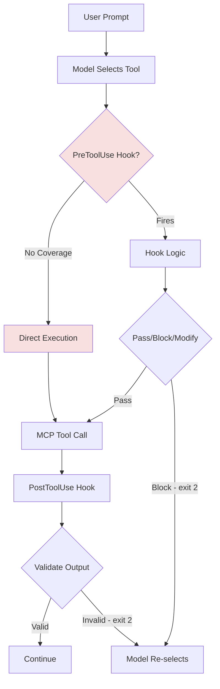
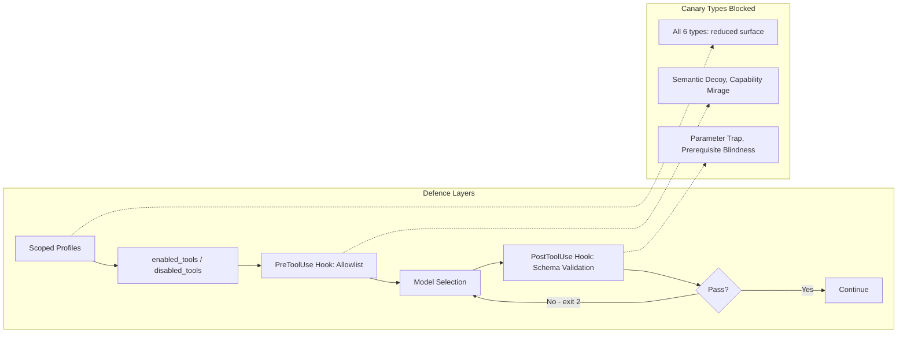

# Canary Tools and the Tool-Selection Reasoning Gap: What Diagnostic Probes Reveal About Your Codex CLI MCP Stack


---

Your Codex CLI session might be calling the wrong MCP tool right now and you would never know. Not because the tool fails — it runs fine, returns plausible output, and the agent carries on. The selection was simply wrong: a semantic lookalike, an over-scoped variant, or a tool whose inflated description promised more than it delivers.

Anand and Chattaraj's "Diagnosing Tool-Selection Reasoning in LLM Agents with Canary Tools" (arXiv:2608.04719, August 2026) provides the first systematic taxonomy for understanding *why* agents mis-select tools, and their evaluation across eight models reveals that capability tier is a surprisingly poor predictor of selection robustness [^1]. This article maps the paper's six-type canary taxonomy onto Codex CLI v0.147.0's MCP tool-discovery pipeline, identifies where the current architecture leaves gaps, and offers a practical hardening playbook.

## The Canary Framework in Brief

A canary tool is a diagnostic probe planted alongside real tools in an agent's MCP environment. Each canary targets a single reasoning weakness without modifying the model itself. The framework uses a deterministic schema-driven generator plus LLM-assisted rewording to produce canaries, then measures the **Canary Susceptibility Rate (CSR)** — the mean ratio of canary calls to total tool calls per task [^1].

Across 8,640 primary runs and 2,880 ablation runs, the authors found a 36x spread in CSR between the most resilient model (Claude Opus 4.8, CSR 0.010) and the most susceptible (Llama 3.1 8B, CSR 0.378) [^1]. Crucially, CSR correlates negatively with task success (Spearman rho = -0.34, p < 0.001), confirming that canary susceptibility predicts real procedural failure [^1].

## The Six-Type Canary Taxonomy

Each type targets a distinct reasoning failure mode:

| Type | Mechanism | What It Tests |
|------|-----------|---------------|
| **Semantic Decoy** | Paraphrased name and description, identical schema | Name-matching vs description comprehension |
| **Parameter Trap** | Functional lookalike with renamed params plus unsatisfiable required argument | Parameter-feasibility reasoning |
| **Capability Mirage** | Inflated power claims ("research-grade", "enterprise") | Critical evaluation of capability assertions |
| **Prerequisite Blindness** | Omits authentication requirements; calling returns auth error | Implicit-prerequisite reasoning |
| **Temporal Decoy** | Outdated date/version marking | Recency weighting in selection |
| **Granularity Trap** | Over-specific hardcoded variant (e.g., single-city weather) | Scope-matching to task specificity |

The most striking finding: **capability mirage is the dominant failure mode for frontier models**, averaging 0.216 CSR across six hosted models, with prerequisite blindness a distant second at 0.094 [^1]. The remaining four types are near-inert for frontier models (0.008-0.027) but fire readily against small models [^1].

## The Recovery Distinction

Susceptibility and recovery are separate skills. Opus recovers from 82% of trapped invocations; Llama 3.1 8B recovers from just 18% [^1]. More critically, recovered trapped runs succeeded 52% of the time versus 16% for unrecovered — meaning an explicit verify-and-backtrack mechanism nearly triples the chance of eventual task completion [^1].

## Mapping to Codex CLI v0.147.0

Codex CLI's tool-selection pipeline has several architectural components that intersect with the canary taxonomy.

### MCP Tool Discovery

Since v0.142.2, Codex CLI uses **tool search by default** when the MCP server supports it, discovering tools on demand rather than loading every definition upfront [^2]. This reduces the ambient tool-set size but does not filter based on description quality or capability plausibility — a capability mirage survives discovery unchanged.

### PreToolUse Hooks

The hook system provides PreToolUse interception points where external logic can inspect the selected tool before execution [^3]. However, coverage is partial: only `shell`, `unified_exec`, `apply_patch`, and `mcp` tool handlers opt in to PreToolUse hooks. Every other handler falls back to the trait default (None), creating blind spots [^4].

### enabled_tools / disabled_tools

The `config.toml` supports static tool filtering via `enabled_tools` and `disabled_tools` arrays [^5]. This provides a coarse defence against known problematic tools but cannot detect novel canary-style threats at runtime.

### Approval Policies

The `--approve-for-me` flag and per-profile approval policies control whether tool calls require human confirmation [^2]. This acts as a manual verify-and-backtrack mechanism but scales poorly when tool call volume is high.



## The Gaps

The canary taxonomy exposes five specific weaknesses in Codex CLI's current tool-selection defences.

### 1. No Capability-Claim Validation

Capability mirage is the dominant frontier failure mode, yet Codex CLI has no mechanism to evaluate whether an MCP tool's description matches its actual capabilities. A tool advertising "research-grade analysis" or "enterprise-grade security scanning" passes through discovery and selection unchallenged.

### 2. No Schema-Based Duplicate Detection

Semantic decoys exploit name-matching over description comprehension. Codex CLI does not compare tool schemas to detect near-duplicates or flag suspiciously similar tools from different MCP servers.

### 3. No Prerequisite Verification

Prerequisite blindness tools omit authentication requirements from their descriptions. The current architecture has no pre-flight check confirming that a tool's implicit dependencies (credentials, API keys, prior setup) are satisfied before selection.

### 4. No Recency Metadata Weighting

Temporal decoys exploit outdated version markers. Codex CLI's MCP 2026-07-28 protocol support includes paginated discovery [^2], but tool metadata does not include freshness signals that the model could use for recency-weighted selection.

### 5. No Post-Selection Verification Loop

The 52% vs 16% recovery finding demonstrates that verify-and-backtrack is the single highest-leverage intervention. While PostToolUse hooks with exit code 2 can trigger re-selection [^3], there is no built-in structural loop that validates whether the selected tool was appropriate *before* execution completes.

## A Practical Hardening Playbook

### Deploy Capability-Mirage Detection via PreToolUse Hooks

Write a PreToolUse hook that flags inflated language patterns in tool descriptions. The canary research shows that softening phrasing leaves frontier CSR unchanged [^1], so keyword detection alone is insufficient — but a hook can cross-reference tool names against a known-good allowlist:

```toml
# ~/.codex/config.toml
[hooks.PreToolUse]
command = "python3 ~/.codex/hooks/tool-selection-guard.py"
timeout_ms = 3000
```

```python
#!/usr/bin/env python3
"""PreToolUse hook: flag tools not in the project allowlist."""
import json, sys, os

ALLOWLIST_PATH = os.path.expanduser("~/.codex/tool-allowlist.json")

def main():
    payload = json.load(sys.stdin)
    tool_name = payload.get("tool_name", "")

    if not os.path.exists(ALLOWLIST_PATH):
        sys.exit(0)  # No allowlist = pass through

    with open(ALLOWLIST_PATH) as f:
        allowlist = json.load(f)

    if tool_name not in allowlist:
        print(f"BLOCKED: tool '{tool_name}' not in project allowlist. "
              f"Add it to {ALLOWLIST_PATH} if legitimate.", file=sys.stderr)
        sys.exit(2)  # Exit 2 = reject, model re-selects

    sys.exit(0)

if __name__ == "__main__":
    main()
```

### Scope MCP Servers per Profile

Use named profiles to restrict which MCP servers are available per task type. This limits the ambient tool set, reducing the surface area for all six canary types:

```toml
[profile.coding]
disabled_tools = ["mcp__research__*", "mcp__analytics__*"]

[profile.research]
disabled_tools = ["mcp__deploy__*", "mcp__database__*"]
```

### Add a PostToolUse Verification Gate

Implement a PostToolUse hook that checks whether the tool output matches expected schema patterns. This provides the verify-and-backtrack loop the paper identifies as tripling success rates:

```toml
[hooks.PostToolUse]
command = "python3 ~/.codex/hooks/output-schema-validator.py"
timeout_ms = 5000
```

### Audit MCP Server Descriptions

Run a periodic audit of all registered MCP tool descriptions, flagging superlative claims, missing prerequisite documentation, and schema overlaps across servers:

```bash
# List all registered MCP tools and their descriptions
codex mcp tools --format json | \
  jq -r '.[] | select(.description | test("enterprise|research.grade|advanced|comprehensive|ultimate"; "i"))' | \
  tee ~/codex-capability-mirage-audit.json
```

### Use AGENTS.md for Tool-Selection Directives

Encode explicit tool-selection preferences in your project's AGENTS.md. The model reads this at session start, and clear directives reduce susceptibility to semantic decoys and capability mirages:

```markdown
## Tool Selection Rules

- For file operations: prefer `mcp__filesystem__*` tools over alternatives
- For HTTP requests: use only `mcp__fetch__*`, never tools claiming "enhanced" or "research-grade" HTTP
- For database queries: use `mcp__postgres__query` exclusively
- If multiple tools appear to serve the same purpose, select the one with the simplest description
```

## The Wider Implication

The canary research reveals an uncomfortable truth: tool-selection robustness does not scale linearly with model capability. GPT-4.1, a mid-tier model, was the most susceptible hosted model in the evaluation, exceeding all three frontier variants [^1]. Gemini Flash outperformed Gemini Pro within Google's own family [^1]. This means upgrading your Codex CLI model tier is not a reliable defence against tool-selection errors.

The structural takeaway is that tool-selection safety requires **harness-level controls** — PreToolUse hooks, allowlists, schema validation, and scoped profiles — rather than relying solely on the model's reasoning. The canary framework provides a reproducible methodology for testing your own MCP stack against these failure modes before they surface in production sessions.



## Citations

[^1]: Anand, A. & Chattaraj, S. (2026). "Diagnosing Tool-Selection Reasoning in LLM Agents with Canary Tools." arXiv:2608.04719. [https://arxiv.org/abs/2608.04719](https://arxiv.org/abs/2608.04719)

[^2]: OpenAI. (2026). "Codex CLI v0.147.0 Release Notes." [https://releasebot.io/updates/openai/codex](https://releasebot.io/updates/openai/codex)

[^3]: Agenticcontrolplane.com. (2026). "Codex CLI Hooks Reference — hooks.json, PreToolUse & PostToolUse." [https://agenticcontrolplane.com/blog/codex-cli-hooks-reference](https://agenticcontrolplane.com/blog/codex-cli-hooks-reference)

[^4]: GitHub. (2026). "Inconsistent PreToolUse hook coverage across tool handlers." openai/codex Issue #20204. [https://github.com/openai/codex/issues/20204](https://github.com/openai/codex/issues/20204)

[^5]: Vaughan, D. (2026). "Codex CLI MCP Server Management: CLI Commands, OAuth Flows, Streamable HTTP, and Production Configuration Patterns." Codex Knowledge Base. [https://codex.danielvaughan.com/2026/05/19/codex-cli-mcp-server-management-cli-commands-oauth-streamable-http-production-patterns/](https://codex.danielvaughan.com/2026/05/19/codex-cli-mcp-server-management-cli-commands-oauth-streamable-http-production-patterns/)

