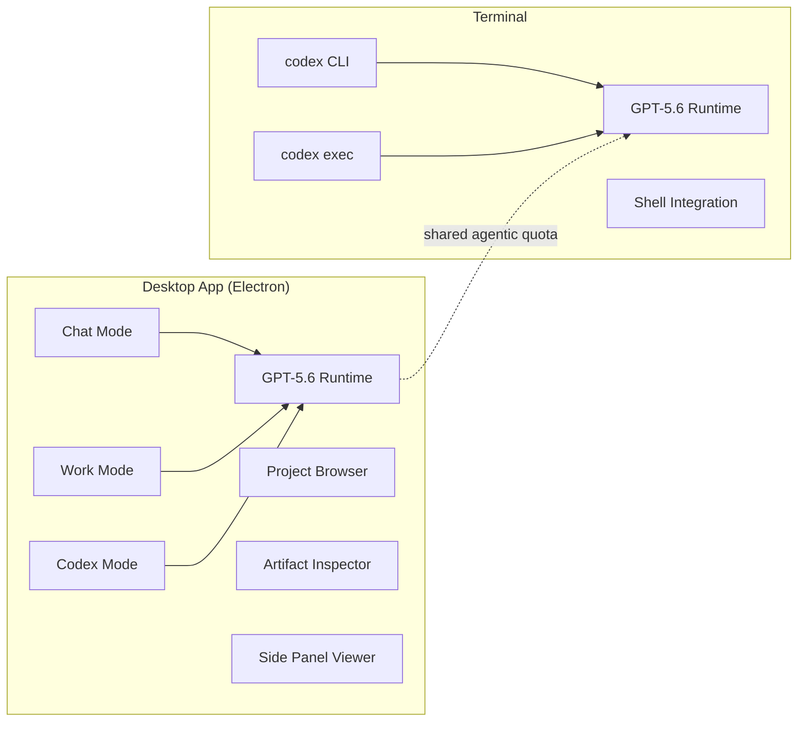
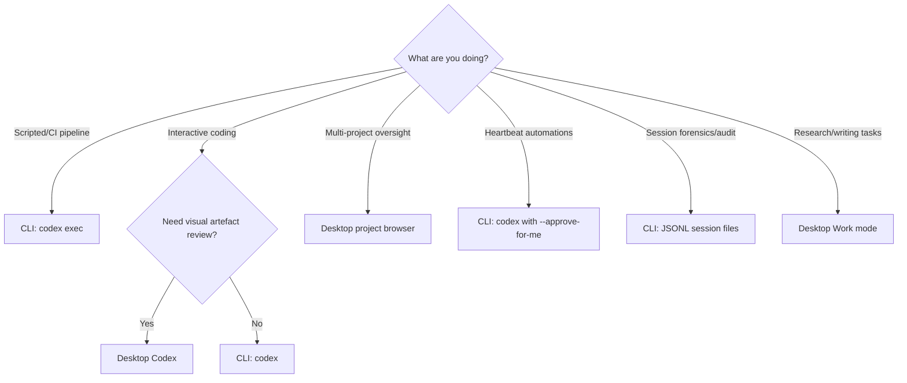

# Codex on Linux at Last: What the Desktop Preview Means for CLI Developers


---

On 11 August 2026, OpenAI shipped the ChatGPT desktop app for Linux in public preview, bringing Chat, Work, and Codex into a single native-ish window on Ubuntu, Debian, and Fedora [^1]. For the majority of Codex CLI users who already run Linux, the obvious question is: *does this change anything, or is it just a GUI wrapper I do not need?*

The answer sits somewhere between the two. The desktop app fills specific workflow gaps — visual project management, artifact inspection, parallel session oversight — while introducing its own friction points that CLI-native developers should understand before adopting it.

## What Shipped

The preview arrives as `.deb` and `.rpm` packages for x64 and ARM64, covering Ubuntu 24.04 LTS and 26.04 LTS, Debian 13, and Fedora 43 and 44 [^1]. The installer adds an OpenAI repository to your package manager, so updates deploy alongside your normal system packages.

Under the hood, the app is Electron-based [^2], sharing the same runtime and architecture as the macOS and Windows builds. It bundles the Codex execution environment — the same GPT-5.6 Sol/Terra/Luna models — alongside Chat and Work modes, all accessible from a single top-left menu switcher.

### Feature Matrix: Linux vs macOS

| Feature | macOS | Linux Preview |
|---|---|---|
| Chat, Work, Codex modes | ✅ | ✅ |
| Voice (GPT Live) | ✅ | ✅ |
| Local repo access | ✅ | ✅ |
| Computer Use (desktop control) | ✅ | ❌ |
| Record & Replay | ✅ | ❌ |
| Appshots | ✅ | ❌ |
| Import from Claude Code / Cursor | ✅ | ✅ |

The notable absentee is Computer Use — the ability to interact with desktop applications like LibreOffice or GIMP [^1]. Record & Replay, which captures demonstrated workflows as reusable skills, is also missing. These omissions are significant for developers who rely on GUI-mediated testing, but for terminal-centric workflows they are largely irrelevant.

## The Two-Surface Architecture

With the desktop preview, Linux developers now have two distinct surfaces for interacting with Codex:



Both surfaces draw from the same shared agentic credit pool [^3]. Running a heavy Codex Desktop session and a CLI `codex exec` pipeline simultaneously will consume from the same budget. This is not a concern for most individual developers, but teams running parallel agents across both surfaces need to account for it.

### What the Desktop Adds

**Visual project management.** The desktop app presents a project browser where you can keep multiple repositories and long-running tasks visible simultaneously. For developers juggling three or four concurrent Codex tasks — a common pattern with heartbeat automations [^4] — this is genuinely useful. The CLI's `codex sessions list` provides the same information, but the desktop's spatial layout makes oversight faster.

**Artifact inspection.** The side panel renders Markdown with annotations, spreadsheets with formula rendering, CSVs as tables, PDFs with LaTeX, and slides — all without leaving the app [^4]. If your Codex workflow produces documentation, reports, or data artefacts, the desktop panel eliminates the context switch to a separate viewer.

**Import from other tools.** The desktop can import instructions, settings, skills, plugins, projects, and recent work from Claude Code and Cursor, with automatic sync if enabled in Settings → Import [^1]. This supplements the CLI's existing `codex import` command (v0.145.0+) with a visual interface for the migration.

### What the CLI Still Does Better

**Scriptability.** `codex exec` pipes into shell workflows, CI/CD pipelines, and cron jobs. The desktop app has no equivalent — it is inherently interactive.

**Sandbox control.** The CLI's `--sandbox=landlock`, `--sandbox=seatbelt`, and `--sandbox=bubblewrap` flags give fine-grained isolation control [^5]. The desktop applies its own sandbox settings per-project without exposing the same configurability.

**Non-interactive automation.** The `--approve-for-me` flag (v0.147.0) enables unattended approval routing [^5]. Desktop Codex still requires manual interaction for approval gates.

**Session forensics.** CLI session JSONL files provide a complete, machine-parseable audit trail. Desktop sessions are stored in a different format with less direct access.

## Known Friction Points

### CLI Project Integration Gap

The most immediate annoyance: CLI projects on the same machine do not appear in the desktop app's project list [^2]. Sessions started with `codex` in the terminal show up as standalone chats rather than integrated projects. This means you cannot start work in the CLI and seamlessly continue it in the desktop, or vice versa. OpenAI has acknowledged this as a known limitation of the preview.

**Workaround:** Use `codex sessions list` to identify session IDs, then `codex resume <session-id>` in the terminal. Cross-surface session continuity is not yet available.

### Wayland vs X11

The desktop app defaults to X11 rather than auto-detecting Wayland [^2]. On high-DPI Wayland systems, this produces scaling issues. Users on Sway, Hyprland, or GNOME Wayland report blurry rendering until the environment variable `ELECTRON_OZONE_PLATFORM_HINT=auto` is set:

```bash
# Add to ~/.profile or shell rc file
export ELECTRON_OZONE_PLATFORM_HINT=auto
```

Input method support under Wayland is also patchy — Japanese IME and Korean Fcitx5 users need the `--enable-wayland-ime` flag [^2].

### Input Method and Virtual Keyboard Issues

Tools like `wtype` (used for automation under Hyprland/Wayland) are misinterpreted by the app's input handling [^2]. If your workflow involves virtual keyboard input for testing or automation, expect breakage.

## Configuration for Dual-Surface Workflows

For developers who want both surfaces, the practical setup is straightforward. Your `~/.codex/config.toml` is shared between CLI and desktop:

```toml
[model]
default = "o3"

[sandbox]
default = "landlock"

[approval]
policy = "on-failure"

[plugins]
marketplace_roots = ["https://plugins.openai.com/v1"]
```

AGENTS.md files, skills, and plugin configurations apply to both surfaces. The desktop reads the same workspace-level `.codex/` directory that the CLI uses.

However, there is one divergence: the desktop's per-project permission settings override CLI defaults when launching from the desktop. If you configure a project in the desktop UI to use a more permissive sandbox, that setting does not propagate to CLI sessions in the same directory.

## The Unofficial Alternative

Before the official preview, the community project `codex-desktop-linux` [^6] repackaged the official macOS app's signed Linux payload with over 30 optional Linux-specific enhancements, including Computer Use, Record & Replay, global dictation hotkeys, and performance workarounds — all disabled by default.

The unofficial build remains relevant because it offers features the official preview lacks:

- **Computer Use on Linux** (experimental, community-maintained)
- **AppImage and Arch pacman packages** (the official preview only ships `.deb` and `.rpm`)
- **NixOS flake support**

Both the official and unofficial apps share the same upstream Codex user profile but maintain separate package identities, so they can coexist on the same machine.

## When to Use Which Surface



The decision framework is simple:

- **CLI** for anything scriptable, automated, or requiring audit trails
- **Desktop** for visual oversight, artefact review, and Work-mode tasks
- **Both** for developers running parallel long-lived sessions who want the desktop as a dashboard while the CLI handles execution

## What Is Still Missing

The Linux preview is explicitly a preview, not GA. OpenAI advises against mission-critical use [^1]. The gaps that matter most for senior developers:

1. **No CLI ↔ Desktop session bridging.** You cannot hand off a session between surfaces.
2. **No Computer Use.** GUI-mediated testing workflows require the unofficial build or macOS.
3. **No Flatpak or AppImage.** Arch, NixOS, and non-Debian/RPM distributions need the unofficial project [^6].
4. **Wayland is second-class.** Scaling, input methods, and virtual keyboards all have rough edges.
5. **No Linux-specific sandbox hardening.** The desktop does not expose Landlock or Bubblewrap controls directly.

For CLI-native developers, the desktop preview is a useful addition to the toolkit rather than a replacement. The terminal remains the more powerful surface for code-centric work. But for the growing category of Codex Work tasks — research, document generation, multi-project coordination — the desktop fills a genuine gap that the CLI was never designed to address.

## Citations

[^1]: OpenAI, "Codex in ChatGPT desktop app for Linux is now in preview," OpenAI Developer Community, August 2026. [https://community.openai.com/t/codex-in-chatgpt-desktop-app-for-linux-is-now-in-preview/1390027](https://community.openai.com/t/codex-in-chatgpt-desktop-app-for-linux-is-now-in-preview/1390027)

[^2]: OpenAI Developer Community, forum discussion threads on Linux preview issues (CLI integration, Wayland, input methods), August 2026. [https://community.openai.com/t/codex-in-chatgpt-desktop-app-for-linux-is-now-in-preview/1390027/23](https://community.openai.com/t/codex-in-chatgpt-desktop-app-for-linux-is-now-in-preview/1390027/23)

[^3]: OpenAI Help Center, "ChatGPT Work and Codex," 2026. [https://help.openai.com/en/articles/20001275-chatgpt-work-and-codex](https://help.openai.com/en/articles/20001275-chatgpt-work-and-codex)

[^4]: Jason Liu, "Codex-maxxing," personal blog, May 2026. [https://jxnl.github.io/blog/writing/2026/05/10/codex-maxxing/](https://jxnl.github.io/blog/writing/2026/05/10/codex-maxxing/)

[^5]: OpenAI, "Release 0.147.0," GitHub, August 2026. [https://github.com/openai/codex/releases/tag/rust-v0.147.0](https://github.com/openai/codex/releases/tag/rust-v0.147.0)

[^6]: ilysenko, "codex-desktop-linux," GitHub, 2026. [https://github.com/ilysenko/codex-desktop-linux](https://github.com/ilysenko/codex-desktop-linux)
