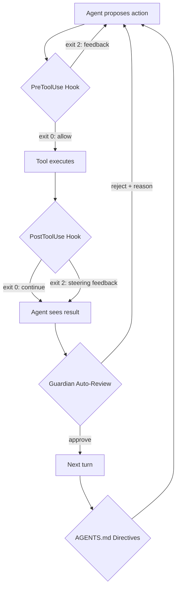
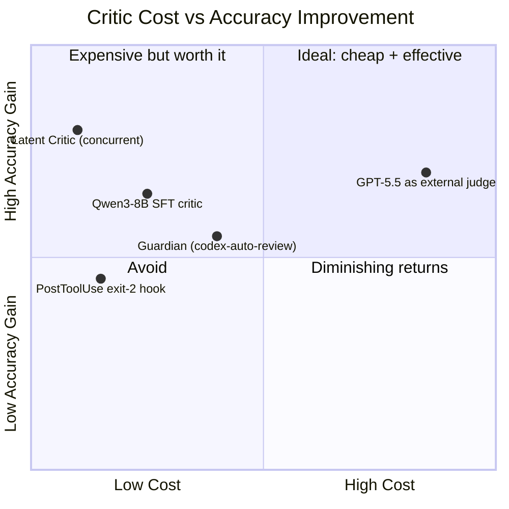
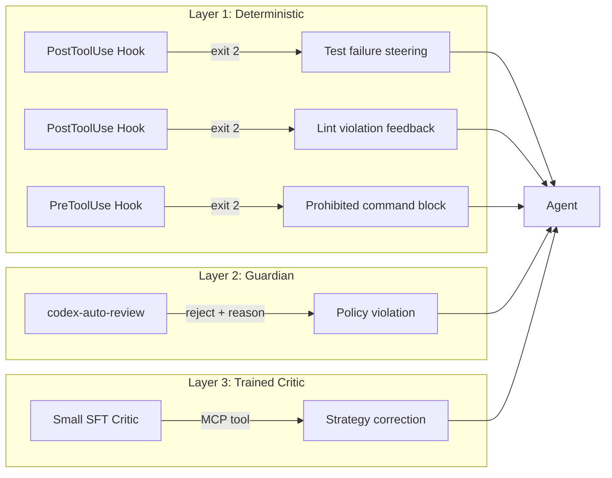

# The Critic Engineering Playbook: Building Steering and Detection Layers for Codex CLI


---

Coding agents fail in predictable ways: they hallucinate API calls, pick the wrong tool from an MCP stack, or charge down a dead-end strategy for six turns before realising the test suite is red. The emerging answer is not to retrain the agent but to bolt on a **critic layer** — a smaller, cheaper model that watches the primary agent's trajectory and steers it back on course in real time.

This playbook synthesises four converging lines of research into a practical Codex CLI configuration guide. By the end you will have a working critic architecture that uses Guardian, PostToolUse hooks, TOML agent definitions, and JSONL session traces to catch errors mid-trajectory rather than after the damage is done.

## The Case for Intra-Trajectory Criticism

Post-hoc code critics — models that score a completed trajectory — cannot redirect a wrong run. By the time a post-hoc scorer flags the problem, the agent has already written the wrong tests, committed the wrong migration, or burned through your token budget. Continued agent post-training couples strategy to execution and saturates quickly [^1].

The alternative is **intra-trajectory feedback**: a lightweight critic that reviews each step as it happens and injects steering signals before the next action. Gandhi et al. demonstrated this with a Qwen3-8B critic trained via supervised fine-tuning on Claude Opus 4.6 teacher trajectories [^1]. The results are striking:

- **+3.8 to +5.2 percentage points** on SWE-bench Verified across CWM-32B and two Qwen agents
- **30–92× cheaper** than the teacher model
- **Pareto-dominant** on Qwen3-Next-80B-A3B: 25.2% accuracy at \$0.04 per task vs 20.8% at \$0.11 unguided [^1]

Crucially, the critic transfers across agents it was never trained on. Error categories describe failure modes shared across models, so a critic trained on CWM-32B transfers to Qwen3-Next-80B-A3B and Qwen3-32B without retraining [^1].

## Codex CLI's Critic Surfaces

Codex CLI v0.147.0 provides four integration points for critic logic [^2]:



### 1. Guardian Auto-Review

The Guardian is a reviewer subagent that sits between the primary agent and sensitive operations — shell execution, file writes, network access, and MCP tool invocations [^2]. Since PR #18169 (April 2026), it uses the purpose-built `codex-auto-review` model rather than a general-purpose GPT slug [^3]. The Guardian session persists across approvals to reuse prompt cache, making it cheap for repeated reviews within a single Codex session.

Guardian operates as a **detective and corrective** control: it cannot prevent the agent from proposing a bad action, but it can block execution and feed a rejection reason back into the conversation context.

### 2. PostToolUse Hooks with Exit Code 2

PostToolUse hooks fire after any tool executes. The exit code protocol gives you a precise steering channel [^4]:

| Exit Code | Behaviour |
|-----------|-----------|
| `0` | Success; parse stdout for JSON or treat as no-op |
| `2` | Surface stderr content as feedback to the model |
| Other | Hook failure; operation proceeds (fail-open) |

Exit code 2 is the critical mechanism: it lets a hook script run a critic check against the tool output and inject **specific, localised feedback** that the agent sees on its next turn. This mirrors the finding from Vijayvargiya & Lokesh that specific feedback yields a 37.0% recovery rate versus 23.9% for generic blocking [^5].

### 3. TOML Agent Definitions

Custom agents are defined in `~/.codex/agents/<name>.toml` (personal) or `.codex/agents/<name>.toml` (project-scoped) [^6]:

```toml
[agent]
name = "critic"
description = "Intra-trajectory critic for strategy-level steering"
model = "gpt-4o-mini"
reasoning_effort = "low"

[agent.developer_instructions]
content = """
You are a code review critic. After each tool execution:
1. Check whether the action aligns with the task specification in AGENTS.md.
2. If the action diverges, emit a concise strategy-level correction.
3. Never propose implementation — only steer.
Concise prompts outperform detailed action-level prompts in critic distillation.
"""
```

The key insight from the "Steer, Don't Solve" research is that **concise strategy-level prompts outperform detailed action-level prompts** in critic training and distillation [^1]. Your TOML agent instructions should describe *what to watch for*, not *how to fix it*.

### 4. AGENTS.md Strategic Directives

AGENTS.md serves as the specification surface against which a critic can verify agent behaviour [^2]. A well-structured AGENTS.md acts as the ground truth for specification-grounding checks — the critic compares the agent's actions against the stated constraints, patterns, and prohibited behaviours.

## Building a PostToolUse Critic Hook

Here is a minimal PostToolUse hook that runs a critic check after every Bash command:

```bash
#!/usr/bin/env bash
# hooks/critic.sh — PostToolUse steering hook
# Exit 2 + stderr = feedback to agent; Exit 0 = pass

set -euo pipefail

# Read the tool output from stdin (JSON payload)
INPUT=$(cat)
COMMAND=$(echo "$INPUT" | jq -r '.tool_input.command // empty')
OUTPUT=$(echo "$INPUT" | jq -r '.tool_response.output // empty')
EXIT_CODE=$(echo "$INPUT" | jq -r '.tool_response.exit_code // 0')

# Skip non-Bash or successful test runs
if [[ -z "$COMMAND" ]]; then
  exit 0
fi

# Example: flag test failures with steering feedback
if [[ "$EXIT_CODE" != "0" ]] && echo "$COMMAND" | grep -qE '(pytest|npm test|cargo test)'; then
  echo "Test failure detected after: $COMMAND" >&2
  echo "STEERING: Re-read the failing test output above. Identify the root cause before changing any implementation files. Do not retry the same approach." >&2
  exit 2
fi

exit 0
```

Register it in your project's `codex.toml`:

```toml
[[hooks.PostToolUse]]
matcher = "^Bash$"
command = "bash .codex/hooks/critic.sh"
timeout = 5
statusMessage = "Running critic check..."
```

## The Latent Critic: Concurrent Detection Without Latency

For teams building custom tooling around Codex CLI, the Latent Critic architecture from Vijayvargiya & Lokesh offers a glimpse of the next generation of critic engineering [^5].

The Latent Critic is a lightweight LoRA adapter (rank 64) that operates **concurrently** during a frozen base model's generation. Rather than running a separate inference call, it restructures the transformer's residual stream to amplify latent grounding signals [^5]. The results:

| Metric | Latent Critic | External Judge | Semantic Entropy |
|--------|--------------|----------------|------------------|
| ID AUROC | 0.966 | ~0.92 | ~0.88 |
| OOD AUROC | 0.925 | ~0.87 | ~0.82 |
| Latency | <10 ms | 884 ms | >12 s |

The critical distinction is between **specification-grounding** and **factual hallucination**. In the Latent Critic evaluation, 51.1% of hallucinated values actually appear in the context — they are real values applied to the wrong parameter. Another 26.8% of correctly grounded values are absent lexically from the specification but are valid inferences [^5]. A naive keyword-matching hook would fail on both counts.

This has direct implications for PostToolUse hook design: your critic logic should check **parameter-level grounding** against the specification, not just whether the output "looks right".

## Cost-Accuracy Trade-Off Calculator

The economics of critic engineering come down to a simple ratio: **critic cost per turn** versus **wasted cost from unsteered failures**.



For a typical Codex CLI session:

- **PostToolUse shell script**: essentially free — runs locally, no API calls
- **Guardian auto-review**: uses `codex-auto-review` model, roughly \$0.001–0.003 per review [^3]
- **Small SFT critic (Qwen3-8B)**: 30–92× cheaper than a teacher model, ~\$0.04 per full task [^1]
- **Full external judge (GPT-5.5)**: ~\$0.11+ per task, diminishing marginal returns [^1]

The optimal stack layers these from cheapest to most expensive: deterministic hooks catch the obvious failures, Guardian catches policy violations, and a small critic model handles strategy-level steering for complex tasks.

## Critic Training from JSONL Session Traces

Codex CLI stores complete session traces as JSONL rollout files at `~/.codex/sessions/YYYY/MM/DD/rollout-*.jsonl` [^4]. Each line contains a typed event: user prompts, model responses, tool calls, tool results, approval decisions, and token usage counters.

These traces are a natural training corpus for critic models. The pipeline:

1. **Collect trajectories** from successful and failed sessions
2. **Label failure points** — the turn where the agent diverged from a correct strategy
3. **Extract (context, critic_feedback) pairs** — the state before the failure and the steering signal that would have prevented it
4. **Fine-tune a small model** (Qwen3-8B or equivalent) via SFT on these pairs
5. **Deploy as a PostToolUse hook** or MCP server that the Guardian can query

The "Steer, Don't Solve" research shows that training on **cross-agent trajectories** produces more robust critics than training on a single agent's traces [^1]. If your team uses multiple model configurations (e.g., `o3` for complex tasks, `codex-mini-latest` for routine work), train your critic on traces from all of them.

## Putting It Together: A Three-Layer Critic Architecture



**Layer 1 — Deterministic hooks** catch known failure patterns: test failures, lint violations, prohibited commands, file writes to protected paths. These are shell scripts with zero API cost and sub-second latency.

**Layer 2 — Guardian** handles approval-gated operations with the `codex-auto-review` model. It persists across the session, reusing prompt cache for efficiency.

**Layer 3 — Trained critic** provides strategy-level steering for complex multi-step tasks. Deployed as an MCP server or a TOML-defined subagent, it reviews the trajectory context and emits concise corrections.

The layers are additive: each catches failures that the previous layer misses, at progressively higher cost per intervention.

## Current Gaps and Future Directions

Codex CLI v0.147.0 does not yet provide:

- **Native intra-trajectory review loop** — hooks fire after tool execution, not during agent reasoning. There is no hook point between the agent's chain-of-thought and its action proposal. ⚠️
- **Trajectory serialisation API for hooks** — hooks receive the current tool call context but lack a clean API to query the full trajectory history. Workaround: read the rollout JSONL directly.
- **Budget-aware submission pressure** — no mechanism to tell the agent "you have 3 turns left, converge now". The critic must encode this logic itself.
- **Adapter injection path** — the Latent Critic's concurrent LoRA approach requires model-level integration that is not available through API-hosted models. ⚠️

These gaps are narrowing. The hooks system has been stable since v0.124.0 and gains new event types regularly. Agent Plugins 1.0 (v0.147.0) opens shared context channels that could carry critic signals between plugin boundaries [^2].

## Recommendations

1. **Start with deterministic PostToolUse hooks** — they are free, fast, and catch the majority of obvious failures
2. **Configure Guardian with specific AGENTS.md constraints** — give the reviewer a clear specification to check against
3. **Train a small critic on your own JSONL traces** once you have 50+ labelled failure trajectories
4. **Keep critic prompts concise and strategy-level** — detailed action-level instructions degrade performance [^1]
5. **Measure critic ROI** by comparing token spend and success rates between critic-guided and unguided sessions on the same task set

---

## Citations

[^1]: Gandhi, R., Xie, S., Naik, A., Zhu, J. & Rose, C. (2026). "Steer, Don't Solve: Training Small Critic Models for Large Code Agents." arXiv:2606.21811. [https://arxiv.org/abs/2606.21811](https://arxiv.org/abs/2606.21811)

[^2]: OpenAI (2026). Codex CLI v0.147.0 documentation — hooks, Guardian, AGENTS.md, Agent Plugins 1.0. [https://github.com/openai/codex](https://github.com/openai/codex)

[^3]: Vaughan, D. (2026). "Purpose-Built Agent Models: What codex-auto-review Tells Us About the Future of Specialised AI." Codex Knowledge Base. [https://codex.danielvaughan.com/2026/04/17/purpose-built-agent-models-codex-auto-review/](https://codex.danielvaughan.com/2026/04/17/purpose-built-agent-models-codex-auto-review/)

[^4]: Vaughan, D. (2026). "Codex CLI Hooks: Complete Guide to Events, Policy Engines and Production Patterns." Codex Knowledge Base. [https://codex.danielvaughan.com/2026/04/15/codex-cli-hooks-complete-guide-events-policy-patterns/](https://codex.danielvaughan.com/2026/04/15/codex-cli-hooks-complete-guide-events-policy-patterns/)

[^5]: Vijayvargiya, A. & Lokesh, S. (2026). "Actionable Hallucination Detection: Translating Latent Uncertainty into Agentic Critique." Samsung Research America. arXiv:2608.10430. [https://arxiv.org/abs/2608.10430](https://arxiv.org/abs/2608.10430)

[^6]: Vaughan, D. (2026). "Codex CLI Custom Agent Definitions: Building Specialised Subagents with TOML Configuration." Codex Knowledge Base. [https://codex.danielvaughan.com/2026/04/27/codex-cli-custom-agent-definitions-toml-specialised-subagents/](https://codex.danielvaughan.com/2026/04/27/codex-cli-custom-agent-definitions-toml-specialised-subagents/)
