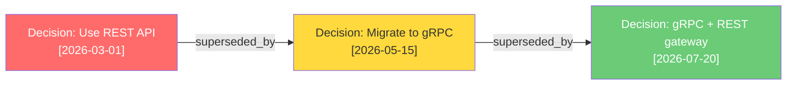
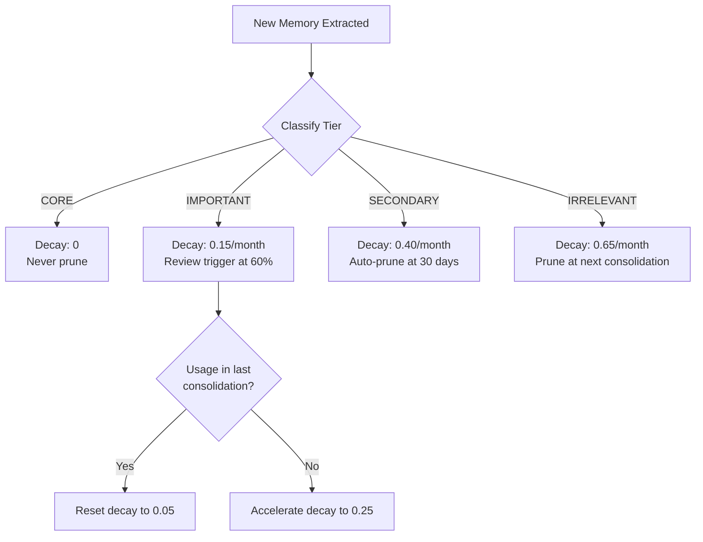
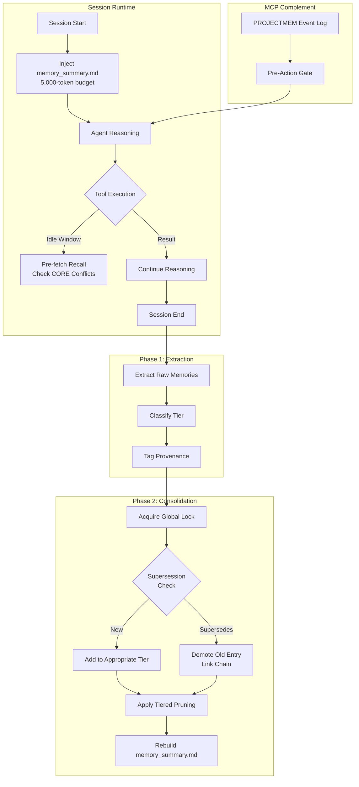

# The Memory Architecture Playbook: From Flat Text to Hierarchical Retention in Codex CLI


---

## The Problem with Flat Memory

Codex CLI's built-in memory system is, by 2026 standards, remarkably capable — and structurally insufficient. The two-phase pipeline extracts memories from session rollouts, consolidates them into `MEMORY.md` via a diff-aware sub-agent, and injects a 5,000-token summary (`memory_summary.md`) into every session's developer instructions [^1]. Retrieval is linear grep over `MEMORY.md` when the summary falls short [^2].

This works well for small projects. It breaks down predictably as projects grow:

- **No importance hierarchy.** A one-off debugging note occupies the same tier as a critical architectural decision. The consolidation agent cannot distinguish between them because no importance metadata exists.
- **No supersession tracking.** When a decision reverses — say, migrating from REST to gRPC — the old memory persists alongside the new one. The agent may retrieve the stale entry first.
- **No structured forgetting.** The 30-day `max_unused_days` pruning is a blunt instrument: it removes anything unreferenced regardless of importance, and keeps low-value noise that happens to get cited [^1].
- **No idle-window utilisation.** While Codex waits for tool execution results, the reasoning pipeline sits idle — time that could be spent on memory maintenance, pre-retrieval, or speculative recall [^3].

Five recent research papers converge on the thesis that these are not configuration problems but architectural gaps. This playbook synthesises their findings into practical patterns you can implement today.

## The Four-Tier Memory Hierarchy

SF-AMS introduces a four-layer hierarchical store with empirically validated retention rates [^4]:

| Tier | Forgetting Rate | Contents |
|------|----------------|----------|
| **Core** | 0% | Architectural decisions, invariants, API contracts |
| **Important** | ~15% | Active feature context, recent design rationale |
| **Secondary** | ~40% | Debugging notes, temporary workarounds |
| **Irrelevant** | ~65% | Superseded decisions, one-off observations |

The key innovation is *Composite Importance Scoring* — combining semantic salience with entity-type priors rather than relying solely on recency or usage count. On the LoCoMo benchmark, SF-AMS achieves +9.65 F1 on multi-hop queries and +6.91 F1 on temporal queries compared to flat retrieval, whilst reducing LLM calls by 46.7% versus LangMem [^4].

### Implementing Tiers in AGENTS.md

Codex CLI does not natively support memory tiers, but you can approximate them through AGENTS.md directives and manual file organisation:

```markdown
## Memory Governance

### Tier Classification
When consolidating memories, classify each entry:
- **CORE**: Architectural decisions, API contracts, invariants.
  Never prune. Prefix with `[CORE]` in MEMORY.md.
- **IMPORTANT**: Active feature context, design rationale for current sprint.
  Review monthly. Prefix with `[IMP]`.
- **SECONDARY**: Debugging notes, temporary workarounds.
  Auto-prune after 14 days unused. Prefix with `[SEC]`.
- **IRRELEVANT**: Superseded decisions, one-off observations.
  Prune immediately during consolidation.

### Consolidation Rules
- Before adding a new memory, check if it supersedes an existing entry.
  If so, move the old entry to IRRELEVANT and add a `superseded_by:` reference.
- Never exceed 80 CORE entries. If approaching limit, review for demotion.
```

This leverages the consolidation sub-agent's ability to follow AGENTS.md instructions during the Phase 2 merge [^1].

## Supersession Chains

MOOSEDev demonstrates why supersession tracking matters: in a 835-record evaluation, its ontology-grounded knowledge graph achieved 0.98 accuracy on supersession queries versus 0.27 for vector retrieval [^5]. The difference is structural — vector stores have no concept of "this fact replaces that fact."



Without supersession chains, the consolidation agent might surface any of these three entries. With them, it always retrieves the current decision and can trace the rationale backwards.

### Practical Supersession via PostToolUse Hooks

You can enforce supersession tracking through a PostToolUse hook that fires after memory writes:

```bash
#!/bin/bash
# hooks/memory-supersession-check.sh
# PostToolUse hook: validates supersession references after memory consolidation

if [[ "$CODEX_TOOL_NAME" == "write" ]] && [[ "$CODEX_FILE_PATH" == *"MEMORY.md"* ]]; then
  # Check for entries missing supersession references
  orphaned=$(grep -c '^\[CORE\]\|^\[IMP\]' "$CODEX_FILE_PATH" | head -1)
  duplicates=$(grep -oP '(?<=Decision: ).*' "$CODEX_FILE_PATH" | sort | uniq -d)

  if [ -n "$duplicates" ]; then
    echo "WARNING: Duplicate decision entries found without supersession chain:" >&2
    echo "$duplicates" >&2
    exit 2  # Signal specific feedback to the agent
  fi
fi
```

Exit code 2 provides specific feedback to the agent rather than a generic rejection, matching the pattern described in the Codex CLI hooks documentation [^1].

## Utility-Driven Pruning Policies

The default 30-day `max_unused_days` window treats all memories equally. SF-AMS's survival potential dynamics offer a better model [^4]:



You can implement tiered pruning through a scheduled script that runs before Codex CLI sessions:

```bash
#!/bin/bash
# scripts/memory-prune.sh
# Run before starting a new session to enforce tiered retention

MEMORY_FILE="$HOME/.codex/memories/MEMORY.md"
DAYS_SECONDARY=14
DAYS_IMPORTANT=60

# Prune IRRELEVANT entries immediately
sed -i '/^\[IRR\]/d' "$MEMORY_FILE"

# Prune SECONDARY entries older than 14 days with no recent usage
# (Simplified — production version should check usage_count)
find "$HOME/.codex/memories/rollout_summaries/" -name "*.md" -mtime +$DAYS_SECONDARY \
  -exec grep -l '\[SEC\]' {} \; -delete 2>/dev/null

echo "Memory pruning complete. Remaining entries:"
grep -c '^\[CORE\]\|^\[IMP\]\|^\[SEC\]' "$MEMORY_FILE"
```

## Idle-Window Reasoning for Memory Maintenance

Second Thought demonstrates that the reasoning idle window — the time an agent spends waiting for tool execution results — can be productively filled with parallel auxiliary tasks [^3]. Across SWE-bench Pro, Terminal-Bench 2.1, and τ³-bench, the technique reduced main-thread decoding time by up to 43% (average 20%) and turn counts across all nine model-benchmark pairs [^3].

Applied to memory, this suggests three idle-window tasks:

1. **Recall branch**: Pre-fetch potentially relevant memories before the tool result arrives, reducing retrieval latency in the next reasoning step.
2. **Rehearse branch**: Preview how the next action will affect the memory state, allowing proactive consolidation.
3. **Check branch**: Validate that the current plan aligns with CORE memory entries, catching contradictions before they manifest as bugs.

Codex CLI v0.147.0 does not yet support intra-turn parallelism [^3], but you can approximate the recall branch through AGENTS.md directives:

```markdown
## Pre-Retrieval Strategy

Before executing any file modification:
1. Grep MEMORY.md for entries related to the target file or module.
2. Check for any [CORE] entries about the module's API contract.
3. Check for any supersession chains affecting the current approach.
4. Only proceed with the modification after confirming no conflicts.
```

## Event-Sourced Memory as a Complement

PROJECTMEM introduces a complementary pattern: rather than relying solely on the consolidation agent's summarisation, maintain an append-only event log of typed events — issues, attempts, fixes, decisions, and notes — and deterministically project that log into compact summaries served via MCP [^6].

The key insight is *Memory-as-Governance*: the memory layer does not merely answer queries but gates the agent's next action. PROJECTMEM's pre-action gate warns an agent before it repeats a previously failed fix or edits a known-fragile file [^6].

This pattern integrates naturally with Codex CLI's MCP server support:

```toml
# ~/.codex/config.toml
[mcp_servers.projectmem]
command = "python"
args = ["-m", "projectmem", "serve"]
env = { PROJECTMEM_ROOT = ".projectmem" }
```

The MCP server then provides 14 tools that Codex CLI can call for memory operations, including `log_decision`, `check_approach`, and `get_file_history` [^6]. ⚠️ Integration specifics may vary depending on PROJECTMEM version; check the project's documentation for current MCP tool names.

## Provenance-Grounded Retrieval

Eywa highlights a structural flaw in most memory systems: they collapse source evidence, extracted facts, and retrieved context into one opaque prompt path [^7]. When a memory entry produces a wrong answer, there is no way to trace *why* without re-reading the original session.

Eywa's solution — storing immutable source evidence before deriving canonical facts — maps to a practical AGENTS.md pattern:

```markdown
## Memory Provenance

Every [CORE] or [IMP] memory entry must include:
- **Source**: The session ID or commit hash where this was established
- **Evidence**: The specific observation or test result that supports it
- **Confidence**: HIGH (verified by test), MEDIUM (observed but untested), LOW (inferred)

Example:
[CORE] API rate limit is 1000 req/min per key
  Source: session-2026-07-15-abc123
  Evidence: Confirmed via load test in PR #847
  Confidence: HIGH
```

This structure enables the agent to weight memories by confidence during retrieval and to trace back to source evidence when entries conflict.

## The Complete Architecture

Combining these patterns produces a memory architecture that addresses all four gaps identified at the outset:



## What You Can Do Today

Not all of this requires waiting for Codex CLI to implement native support. Here is a prioritised checklist:

1. **Add tier prefixes to MEMORY.md** — Manually tag existing entries with `[CORE]`, `[IMP]`, `[SEC]`, or `[IRR]`. Add AGENTS.md directives for the consolidation agent to maintain them.

2. **Write a supersession check hook** — A PostToolUse hook that detects duplicate decision entries in MEMORY.md and signals exit code 2 for agent correction.

3. **Install PROJECTMEM as an MCP server** — Gain event-sourced memory and pre-action gates immediately, complementing the native memory pipeline.

4. **Implement tiered pruning** — A pre-session script that enforces different retention windows per tier, replacing the flat 30-day window.

5. **Add provenance metadata to CORE entries** — Start with high-value architectural decisions; extend to IMPORTANT entries as the habit develops.

6. **Pre-retrieval directives in AGENTS.md** — Instruct the agent to grep MEMORY.md for relevant context before file modifications, approximating the idle-window recall branch.

The research is clear: flat-text memory is structurally insufficient for long-lived projects. The good news is that Codex CLI's extensibility — through AGENTS.md, hooks, and MCP servers — provides enough surface area to implement most of these patterns today, without waiting for native support.

---

## Citations

[^1]: Codex CLI Memory Internals: Pipelines, Secret Sanitisation and Intelligent Forgetting. Codex Knowledge Base, April 2026. [https://codex.danielvaughan.com/2026/04/08/codex-cli-memory-internals/](https://codex.danielvaughan.com/2026/04/08/codex-cli-memory-internals/)

[^2]: Memory Lifecycle Management: Create, Consolidate, Clean, Delete in Codex CLI. Codex Knowledge Base, April 2026. [https://codex.danielvaughan.com/2026/04/15/memory-lifecycle-management-codex-cli/](https://codex.danielvaughan.com/2026/04/15/memory-lifecycle-management-codex-cli/)

[^3]: Sun, Z., Yang, C., Lyu, Y., Shi, J. & Lo, D. "Second Thought: Reasoning in Parallel as LLM Agents Act and Observe." arXiv:2608.13667, August 2026. [https://arxiv.org/abs/2608.13667](https://arxiv.org/abs/2608.13667)

[^4]: Yang, Li, Shen, Zhou, Zhang, Li & Zhang. "SF-AMS: Strategic Forgetting for Structured Memory in LLM Agent." arXiv:2607.22562, May 2026. [https://arxiv.org/abs/2607.22562](https://arxiv.org/abs/2607.22562)

[^5]: Adam. "Ontology-Grounded Project Memory for Coding Agents." arXiv:2608.13662, August 2026. [https://arxiv.org/abs/2608.13662](https://arxiv.org/abs/2608.13662)

[^6]: Malo, R.C. & Qiu, T. "PROJECTMEM: A Local-First, Event-Sourced Memory and Judgment Layer for AI Coding Agents." arXiv:2606.12329, June 2026. [https://arxiv.org/abs/2606.12329](https://arxiv.org/abs/2606.12329)

[^7]: Joshi, R. "Eywa: Provenance-Grounded Long-Term Memory for AI Agents." arXiv:2605.30771, May 2026. [https://arxiv.org/abs/2605.30771](https://arxiv.org/abs/2605.30771)
