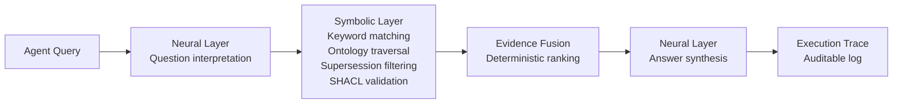

# Ontology-Grounded Project Memory and the Structured Reasoning Gap: What MOOSEDev Reveals About Codex CLI's Flat Memory Model


---

Codex CLI's Memories system is one of the more sophisticated context-persistence mechanisms in the terminal agent ecosystem. The two-phase pipeline — extract from idle sessions, consolidate into `MEMORY.md`, inject a 5,000-token summary at session start — means the agent learns from your work without you managing a database[^1]. But there is a category of question that flat-text memory fundamentally cannot answer: *What is the current architectural guidance for component X, and what did it supersede?*

A paper published on 13 August 2026, accepted at the NeSy 2026 Industry Track, demonstrates exactly where the boundary lies — and what a structured alternative looks like in practice[^2].

## The Paper: MOOSEDev

James Adam's "Ontology-Grounded Project Memory for Coding Agents" introduces MOOSEDev, a neurosymbolic memory system that replaces vector retrieval with a knowledge graph built on two small OWL ontologies — a software-engineering ontology (9 classes) and a software-architecture ontology (11 classes), comprising 51 properties in total[^2]. Records capture architectural decisions, lessons, constraints, rationales, and anti-patterns with typed attributes including lifecycle status, provenance, author, and timestamp.

The critical design move: records carry explicit supersession links forming chains through time. When an agent requests current guidance, the retrieval engine excludes superseded records by construction — not by similarity ranking, not by recency heuristic, but by deterministic graph traversal[^2].

## Where Structured Memory Categorically Wins

The evaluation compared five conditions using 835 typed records from the CodeGraph open-source developer tool, all running identical CLI agent configuration against GPT-5.x models[^2]:

| Task Class | MOOSEDev (B2) | Mem0 Vector (B1-mem0) | Flat Notes (B1-notes) |
|---|---|---|---|
| Set completeness | 1.00 | 0.18 | 0.08 |
| Negation (absence) | 0.98 | 0.06 | 0.00 |
| Supersession traversal | 0.98 | 0.27 | 0.12 |
| Relevance retrieval | 0.82 | 0.67–0.90 | — |

Three categories of question expose the gap:

**Set completeness.** "List all accepted constraints affecting the authentication module." Vector retrieval returns ranked slices — it cannot guarantee enumeration. The graph traverses component associations and filters by lifecycle status deterministically[^2].

**Negation.** "Which decisions have no recorded rationale?" This is fundamentally a closed-world query. You need to know the complete set, then identify what is missing. Similarity search cannot reason about absence[^2].

**Supersession.** "What replaced the event-sourcing approach for state management?" This requires following typed edges through time. Vector embeddings encode semantic similarity, not temporal replacement relationships[^2].

On relevance retrieval — the category where you want ranked, approximate answers — both systems converge. MOOSEDev scored 0.82 at ~35k tokens; Mem0 scored 0.67–0.90 at ~40k tokens[^2]. For "find me something relevant about authentication," flat retrieval works perfectly well.

## Currency by Construction

The most striking result: across four real-world reversal pairs, four models, and two delivery regimes (40 total trials), the knowledge graph served current answers 100% of the time. The vector baseline tied on one reversal pair; BM25 search over flattened content delivered current information in only 8% of relevant trials[^2].

This matters because architectural guidance changes. Teams migrate from REST to gRPC, swap ORMs, deprecate internal libraries. A flat memory system that surfaces "the most relevant" memory about database access might return guidance that was superseded six months ago — and the agent has no mechanism to know this.

## The MOOSE Neurosymbolic Engine

The underlying architecture treats the LLM as what Adam calls "an unreliable, albeit useful sensor"[^2]. The reasoning pipeline separates concerns:



The symbolic layer handles the structural work: keyword and structural matching, ontology traversal, deterministic evidence fusion, and SHACL validation. The neural layer handles two narrow tasks: interpreting the natural-language question and synthesising the final answer. Small models in the 8–32B range suffice for the neural component[^2].

Every step is logged in an auditable execution trace — a property that matters for enterprise adoption where "the agent told me" is not an acceptable justification for an architectural decision.

## MCP as the Integration Surface

MOOSEDev exposes capabilities through the Model Context Protocol as four tool groups[^2]:

- **Typed capture** — structured record creation with ontology validation
- **Reading** — context retrieval, natural-language query, and SPARQL
- **Lifecycle management** — status transitions, supersession declarations
- **Integrity operations** — validation, consistency checks

This is significant because Codex CLI v0.147.0 ships with full MCP 2026-07-28 support including paginated discovery[^3]. A MOOSEDev-style memory server could, in principle, run alongside Codex CLI's native Memories as a complementary MCP tool server — the native system handling relevance-ranked recall, the knowledge graph handling structural queries.

## Mapping to Codex CLI's Memory Architecture

Codex CLI v0.147.0's Memories system operates as a two-phase background pipeline[^1]:

1. **Phase 1 (extraction):** After sessions go idle, an extract model identifies memories from rollout summaries
2. **Phase 2 (consolidation):** A separate sub-agent merges raw extractions into `MEMORY.md`
3. **Injection:** At session start, `memory_summary.md` is truncated to a 5,000-token budget and inserted into developer instructions

This pipeline handles relevance recall well — the consolidation pass surfaces patterns, preferences, and learned facts. But it has no concept of:

- **Typed relationships** between memories (rationale → decision, constraint → component)
- **Supersession chains** (memory A was replaced by memory B)
- **Lifecycle status** (accepted, deprecated, superseded)
- **Set completeness** (enumerate all memories affecting module X)
- **Negation** (which components have no recorded constraints?)

The 30-day decay mechanism — rollouts unused for 30 days are aged out, individual memories unrecalled for 30 days are pruned[^1] — is a recency heuristic, not a supersession model. A frequently-recalled but outdated memory survives; a rarely-recalled but current one might not.

### The AGENTS.md Bridge

`AGENTS.md` partially fills the structured-knowledge role. Teams use it to encode architectural constraints, naming conventions, and technology choices as static developer instructions[^4]. But `AGENTS.md` has no versioning, no supersession tracking, and no programmatic query interface. It is a document, not a knowledge base.

```toml
# config.toml — MCP server for structured project memory
[mcp_servers.project-memory]
command = "npx"
args = ["moosedev-mcp", "--store", ".codex/project-memory.db"]
```

A hypothetical configuration wiring a MOOSEDev-style MCP server into Codex CLI would give agents access to structured queries alongside native Memories — but the capture discipline problem remains.

## The Capture Discipline Problem

MOOSEDev's advantage depends entirely on correct capture. As Adam notes: "Flat capture degrades the graph to free-text parity, and that discipline imposes friction that a vector store does not"[^2].

Codex CLI's native Memories extract automatically from session transcripts — zero friction, reasonable quality. A knowledge graph demands structured input: typed records, explicit supersession declarations, component associations. In the live trial, MOOSEDev provided 71 unprompted assists citing relevant records over 21 days, with 38 misses (35 from one project with thinner commit history)[^2].

The temporal bootstrap mechanism — walking repository history commit-by-commit to extract typed records with historical timestamps — partially addresses cold-start. Over MOOSEDev's own codebase, it recovered seven authentic supersession chains from commit metadata and code structure deltas[^2]. This is clever but limited: commit messages are notoriously unreliable as architectural documentation.

## What Codex CLI Could Learn

The paper's most actionable insight is not "replace flat memory with a knowledge graph" — that would sacrifice the zero-friction capture that makes Codex CLI's Memories actually get used. Instead, the insight is that three specific query patterns fail categorically with flat retrieval:

1. **Completeness queries** — "list everything affecting X"
2. **Negation queries** — "what is missing from X?"
3. **Currency queries** — "what is the current guidance, accounting for what was replaced?"

### Practical Mitigations Today

Without waiting for upstream changes, teams can partially address these gaps:

**Structured `AGENTS.md` with manual supersession markers:**

```markdown
## Architectural Decisions

### AD-007: Use gRPC for internal service communication
- **Status:** ACCEPTED
- **Supersedes:** AD-003 (REST for internal APIs)
- **Rationale:** Latency requirements for real-time pipeline
- **Components:** order-service, inventory-service, pricing-engine

### AD-003: REST for internal APIs ~~SUPERSEDED by AD-007~~
```

**PostToolUse hooks as capture triggers:**

A PostToolUse hook could detect architectural-decision-shaped outputs (files modified across service boundaries, new dependency introductions, configuration changes) and prompt for structured capture into a project-level knowledge store.

**MCP memory servers with typed schemas:**

The existing MCP memory server ecosystem[^5] includes servers with structured schemas. Wiring one alongside native Memories gives agents access to both relevance-ranked recall and structured queries — different tools for different question types.

## The Scale Invariance Finding

One result deserves particular attention: from 50 to 634 records, the graph maintained a constant offset advantage (hit@5: 0.84 vs. 0.60 for the vector baseline) with the slope confidence interval spanning zero[^2]. The structured approach did not compound its advantage as the store grew — but neither did it degrade. For teams accumulating project knowledge over months or years, this means the graph's structural advantage persists without the relevance-ranking degradation that plagues growing vector stores.

## Identified Gaps in Codex CLI

| Capability | MOOSEDev | Codex CLI v0.147.0 |
|---|---|---|
| Relevance-ranked recall | Comparable (0.82) | Native Memories pipeline |
| Set completeness queries | 1.00 recall | Not supported |
| Negation queries | 0.98 recall | Not supported |
| Supersession tracking | Deterministic graph traversal | 30-day recency decay |
| Typed relationships | OWL ontology + SHACL | Flat text in `MEMORY.md` |
| Capture friction | High (structured input required) | Zero (automatic extraction) |
| Auditable reasoning trace | Full execution logging | Not available |
| MCP integration path | Native MCP tool server | MCP server config in `config.toml` |

The fundamental tension: zero-friction capture produces memories that work for relevance retrieval but fail for structural reasoning. Structured capture produces memories that handle structural queries but imposes adoption friction. The most promising path forward is likely a hybrid — automatic flat capture for the common case, with structured capture affordances for architectural decisions that warrant the overhead.

## Conclusions

MOOSEDev demonstrates that the gap between flat and structured memory is not one of degree but of kind. For relevance retrieval, both approaches converge. For completeness, negation, and currency queries, the advantage is categorical — vector systems cannot answer these questions at any cost[^2].

For Codex CLI practitioners, the immediate takeaway is architectural: if your project memory needs extend beyond "remind me of something relevant," you need a structured layer. Today, that means an MCP memory server running alongside native Memories. Tomorrow, it might mean upstream support for typed memory records with lifecycle status and supersession tracking in the Memories pipeline itself.

The paper's honest assessment of capture discipline as the primary adoption barrier is refreshing. Ontology-grounded memory is not a drop-in replacement — it is a different tool for a different class of problem. Knowing which class your problem belongs to is the first step.

---

## Citations

[^1]: OpenAI, "Codex Built-In Memory Deep Dive: How the Two-Phase Pipeline Turns Sessions into Institutional Knowledge," Codex Knowledge Base, April 2026. [https://codex.danielvaughan.com/2026/04/18/codex-built-in-memory-system-deep-dive/](https://codex.danielvaughan.com/2026/04/18/codex-built-in-memory-system-deep-dive/)

[^2]: J. Adam, "Ontology-Grounded Project Memory for Coding Agents," arXiv:2608.13662, August 2026. Accepted at NeSy 2026 Industry Track. [https://arxiv.org/abs/2608.13662](https://arxiv.org/abs/2608.13662)

[^3]: OpenAI, "Codex CLI v0.147.0 Release Notes," GitHub, August 2026. [https://github.com/openai/codex/releases](https://github.com/openai/codex/releases)

[^4]: OpenAI, "AGENTS.md Documentation," Codex CLI Docs, 2026. [https://developers.openai.com/codex/local-config/](https://developers.openai.com/codex/local-config/)

[^5]: TensorBlock, "Awesome MCP Servers: Knowledge Management and Memory," GitHub, 2026. [https://github.com/TensorBlock/awesome-mcp-servers/blob/main/docs/knowledge-management--memory.md](https://github.com/TensorBlock/awesome-mcp-servers/blob/main/docs/knowledge-management--memory.md)
