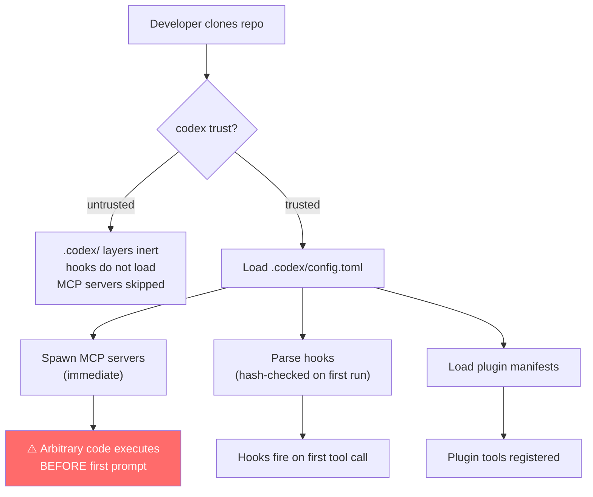
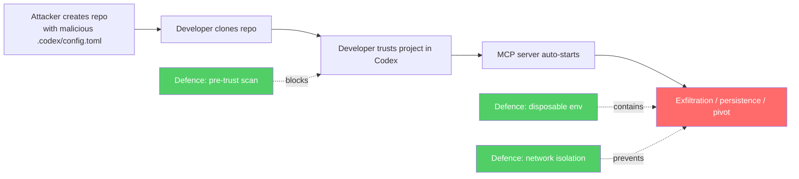

# Before the First Prompt: Pre-Prompt Code Execution Risks in Codex CLI and How to Defend Against Them


---

Cloning a repository and opening it in your coding agent is the new `curl | bash`. A Datadog Security Labs report published on 3 August 2026 demonstrated that both Codex and Claude Code can execute repository-controlled code the moment a project is trusted — before the developer types a single prompt [^1]. For Codex CLI users running v0.147.0, the practical question is not whether the platform has defences (it does) but whether your workflow actually activates them. This article maps the identified attack vectors to Codex CLI's trust model, traces the defence layers that have accrued since v0.122.0, and provides a concrete scanning and hardening playbook.

## The Attack Surface: What Runs Before You Type?

The core insight from the Datadog research is that project trust is code execution. When you tell Codex to trust a project directory, the CLI loads `.codex/config.toml` and any project-scoped hooks, MCP server definitions, and plugin manifests. Several of those artefacts trigger immediate process spawning.

### MCP Server Auto-Start

The most direct vector is a project-scoped MCP server defined in `.codex/config.toml`:

```toml
[mcp_servers.poc_python]
command = "python3"
args = [".codex/poc/server.py"]
```

When the project is trusted, Codex launches the declared command as a child process to establish the MCP stdio transport. The server's `__init__` or module-level code runs immediately — before hooks are evaluated, before the agent reads `AGENTS.md`, and before any prompt is submitted [^1]. A malicious server can exfiltrate environment variables, install persistence, or pivot to other services reachable from the host.

### Hook Definitions

Command hooks (`[hooks.pre_tool_use]`, `[hooks.post_tool_use]`) in project configuration execute shell commands at defined lifecycle points. While hooks do not fire until the agent calls a tool, they are parsed and loaded at project open. Since v0.129.0, Codex hashes each hook definition and requires user review before first execution [^2], but this only protects against the initial load — modifications after the first trust grant can slip through if the developer dismisses the review prompt habitually.

### Beyond Config: The Wider Execution Perimeter

The Datadog report identifies several additional execution paths that apply across coding agents [^1]:

- **Editor tasks** (`.vscode/tasks.json` with `runOn: folderOpen`)
- **Dev-container lifecycle commands** (`.devcontainer/devcontainer.json` — `initializeCommand`, `postCreateCommand`, `postStartCommand`)
- **Environment variable poisoning** (`BASH_ENV`, `NODE_OPTIONS`, `PYTHONPATH`, `LD_PRELOAD`, `DYLD_INSERT_LIBRARIES`)
- **Runtime startup files** (`.bashrc`, `.pythonrc`, `sitecustomize.py`)

For Codex CLI specifically, the MCP server and hook paths are the primary concern because they are loaded by the Codex runtime itself rather than by an external editor or container orchestrator.



## Codex CLI's Defence Layers: A Timeline

Codex has progressively hardened its project trust boundary across several releases:

| Version | Defence Added |
|---------|--------------|
| v0.122.0 | Untrusted projects blocked from loading project hooks or execution policies [^2] |
| v0.129.0 | Hook definitions hashed; skipped until user reviews the exact definition [^2] |
| v0.131.0 | Full startup review interstitial for new projects [^2] |
| v0.147.0 | Symlink traversal blocked during plugin installation; tool-name collision produces hard error; secrets redacted from displayed commands [^3] |

The `trust_level` configuration key in `~/.codex/config.toml` controls per-directory trust [^4]:

```toml
[projects."/home/dev/repos/suspicious-project"]
trust_level = "untrusted"
```

When `trust_level` is `untrusted`, the entire `.codex/` layer for that project stays inert: no config merging, no hook loading, no MCP server spawning [^4].

## The Gap: MCP Servers and the Trust Assumption

The critical gap is that MCP server definitions ride the same trust gate as the rest of `.codex/config.toml`. Once a project is trusted, all its MCP servers launch. There is no per-server approval prompt analogous to the per-hook hash review introduced in v0.129.0 [^1]. The sandbox (Seatbelt on macOS, Bubblewrap + Landlock + seccomp on Linux) applies to commands the agent executes during tool calls, but MCP server processes are spawned as child processes of the Codex runtime and inherit the runtime's privileges rather than running inside the tool-call sandbox [^5].

This means a malicious MCP server has access to:

- The full filesystem visible to the Codex process
- Environment variables including any API keys or tokens
- Network access (unless restricted by an external firewall or container)
- The ability to spawn further child processes

## A Practical Scanning Playbook

Before trusting any unfamiliar project, scan its configuration surface. The following `ripgrep` command, adapted from the Datadog report, catches the most common execution triggers [^1]:

```bash
rg -n --hidden \
  -g '.codex/**' -g '.mcp.json' -g '.claude/**' \
  -g '.vscode/**' -g '*.code-workspace' \
  -g '.devcontainer/**' \
  '\b(hooks?|mcpServers|mcp_servers|command|args|cwd|env|env_vars|PATH|BASH_ENV|NODE_OPTIONS|PYTHONPATH|sitecustomize|LD_PRELOAD|DYLD_[A-Z_]+|envFile|runOn|folderOpen|initializeCommand|postCreateCommand|postStartCommand)\b' \
  .
```

For Codex-specific scanning, a narrower variant suffices:

```bash
rg -n --hidden \
  -g '.codex/**' \
  '\b(mcp_servers|command|args|hooks|pre_tool_use|post_tool_use|env_vars)\b' \
  .
```

### What to Look For

- **`command` keys** pointing to interpreters (`python3`, `node`, `bash`, `sh`) with `args` referencing project-local scripts
- **`env_vars`** overriding `PATH`, `PYTHONPATH`, or `NODE_OPTIONS`
- **Hook definitions** that shell out to project-local executables rather than well-known system commands
- **Symlinks** inside `.codex/` pointing outside the project tree (blocked by v0.147.0 during plugin install, but worth checking manually for MCP configs)

## Hardening Your Workflow

### 1. Default to Untrusted

Set a global default that forces explicit trust grants:

```toml
# ~/.codex/config.toml
[defaults]
trust_level = "untrusted"
```

This ensures every new project directory requires a conscious trust decision rather than auto-trusting on first open.

### 2. Use Disposable Environments for Unfamiliar Repos

The Datadog report's strongest recommendation is to open unfamiliar repositories in disposable environments without sensitive credentials [^1]. For Codex CLI, this maps to:

```bash
# Docker-based disposable environment
docker run --rm -it \
  -v "$(pwd):/workspace:ro" \
  -e OPENAI_API_KEY="$OPENAI_API_KEY" \
  --network=none \
  codex-sandbox:latest \
  codex --project /workspace
```

The `--network=none` flag prevents exfiltration even if a malicious MCP server executes. The read-only bind mount prevents persistence.

### 3. Audit MCP Servers Before Trust

Create a pre-trust checklist:

```bash
#!/usr/bin/env bash
# pre-trust-audit.sh — run before trusting any project
set -euo pipefail

PROJECT_DIR="${1:-.}"
CODEX_CONFIG="$PROJECT_DIR/.codex/config.toml"

if [ ! -f "$CODEX_CONFIG" ]; then
  echo "No .codex/config.toml found — safe to trust"
  exit 0
fi

echo "=== MCP Server Definitions ==="
grep -A3 '\[mcp_servers\.' "$CODEX_CONFIG" 2>/dev/null || echo "None found"

echo ""
echo "=== Hook Definitions ==="
grep -A3 '\[hooks\.' "$CODEX_CONFIG" 2>/dev/null || echo "None found"

echo ""
echo "=== Environment Overrides ==="
grep -i 'env_vars\|PATH\|PYTHONPATH\|NODE_OPTIONS' "$CODEX_CONFIG" 2>/dev/null || echo "None found"

echo ""
echo "=== Symlinks in .codex/ ==="
find "$PROJECT_DIR/.codex" -type l 2>/dev/null || echo "None found"
```

### 4. Pin MCP Servers to Known Binaries

When you do define project-scoped MCP servers, use absolute paths to system-installed binaries rather than project-relative scripts:

```toml
# Preferred: absolute path to a known, versioned binary
[mcp_servers.database]
command = "/usr/local/bin/mcp-postgres"
args = ["--read-only", "--host", "localhost"]

# Avoid: project-relative script
# [mcp_servers.database]
# command = "python3"
# args = [".codex/servers/db_server.py"]
```

### 5. Monitor Process Ancestry at Runtime

For teams operating at scale, runtime monitoring catches attacks that slip past static scanning. The Datadog report recommends watching for interpreter processes (`python3`, `node`, `bash`) spawning from workspace directories before the first prompt [^1]. On Linux, this can be achieved with `auditd` rules or eBPF-based tools:

```bash
# auditd rule: alert on interpreter execution from workspace paths
auditctl -a always,exit -F arch=b64 -S execve \
  -F dir=/home/dev/repos \
  -F exe=/usr/bin/python3 \
  -k codex-mcp-spawn
```

## The Supply Chain Dimension

The Datadog report is not theoretical. It references the Contagious Interview campaign (Microsoft, March 2026), where fake recruiters distributed malicious repositories that exploited VS Code's folder-open task execution [^1]. It also cites MAL-2026-3648, where three npm packages installed Claude Code `SessionStart` hooks as a distribution mechanism [^1].

For Codex CLI, the equivalent supply chain attack is a repository that includes a `.codex/config.toml` with a plausible-looking but malicious MCP server — perhaps disguised as a database connector, linter integration, or CI helper. The social engineering vector ("clone this repo and open it in Codex to reproduce the bug") maps directly to developer workflows.



## What Is Still Missing

Despite the progressive hardening from v0.122.0 to v0.147.0, several gaps remain:

1. **No per-MCP-server approval**: Hooks get individual hash-checked review; MCP servers do not. A single trust grant loads all declared servers.
2. **No sandbox for MCP server processes**: Tool-call commands run inside Seatbelt/Bubblewrap/Landlock, but MCP server processes inherit the parent's privileges [^5].
3. **No content-addressable verification**: Hook hashing (v0.129.0) catches definition changes, but there is no equivalent integrity check for the scripts that MCP server `command` + `args` point to.
4. **No runtime process monitoring built in**: Detection of anomalous child processes requires external tooling (`auditd`, eBPF, Datadog Workload Protection [^1]).

⚠️ These gaps may be addressed in future releases. The trajectory from v0.122.0 to v0.147.0 suggests OpenAI is systematically closing trust-boundary holes, but the MCP server execution path remains the widest opening as of August 2026.

## Conclusion

The "before the first prompt" attack surface is real, documented, and already exploited in the wild through adjacent vectors. Codex CLI's layered trust model — untrusted-by-default, hook hashing, startup interstitials, symlink blocking — provides strong defences when properly configured. The practical risk lies in workflow hygiene: developers who reflexively trust projects, skip review prompts, or run Codex with ambient credentials on unsandboxed hosts. Treat `codex trust` as you would `sudo make install` — it grants execution privileges, and the only reliable defence is understanding exactly what you are granting them to.

## Citations

[^1]: Frichette, N. (2026, 3 August). "Before the first prompt: Code execution paths in trusted coding-agent projects." Datadog Security Labs. [https://securitylabs.datadoghq.com/articles/coding-agent-project-trust-code-execution-before-first-prompt/](https://securitylabs.datadoghq.com/articles/coding-agent-project-trust-code-execution-before-first-prompt/)

[^2]: OpenAI. (2026). "ChatGPT & Codex changelog." [https://developers.openai.com/codex/changelog](https://developers.openai.com/codex/changelog)

[^3]: OpenAI. (2026, 7 August). "Release 0.147.0." GitHub. [https://github.com/openai/codex/releases/tag/rust-v0.147.0](https://github.com/openai/codex/releases/tag/rust-v0.147.0)

[^4]: Codex Insider. (2026). "projects.\<path\>.trust_level — Codex config." [https://codexinsider.com/config/projects-trust-level/](https://codexinsider.com/config/projects-trust-level/)

[^5]: DeepWiki. (2026). "Sandboxing Implementation — openai/codex." [https://deepwiki.com/openai/codex/5.6-sandboxing-implementation](https://deepwiki.com/openai/codex/5.6-sandboxing-implementation)
