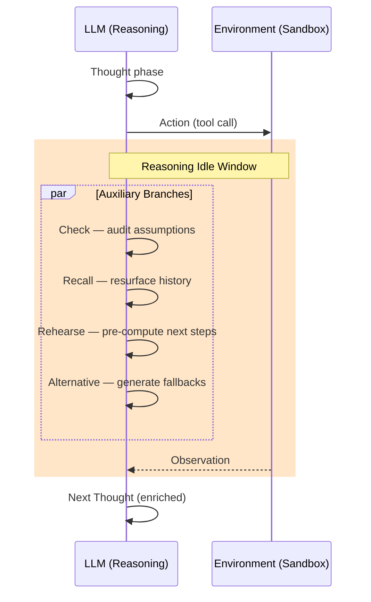
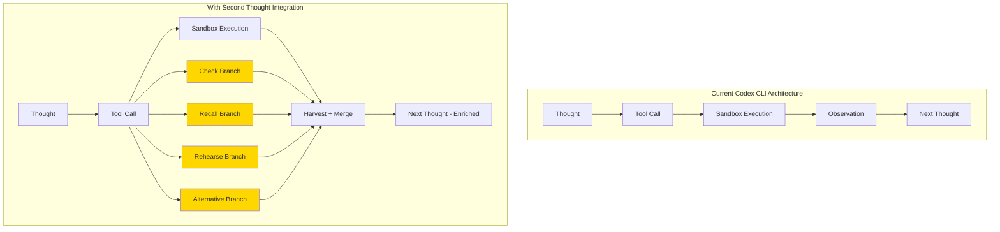

# Second Thought and the Reasoning Idle Window: What Parallel Auxiliary Branches Mean for Codex CLI Latency and Turn Efficiency


---

Every ReAct-style coding agent follows the same cadence: think, act, wait for an observation, then think again. The wait is the problem. While the sandbox runs a test suite or a linter grinds through a large codebase, the LLM sits idle — context loaded, GPU cycles allocated, developer staring at a spinner. Sun, Yang, Lyu, Shi, and Lo's *Second Thought: Reasoning in Parallel as LLM Agents Act and Observe* (arXiv:2608.13667, August 2026) asks a sharp question: what if we filled that dead time with useful reasoning?[^1]

The answer matters directly for Codex CLI, which already separates its Rust execution layer from the LLM reasoning loop[^2] and already supports parallel subagent threads[^3]. Second Thought exposes a finer-grained opportunity — one that sits *within* a single agent turn rather than across orchestrated subagents — and the gap between what the paper demonstrates and what Codex CLI currently provides is instructive.

## The Reasoning Idle Window

In a standard ReAct loop, the agent generates a thought, emits a tool call, and blocks until the environment returns an observation. The interval between action dispatch and observation arrival is the **reasoning idle window**. For Codex CLI, this window covers sandbox execution time: running `cargo test`, `pytest`, `make build`, or any MCP tool call that touches disk or network.

Sun et al. measured idle windows across SWE-Bench Pro, Terminal-Bench 2.1, and τ³-bench, finding them long enough to harvest meaningful auxiliary reasoning — particularly in repository-level software engineering tasks where test suites routinely take seconds to minutes[^1].



## Four Complementary Branches

Rather than spawning competing solution paths, Second Thought launches four branches that explore **complementary reasoning dimensions**[^1]:

| Branch | Purpose | Coding-Agent Analogue |
|--------|---------|----------------------|
| **Check** | Audit assumptions in the current plan; flag fragile presuppositions | "Did I assume the function exists in `utils.py` when it might have moved?" |
| **Recall** | Resurface critical historical context that may have faded from attention | Re-reading earlier error messages or API constraints from turn 3 of a 40-turn session |
| **Rehearse** | Pre-compute conditional next steps for plausible outcomes | "If the test passes, run the linter; if it fails on line 42, check the import" |
| **Alternative** | Generate alternative strategies with trigger conditions | "If this regex approach is too slow, fall back to AST parsing" |

Each branch emits **atomic thoughts** — self-contained units enclosed in XML tags. When the observation arrives, completed thoughts are harvested, truncated at the last closed tag, and appended to the tool-observation message. The next reasoning phase conditions on all accumulated context[^1].

## Benchmarks and Results

The authors evaluated three reasoning LLMs — DeepSeek-V4-Flash, Qwen3.6-Plus, and MiniMax-M3 — across three agentic benchmarks[^1]:

- **SWE-Bench Pro** (150 instances): repository-level software engineering
- **Terminal-Bench 2.1** (89 tasks): terminal administration and data processing
- **τ³-bench** (97 tasks): multi-turn banking customer-service dialogue

Key findings:

1. **Main-thread decoding reduced by up to 43%**, averaging 20% across six of nine model-benchmark pairs. The auxiliary branches effectively move reasoning off the critical path.
2. **Pass@1 accuracy stable or improved**: seven of nine pairs showed no degradation; two pairs gained +12.4 and +10.2 percentage points respectively.
3. **Turn counts decreased** across all nine pairs, suggesting the pre-computed reasoning reduces wasted exploration.
4. **Wall-clock latency improved 10.9% median** despite the additional API calls, because the auxiliary work happens concurrently with tool execution.
5. **No per-cell tuning required** — the same four-branch configuration worked across model families and task domains.

The cost trade-off is real: API spend increased 66–181%, driven primarily by cached prefix reads rather than new generation tokens[^1].

## Mapping to Codex CLI's Architecture

Codex CLI v0.147.0 already has several architectural properties that make it a natural fit for idle-window reasoning — and several gaps that prevent it[^2][^3].

### What Codex CLI Already Has

**Disaggregated execution.** The Rust core separates tool execution from LLM inference. When the sandbox runs a command, the LLM endpoint is free. This is precisely the idle window Second Thought exploits.

**Parallel subagents.** Codex CLI's multi-agent orchestration lets a parent agent spawn child agents that work concurrently, each in its own sandbox and context window[^3]. The infrastructure for concurrent LLM calls exists.

**Streaming API access.** Codex CLI uses streaming completions, and the models it targets (GPT-5.6 Luna/Terra, codex-1) support streaming with reasoning tokens[^4]. The streaming architecture could surface partial auxiliary thoughts as they arrive.

**`model_auto_compact_token_limit`.** Context compaction already manages the budget pressure that auxiliary thoughts would create[^5].

### What's Missing

**No intra-turn parallelism.** Subagents operate at the *task* level — "fix this file while I fix that one." Second Thought operates at the *turn* level — "while you wait for `pytest`, reason about what happens next." Codex CLI has no mechanism to spawn auxiliary reasoning calls within a single turn's idle window.

**No branch taxonomy.** The four-branch structure (Check, Recall, Rehearse, Alternative) is a reasoning protocol, not a tool protocol. Codex CLI's hooks system (PreToolUse, PostToolUse) operates on tool calls, not on reasoning phases[^2]. There is no hook point that fires at "tool dispatched, waiting for observation."

**No atomic-thought harvesting.** Second Thought's XML-tagged thought units need a merge protocol — harvesting completed tags, truncating incomplete ones, and injecting them into the observation context. Codex CLI's conversation model does not support mid-turn context injection.

**No cost-aware branch gating.** The 66–181% cost overhead[^1] is significant. Codex CLI has `reasoning_effort` levels (low/medium/high/xhigh) and per-profile model selection[^4], but no mechanism to conditionally enable auxiliary reasoning based on expected idle-window duration or task complexity.



## Practical Integration Paths

While Codex CLI cannot natively implement Second Thought today, several approximation strategies exist within the current v0.147.0 feature set.

### 1. AGENTS.md-Driven Rehearsal Prompts

The simplest approximation: encode rehearsal logic directly in AGENTS.md.

```markdown
## Reasoning Protocol
When waiting for test results, always:
1. State what you expect the test to show
2. Plan your next action for both pass and fail outcomes
3. Note any assumptions you haven't verified
```

This is a prompt-level approximation of Check and Rehearse, executed *before* the tool call rather than during the idle window. It adds latency to the thought phase but captures some of the benefit[^2].

### 2. PostToolUse Hooks as Recall Triggers

A PostToolUse hook can inject historical context after the observation arrives, partially replicating the Recall branch:

```toml
# hooks.toml
[[hooks]]
event = "PostToolUse"
match_tools = ["shell"]
command = "cat .codex/test-history.log | tail -20"
```

This surfaces recent test outcomes immediately after each shell execution, providing the recall context that would otherwise require an auxiliary branch[^2].

### 3. Subagent-Based Branch Emulation

For long-running tasks, you can approximate Second Thought by spawning a subagent that reasons about the problem while the primary agent executes:

```
Spawn a subagent: "While the main agent runs the test suite,
review the last 5 changes and list any assumptions that
haven't been verified by tests."
```

This is coarser than Second Thought's per-turn branches and carries higher context overhead, but leverages Codex CLI's existing multi-agent infrastructure[^3].

### 4. MCP Server for Structured Pre-Computation

An MCP server could implement the Rehearse branch by pre-computing likely next steps and caching them:

```json
{
  "name": "rehearse",
  "description": "Pre-compute conditional next steps based on current plan state",
  "inputSchema": {
    "type": "object",
    "properties": {
      "current_plan": { "type": "string" },
      "pending_action": { "type": "string" }
    }
  }
}
```

The agent calls `rehearse` before dispatching the tool call, and the cached result is available instantly when the observation arrives. This trades the idle window for a sequential pre-computation step but eliminates wasted turns[^6].

## The Cost Question

Second Thought's 66–181% cost overhead deserves scrutiny in the Codex CLI context. With GPT-5.6 Luna and Terra pricing, and reasoning tokens already doubling effective turn costs at medium effort[^5], adding four auxiliary branches could triple or quadruple per-turn spend. The paper reports that most of the overhead comes from cached prefix reads rather than new token generation[^1], which suggests that providers with aggressive KV-cache pricing (as OpenAI has for GPT-5.6[^4]) could make the approach more viable.

The economic argument hinges on **turn reduction**. If auxiliary reasoning eliminates even two wasted turns per session — turns spent discovering an assumption was wrong, re-reading forgotten context, or exploring a dead-end strategy — the net cost may be neutral or positive. Sun et al.'s data showing reduced turn counts across all nine model-benchmark pairs supports this[^1], but production-scale validation on Codex CLI workloads is needed.

## What This Means for Codex CLI's Roadmap

Second Thought identifies a structural inefficiency in every ReAct-style agent: the reasoning idle window is wasted compute. The fix is architectural — the execution runtime needs a "tool dispatched" event that triggers concurrent reasoning, and a merge protocol for injecting the results.

For Codex CLI specifically, the most impactful additions would be:

1. **An `OnToolDispatched` hook event** that fires when a tool call is sent to the sandbox, enabling concurrent processing during the idle window.
2. **Branch budget controls** in `config.toml` — enabling/disabling specific branch types, setting per-branch token caps, and gating branches on estimated execution time.
3. **Atomic thought injection** in the conversation model, allowing mid-turn context additions without disrupting the ReAct loop.

The paper's training-free, model-agnostic design[^1] means these features would work with any model Codex CLI supports — from GPT-5.6 Terra to codex-1 to third-party models via API — without fine-tuning or model-specific adapters.

## Citations

[^1]: Sun, Z., Yang, C., Lyu, Y., Shi, J. & Lo, D. (2026). "Second Thought: Reasoning in Parallel as LLM Agents Act and Observe." arXiv:2608.13667. Accepted at NeSy 2026 (Industry Track). [https://arxiv.org/abs/2608.13667](https://arxiv.org/abs/2608.13667)

[^2]: OpenAI. (2026). "Codex CLI Documentation — Hooks, AGENTS.md, and Architecture." GitHub: openai/codex. [https://github.com/openai/codex](https://github.com/openai/codex)

[^3]: OpenAI. (2026). "Codex CLI v0.147.0 Release Notes — Multi-Agent Orchestration, Subagents, and Plugin Federation." [https://github.com/openai/codex/releases/tag/rust-v0.147.0](https://github.com/openai/codex/releases/tag/rust-v0.147.0)

[^4]: OpenAI. (2026). "API Pricing and Model Specifications — GPT-5.6 Luna, Terra, codex-1." [https://openai.com/api/pricing](https://openai.com/api/pricing)

[^5]: Vaughan, D. (2026). "Codex CLI Performance Optimisation: Token Overhead, Hidden Costs and Tuning Tactics." Codex Knowledge Base. [https://codex.danielvaughan.com/2026/04/08/codex-cli-performance-optimization/](https://codex.danielvaughan.com/2026/04/08/codex-cli-performance-optimization/)

[^6]: Model Context Protocol. (2026). "MCP Specification — Tool Definitions and Server Architecture." [https://modelcontextprotocol.io/specification](https://modelcontextprotocol.io/specification)
