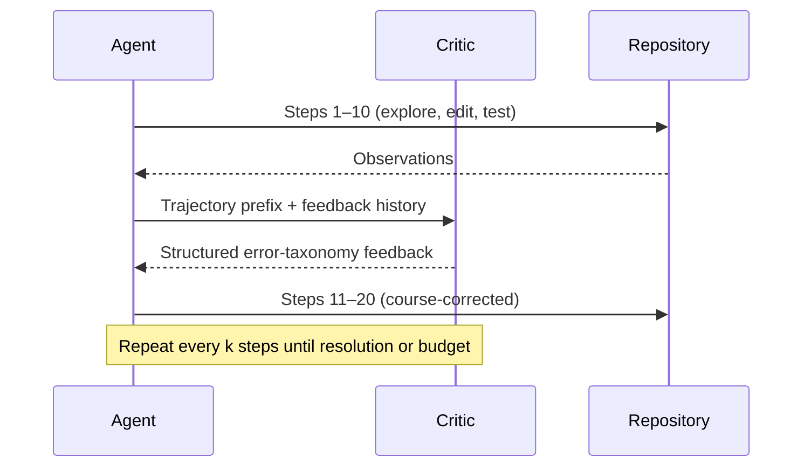
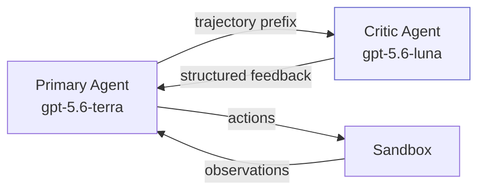

# Steer, Don't Solve: What Small Critic Models Mean for Your Codex CLI Guardian and Hook Strategy


---

End-to-end agent training is expensive, and it plateaus. The strategy-level reasoning a coding agent needs to navigate a repository — when to switch files, when to abandon a failing approach, when to re-read the specification — gets drowned out by the sheer volume of code-level execution signals during joint optimisation [^1]. Gandhi, Xie, Naik, Zhu, and Rose at Carnegie Mellon University propose a cleaner separation: freeze the agent, bolt on a small critic that steers it mid-run, and let each component do what it does best.

Their paper, *Steer, Don't Solve: Training Small Critic Models for Large Code Agents* (arXiv:2606.21811, June 2026), demonstrates that a Qwen3-8B critic, trained via supervised fine-tuning on teacher trajectories, delivers +3.8 to +5.2 percentage-point gains on SWE-bench Verified at 30–92× lower cost than the frontier teacher [^1]. On Qwen3-Next-80B-A3B, the critic-guided system is simultaneously more accurate (25.2% vs. 20.8%) and cheaper (\$0.04 vs. \$0.11 per instance) because steering shortens trajectories [^1].

If you use Codex CLI's Guardian auto-review subagent, PostToolUse hooks, or TOML agent definitions, this paper maps directly onto your existing toolchain.

## The Core Insight: Intra-Trajectory Feedback Beats Post-Hoc Scoring

Prior code critics — verification models, reward models, outcome classifiers — score completed trajectories [^1]. By the time they speak, the agent has already committed to its path. The Steer, Don't Solve critic intervenes every *k* steps (default *k* = 10) during execution, inspecting the partial trajectory and writing structured textual feedback that the agent reads before its next action [^1].



The critic's output follows a 12-category error taxonomy spanning specification errors, reasoning errors, and coordination errors. Each category includes detection status, evidence, and recovery guidance — but crucially, no action-level prescriptions [^1]. The critic says *"you're exploring the wrong module"*, not *"run `grep -r 'foo' src/`"*.

## The Numbers: Cross-Agent Transfer and Pareto Dominance

Three results stand out for practitioners.

### Transfer to unseen agents

A critic trained solely on CWM-32B trajectories transfers to two agents it has never seen [^1]:

| Agent | No Critic | + Critic (CWM-only) | + Critic (Mixed) |
|-------|-----------|---------------------|------------------|
| CWM-32B | 29.2% | 32.2% | 33.0% (+3.8pp) |
| Qwen3-Next-80B-A3B | 20.8% | 23.8% (+3.0pp) | 25.2% (+4.4pp) |
| Qwen3-32B | 9.6% | 13.0% (+3.4pp) | 14.8% (+5.2pp) |

The steering signal is not agent-specific. Strategy-level patterns — when to switch files, when to re-read the issue, when to stop editing and start testing — generalise across architectures [^1].

### Cost inversion

On Qwen3-Next-80B-A3B, adding the critic reduces total cost from \$0.11 to \$0.04 per instance because shorter trajectories offset the \$0.003–\$0.010 critic overhead [^1]. The critic-guided system Pareto-dominates the unguided baseline on both accuracy and cost.

### Teacher distillation efficiency

The frontier teacher (Claude Opus 4.6) achieves 51.4% resolve rate but costs \$0.96 per instance in critic overhead alone [^1]. The trained Qwen3-8B critic captures enough of the teacher's steering signal to deliver meaningful gains at 30–92× lower cost.

## Mapping to Codex CLI: Three Integration Points

Codex CLI v0.147.0 already ships three mechanisms that implement variants of the critic pattern. The Steer, Don't Solve results suggest specific ways to sharpen each.

### 1. The Guardian as a Coarse Critic

The Guardian auto-review subagent (activated via `--approve-for-me`) sits between the primary agent and sensitive operations — shell execution, file writes, network access, and MCP tool invocations [^2]. It reviews pending actions and routes them: approve silently, escalate to the user, or block.

The Guardian is a *pre-action* critic. Steer, Don't Solve operates as a *post-observation* critic — it reads what happened and redirects the agent's next strategy. The two are complementary:

```toml
# config.toml — Guardian handles safety; a custom critic agent handles strategy
[agent]
model = "gpt-5.6-terra"

[review]
review_model = "gpt-5.6-luna"  # Guardian: lightweight safety gate

# TOML subagent for strategy-level steering
# (hypothetical — maps to the paper's architecture)
[[agents]]
name = "strategy-critic"
model = "gpt-5.6-luna"
instructions = """
You are a strategy-level critic. Every 10 steps, review the trajectory
and provide high-level feedback using the error taxonomy:
Specification (S1-S4), Reasoning (R1-R4), Coordination (C1-C4).
Never prescribe specific commands. Only redirect strategy.
"""
```

The paper's key finding — that concise, strategy-level prompts outperform detailed, action-level prompts in distillation (+1.0pp on SWE-bench Verified) [^1] — has a direct implication for Guardian configuration. Overspecifying review criteria in AGENTS.md produces the same failure mode the paper identifies: the reviewer becomes a backseat driver rather than a strategic advisor.

### 2. PostToolUse Hooks as Intervention Points

PostToolUse hooks fire after every supported tool execution — shell commands, `apply_patch` file edits, and MCP tool calls [^3]. Exit code 2 replaces the tool result the agent sees with custom stderr feedback, effectively steering the agent's next action without undoing what already ran.

This is the *k*-step intervention mechanism. You can approximate the paper's critic protocol with a hook that counts invocations and triggers a review:

```bash
#!/usr/bin/env bash
# hooks/strategy-critic.sh — PostToolUse hook
# Fires after every tool call; triggers critic every 10 steps

STEP_FILE="/tmp/codex-critic-step-count"
COUNT=$(cat "$STEP_FILE" 2>/dev/null || echo 0)
COUNT=$((COUNT + 1))
echo "$COUNT" > "$STEP_FILE"

if (( COUNT % 10 == 0 )); then
  # Summarise recent trajectory and request strategic redirect
  echo "CRITIC CHECKPOINT (step $COUNT): Review your approach." \
       "Are you still aligned with the original issue?" \
       "Have you verified your assumptions against the test suite?" \
       "If stuck, consider switching to a different module or re-reading the spec." >&2
  exit 2  # Replace tool output with this feedback
fi

exit 0  # Pass through normally
```

The paper shows that even static, template-based feedback at fixed intervals provides measurable gains [^1]. A production deployment would route the trajectory to a lightweight model via an MCP server, but the hook mechanism is the right integration point.

### 3. TOML Agent Definitions as Critic Slots

Codex CLI's custom agent definitions encode roles as standalone TOML files — each with its own model, sandbox policy, MCP servers, and behavioural instructions [^4]. The Steer, Don't Solve architecture maps naturally to a TOML-defined critic agent:



The paper's transfer results are particularly relevant here. A critic trained on one agent's trajectories transfers to unseen agents with +3.0 to +3.4pp gains even without target-agent data [^1]. This means a single critic TOML definition could serve across model configurations — the same `strategy-critic` agent working whether the primary model is `gpt-5.6-terra`, `gpt-5.6-sol`, or a Bedrock-hosted variant.

## The Concise Prompt Paradox

One counterintuitive result deserves special attention. Claude Opus 4.6, used as the teacher, performs better with detailed prompts that include action-level instructions. But the distilled Qwen3-8B critic performs better when trained on *concise* prompts that constrain it to strategy-level reasoning [^1].

The concise-trained critic achieves 33.0% vs. 32.0% for the detailed-trained variant on CWM-32B. The paper's explanation: "SFT loss matches teacher tokens at each prefix without penalising critiques the agent ignores" — a detailed critic produces instructions the agent cannot reliably follow, and the distillation process cannot distinguish followed from ignored advice [^1].

The practical implication for AGENTS.md and hook design is clear: **write strategic directives, not procedural instructions**. Instead of:

```markdown
<!-- AGENTS.md — too detailed -->
## Review Policy
- After editing any file in src/core/, run `pytest tests/core/ -x`
- If tests fail, check the import graph with `grep -r 'from core' src/`
- Never modify more than 3 files without running the full test suite
```

Prefer:

```markdown
<!-- AGENTS.md — strategic -->
## Review Policy
- Verify your changes against the test suite before moving to the next module.
- If stuck on a failing approach for more than 3 attempts, re-read the issue
  description and consider an alternative strategy.
- Minimise the scope of each change. Smaller patches are easier to verify.
```

## Where Codex CLI Falls Short

The paper exposes three gaps in the current Codex CLI architecture.

**No native intra-trajectory review loop.** The Guardian reviews individual actions; PostToolUse hooks fire per tool call. Neither implements the paper's *trajectory-aware* critic that accumulates context across multiple steps and issues holistic strategic feedback. The feedback history — knowing what guidance was previously given and whether the agent followed it — is absent from the hook mechanism [^1].

**No trajectory serialisation API.** The critic needs the full trajectory prefix as input. Codex CLI's JSONL session traces exist for post-session replay but are not exposed to hooks or subagents in real time. A `trajectory_context` variable available to PostToolUse hooks would unlock the steering pattern [^5].

**No budget-aware submission pressure.** The paper's critic appends submission-priority guidance after step 100 of a 150-step budget, preventing agents from exhausting their allocation on fruitless exploration [^1]. Codex CLI has no step-budget concept exposed to hooks — the agent runs until it stops or the user intervenes.

## Practical Mitigations

Until native support arrives, three workarounds approximate the critic pattern:

1. **Stateful PostToolUse hooks.** Maintain a step counter and trajectory summary in a temporary file. At every *k*-th step, inject strategic feedback via exit code 2. This loses the trajectory-aware context but provides the intervention cadence.

2. **MCP-based critic server.** Route trajectory prefixes to a lightweight model via an MCP server. The server maintains state across invocations and returns structured feedback following the paper's error taxonomy. Wire the server into the PostToolUse hook via `curl`.

3. **AGENTS.md as static critic.** Encode the paper's 12-category error taxonomy as AGENTS.md directives. The agent reads these at session start and (in theory) self-applies the critic's categories. This is the weakest approximation — the paper explicitly shows that external critic feedback outperforms self-critique — but it costs nothing and requires no infrastructure.

## Implications for the GPT-5.6 Model Tiers

The cost dynamics are particularly interesting given Codex CLI's three-tier GPT-5.6 model family. The paper demonstrates that pairing a large agent with a small critic can be Pareto-optimal: simultaneously more accurate and cheaper than the agent alone [^1].

Translated to the Codex CLI model landscape:

| Configuration | Approximate Cost | Expected Benefit |
|--------------|------------------|------------------|
| Sol (agent) + Luna (critic) | High agent cost, minimal critic overhead | Maximum accuracy with strategic steering |
| Terra (agent) + Luna (critic) | Moderate total cost | Best cost-accuracy trade-off |
| Luna (agent) + Luna (self-critic) | Lowest cost | ⚠️ Unclear — paper doesn't test same-model critics |

The paper's transfer results suggest that a Luna-class critic trained on Terra or Sol trajectories would provide meaningful steering even for a Luna-class agent, but this specific configuration was not tested [^1].

## Citations

[^1]: Gandhi, S., Xie, Y., Naik, A., Zhu, R., & Rose, C. (2026). "Steer, Don't Solve: Training Small Critic Models for Large Code Agents." arXiv:2606.21811. [https://arxiv.org/abs/2606.21811](https://arxiv.org/abs/2606.21811)

[^2]: OpenAI. (2026). "Codex CLI v0.147.0 Release Notes — Guardian Auto-Review, Agent Plugins, Conversation Sections." [https://github.com/openai/codex/releases/tag/v0.147.0](https://github.com/openai/codex/releases/tag/v0.147.0)

[^3]: OpenAI. (2026). "Codex CLI Hooks Reference — hooks.json, PreToolUse & PostToolUse." [https://openai.com/codex/docs/hooks](https://openai.com/codex/docs/hooks)

[^4]: OpenAI. (2026). "Codex CLI Custom Agent Definitions: Building Specialised Subagents with TOML Configuration." [https://openai.com/codex/docs/custom-agents](https://openai.com/codex/docs/custom-agents)

[^5]: OpenAI. (2026). "Codex CLI v0.147.0 CHANGELOG — JSONL Session Traces, RolloutRecorder." [https://github.com/openai/codex/blob/main/CHANGELOG.md](https://github.com/openai/codex/blob/main/CHANGELOG.md)
